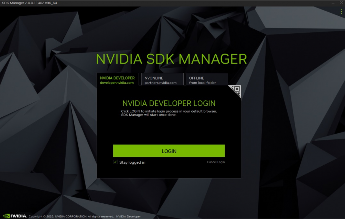
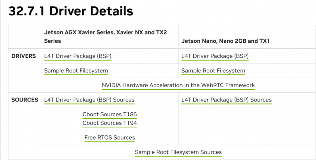
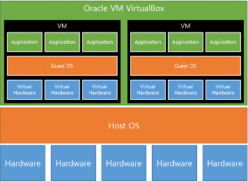
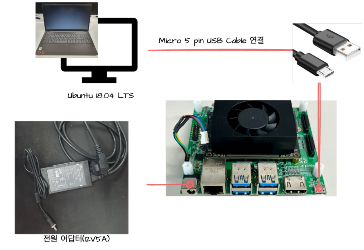
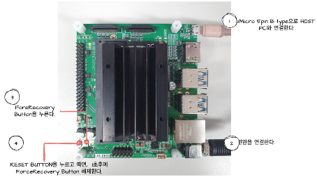
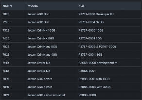

# Jetson OS Flash

> **충청ICT 교육과정 Day1 — 02장**  
> Jetson Nano 운영체제 플래싱 방법 및 VirtualBox 설정

---

## 1. Flash란?

**Flash**는 운영체제와 소프트웨어를 디바이스의 저장 장치 (micro SD card 또는 eMMC)에 설치하는 과정이다. 디바이스가 부팅될 수 있도록 필요한 모든 시스템 파일과 소프트웨어를 해당 저장 장치에 기록한다.

---

## 2. Flash 방법 – SDK Manager

- **SDK Manager** 사용 가능
- SDK Manager는 Devkit(개발 참조보드)만 지원



---

## 3. Flash 방법 – Jetson Linux (BSP)

**Jetson Linux**는 Jetson module들을 위한 Board Support Package로 kernel, Bootloader, Flashing utility, ubuntu 기반의 sample root file system 등이 포함되어 있다.

- 현재 ALLAI JCB보드에서 지원 버전:
  - **Jetson Linux 32.7.1** (Ubuntu 18.04 LTS)
  - **Jetson Linux 35.x.x** (Ubuntu 20.04 LTS)
- 다운로드: [NVIDIA Linux Tegra](https://developer.nvidia.com/embedded/linux-tegra)

---

## 4. Flash 방법 – MFI (Mass Flash Interface)

Jetson module을 **대량으로 flash**하기 위해 생긴 방법.

- **Mass Flash Interface**의 약자
- 처음 초기화 할때 사용한 이미지들이 포함되어 있음
- **동시에 여러 Jetson module flash 가능**



---

## 5. VirtualBox

하나의 물리적 컴퓨터에서 여러 개의 가상 머신(Virtual Machine: VM)으로 분할하여 각기 다른 운영체제를 동시에 실행 가능

- **Host 운영체제 (Host OS)**: VirtualBox가 설치된 실제 컴퓨터의 OS (예: Windows 11)
- **Guest 운영체제 (Guest OS)**: VirtualBox 내에서 실행되는 가상머신의 OS (예: Ubuntu)




---

## 6. Flash 방법 – MFI로 flash 하기 위한 구성



---

## 7. Flash 방법 – Recovery mode boot

- Jetson SOM별 USB ID:
  - `Bus <bbb> Device <ddd>: ID 0955:<nnnn> Nvidia Corp.`
  - `<bbb>`: 3자리 숫자로 연결된 버스 번호
  - `<ddd>`: 3자리 숫자로 연결된 장치 번호
  - `<nnnn>`: 4자리 숫자로 Jetson Module 구별 식별자

**Jetson Nano 예시**:
```
BUS 001 Device 005: ID 0955:7f21 NVidia Corp.
```



---

## 8. SD Card 부팅

- Jetson Nano Module의 Storage는 **16GB eMMC**
- 현재 쓰는 Jetson Nano는 module에 포함되어 있는 내부 저장소(eMMC)로 부팅
- SD card로 부팅하기 위해서는 SD card에도 따로 image를 flash하고 부팅 미디어를 변경해야 함
- SD card를 flash 하기 위해 **balenaEtcher** (SD card flash tool) 사용
- 플래싱 된 JCB의 eMMC에 있는 설정파일의 루트 경로를 수정하여 부팅 미디어를 SD card로 변경
- **Gparted**를 사용하여 SD Card 용량을 모두 사용하도록 수정


