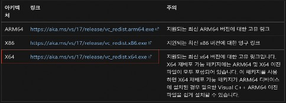
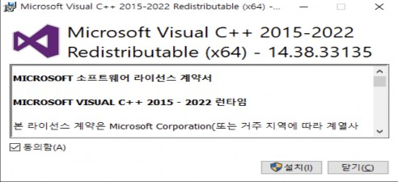
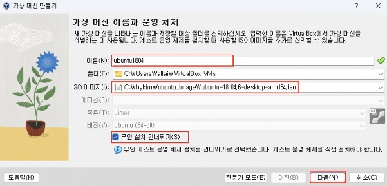

# 실습 1-2: Jetson Nano OS Image Flash 실습

> **충청ICT 교육과정 Day1 — 03장**  
> Windows PC에 VirtualBox 설치 후 Ubuntu 세팅 및 Jetson Nano Flash
> 
> **목표**: Windows PC에서 VirtualBox로 Ubuntu 환경을 구성하고, Jetson Nano에 OS를 플래싱한다.

---

## 1. 실습 개요

Windows PC에서 VirtualBox를 설치하고 Ubuntu 18.04(Guest OS)를 구성하여 Jetson Nano Flash를 위한 Host PC 환경을 만든다.

> **참고**: Windows 11의 WSL을 사용해도 가능하지만 복잡한 설정으로 인해 VirtualBox 환경을 권장한다.

---

## 2. VirtualBox 설치 파일 다운로드

아래 사이트에서 Windows OS용(Host OS) VirtualBox 설치 파일을 다운로드 받는다.

[https://www.oracle.com/kr/virtualization/technologies/vm/downloads/virtualbox-downloads.html](https://www.oracle.com/kr/virtualization/technologies/vm/downloads/virtualbox-downloads.html)

"VirtualBox Extension Pack"과 "VBox GuestAdditions"도 같이 다운로드 받는다.

---

## 3. Windows PC에 VirtualBox 설치

다운로드 받은 VirtualBox 설치 파일(예: `VirtualBox-7.0.14-161095-Win.exe`)을 더블 클릭해서 설치한다.

- **Next** 버튼을 누르고 **Finish** 버튼이 나타날 때까지 설치 진행
- 기본 설치가 완료되면 Extension Pack도 설치

---

## 4. Microsoft Visual C++ 에러 처리

설치 중 Microsoft Visual C++ 관련 에러가 발생할 수 있다.

아래 링크에서 `vc_redist.x64.exe` 파일을 다운받아 설치한다.
[https://learn.microsoft.com/ko-kr/cpp/windows/latest-supported-vc-redist](https://learn.microsoft.com/ko-kr/cpp/windows/latest-supported-vc-redist)

VC++ 설치 완료 후 VirtualBox 설치를 다시 진행하면 정상적으로 설치된다.

---

## 5. VirtualBox 가상 머신 생성

### 5.1 새로 만들기

VirtualBox에서 **새로 만들기** 클릭

이름에 "ubuntu"가 들어가면 자동으로 종류와 버전이 **Linux → Ubuntu**로 변경된다.

### 5.2 메모리 및 프로세서 설정

가상환경의 기본 메모리와 프로세서 개수를 선택한다 (초록색 범위 내에서 선택).

### 5.3 하드 디스크 설정

**지금 새 가상 하드 디스크 만들기**를 선택하고, 디스크 크기는 여유롭게 설정한다 (최소 **30GB 이상**).

### 5.4 설정 확인

설정한 내용을 확인하고 **완료** 버튼 클릭

---

## 6. VirtualBox 가상 머신 설정

### 6.1 일반 설정

VirtualBox 초기 화면에서 **설정** 버튼 클릭

**일반 → 고급**에서 클립보드 공유와 드래그 앤 드롭을 **양방향**으로 변경 (Host PC와 VirtualBox 간 공유 가능)

### 6.2 시스템 설정

부팅 순서를 적절히 설정

### 6.3 네트워크 설정

**어댑터에 브리지**로 변경

네트워크 연결 방법에 맞게 선택

### 6.4 공유 폴더 설정

Windows PC에 다음과 같이 폴더 생성: `D:\share`

설정 → 공유 폴더 → 폴더 추가 아이콘 클릭

공유 폴더에 Windows PC에 생성한 폴더 경로 입력

공유 폴더가 추가된 것 확인

---

## 7. Ubuntu 설치

설정이 완료되었다면 **시작** 버튼 클릭

---

## 8. Jetson Nano Flash

### 8.1 VirtualBox에 USB 장치 연결

Jetson Nano를 Recovery Mode로 진입시킨 후 VirtualBox에 USB 장치로 연결

> **참고**: VirtualBox 메뉴 → 장치(Devices) → USB에서 Jetson Nano 선택

### 8.2 SDK Manager로 Flash

Ubuntu 가상 머신 내에서 NVIDIA SDK Manager를 실행하여 Jetson Nano 플래싱 진행

---

## 참고 자료

- [Oracle VM VirtualBox 다운로드](https://www.oracle.com/kr/virtualization/technologies/vm/downloads/virtualbox-downloads.html)
- [NVIDIA SDK Manager](https://developer.nvidia.com/sdk-manager)
- [Microsoft Visual C++ 재배포 가능 패키지](https://learn.microsoft.com/ko-kr/cpp/windows/latest-supported-vc-redist)
