# 실습 1-2: Jetson Nano OS Image Flash 실습

---

## 1. 실습 개요

Windows PC에서 **VirtualBox**를 설치하고 **Ubuntu 18.04 (Guest OS)**를 구성하여 Jetson Nano Flash를 위한 Host PC 환경을 만든다.

> **참고**: Windows 11의 WSL을 사용해도 가능하지만 복잡한 설정으로 인해 VirtualBox 환경을 권장한다.

---

## 2. VirtualBox 설치 파일 다운로드

아래 사이트에서 Windows OS용 (Host OS) VirtualBox 설치 파일을 다운로드 받는다.

[https://www.oracle.com/kr/virtualization/technologies/vm/downloads/virtualbox-downloads.html](https://www.oracle.com/kr/virtualization/technologies/vm/downloads/virtualbox-downloads.html)

"**VirtualBox Extension Pack**"과 "**VBox GuestAdditions**"도 같이 다운로드 받는다.

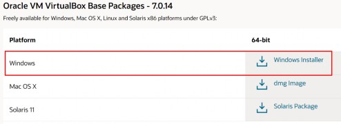
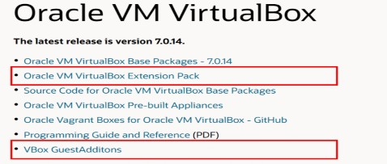

---

## 3. Windows PC에 VirtualBox 설치

다운로드 받은 VirtualBox 설치 파일 (예: `VirtualBox-7.0.14-161095-Win.exe`)을 더블 클릭해서 설치한다.

- **Next** 버튼을 누르고 **Finish** 버튼이 나타날 때까지 설치 진행
- 기본 설치가 완료되면 **Extension Pack**도 설치

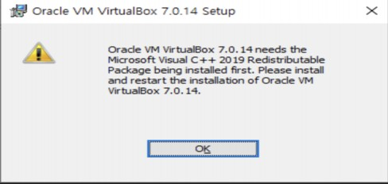

---

## 4. Microsoft Visual C++ 에러 처리

설치 중 Microsoft Visual C++ 관련 에러가 발생할 수 있다.


.

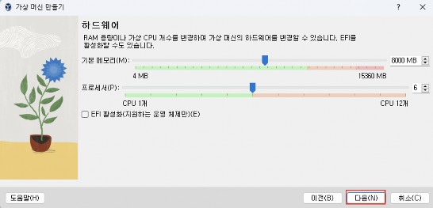

### 5.3 하드 디스크 설정

**지금 새 가상 하드 디스크 만들기**를 선택하고, 디스크 크기는 여유롭게 설정한다 (최소 **30GB 이상**).

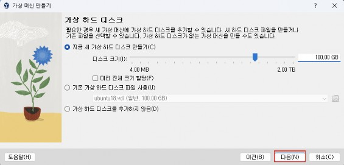

### 5.4 설정 확인

설정한 내용을 확인하고 **완료** 버튼 클릭

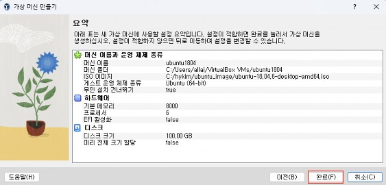

---

## 6. VirtualBox 가상 머신 설정

### 6.1 일반 설정

VirtualBox 초기 화면에서 **설정** 버튼 클릭

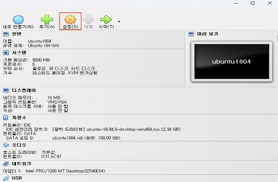

**일반 → 고급**에서 클립보드 공유와 드래그 앤 드롭을 **양방향**으로 변경 (Host PC와 VirtualBox 간 공유 가능)

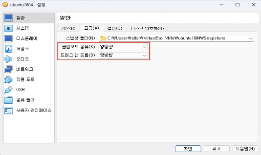

### 6.2 시스템 설정

부팅 순서를 적절히 설정

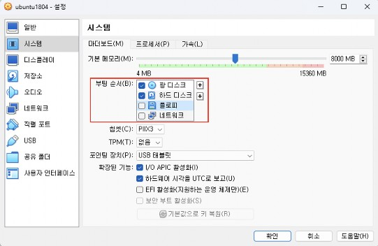

### 6.3 네트워크 설정

**어댑터에 브리지**로 변경

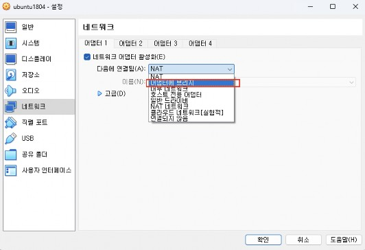

네트워크 연결 방법에 맞게 선택

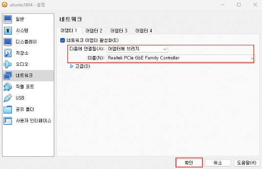

### 6.4 공유 폴더 설정

Windows PC에 다음과 같이 폴더 생성: `D:\share`

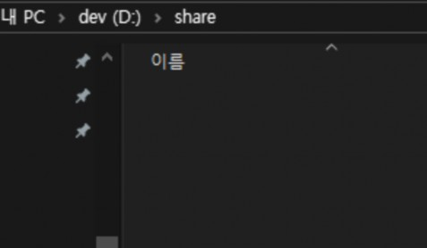

설정 → 공유 폴더 → 폴더 추가 아이콘 클릭

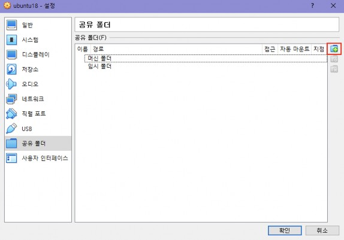

공유 폴더에 Windows PC에 생성한 폴더 경로 입력

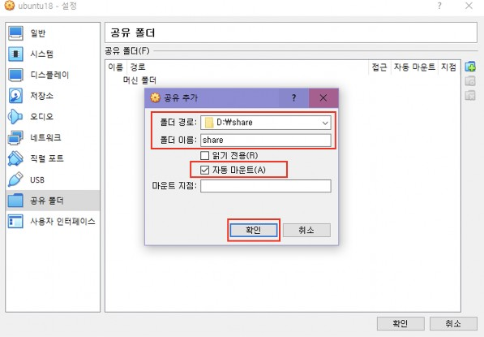

공유 폴더가 추가된 것 확인

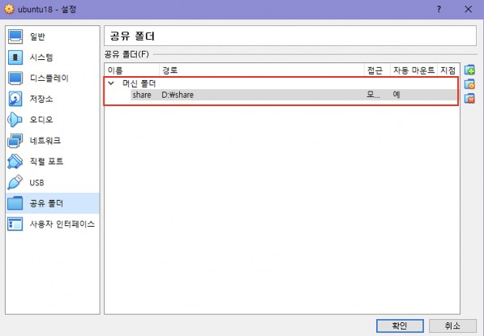

---

## 7. Ubuntu 설치

설정이 완료되었다면 **시작** 버튼 클릭

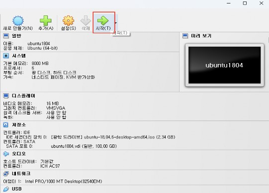

### VirtualBox에서 Ubuntu 설치

**Install Ubuntu**를 눌러주세요.

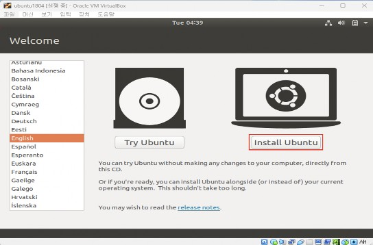

1. **Continue** 버튼을 눌러주세요.

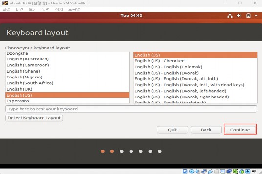

3. 아래와 같이 선택한 후 **Continue** 버튼을 눌러주세요.

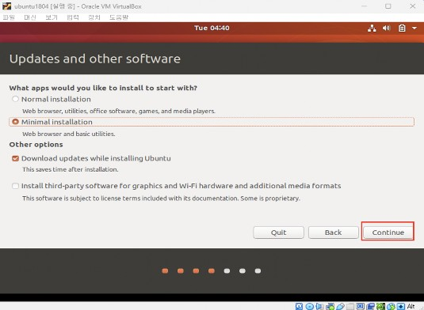

5. 아래와 같이 선택한 후 **Install Now** 버튼을 선택해주세요.

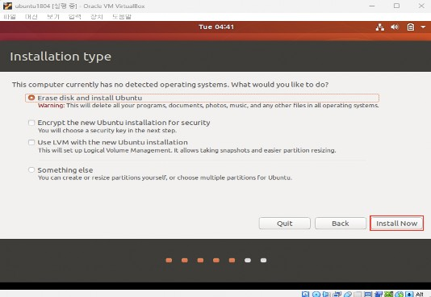

7. **Continue** 버튼을 눌러주세요.

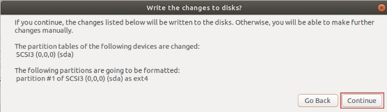

9. **Continue** 버튼을 눌러주세요.

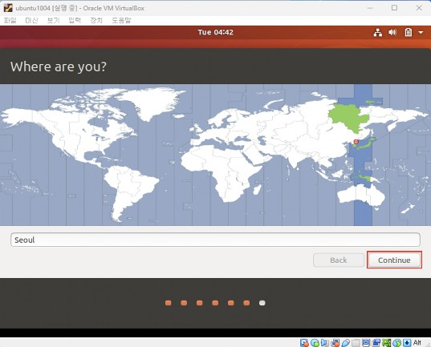

11. **Name**, **user name**, **password**를 입력하고 **Continue** 버튼을 눌러주세요.
   - (참고: 이번 실습에서는 모두 **nvidia**로 통일합니다.)

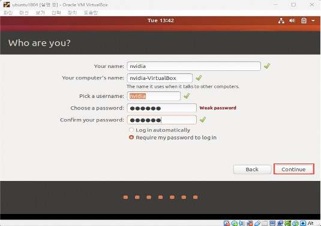

11. 설치되는 동안 기다려주세요. 설치가 완료되었다면 **Restart Now** 버튼을 눌러주세요.

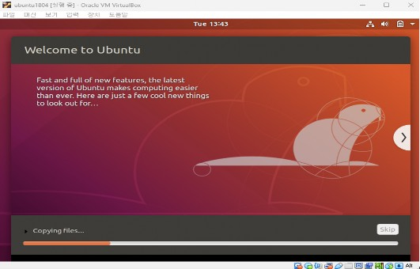

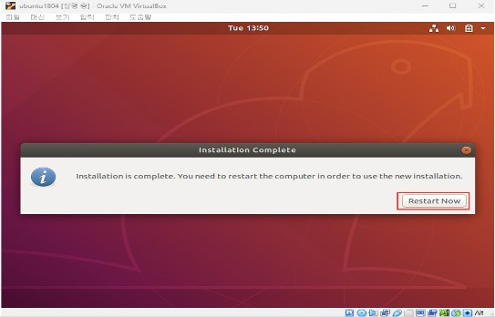

13. "Please remove the installation medium, then press ENTER" 문구가 나오면 **Enter**를 눌러주세요.
   - (삽입한 iso 이미지 파일을 제거하라는 의미인데 VirtualBox는 자동 해제해주기 때문에 Enter를 누르면 됩니다.)

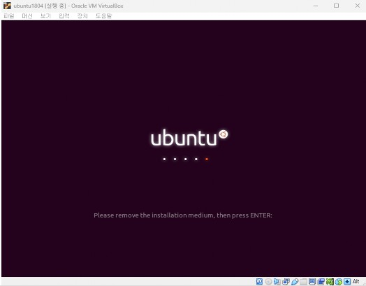

11. 만약 아래 이미지가 떴다면 VirtualBox 우측 상단에 **X** 표시를 눌러 시스템 전원 끄기를 누른 후 다시 시작해주세요.

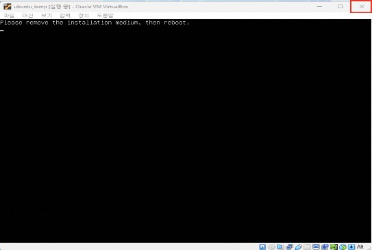

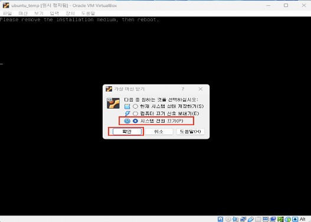

13. 이전에 설정한 **Password**를 입력하고 **Enter**를 눌러주세요.

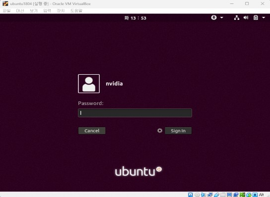

### 게스트 확장 CD 이미지 삽입

1. 화면이 켜졌다면 **장치 → 게스트 확장 CD 이미지 삽입**을 눌러주세요.

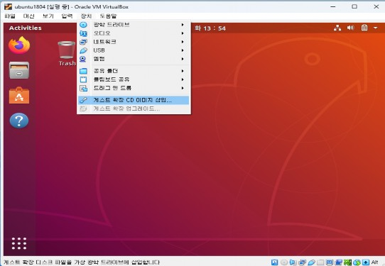

3. 아래 창이 뜬다면 **Run** 버튼을 눌러주세요.

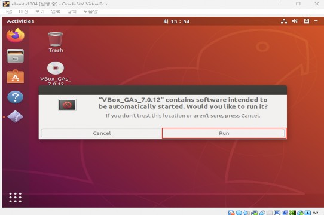

5. 아래와 같은 창이 뜬다면 **Don't Upgrade** 버튼을 눌러주세요.

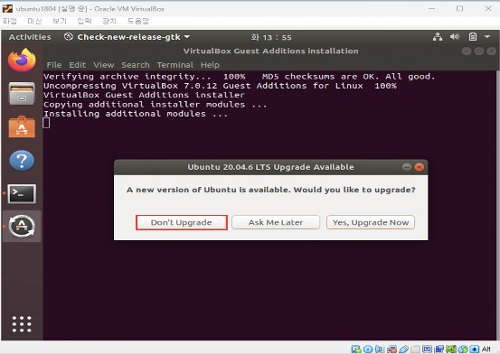

7. 아래와 같이 "Press Return to close this window..."가 뜬다면 **Enter**를 눌러주세요.

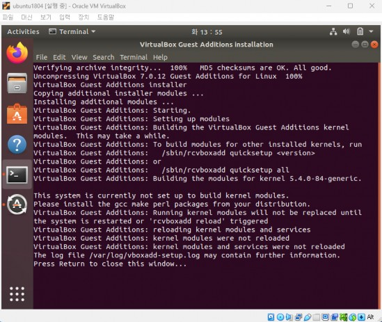

게스트 확장 CD 이미지 삽입을 완료하면 아래와 같은 기능을 사용할 수 있다:

| 기능 | 설명 |
|------|------|
| **Mouse Pointer Integration** | 마우스 포인터 통합 |
| **Shared Folders** | 공유 폴더 |
| **Better Video Support** | 더 나은 비디오 지원 |
| **Seamless Windows** | 심리스 윈도우 |
| **Shared Clipboard** | 클립보드 공유 |
| **Time Synchronization** | 시간 동기화 |

### 재부팅 및 공유 폴더 설정

```bash
$ sudo reboot
```

1. VirtualBox에서 파일 관리자 (Nautilus)를 열고, 공유 폴더가 있는지 확인한다.

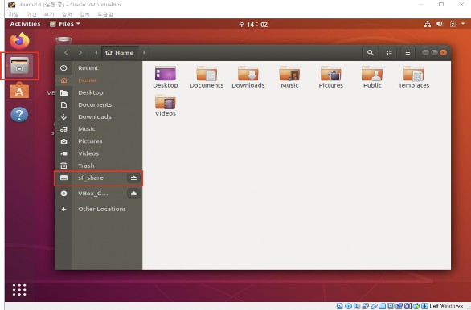

3. 공유 폴더를 들어가보면 사용자가 `vboxsf` 그룹에 없어서 에러가 발생한다.

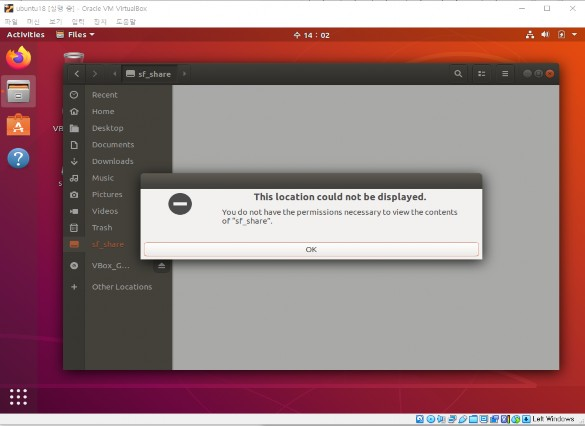

5. 아래 명령어를 실행하여 `vboxsf` 그룹에 사용자를 추가한다:

```bash
$ sudo usermod -G vboxsf -a nvidia
```

> 참고: VirtualBox를 설치할 때 사용자명을 `nvidia`가 아닌 다른 이름으로 설치했다면 해당 부분에 사용자명을 입력하면 된다.

4. 아래 명령어를 실행하여 현재 사용중인 아이디가 `vboxsf` 그룹에 들어가있는지 확인한다:

```bash
$ cat /etc/group
```

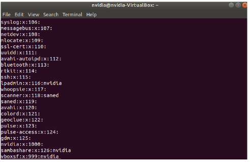

5. VirtualBox를 재부팅한다:

```bash
$ sudo reboot
```

6. Windows PC에 테스트할 텍스트 파일을 만들고, 공유 폴더 경로와 VirtualBox 내의 공유 폴더 안에 같은 파일이 있는지 확인한다. Windows PC에 있는 파일을 VirtualBox로 옮겨야 할 때 공유 폴더를 사용하면 편리하게 옮길 수 있다.

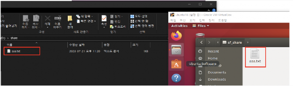

---

## 8. Visual Studio Code 설치 후 세팅

Visual Studio Code는 원격으로 소스 코드를 수정하고, 파일 복사, 다운로드하는데 매우 유용하다. Windows PC 또는 VirtualBox + Ubuntu에 설치하여 원격(SSH)으로 Jetson 디바이스의 소스 코드들을 수정하는 목적으로 활용한다.

### 8.1 Windows PC에서 Visual Studio Code 설치

1. Windows PC의 인터넷 브라우저를 실행하고, 주소창에 아래 사이트를 입력 후, Windows PC용 Visual Studio Code 설치 파일을 다운로드 받는다. (ver 1.84)

   [https://code.visualstudio.com/updates/v1_84](https://code.visualstudio.com/updates/v1_84)

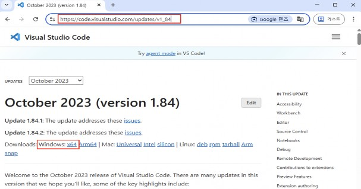

2. 윈도우 파일 탐색기를 열고, '다운로드' 폴더로 이동하면 다운로드 받은 `VSCodeUserSetup-x64-1.84.2.exe` 파일을 볼 수 있다.

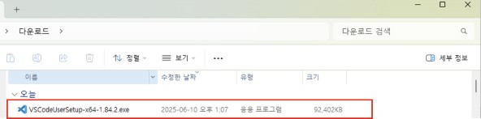

3. 아래 내용을 참고하여 설치를 진행한다:
   - **동의합니다**를 선택한 후 **다음** 버튼 클릭

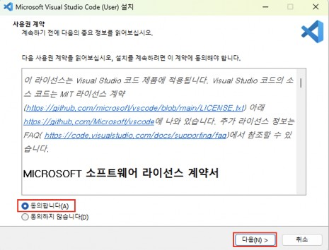

   - **다음** 버튼 클릭

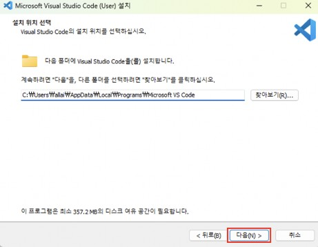

   - **다음** 버튼 클릭

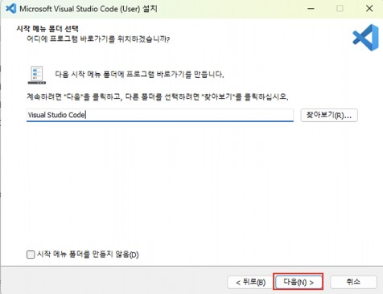

   - **다음** 버튼 클릭

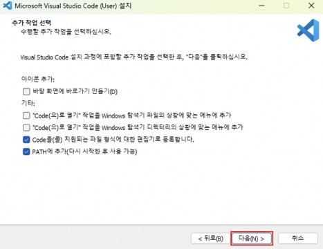

   - **설치** 버튼 클릭

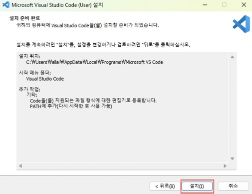

   - **종료** 버튼 클릭

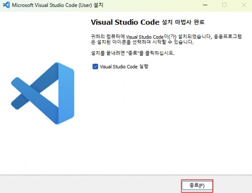

   - Windows 검색창에 **Visual Studio Code**를 입력하고, 표시된 항목을 클릭하여 실행

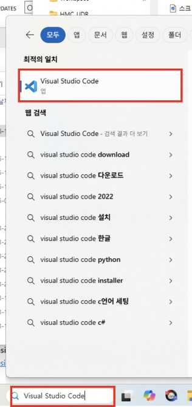

4. Windows PC에서 Visual Studio Code를 설치할 경우 **자동 업데이트 기능**이 기본적으로 활성화되어 있다. 업데이트가 진행되면 Jetson Nano와의 SSH 연결이 정상적으로 되지 않는 문제가 발생할 수 있으므로, 설치 직후 자동 업데이트 기능을 비활성화하는 것이 좋다.

   아래 안내에 따라 자동 업데이트를 비활성화해주세요:

   - **File → Preferences → Settings** 클릭

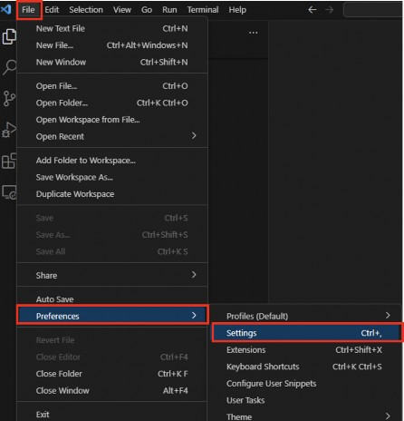
  
   - 검색창에 `update` 입력

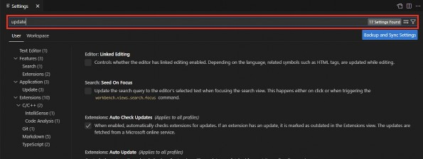

   - 아래 항목을 변경:
     - **Auto Update** → `None`
     - **Enable Windows Background updates** → 체크 해제
     - **Update: Mode** → `None`

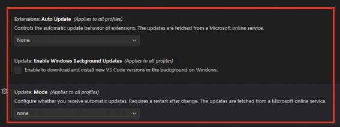
   
   - 다음 창이 나타날 경우 **restart**를 눌러주세요.


> 참고: 초기 설정 시 Visual Studio Code가 이미 1.100.x 버전으로 업데이트되어 있을 수 있다. 이 경우, 제어판에서 해당 프로그램을 제거한 뒤 1.84.2 버전을 다시 설치하면 자동 업데이트 없이 해당 버전으로 유지된다.

### 8.2 VirtualBox + Ubuntu에서 Visual Studio Code 설치

1. VirtualBox + Ubuntu의 인터넷 브라우저를 실행하고, 주소창에 아래 사이트를 입력 후, Ubuntu 18.04용 Visual Studio Code 설치 파일을 다운로드 받는다. (ver 1.84)

   [https://code.visualstudio.com/updates/v1_84](https://code.visualstudio.com/updates/v1_84)


   > 참고: 최신 버전의 Visual Studio Code가 Ubuntu 18.04에 설치되지 않아 구 버전을 설치한다.

2. 리눅스 파일 탐색기 (Nautilus)를 열고, **Downloads** 폴더로 이동하면 다운로드 받은 `code_1.84.2-1699528352_amd64.deb` 파일을 볼 수 있다.


3. `code_1.84.2-1699528352_amd64.deb` 파일을 더블 클릭하면 설치창이 나타난다. **Install** 버튼을 눌러 설치를 진행한다.


4. 설치가 완료되면, Host PC (VirtualBox + Ubuntu)의 바탕화면 왼쪽 아래에 있는 **Show Applications** 버튼을 눌러, 설치한 Visual Studio Code를 찾아 실행한다.
   - 또는 터미널에서 `code`를 입력하면 Visual Studio Code를 실행할 수 있다.


---

## 9. Jetson Nano MFI Flash (JetPack 4.6) 및 Jetson 초기 세팅

### 9.1 Flash 패키지 준비

1. Guest PC (Ubuntu)에서 Jetson Nano OS 설치 패키지를 복사할 디렉터리를 생성한다:

   ```bash
   $ mkdir jetson
   ```

2. 공유 폴더를 이용하여 Host PC에 있는 Jetson Nano OS 설치 패키지 파일 (`allai-mfi-jcb100-nano.tbz2`)을 VirtualBox의 Guest PC (Ubuntu)의 `~/jetson` 경로에 복사한다.

3. Guest PC (Ubuntu)에서 아래 명령어를 이용해서 압축파일을 풀어준다:

   ```bash
   $ tar xvjf allai-mfi-jcb100-nano.tbz2
   ```


4. 압축해제가 다 되면 해당 폴더로 이동한다:

   ```bash
   $ cd mfi_jetson-nano-emmc/
   ```


### 9.2 Flash 실행

1. Jetson Nano와 Windows PC를 **5핀**으로 연결하고, **Recovery mode**를 만들어준다.


2. VirtualBox 상단에 **장치 → USB**에서 `NVIDIA Corp, APX [0102]`를 선택한다.


3. Guest PC (Ubuntu)에서 터미널 창을 열어 아래 명령어를 입력한 후 `0955:7f21 Nvidia Corp.`로 뜨는지 확인한다:

   ```bash
   $ lsusb
   ```


4. 압축을 해제한 폴더 (`~/jetson/mfi_jetson-nano-emmc/`)에서 아래 명령어를 실행한다:

   ```bash
   $ sudo ./nvmflash.sh
   ```


5. 아래처럼 **Flash complete (SUCCESS)** 라고 뜨면 Jetson Nano Flash가 성공적으로 완료된 것이다.

   ```
   Flash complete (SUCCESS)
   ```


   > 참고: Flash complete (SUCCESS)가 출력됐다면, Jetson Nano에 다음 사진과 같이 연결하고, 다음 내용부터 진행한다.


### 9.3 Jetson Nano 초기 설정

1. Jetson Nano에 키보드, 마우스 USB와 Power, HDMI를 연결한 다음 아래 화면이 나타나면, 체크박스에 체크를 한 뒤 **Continue** 버튼을 클릭한다.


2. **English**를 선택한 뒤 **Continue** 버튼을 클릭한다.
   - (설치 경로나 파일 경로에 한글이 포함되면 호환성 문제가 발생할 수 있으므로, 언어는 영어로 설정하는 것을 권장한다.)


3. **Seoul**을 입력한 뒤 **Continue** 버튼을 클릭한다.
   - (Jetson Nano에 랜선을 연결한 상태에서는 지역이 자동으로 Seoul로 설정된다.)


4. **Name**, **username**, **passwd**를 모두 **nvidia**로 입력한 후 **Continue** 버튼을 클릭한다.
   - (참고: 아이디와 패스워드는 nvidia로 통일한다.)


5. **Continue** 버튼을 클릭한다.


> 참고: Jetson Nano 설정이 완료된 후 부팅이 됐다면, SD 카드를 세팅하기 위해 Host PC에서 다음 내용을 진행한다.

---

## 10. Host PC (Windows)에서 SD Card Image 굽고 Jetson 부팅 시스템 변경

### 10.1 BalenaEtcher 설치

Host PC (Windows)에서 SD 카드에 이미지를 굽기 위해 사용되는 도구인 **BalenaEtcher**를 설치한다.


### 10.2 SD 카드 이미지 굽기

1. 제공된 SD 카드를 SD 어댑터에 삽입하고, 어댑터를 USB 방식의 SD 카드 리더기에 연결한 후, 이를 Host PC (Windows)에 꽂아 사용한다.


2. BalenaEtcher를 **관리자 권한**으로 실행한 후 **Image File** (실습자료로 제공된 `jcb100_nano_sd.img` 파일)과 **Target** (`Generic STORAGE DEVICE Media 128GB SD card`)을 선택한다.


3. **Yes, I'm sure** 버튼을 클릭한다.


4. 다음 내용이 나오면 **취소**를 눌러준다.


5. **Flash Completed!** 문구가 나오면 Flash가 완료된 것이다. SD 카드 리더기를 Host PC와 분리해준다.


### 10.3 SD 카드 장착 및 파티션 확장

1. Jetson eMMC에 Flash가 완료되어 부팅이 되었으면 Jetson Nano Board SD Card Slot에 SD 카드를 꽂아준다.


   > 참고: SD 카드 이미지를 구운 후 부팅하면, user와 passwd는 모두 `nvidia`로 고정되어 있다.


2. Jetson Nano에서 SD 카드가 인식됐는지 확인하고, Flash된 SD 카드의 공간을 **gparted** 도구를 이용해서 늘려준다.
   - Jetson Nano에서 부팅한 후 사이드 메뉴바에 아이콘으로 SD 카드가 인식됐는지 확인한다.


3. gparted를 설치한 후 실행한다:

   ```bash
   $ sudo apt install gparted
   $ sudo gparted
   ```
   > 참고: 인터넷이 연결되어 있지 않으면 에러가 발생할 수 있다. 이더넷 케이블을 연결해주세요.


4. gparted를 실행했을 때 창이 뜰 경우 **Fix**를 클릭한다.


5. `/dev/mmcblk1`로 이동 후 번호 순서대로 클릭한다.


6. **Size**를 늘려주고 **Resize**를 눌러준다.


7. 순서대로 누른 후 적용이 완료되면 **close** 버튼을 눌러준다.


8. Size가 늘어난 것을 확인한다.


9. `df` 명령어로 크기를 한번 더 확인한다:

   ```bash
   $ df -h
   ```


### 10.4 부팅 시스템 변경 (extlinux.conf)

1. 터미널 창을 열어서 `extlinux.conf`를 vi 에디터 또는 gedit으로 열어준다.

   ```bash
   # vi로 편집
   $ sudo vi /boot/extlinux/extlinux.conf
```


```
   # gedit으로 편집
   $ sudo gedit /boot/extlinux/extlinux.conf
   ```


2. 빨간색 네모로 표시된 부분을 **mmcblk1p1**로 바꾸고 저장 후 닫아준다.

   > **주의**: 잘못 바꿀 경우 부팅이 안되어 다시 flash 하는 상황이 생길 수 있다. 실수하지 않도록 주의해주세요.

### 10.5 재부팅 및 확인

1. Reboot 한다:

   ```bash
   $ sudo reboot
   ```


2. Reboot이 되면 터미널을 열어서 아래 명령어를 실행하여 Filesystem `/dev/mmcblk1p1`이 `/`(root)에 Mount 되어있는지 확인한다:

   ```bash
   $ df -h
   ```


---

## 참고 자료

- [Oracle VM VirtualBox 다운로드](https://www.oracle.com/kr/virtualization/technologies/vm/downloads/virtualbox-downloads.html)
- [NVIDIA SDK Manager](https://developer.nvidia.com/sdk-manager)
- [Microsoft Visual C++ 재배포 가능 패키지](https://learn.microsoft.com/ko-kr/cpp/windows/latest-supported-vc-redist)
