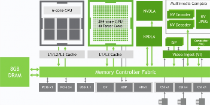

# NVIDIA Jetson

---

## 1. NVIDIA Jetson 개요

**NVIDIA Jetson**은 CPU(Cortex-A: Tegra)와 Nvidia GPU, NPU 등을 하나의 **SOC(System On Chip)** 에 탑재한 임베디드 플랫폼이다.

- **Embedded Edge Device**에서 NVIDIA의 고성능 병렬처리 연산 GPU를 일반 SW에서도 활용하도록 하는 **CUDA** 제공
- **CUDA** 기반의 **Deep Learning (cuDNN)** 환경 및 주요 DL 프레임워크(예: TensorFlow, PyTorch)에 대한 다양한 SW 라이브러리와 예제코드 제공
- **SOM(System-On-Module)** 형태로 하드웨어를 설계하며, 개발 시간과 비용 절감 가능
- 주요 제품군: **Jetson Nano, TX2 NX, Xavier NX, AGX Xavier, Orin Nano, Orin NX, AGX Orin, Thor**

---

## 2. NVIDIA Jetson Module (SOM)

### NVIDIA Jetson Module (SOM)

- NVIDIA Jetson Module (SOM)은 AI 작업 부하를 처리하도록 특별히 설계되어 복잡한 데이터를 처리하고 edge 디바이스에서 AI 알고리즘을 실행하는데 필요한 컴퓨팅 성능을 제공한다.
- CPU, GPU, 메모리 및 다양한 인터페이스를 **단일 소형 모듈에 통합**

### NVIDIA Jetson Nano

- 128개의 NVIDIA CUDA 코어를 장착한 **Maxwell 아키텍처**
- AI Performance: **472 GFLOPs**
- GPU: 128-core NVIDIA Maxwell™ GPU
- CPU: Quad-Core Arm® Cortex®-A57 MPCore processor

---

## 3. Jetson Module별 사양 비교

### 종합 사양표

**AI 성능 · GPU · 메모리**

| 모델 | AI 성능 | GPU | 메모리 |
|------|---------|-----|--------|
| **Jetson NANO** | 472 GFLOPs | 128-core Maxwell | 4GB LPDDR4 25.6GB/s |
| **Jetson TX2 NX** | 1.33 TFLOPs | 256-core Pascal | 4GB LPDDR4 51.2GB/s |
| **Jetson Xavier NX** | 21 TOPS | 384-core Volta (48 Tensor) | 8GB/16GB LPDDR4x 59.7GB/s |
| **Jetson Orin Nano 4GB** | 20 TOPS | 512-core Ampere (16 Tensor) | 4GB LPDDR5 34GB/s |
| **Jetson Orin Nano 8GB** | 40 TOPS | 1024-core Ampere (32 Tensor) | 8GB LPDDR5 68GB/s |
| **Jetson Orin NX 8GB** | 70 TOPS | 1024-core Ampere (32 Tensor) | 8GB LPDDR5 102.4GB/s |
| **Jetson Orin NX 16GB** | 100 TOPS | 1024-core Ampere (32 Tensor) | 16GB LPDDR5 102.4GB/s |
| **Jetson AGX Xavier 32GB** | 32 TOPS | 512-core Volta (64 Tensor) | 32GB LPDDR4x 136.5GB/s |
| **Jetson AGX Xavier 64GB** | 32 TOPS | 512-core Volta (64 Tensor) | 64GB LPDDR4x 136.5GB/s |
| **Jetson AGX Orin 32GB** | 200 TOPS | 1792-core Ampere (56 Tensor) | 32GB LPDDR5 205GB/s |
| **Jetson AGX Orin 64GB** | 275 TOPS | 2048-core Ampere (64 Tensor) | 64GB LPDDR5 205GB/s |
| **Jetson AGX Orin industrial** | 248 TOPS | 2048-core Ampere (64 Tensor) | 64GB LPDDR5 (+ ECC) 204.8GB/s |

**CPU · 가속기**

| 모델 | CPU | DL 가속기 | Vision 가속기 |
|------|-----|-----------|-------------|
| **Jetson NANO** | Quad-Core A57 MPCore | - | - |
| **Jetson TX2 NX** | Dual Denver2 64-bit + Quad A57 MPCore | - | - |
| **Jetson Xavier NX** | 6-core Carmel ARMv8.2 6MB L2 + 4MB L3 | 2x NVDLA | - |
| **Jetson Orin Nano 4GB** | 6-core A78AE | - | - |
| **Jetson Orin Nano 8GB** | 6-core A78AE | - | - |
| **Jetson Orin NX 8GB** | 6-core A78AE | 1x NVDLA V2.0 | PVA v2.0 |
| **Jetson Orin NX 16GB** | 8-core A78AE | 2x NVDLA V2.0 | PVA v2.0 |
| **Jetson AGX Xavier 32GB** | 8-core Carmel ARMv8.2 8MB L2 + 4MB L3 | 2x NVDLA V1.0 | 2x 7-way VLIW |
| **Jetson AGX Xavier 64GB** | 8-core Carmel ARMv8.2 8MB L2 + 4MB L3 | 2x NVDLA V1.0 | 2x 7-way VLIW |
| **Jetson AGX Orin 32GB** | 8-core A78AE v8.2 2MB L2 + 4MB L3 | 2x NVDLA V2.0 | PVA v2.0 |
| **Jetson AGX Orin 64GB** | 12-core A78AE v8.2 3MB L2 + 6MB L3 | 2x NVDLA V2.0 | PVA v2.0 |
| **Jetson AGX Orin industrial** | 12-core A78AE v8.2 3MB L2 + 6MB L3 | 2x NVDLA V2.0 | PVA v2.0 |

### CPU 상세 및 비디오 사양

**저장장치**

| 모델 | Storage |
|------|---------|
| **Jetson NANO** | 16GB eMMC 5.1 |
| **Jetson TX2 NX** | 16GB eMMC 5.1 |
| **Jetson Xavier NX** | 16GB eMMC 5.1 |
| **Jetson Orin Nano 4GB** | External NVMe |
| **Jetson Orin Nano 8GB** | External NVMe |
| **Jetson Orin NX 8GB** | External NVMe |
| **Jetson Orin NX 16GB** | External NVMe |
| **Jetson AGX Xavier 32GB** | 32GB eMMC 5.1 |
| **Jetson AGX Xavier 64GB** | 32GB eMMC 5.1 |
| **Jetson AGX Orin 32GB** | 64GB eMMC 5.1 |
| **Jetson AGX Orin 64GB** | 64GB eMMC 5.1 |
| **Jetson AGX Orin industrial** | 64GB eMMC 5.1 |

**Video Encode**

| 모델 | Video Encode |
|------|-------------|
| **Jetson NANO** | 250MP/sec |
| **Jetson TX2 NX** | 1x 4K@30 (HEVC) |
| **Jetson Xavier NX** | 2x 1080p@60 (HEVC) |
| **Jetson Orin Nano 4GB** | 1080p30 (1-2 CPU cores) |
| **Jetson Orin Nano 8GB** | 1080p30 (1-2 CPU cores) |
| **Jetson Orin NX 8GB** | 1x 4K60 \| 3x 4K30 \| 6x 1080p60 \| 12x 1080p30 (H.265/H.264/AV1) |
| **Jetson Orin NX 16GB** | 1x 4K60 \| 3x 4K30 \| 6x 1080p60 \| 12x 1080p30 (H.265/H.264/AV1) |
| **Jetson AGX Xavier 32GB** | 4x 4K@60 \| 16x 1080p@60 \| 32x 1080p@30 (H.265) |
| **Jetson AGX Xavier 64GB** | 4x 4K@60 \| 16x 1080p@60 \| 32x 1080p@30 (H.265) |
| **Jetson AGX Orin 32GB** | 1x 4K60 \| 3x 4K30 \| 6x 1080p60 \| 12x 1080p30 (H.265) |
| **Jetson AGX Orin 64GB** | 2x 4K60 \| 4x 4K30 \| 8x 1080p60 \| 16x 1080p30 (H.265) |
| **Jetson AGX Orin industrial** | 1x 4K60 \| 3x 4K30 \| 7x 1080p60 \| 15x 1080p30 (H.265) |

**Video Decode**

| 모델 | Video Decode |
|------|-------------|
| **Jetson NANO** | 500MP/sec |
| **Jetson TX2 NX** | 1x 4K@60 (HEVC) |
| **Jetson Xavier NX** | 4x 1080p@60 (HEVC) |
| **Jetson Orin Nano 4GB** | 1x 4K60 \| 2x 4K30 \| 5x 1080p60 \| 11x 1080p30 (H.265) |
| **Jetson Orin Nano 8GB** | 1x 4K60 \| 5x 1080p60 (H.265) |
| **Jetson Orin NX 8GB** | 1x 4K60 \| 3x 4K30 \| 6x 1080p60 (H.265) |
| **Jetson Orin NX 16GB** | 1x 8K30 \| 2x 4K60 \| 9x 1080p60 (H.265) |
| **Jetson AGX Xavier 32GB** | 2x 8K@30 \| 6x 4K@60 \| 26x 1080p@60 \| 52x 1080p@30 (H.265) |
| **Jetson AGX Xavier 64GB** | 2x 8K@30 \| 6x 4K@60 \| 26x 1080p@60 \| 52x 1080p@30 (H.265) |
| **Jetson AGX Orin 32GB** | 1x 8K30 \| 2x 4K60 \| 4x 4K30 \| 9x 1080p60 \| 18x 1080p30 (H.265) |
| **Jetson AGX Orin 64GB** | 1x 8K30 \| 3x 4K60 \| 7x 4K30 \| 11x 1080p60 \| 22x 1080p30 (H.265) |
| **Jetson AGX Orin industrial** | 1x 8K30 \| 3x 4K60 \| 7x 4K30 \| 11x 1080p60 \| 22x 1080p30 (H.265) |

### 카메라 / PCIe / 규격 / 전력

**Camera**

| 모델 | Camera |
|------|--------|
| **Jetson NANO** | Up to 4 cameras, 12 lanes MIPI CSI-2, D-PHY 1.1 (up to 18 Gbps) |
| **Jetson TX2 NX** | Up to 5 cameras (12 via virtual), 12 lanes MIPI CSI-2 (3×4 or 5×2), D-PHY 1.2 (up to 30 Gbps) |
| **Jetson Xavier NX** | Up to 6 cameras (24 via virtual), 12 lanes MIPI CSI-2, D-PHY 1.2 (up to 30 Gbps) |
| **Jetson Orin Nano 4GB** | Up to 4 cameras (8 via virtual), 8 lanes MIPI CSI-2, D-PHY 2.1 (up to 20 Gbps) |
| **Jetson Orin Nano 8GB** | Up to 4 cameras (8 via virtual), 8 lanes MIPI CSI-2, D-PHY 2.1 (up to 20 Gbps) |
| **Jetson Orin NX 8GB** | Up to 4 cameras (8 via virtual), 8 lanes MIPI CSI-2, D-PHY 2.1 (up to 20 Gbps) |
| **Jetson Orin NX 16GB** | Up to 4 cameras (8 via virtual), 8 lanes MIPI CSI-2, D-PHY 2.1 (up to 20 Gbps) |
| **Jetson AGX Xavier 32GB** | Up to 6 cameras (36 via virtual), 16 lanes MIPI CSI-2 \| 8 lanes SLVS-EC, D-PHY 1.2 (up to 40 Gbps) |
| **Jetson AGX Xavier 64GB** | Up to 6 cameras (36 via virtual), 16 lanes MIPI CSI-2 \| 8 lanes SLVS-EC, D-PHY 1.2 (up to 40 Gbps) |
| **Jetson AGX Orin 32GB** | Up to 6 cameras (16 via virtual), 16 lanes MIPI CSI-2, D-PHY 2.1 (up to 40 Gbps) \| C-PHY 2.0 (up to 164 Gbps) |
| **Jetson AGX Orin 64GB** | Up to 6 cameras (16 via virtual), 16 lanes MIPI CSI-2, D-PHY 2.1 (up to 40 Gbps) \| C-PHY 2.0 (up to 164 Gbps) |
| **Jetson AGX Orin industrial** | Up to 6 cameras (16 via virtual), 16 lanes MIPI CSI-2, D-PHY 2.1 (up to 40 Gbps) \| C-PHY 2.0 (up to 164 Gbps) |

**PCI Express**

| 모델 | PCI Express |
|------|-------------|
| **Jetson NANO** | 1 x4 (PCIe Gen2) |
| **Jetson TX2 NX** | 1 x1 + 1 x2 (PCIe Gen2, total 30GT/s) |
| **Jetson Xavier NX** | 1 x1 + 1 x4 (PCIe Gen3, Root Port & Endpoint) |
| **Jetson Orin Nano 4GB** | 1 x4 + 3 x1 (PCIe Gen3, Root Port & Endpoint) |
| **Jetson Orin Nano 8GB** | 1 x4 + 3 x1 (PCIe Gen3, Root Port & Endpoint) |
| **Jetson Orin NX 8GB** | 1 x4 + 3 x1 (PCIe Gen4, Root Port & Endpoint) |
| **Jetson Orin NX 16GB** | 1 x4 + 3 x1 (PCIe Gen4, Root Port & Endpoint) |
| **Jetson AGX Xavier 32GB** | 1 x8 + 1 x4 + 1 x2 + 2 x1 (PCIe Gen4, Root Port & Endpoint) |
| **Jetson AGX Xavier 64GB** | 1 x8 + 1 x4 + 1 x2 + 2 x1 (PCIe Gen4, Root Port & Endpoint) |
| **Jetson AGX Orin 32GB** | Up to 2 x8 + 1 x4 + 2 x1 (PCIe Gen4, Root Port & Endpoint) |
| **Jetson AGX Orin 64GB** | Up to 2 x8 + 1 x4 + 2 x1 (PCIe Gen4, Root Port & Endpoint) |
| **Jetson AGX Orin industrial** | Up to 2 x8 + 1 x4 + 2 x1 (PCIe Gen4, Root Port & Endpoint) |

**규격(Mechanical) · 전력(Power)**

| 모델 | Mechanical | Power |
|------|-------------|-------|
| **Jetson NANO** | 69.6mm x 45mm, 260-pin SO-DIMM | 5W – 10W |
| **Jetson TX2 NX** | 69.6mm x 45mm, 260-pin SO-DIMM | 7.5W – 15W |
| **Jetson Xavier NX** | 69.6mm x 45mm, 260-pin SO-DIMM | 10W – 20W |
| **Jetson Orin Nano 4GB** | 69.6mm x 45mm, 260-pin SO-DIMM | 5W – 10W |
| **Jetson Orin Nano 8GB** | 69.6mm x 45mm, 260-pin SO-DIMM | 7W – 15W |
| **Jetson Orin NX 8GB** | 69.6mm x 45mm, 260-pin SO-DIMM | 10W – 20W |
| **Jetson Orin NX 16GB** | 69.6mm x 45mm, 260-pin SO-DIMM | 10W – 25W |
| **Jetson AGX Xavier 32GB** | 100mm x 87mm, 699-pin connector, Integrated thermal transfer plate | 10W – 30W |
| **Jetson AGX Xavier 64GB** | 100mm x 87mm, 699-pin Molex Mirror Mezz, Integrated thermal transfer plate | 10W – 30W |
| **Jetson AGX Orin 32GB** | 100mm x 87mm, 699-pin Molex Mirror Mezz, Integrated thermal transfer plate | 15W – 40W |
| **Jetson AGX Orin 64GB** | 100mm x 87mm, 699-pin Molex Mirror Mezz, Integrated thermal transfer plate | 15W – 60W |
| **Jetson AGX Orin industrial** | 100mm x 87mm, 699-pin Molex Mirror Mezz, Integrated thermal transfer plate | 15W – 75W |

---

## NVIDIA Jetson Developer Kit

### NVIDIA Jetson Developer kit
•   NVIDIA Jetson Developer Kit은 Jetson SOM을 기반으로 한 개발 보드로, AI 및 엣지 컴퓨팅 애플리케이션 을 개발하고 테스트하는데 사용
•   Jetson 사용자들이 좀 더 쉽게 소프트웨어 개발 하기 위한 표준 하드웨어 플랫폼으로 하드웨어 제작 이전에 소프트웨어 구현 및 시험을 가능하게 해줌

## Jetson Module(SOM) vs Jetson Developer Kit
▪  Jetson Module(SOM)과 NVIDIA Jetson Developer kit 차이점?

### Nvidia Jetson Module(SOM)
▪ Jetson 모듈은 양산 및 운영 환경에 적합하며, 각 모듈은 사전 설치된 소프트웨어 없이 판매됨
▪ 최종 양산용으로 설계되거나 판매되는 캐리어(I/O interface) 보드에 Jetson 모듈을 부착하고, 개발한 소프트웨어를 탑재 (Image Flash)하여 배포해야 함

### Nvidia Jetson Developer Kit
▪ 각 Jetson Developer Kit에는 참조용 캐리어 보드와 비양산 용도의 Jetson 모듈이 포함
▪ Jetpack SDK를 통해서 소프트웨어를 개발하고 테스트하는데 사용되며, 양산 용도로 사용되지 않음
▪ Jetson Developer Kit은 양산 용도가 아니며, Jetson 모듈은 Operating-Life time내 양산 환경에 맞춰 설계 됨

### NVIDIA Jetson Platform 하드웨어 구성
▪ Nvidia Jetson SOM 구성
▪ CPU/GPU
▪ RAM
▪ NVDLA
▪ NV Encoder/NV Decoder, NV JPEG
▪ ISP/VIC
▪ eMMC(Storage)
▪ 그리고 외부 인터페이스
▪ 개발자는 Jetson SOM과 연결할 커넥터와 사용할 외부 인터페이스를 구현한 Carrier Board를 제작 생산하면, Jetson에서 개발한 소프트웨어 이식 가능

---

## 4. Jetson Module 아키텍처 세대별 특징

### Maxwell 세대 (Jetson Nano)
- 128 CUDA 코어, FP16 472 GFLOPs
- Tensor Core 없음, DL Accelerator 없음
- 28nm 공정, 5~10W

### Pascal 세대 (Jetson TX2/TX2 NX)
- 256 CUDA 코어, FP16 1.33 TFLOPs
- Tensor Core 없음
- 16nm 공정, 7.5~15W
- Denver2 + A57 HMP CPU (6코어)

### Volta 세대 (Jetson Xavier NX)
- 384 CUDA + 48 Tensor 코어 (최초 Tensor Core 탑재)
- INT8 21 TOPS
- 2x NVDLA 엔진 내장
- 8~15W

### Ampere 세대 (Jetson Orin 시리즈)
- 512~1024 CUDA + 16~32 Tensor 코어
- INT8 20~100 TOPS
- NVDLA V2.0, PVA V2.0 (Orin NX)
- 8nm 공정, 7~25W
- A78AE CPU (안전 기능 지원)

---

## 5. Jetson Software Stack

NVIDIA Jetson 플랫폼은 하드웨어 성능을 최대한 활용할 수 있도록 최적화된 소프트웨어 스택을 제공한다:

- **JetPack SDK**: BSP, CUDA, cuDNN, TensorRT, 멀티미디어 API 등 포함
- **CUDA**: GPU 가속 병렬 컴퓨팅
- **cuDNN**: 딥러닝 연산 가속 라이브러리
- **TensorRT**: 고성능 추론 최적화 엔진
- **VisionWorks/VPI**: 컴퓨터 비전 가속
- **OpenCV**: CUDA 가속 OpenCV
- **TensorFlow / PyTorch**: NVIDIA 최적화 버전 제공

---

## 참고 자료

- [NVIDIA Jetson 공식 페이지](https://developer.nvidia.com/embedded/jetson-modules)
- [NVIDIA Jetson Module Datasheet](https://developer.nvidia.com/embedded/jetson-modules)
- [Jetson Linux Developer Guide](https://docs.nvidia.com/jetson/l4t/)
