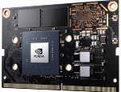
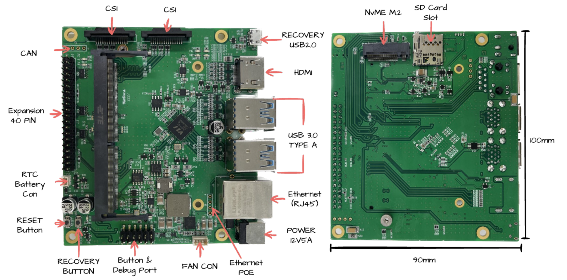

# NVIDIA Jetson

---

## 1. NVIDIA Jetson 개요

**NVIDIA Jetson**은 CPU(Cortex-A: Tegra)와 Nvidia GPU, NPU 등을 하나의 **SOC(System On Chip)** 에 탑재한 임베디드 플랫폼이다.

- **Embedded Edge Device**에서 NVIDIA의 고성능 병렬처리 연산 GPU를 일반 SW에서도 활용하도록 하는 **CUDA** 제공
- **CUDA** 기반의 **Deep Learning (cuDNN)** 환경 및 주요 DL 프레임워크(예: TensorFlow, PyTorch)에 대한 다양한 SW 라이브러리와 예제코드 제공
- **SOM(System-On-Module)** 형태로 하드웨어를 설계하며, 개발 시간과 비용 절감 가능
- 주요 제품군: **Jetson Nano, TX2 NX, Xavier NX, AGX Xavier, Orin Nano, Orin NX, AGX Orin, Thor**

---

## 2. NVIDIA Jetson Module (SOM)

NVIDIA Jetson Module (SOM)은 AI 작업 부하를 처리하도록 특별히 설계되어 복잡한 데이터를 처리하고 edge 디바이스에서 AI 알고리즘을 실행하는데 필요한 컴퓨팅 성능을 제공한다.

- CPU, GPU, 메모리 및 다양한 인터페이스를 **단일 소형 모듈에 통합**

### NVIDIA Jetson Nano

- 128개의 NVIDIA CUDA 코어를 장착한 **Maxwell 아키텍처**
- AI Performance: **472 GFLOPs**
- GPU: 128-core NVIDIA Maxwell™ GPU
- CPU: Quad-Core Arm® Cortex®-A57 MPCore processor

---

## 3. Jetson Module별 사양 비교

### 종합 사양표

| 모델 | AI 성능 | GPU | CPU | 메모리 | DL 가속기 | Vision 가속기 |
|------|---------|-----|-----|--------|----------|-------------|
| **Jetson NANO** | 472 GFLOPs | 128-core Maxwell | Quad-Core A57 | 4GB LPDDR4 25.6GB/s | - | - |
| **Jetson TX2 NX** | 1.33 TFLOPs | 256-core Pascal | Dual Denver2 + Quad A57 | 4GB LPDDR4 51.2GB/s | - | - |
| **Jetson Xavier NX** | 21 TOPS | 384-core Volta (48 Tensor) | 6-core Carmel | 8GB/16GB LPDDR4x 59.7GB/s | 2x NVDLA | - |
| **Jetson Orin Nano 4GB** | 20 TOPS | 512-core Ampere (16 Tensor) | 6-core A78AE | 4GB LPDDR5 34GB/s | - | - |
| **Jetson Orin Nano 8GB** | 40 TOPS | 1024-core Ampere (32 Tensor) | 6-core A78AE | 8GB LPDDR5 68GB/s | - | - |
| **Jetson Orin NX 8GB** | 70 TOPS | 1024-core Ampere (32 Tensor) | 6-core A78AE | 8GB LPDDR5 102.4GB/s | 1x NVDLA V2.0 | PVA v2.0 |
| **Jetson Orin NX 16GB** | 100 TOPS | 1024-core Ampere (32 Tensor) | 8-core A78AE | 16GB LPDDR5 102.4GB/s | 2x NVDLA V2.0 | PVA v2.0 |

### CPU 및 비디오 사양

| 모델 | CPU 상세 | Video Encode | Video Decode | Storage |
|------|---------|-------------|-------------|---------|
| **Jetson NANO** | Quad-Core A57 | 250MP/sec | 500MP/sec | 16GB eMMC 5.1 |
| **Jetson TX2 NX** | Dual Denver2 + Quad A57 | 1x 4K@30 (HEVC) | 1x 4K@60 (HEVC) | 16GB eMMC 5.1 |
| **Jetson Xavier NX** | 6-core Carmel ARMv8.2, 6MB L2 | 2x 1080p@60 (HEVC) | 4x 1080p@60 (HEVC) | 16GB eMMC 5.1 |
| **Jetson Orin Nano 4GB** | 6-core A78AE | 1080p30 (1-2 CPU cores) | 1x 4K60 (H.265) | External NVMe |
| **Jetson Orin Nano 8GB** | 6-core A78AE | 1080p30 (1-2 CPU cores) | 1x 4K60 (H.265) | External NVMe |
| **Jetson Orin NX 8GB** | 6-core A78AE | 1x 4K60 \| 3x 4K30 | 1x 4K60 \| 3x 4K30 \| 5x 1080p60 | External NVMe |
| **Jetson Orin NX 16GB** | 8-core A78AE | 1x 4K60 \| 3x 4K30 | 1x 4K60 \| 3x 4K30 \| 5x 1080p60 | External NVMe |

---

## 4. Jetson Module 아키텍처 세대별 특징

### Maxwell 세대 (Jetson Nano)
- 128 CUDA 코어, FP16 472 GFLOPs
- Tensor Core 없음, DL Accelerator 없음
- 28nm 공정, 5~10W

### Pascal 세대 (Jetson TX2/TX2 NX)
- 256 CUDA 코어, FP16 1.33 TFLOPs
- Tensor Core 없음
- 16nm 공정, 7.5~15W
- Denver2 + A57 HMP CPU (6코어)

### Volta 세대 (Jetson Xavier NX)
- 384 CUDA + 48 Tensor 코어 (최초 Tensor Core 탑재)
- INT8 21 TOPS
- 2x NVDLA 엔진 내장
- 8~15W

### Ampere 세대 (Jetson Orin 시리즈)
- 512~1024 CUDA + 16~32 Tensor 코어
- INT8 20~100 TOPS
- NVDLA V2.0, PVA V2.0 (Orin NX)
- 8nm 공정, 7~25W
- A78AE CPU (안전 기능 지원)

---

## 5. Jetson Software Stack

NVIDIA Jetson 플랫폼은 하드웨어 성능을 최대한 활용할 수 있도록 최적화된 소프트웨어 스택을 제공한다:

- **JetPack SDK**: BSP, CUDA, cuDNN, TensorRT, 멀티미디어 API 등 포함
- **CUDA**: GPU 가속 병렬 컴퓨팅
- **cuDNN**: 딥러닝 연산 가속 라이브러리
- **TensorRT**: 고성능 추론 최적화 엔진
- **VisionWorks/VPI**: 컴퓨터 비전 가속
- **OpenCV**: CUDA 가속 OpenCV
- **TensorFlow / PyTorch**: NVIDIA 최적화 버전 제공

---

## 참고 자료

- [NVIDIA Jetson 공식 페이지](https://developer.nvidia.com/embedded/jetson-modules)
- [NVIDIA Jetson Module Datasheet](https://developer.nvidia.com/embedded/jetson-modules)
- [Jetson Linux Developer Guide](https://docs.nvidia.com/jetson/l4t/)
