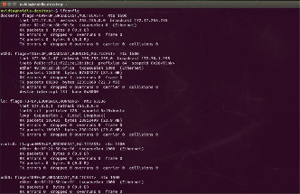
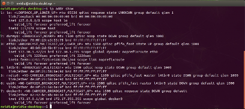
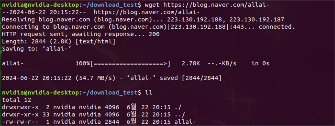
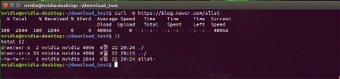
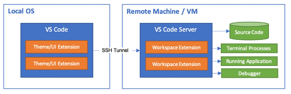

# Linux Network

---

## 1. Linux Network 개요

리눅스는 네트워크 관리와 설정에서 강력하고 유연한 기능을 제공한다. 다양한 도구와 명령어를 통해 네트워크 인터페이스를 구성하고, 네트워크 상태를 모니터링할 수 있다.

대표적인 네트워크 명령어:
- `ip`, `ifconfig` — 네트워크 인터페이스 설정 및 확인
- `wget`, `curl` — 파일 다운로드
- `ssh`, `scp` — 원격 접속 및 파일 전송

---

## 2. ifconfig

유닉스 계열 운영체제에서 네트워크 설정을 간단하게 관리하기 위해 만들어진 명령어.

- **네트워크 인터페이스 설정 및 관리 기능**
- **네트워크 상태 확인 기능**
- 모든 네트워크 인터페이스 정보 표시

```bash
# 모든 네트워크 인터페이스 정보 표시
$ ifconfig

# 특정 인터페이스 정보 표시
$ ifconfig eth0

# 인터페이스 비활성화
$ sudo ifconfig eth0 down

# 인터페이스 활성화
$ sudo ifconfig eth0 up
```

---

## 3. ip

`ifconfig` 명령어의 기능을 확장하고, 더 많은 네트워크 설정을 지원하는 최신 명령어.

- 네트워크 인터페이스 설정 및 관리
- 라우팅 테이블 관리
- 네트워크 장치 관리
- 모든 네트워크 인터페이스 정보 표시

```bash
# 모든 네트워크 인터페이스의 IP 주소 정보 표시
$ ip addr show

# 모든 네트워크 인터페이스의 상태 표시
$ ip link show

# 인터페이스 비활성화
$ sudo ip link set eth0 down

# 인터페이스 활성화
$ sudo ip link set eth0 up

# 라우팅 테이블 표시
$ ip route show
```




---

## 4. wget

웹에서 파일을 다운로드하기 위해 만들어진 도구.

- HTTP, HTTPS, FTP 등 다양한 프로토콜 지원
- **배치 다운로드와 재시도 기능**이 필요할 때 유용
- 속도를 엄격하게 제한하고, 네트워크 트래픽을 모니터링하며 일정한 시간 간격으로 데이터 전송

```bash
# 기본 다운로드
$ wget https://example.com/file.zip

# 특정 이름으로 저장
$ wget -O myfile.zip https://example.com/file.zip

# 속도 제한 다운로드
$ wget --limit-rate=500k https://example.com/file.zip
```



---

## 5. curl

웹 API와의 상호작용을 위해 만들어진 도구.

- HTTP, HTTPS, FTP 등 다양한 프로토콜 지원
- **유연성과 다양한 기능**을 중점으로 설계
- API 테스트, 파일 업로드/다운로드 등에 활용

```bash
# 기본 다운로드 (원본 파일명)
$ curl -O https://example.com/file.zip

# 특정 이름으로 저장
$ curl -o myfile.zip https://example.com/file.zip

# 출력 리다이렉션
$ curl https://example.com > output.html

# 속도 제한
$ curl --limit-rate 500B -o output.file https://example.com/file
```



---

## 6. SSH (Secure Shell)

네트워크를 통해 안전하게 원격 시스템에 접속하고 명령을 실행할 수 있는 프로토콜.

- 비암호화 통신인 **Telnet**을 대체하기 위해 개발
- 암호화된 연결을 통해 데이터 전송의 **기밀성과 무결성** 보장
- 대표적인 명령어: `ssh`(원격접속), `scp`(파일전송)

```
  SSH Client                  SSH Server
  ┌─────────┐   Encrypted    ┌─────────┐
  │ ssh/PuTTY│◄─────────────►│ sshd    │
  │         │   Channel      │         │
  └─────────┘               └─────────┘
```

```bash
# 원격 접속
$ ssh username@192.168.1.100

# 파일 전송
$ scp local_file.txt username@192.168.1.100:/home/username/

# 디렉토리 전송
$ scp -r local_dir/ username@192.168.1.100:/home/username/
```


---

## 7. Visual Studio Code에서 SSH 연결

VSCode의 SSH 연결 기능은 원격 서버의 리소스를 활용하면서도 로컬에서 개발을 계속할 수 있는 도구이다.

- 개발자가 원격 시스템에서 직접 작업하는 것처럼 로컬 개발 환경을 사용 가능
- SSH 연결을 통해 VSCode는 원격 서버에서 실행되는 서버 컴포넌트를 시작하고, 이 서버와 로컬 VSCode 클라이언트 사이에 터널 설정
- 이 터널을 통해 VSCode는 원격 파일 시스템을 탐색하고, 파일을 열고 저장하며, 명령을 실행 가능
- 코드 편집, 디버깅, 터미널 사용 등 모든 작업이 SSH 터널을 통해 원격 서버와 동기화


```bash
# VSCode에서 SSH 접속 방법
# 1. VSCode 확장: "Remote - SSH" 설치
# 2. F1 → "Remote-SSH: Connect to Host..."
# 3. SSH 접속 정보 입력: ssh user@hostname
# 4. 원격 서버에서 직접 개발
```

공식 문서: [https://code.visualstudio.com/docs/remote/ssh](https://code.visualstudio.com/docs/remote/ssh)



---

## 참고 자료

- [VSCode Remote SSH 공식 문서](https://code.visualstudio.com/docs/remote/ssh)
- [Linux ip 명령어 문서](https://man7.org/linux/man-pages/man8/ip.8.html)
- [curl 공식 문서](https://curl.se/docs/)
- [GNU Wget 문서](https://www.gnu.org/software/wget/manual/)
