# Jetpack Library

---

## 1. Jetpack Library 개요

**Jetpack Library**는 Jetson용 AI 핵심 S/W 라이브러리이다.

### 구성 요소
- **CUDA** (Compute Unified Device Architecture) — GPU 가속
- **TensorRT** 및 **cuDNN** (CUDA Deep Neural Network) 라이브러리 및 샘플코드
- **멀티미디어 API 패키지** (VPI, Vision 프로그래밍 인터페이스 및 OpenCV 등)

---

## 2. Jetpack Library 설치

### SDK Manager를 통한 설치
- NVIDIA SDK Manager를 통해서 설치 (dev kit만 해당)

### Repository를 통한 설치
- Commercial (예: JCB100) 보드의 경우 Linux repository를 통해서 설치

```bash
# nvidia-jetpack 설치
$ sudo apt install nvidia-jetpack
```

### 설치 확인
- `jetson_release` 도구를 통해서 설치 여부 확인 가능

**설치 전:**

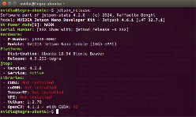

**설치 후:**

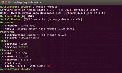
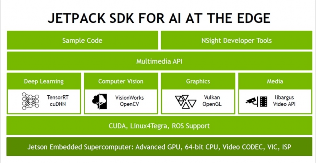

---

## 3. CUDA Enabled OpenCV

- NVIDIA 제공 OpenCV 패키지 또는 스크립트를 통해서 설치 가능
- GitHub: [nano_build_opencv](https://github.com/mdegans/nano_build_opencv)
- 최신 OpenCV 소스 코드 이용 시 **CUDA**, **DNN_CUDA** 등 옵션 활성화 후 빌드
- 이후 OpenCV 내 CUDA 활용 sample code 및 라이브러리 활용 가능 (예: `opencv_dnn`)

```bash
# CMake 옵션 예시
$ cmake -D WITH_CUDA=ON \
        -D ENABLE_PRECOMPILED_HEADERS=OFF \
        -D WITH_GSTREAMER=ON \
        -D WITH_CUDNN=ON \
        -D CUDA_FAST_MATH=ON \
        -D OPENCV_DNN_CUDA=ON \
        ...
```

---

## 4. Jetson CUDA Enabled TensorFlow

- Jetpack version에 따른 **CUDA Enabled TensorFlow** 제공
- NVIDIA Developer 다운로드 페이지를 통해서 설치

```bash
# TensorFlow 설치 예시 (JetPack 5.1.2)
$ sudo pip3 install --extra-index-url \
  https://developer.download.nvidia.com/compute/redist/jp/v512 \
  tensorflow==2.12.0+nv23.06
```

**TensorFlow GPU 사용 확인:**

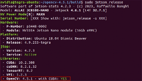
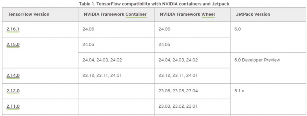
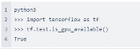

```python
# Python에서 GPU 사용 확인
import tensorflow as tf
print(tf.config.list_physical_devices('GPU'))
```

> 최신 TensorFlow 릴리스 목록과 Jetpack 호환성은 [Jetson 플랫폼용 TensorFlow 릴리스 노트](https://docs.nvidia.com/deeplearning/frameworks/install-tf-jetson-platform-release-notes/index.html)에서 확인 가능

---

## 5. Jetson's PyTorch

- **PyTorch (for Jetpack)** 은 Jetson의 GPU와 CPU에 최적화된 Tensor 라이브러리 제공
- 높은 수준의 유연성과 빠른 성능을 지원하며 **Accelerated NumPy**와 유사 기능 제공
- NVIDIA Developer site에서 Jetson/Jetpack에 따른 패키지(wheel) 제공

```bash
# PyTorch 설치 예시 (JetPack 5.1.1)
$ export TORCH_INSTALL=https://developer.download.nvidia.cn/compute/redist/jp/v511/pytorch/torch-2.0.0+nv23.05-cp38-cp38-linux_aarch64.whl
$ python3 -m pip install --upgrade pip
$ python3 -m pip install numpy==1.26.1
$ python3 -m pip install --no-cache $TORCH_INSTALL
```

**PyTorch CUDA 확인:**

```python
$ python3
>>> import torch
>>> torch.cuda.is_available()
True
>>> torch.backends.cudnn.version()
8600
```

---

## 6. Jetson Stats

**Jetson Stats**는 NVIDIA Jetson 플랫폼에서 시스템 상태를 모니터링하고 관리하는 도구이다.

- Jetson 장치의 **CPU, GPU, 메모리 사용량** 등을 실시간으로 확인
- 다양한 관리 작업을 수행할 수 있는 직관적인 인터페이스 제공
- Jetson 장치의 성능 최적화, 리소스 사용을 효율적으로 관리

### 설치

```bash
$ sudo apt-get install python3-pip
$ sudo -H pip3 install -U jetson-stats
```

### 포함 도구
- `jtop` — 실시간 시스템 모니터링 (CPU, GPU, 메모리, 프로세스 정보)
- `jetson_release` — Jetson 시스템 정보 출력
- `jetson_config` — 시스템 설정 도구
- `jetson_swap` — 스왑 파일 관리

### jtop 화면


| jtop 탭 | 정보 |
|----------|------|
| CPU | CPU 코어별 사용률 및 온도 |
| Memory | RAM 및 스왑 사용량 |
| GPU | GPU 사용률 및 클럭 |
| Processes | 실행 중인 프로세스 목록 |

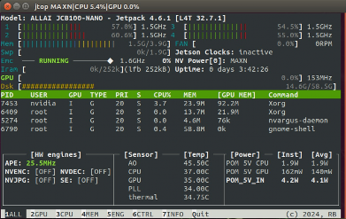 <br>

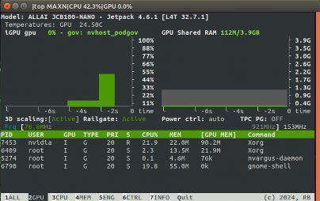 <br>
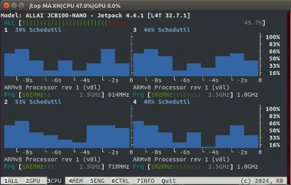 <br>
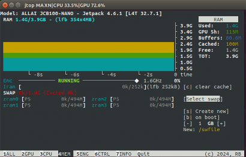 <br>
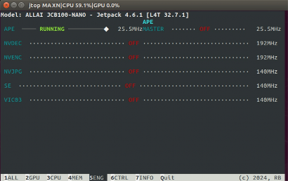 <br>
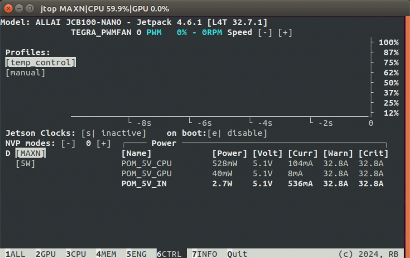 <br>
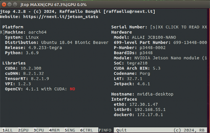 <br>
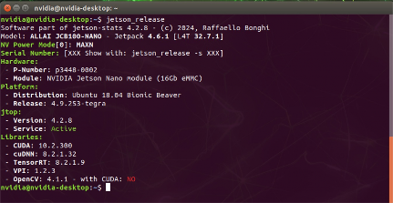 <br>
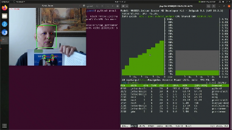 <br>
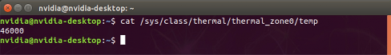 <br>


---

## 참고 자료

- [NVIDIA JetPack SDK](https://developer.nvidia.com/embedded/jetpack)
- [Jetson Stats GitHub](https://github.com/rbonghi/jetson_stats)
- [TensorFlow for Jetson](https://docs.nvidia.com/deeplearning/frameworks/install-tf-jetson-platform-release-notes/index.html)
- [PyTorch for Jetson](https://forums.developer.nvidia.com/t/pytorch-for-jetson/)
- [OpenCV CUDA Build Script](https://github.com/mdegans/nano_build_opencv)
