# 실습 1-4: Linux Network / Jetpack Library 실습

---

## 1. 실습 개요

**실습 내용:**
1. 리눅스 네트워크 명령어 실습 (`ip`, `ifconfig`, `wget`, `curl` 등)
2. Jetson ←→ Host PC VSCode SSH 연결
3. Jetson 시스템 관련 명령어 실행 및 JetPack 설치

---

## 2. 네트워크 인터페이스 – ip, ifconfig

리눅스에서 네트워크 인터페이스를 구성하고 관리하기 위한 명령어.

### ip 명령어 실습

**모든 네트워크 인터페이스의 IP 주소 정보 표시**

```bash
$ ip addr show
```

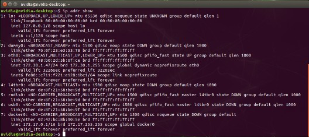

**모든 네트워크 인터페이스의 상태 표시**

```bash
$ ip link show
```

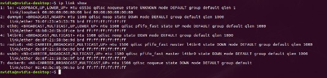

**네트워크 인터페이스 비활성화**

```bash
$ sudo ip link set eth0 down
```

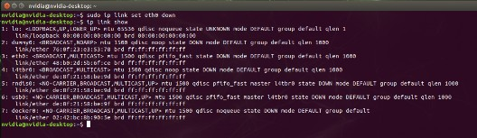

**네트워크 인터페이스 활성화**

```bash
$ sudo ip link set eth0 up
```

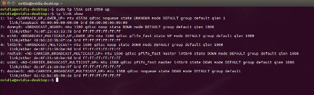

**라우팅 테이블 표시**

```bash
$ ip route show
```

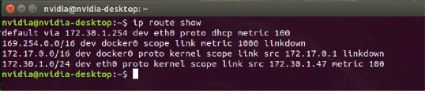

### ifconfig 명령어 실습

**모든 네트워크 인터페이스 정보 표시**

```bash
$ ifconfig
```

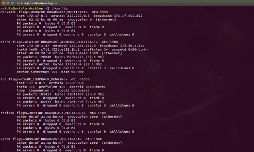

**특정 네트워크 인터페이스 정보 표시**

```bash
$ ifconfig eth0
```

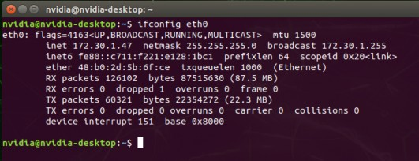

**인터페이스 비활성화 (ifconfig)**

```bash
$ sudo ifconfig eth0 down
```

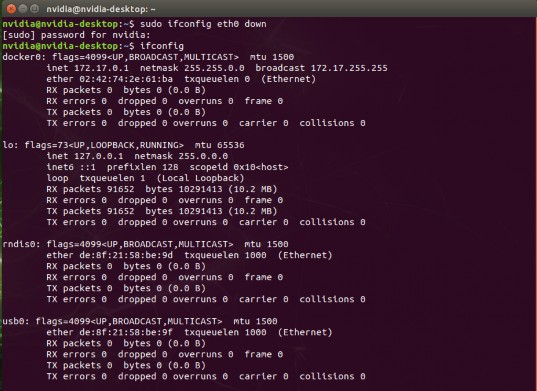

**인터페이스 활성화 (ifconfig)**

```bash
$ sudo ifconfig eth0 up
```

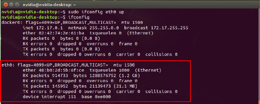

---

## 3. 파일 다운로드 – wget, curl

웹에서 파일을 다운로드 하기 위한 명령어. 주로 HTTP, HTTPS, FTP 프로토콜을 지원하며, 다운로드할 파일의 URL을 입력하면 해당 파일을 로컬 컴퓨터에 다운로드한다.

### wget 실습

**wget 설치**

```bash
$ sudo apt install wget
```

**원본 파일명으로 다운로드**

```bash
$ wget https://blog.naver.com/allai-
```

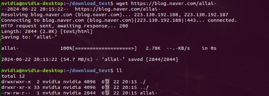

**파일 내용 확인**

```bash
$ cat allai-
```

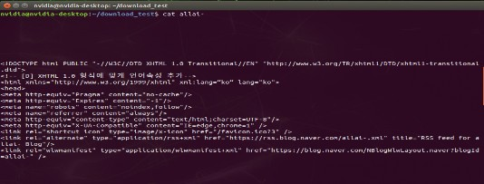

**특정 이름으로 다운로드**

```bash
$ wget -O allai_blog.txt https://blog.naver.com/allai-
```

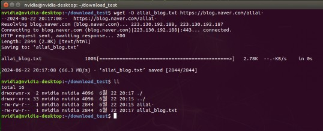

**다운로드 속도 제한**

```bash
$ wget --limit-rate=0.5k https://blog.naver.com/allai-
```

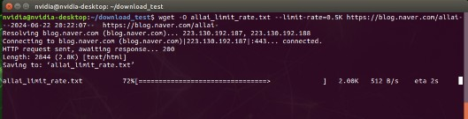
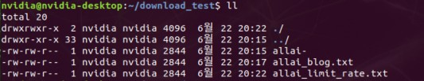

### curl 실습

**curl 설치**

```bash
$ sudo apt install curl
```

**원본 파일명으로 다운로드**

```bash
$ curl -O https://blog.naver.com/allai-
```

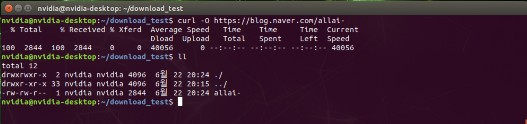

**특정 이름으로 다운로드**

```bash
$ curl -o allai-blog.txt https://blog.naver.com/allai-
```

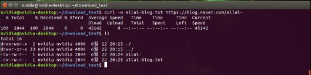

**출력 리다이렉션 다운로드**

```bash
$ curl https://blog.naver.com/allai- > allai_resource.txt
```

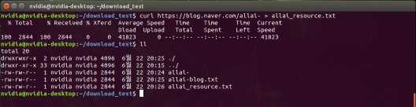

**여러 파일 다운로드**

```bash
$ curl -O https://blog.naver.com/allai-/allai[0-5].txt
```

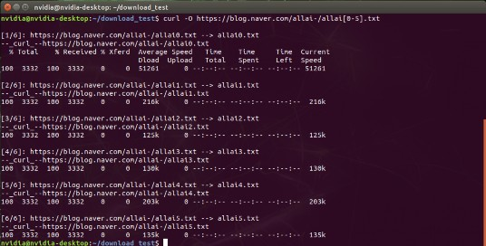
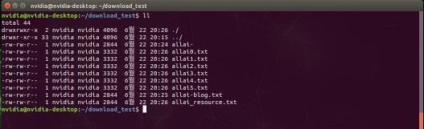

**다운로드 속도 제한 (curl)**

```bash
$ curl --limit-rate 500B -o allai_limit_rate.txt https://blog.naver.com/allai-
```

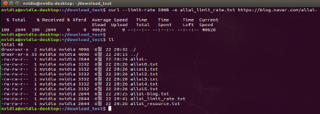

> **wget vs curl 속도 제한 차이점**: wget은 다운로드 속도를 더 엄격하게 제한하며, 네트워크 트래픽을 모니터링하고 일정한 시간 간격으로 데이터를 전송하는 방식으로 속도 제한을 구현한다. curl은 버퍼링 방식을 사용하여 더 유연한 속도 제어가 가능하다.

> (참고 : wget 은 다운로드 속도를 더 엄격하게 제한하며, 네트워크 트래픽을 모니터링하고 일정한 시간 간격으로 데이터를 전송하는 방식으로 속도 제한을 구현합니다. curl 은 버퍼를 사용하여 데이터를 다운로드하는 동안 대기 시간을 적용합니다. 이 방식은 설정된 속도 제한보다 순간적으로 더 빠르게 다운로드될 수 있습니다. 위와 같은 이유로 curl 이 다운로드 속도가 더 빠를 수 있습니다.)
---

## 4. SSH를 사용한 원격 접속

**SSH 원격 시스템 실습**

   * ssh(secure Shell)는 네트워크 상에서 다른 컴퓨터에 접속하거나 명령을 실행하거나 파일을 전송하는데 사용되는 프로토콜입니다.
   * 보안이 취약한 네트워크에서 암호화된 통신을 제공하여, 데이터의 도청이나 변조를 방지하고 주로 원격 실행이나 파일 전송에 사용됩니다.

   * SSH 사용방법
      * Jetson Nano 의 ip 를 확인한 후 Window PC CMD 창 또는 Virtual Box + Ubuntu 터미널에서 ssh 명령어를 사용하여 Jetson Nano 에 접속합니다.
      * 접속 시 비밀번호를 입력해야 하며, 입력 중에는 화면에 표시되지 않지만 정상적인 동작이므로 그대로 입력해 주시면 됩니다.

```
사용법 : $ ssh [아이디]@[서버 주소]
예) ssh nvidia@172.30.1.5
```

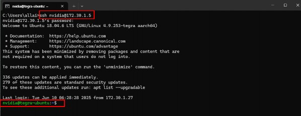

**SCP 사용방법**

   * Jetson Nano 의 ip 를 확인한 후 다른 Window PC CMD 창 또는 Virtual Box (Ubuntu) 터미널에서 scp 를 이용하여 Jetson Nano 에 파일을 전송합니다.
   * 다른 서버로 전송
```
사용법 : $ scp [option] [보낼 파일] [아이디]@[서버 주소]:[저장할 경로]
예) scp text.txt nvidia@172.30.1.5:~
```

   * <Window CMD 창>

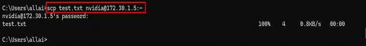

   * <Window 의 Jetson Nano 의 ‘~’ 경로로 전송 받은 test.txt 확인>

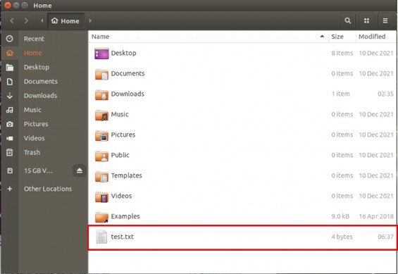

   * 서버로부터 다운
```
사용법 : $ scp [option] [아이디]@[서버주소]:[파일경로] [저장할경로]
예) scp nvidia@172.30.1.5:~/test1.txt C:\Users\allai\Desktop\
```

* <Window CMD 창>

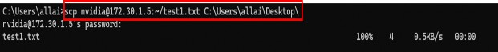

<Jetson Nano ‘~’ 경로에 있는 test1.txt 파일이 Window PC 의 C:\Users\allai\Desktop\ 경로에 전송 됐는지 확인>

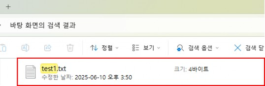

(참고: Ubuntu/Linux 에서는 /를, Windows PowerShell 에서는 \를 경로 구분자로 사용하므로, scp 명령어 실행 시 파일 경로 표기에 주의해 주세요.)

---

## 5. nvidia-jetpack 설치

```bash
$ sudo apt update
$ sudo apt install nvidia-jetpack
```

> **참고**: 설치에는 시간이 소요되며, 인터넷 연결 상태에 따라 수 분에서 수십 분까지 소요될 수 있다.

---


## Visual Studio Code SSH 연결

### Host device : jetson Nano <--> Client device : Window or Ubuntu Host device

**Host device (jetson nano)**
* SSH 설정 : SSH 연결을 이용해 원격으로 접근할 기기(Jetson Nano)에 openssh- server 를 설치해주세요.
(참고 : 설치 중 Y/n 내용이 나올 경우 엔터를 누르세요.)

```
$ sudo apt-get install openssh-server
```

* Jetson Nano 에서 아래 명령어를 실행하여 IP 주소를 확인해주세요.

```
$ ifconfig
```

**Client device (Window or Ubuntu)**

* 1. Visual Studio Code 가 실행되면 아래와 같은 순서로 ‘SSH extension’을 설치합니다.
  * ① 왼쪽 메뉴에서 “Extension” 클릭
  * ② 입력창에 “SSH”를 입력하고 “Remote-SSH” extension 선택
  * ③ “install” 버튼 클릭

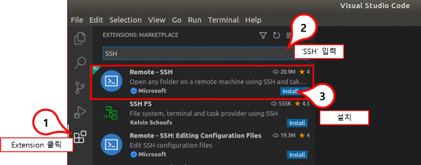

* 2. Visual Studio Code 중앙의 “Remote SSH”에 대한 설명 화면에서 “install” 버튼을 누르면 설치가 시작됩니다.

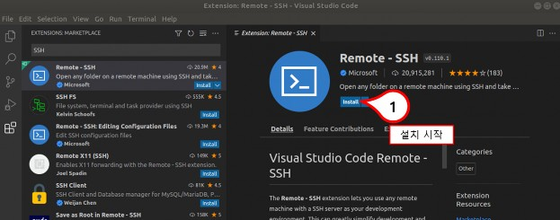

* 3. Visual Studio Code 가 활성화된 상태에서 ‘Ctrl’ + ‘Shift’ + ‘P’ 키를 동시에 누릅니다.
  * 또는 메뉴 “Help” -> “Show All Commands”를 누르면, 아래 화면과 같이 ‘Command’입력창이 나타납니다.

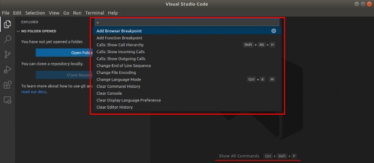

* 4. 입력창에 “ssh”를 입력하고 아래 화면과 같이 ssh 관련 커맨드들이 나타나면……
   * “Remote-SSH: Add New SSH Host…”를 선택합니다.

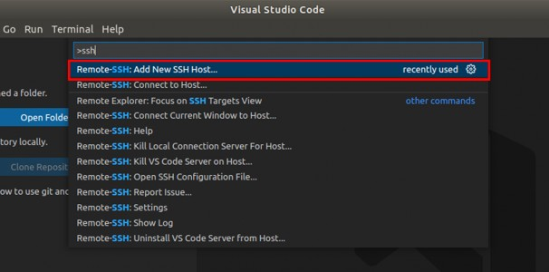

* 5. 입력창이 “Enter SSH Connection Command”로 바뀌면, 아래와 같이 접속할 Jetson 디바이스의 SSH 커맨드를 입력합니다.

```
ssh 계정@IP 주소
예시: ssh nvidia@192.168.0.16
```

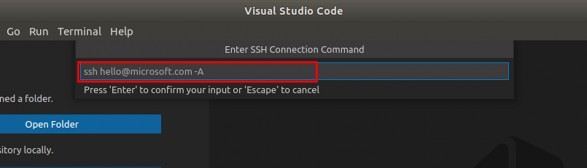

* 6. 새로 생성한 SSH 접속 커맨드를 저장할 위치를 묻는 화면에, default 위치를 선택합니다.

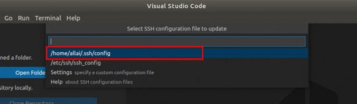

* 7.   그러면 오른쪽 하단에 아래와 같은 팝업이 나타난다. “Open Config” 버튼을 누르면 생성한 SSH 접속 커맨드를 확인할 수 있습니다.

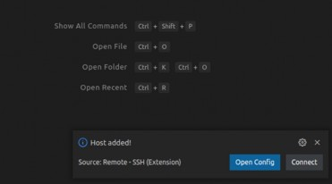

* 8. 다시 ‘Ctrl’ + ‘Shift’ + ‘P’ 키를 동시에 눌러 아래와 같이 ‘Command’입력창이 나타나면,  “Remote-SSH: Connect to Host…” 를 선택합니다.

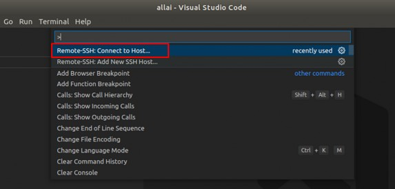

* 9. 앞에서 생성한 SSH 접속 커맨드에 대한 IP 주소가 나타나면 선택합니다.

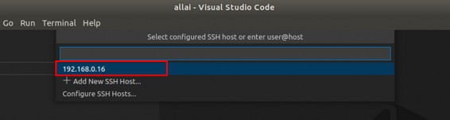

* 10. 그러면 새로운 Visual Studio Code 가 열리고, 접속 진행여부를 묻는 창이 나타나면 “Continue” 선택합니다. 

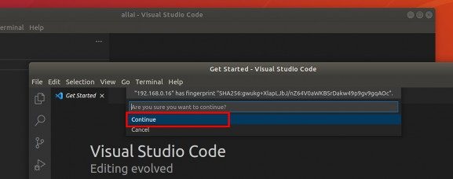

* 11.   접속할 디바이스에 대한 “Password”를 묻는 창에 password 를 입력합니다. (예: nvidia)

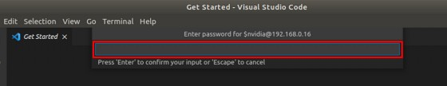

* 12. 그러면 visual studio code 가 디바이스에 SSH 접속을 시도하고, 접속이 완료되면 아래 화면과 같이 왼쪽 하단에 디바이스의 IP 주소가 표시됩니다. 

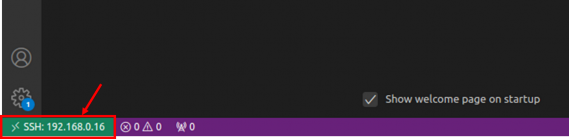

* 13. Visual Studio Code 상단 오른쪽에 있는 “Explorer”버튼을 누르고, 버튼을 누릅니다. 
“Open Folder”

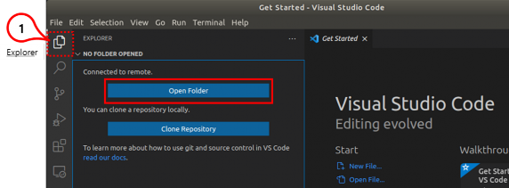

* 14. “Open Folder”를 묻는 입력창이 나오면, default 경로(예: /home/nvidia/)를 선택하고 “OK” 버튼을 누릅니다.. 최초 SSH 접속일 경우 password 를 다시한번 묻는 창이 나옵니다.

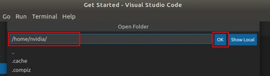

* 15. 접속할 폴더에 대한 신뢰여부를 묻는 창이 나오면 아래와 같이           체크 박스를 선택하고              버튼을 누릅니다.
“Trust”
“Yes, ~~”16. SSH 접속 과정이 모두 끝나면, Visual Studio Code 오른쪽 패널을 통해서 Jetson 디바이스의 주요 폴더와 파일들을 선택하고, 수정할 수 있습니다. (참고: ssh 연결이 안될 경우 다음 내용을 따라하고 다시 한번 ssh 연결을 시도해주세요.)
방법 1
-    이더넷 케이블을 다시 연결합니다.
방법 2
-    Jetson nano 에서 다음 명령어를 실행합니다.

```
$ sudo apt purge openssh-server
$ sudo apt install openssh-serverJetson 시스템 정보 및 온도 확인
```

n Jetson information 관련 명령어를 확인합니다.
•      Ubuntu Version 을 확인합니다.

```
$ cat /etc/lsb-release
```

•      L4T Version 을 확인합니다.

```
$ cat /etc/nv_tegra_release
```

•      Kernel Version 을 확인합니다.

```
$ uname -a
```

n    PWM FAN 제어
Jetson 디바이스는 고성능 작업을 실행할 때 많은 열을 발생 시킬 수 있습니다. 이러한 과열 상태를 방지하기 위해 팬이 필요하며, PWM 팬은 정확한 속도 제어를 통해 장치의 온도에 맞춰 효율적으로 열을 배출할 수 있습니다.
•      현재 시스템 온도 확인 (결과 값 나누기 1000 하면 현재 시스템의 온도)

```
$ cat /sys/class/thermal/thermal_zone0/temp
```

à 시스템 온도가 약 46 도 정도임을 확인할 수 있습니다. (46000/1000)
•      온도에 따른 fan 제어를 합니다. 
fan-ctl git 을 clone 하고, clone 한 폴더로 이동합니다.

```
$ git clone https://github.com/jetsonworld/jetson-fan-ctl.git
$ cd jetson-fan-ctl
```

•      install.sh 을 실행합니다. Install.sh 을 실행하면 서비스가 설치되고, 자동으로 실행됩니다.

```
$ sudo sh install.sh•      편집기로 config.json 을 수정합니다.
$ sudo vi /etc/automagic-fan/config.json
```

config.json 을 다음과 같이 수정합니다. 이 경우 60 도 이상에서 fan 속도가 최대로 작동하고, 40 도보다 낮아지면 팬이 꺼집니다.

```
{
“FAN_OFF_TEMP”:40, “FAN_MAX_TEMP”:60, “UPDATE_INTERVAL”:2, “MAX_PERF”:1
}
```

config.json
FAN_OFF_TEMP
이 온도(°C)보다 낮아지면 팬이 꺼짐
FAN_MAX_TEMP
FAN_MAX_TEMP 온도(°C) 이상이면 팬이 최대 속도로 작동함
UPDATE_INTERVAL 
온도 체크하는 주기 (초)
MAX_PERF 
“1”로 설정하면 Jetson 이 항상 최대 성능 모드로 동작하게 되어, 온도 변동이 줄고 팬 제어가 더 안정적으로 작동함 전력 소모를 줄이고 싶다면 “0”으로 설정하면 됨
* service 명령어로 재부팅 없이 변경사항을 적용하세요.

```
$ sudo service automagic-fan restart
```

* automagic-fan status 를 확인하세요.

```
$ sudo service automagic-fan status
```

   * (참고: 현재 시스템 온도가 설정한 FAN_OFF_TEMP 보다 낮을 경우 팬은 동작하지 않으며, 이 값을 초과할 경우 자동으로 팬이 동작하게 됩니다.)
   * Jetpack Library, Jetson-stats 설치 및 유틸리티 사용
Jetson-stats 는 NVIDIA Jetson 시리즈를 모니터링하고 제어하기 위한 패키지입니다. 
보드를 분석하는 강력한 도구이며, jtop 이 있는 독립 실행형 응용 프로그램과 함께
사용하거나 파이썬 스크립트에서 가져올 수 있습니다. 자세한 유틸리티 사용 방법은 이후 시간에 진행하고, 이번시간에는 설치만 합니다.
n    Commercial 보드(JCB100)이기 때문에 SDK Manager 가 아닌, Linux repository 를 통해 nvidia-jetpack, jetson-stats 를 설치합니다.

* apt 를 업데이트 합니다.

```
$ sudo apt update
```

* nvidia-jetpack 을 설치합니다.

```
$ sudo apt install nvidia-jetpack
```

(참고 : 설치 중 Y/n 내용이 나올 경우 엔터를 누르세요.)

* python3-pip 를 설치합니다. (이미 설치한 경우 넘어가도 됩니다.)

```
$ sudo apt-get install python3-pip
```

* jetson-stats 를 설치합니다.

```
$ sudo -H pip3 install -U jetson-stats
```

* 재부팅 합니다.

```
$ sudo reboot
```

* Jetpack Library install broken error 발생 시 다음 내용을 따라해주세요. 1.  패키지 리스트 삭제

```
$ sudo rm -rf /var/lib/apt/lists/*
```

2.  apt clean

```
$ sudo apt-get clean
```

3.  apt update

```
$ sudo apt-get update
```

4.  jetpack library 설치$ sudo apt install nvidia-jetpack

```
(참고: Jetson Nano 는 NVIDIA 의 커스텀 커널과 부트로더를 기반으로 작동합니다. 따라서 Ubuntu 일반 시스템과 달리 전체 시스템 패키지를 업그레이드 (‘sudo apt upgrade’) 하면 Jetson 전용 커널 및 부팅 구성요소가 손상되어 부팅이 안되는 상태가 될 수 있습니다. 따라서 ‘sudo apt upgrade’ 명령어는 사용하지 마십시오.)
```

* 'jetson_release' 도구를 이용하여 jetpack library 가 설치됐는지 확인합니다.

```
'$ jetson_releasen'
```

 **jtop’ 도구를 이용하여 jetson nano 의 CPU, GPU, 메모리 사용량 등을 실시간으로 확인합니다.**

```
$ jtop
```

   * jtop 을 실행할 경우 1 번 화면이 나타납니다.
   * 1 번은 시스템의 요약 정보 화면이며, CPU, GPU, 메모리, 디스크 사용량과 같은 전반적인 시스템 상태를 한눈에 볼 수 있습니다.
   * 또한 각 하드웨어 자원의 온도, 전력 소비량 등을 볼 수 있습니다.
   * 다른 메뉴로 전환하고 다시 1 번 메뉴를 보고싶으면 1 번을 누르면 됩니다.

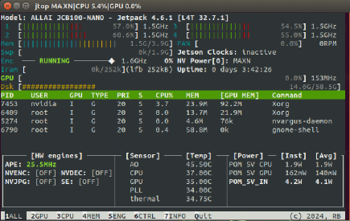 <br>

* 2 번(GPU)을 누르면 GPU 사용 현황을 보여줍니다. AI 연산이나 영상 처리 작업 시 GPU 의 상태를 모니터링 할 때 유용합니다.

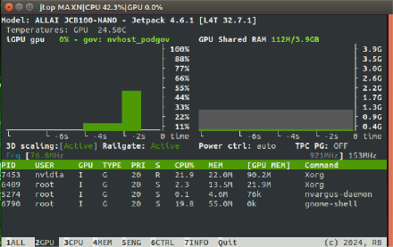 <br>

* 3 번(CPU)을 누르면 CPU 사용 현황을 보여줍니다. 각 코어별로 사용률을 파악할 수 있습니다.

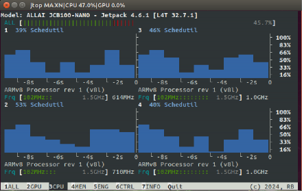 <br>

* 4 번(MEM)을 누르면 메모리 사용 현황을 보여줍니다. 시스템의 전체 메모리 용량과 현재 사용 중인 메모리의 양을 보여주며, 스왑 메모리 사용량도 함께 확인할 수 있습니다.•

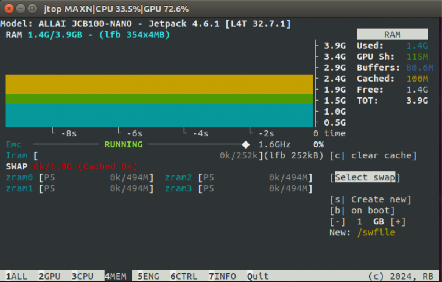 <br>

* 5 번(ENG)을 누르면 엔진 상태들을 보여줍니다. Jetson Nano 의 하드웨어 가속 엔진들의 상태와 클럭 속도를 실시간으로 모니터링 할 수 있습니다.

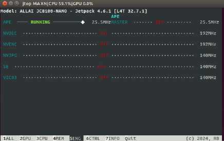 <br>

* 6 번(CTRL)을 누르면 관리 화면을 보여줍니다. 전력 관리 상태와 클럭 최적화 설정을 모니터링하고 제어하는데 사용됩니다.

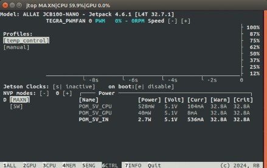 <br>

* 7 번(INFO)을 누르면 정보 화면을 보여줍니다. 시스템의 주요 하드웨어 및 소프트웨어 정보를 확인할 수 있습니다.

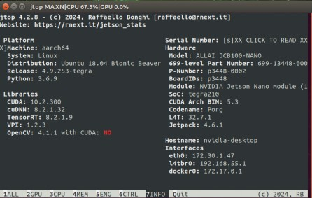

* Q 버튼을 누를 경우 jtop 이 종료됩니다.


---

## 참고 자료

- [Linux ip 명령어 문서](https://man7.org/linux/man-pages/man8/ip.8.html)
- [VSCode Remote SSH](https://code.visualstudio.com/docs/remote/ssh)
- [NVIDIA JetPack SDK](https://developer.nvidia.com/embedded/jetpack)
- [GNU Wget Manual](https://www.gnu.org/software/wget/manual/)
- [curl Documentation](https://curl.se/docs/)
