# GPIO 실습 1-6: Jetson Nano GPIO LED 제어

---

## 1. GPIO (General Purpose Input Output)

**GPIO**는 MCU의 일반적인 입력과 출력을 처리할 수 있는 외부 인터페이스이다.

- 제어를 위한 단순 신호를 출력하거나 외부에서 들어오는 신호를 디지털 입력으로 사용 가능
- 다양한 센서, LED, 버튼 등과 상호작용 가능

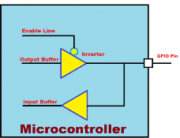

---

## 2. Jetson.GPIO

- Jetson Nano 개발 보드에는 **Raspberry Pi의 40pin 헤더**와 유사한 **40pin GPIO 헤더**가 포함
- 이러한 GPIO는 **Jetson GPIO Library** 패키지에 제공된 Python 라이브러리를 사용하여 디지털 입출력 제어 가능
- GitHub: [https://github.com/NVIDIA/jetson-gpio](https://github.com/NVIDIA/jetson-gpio)
- Jetson GPIO sample 코드는 `/usr/share/doc/jetson-gpio-common/sample/` 경로에 위치

---

## 3. 40-pin Expansion 헤더


### Jetson Nano Interface – GPIO 상세


---

## 4. LED 제어 회로

### LED 연결 방법

- LED의 **긴 쪽**: (+), 양극
- LED의 **짧은 쪽**: (-), 음극

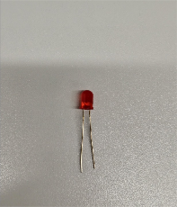


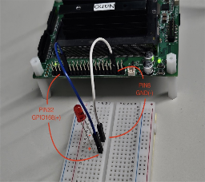

### LED ON/OFF

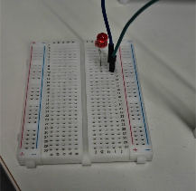
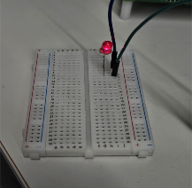

---

## 5. 실습 1-6: Jetson Nano에서 GPIO 사용

### 5.1 sysfs GPIO를 이용한 LED 제어 실습

Jetson Nano Interface를 참고하여 GPIO **32번 Pin** 사용, GND는 **6번**에 연결.

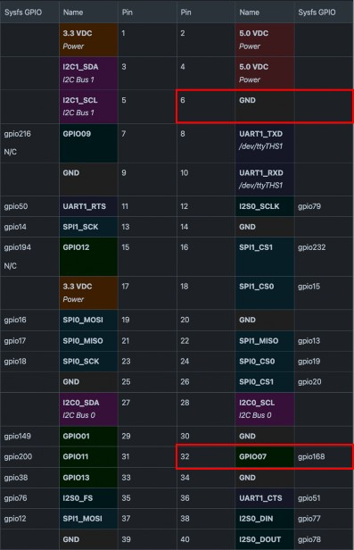

40핀 양쪽에 pin 번호가 쓰여져 있다.

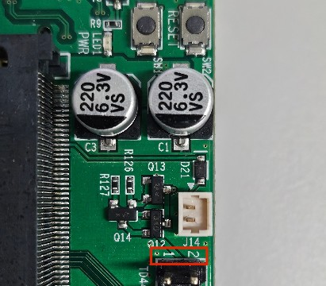
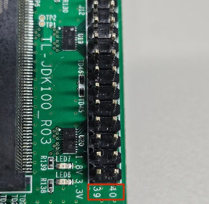

**회로 연결:**

Jetson Nano와 LED (+브레드보드)를 다음과 같이 연결한다.

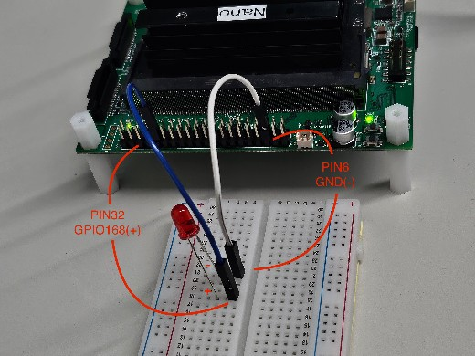
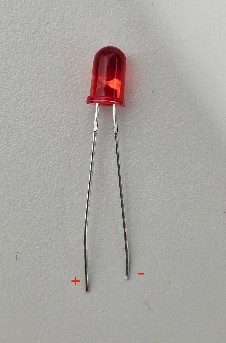

### 5.2 sysfs를 통한 GPIO 제어 명령어

```bash
# Super User 모드 진입
$ sudo su

# 사용할 GPIO pin export (GPIO 168 = Pin 32)
$ echo 168 > /sys/class/gpio/export

# 출력 모드로 설정
$ echo out > /sys/class/gpio/gpio168/direction

# LED ON
$ echo 1 > /sys/class/gpio/gpio168/value
```

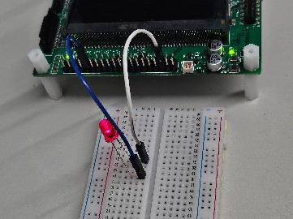

```bash
# LED OFF
$ echo 0 > /sys/class/gpio/gpio168/value
```

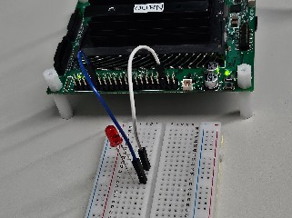
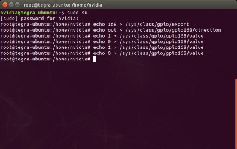

> **참고**: 브레드 보드와 점퍼선이 제대로 연결되지 않았을 경우 LED ON/OFF가 잘 작동하지 않을 수 있다. 점퍼선을 정확히 연결해야 한다.

---

## 6. Jetson.GPIO 라이브러리 (Python)

### 설치

```bash
$ git clone https://github.com/NVIDIA/jetson-gpio.git
$ cd jetson-gpio
```

### 주요 함수

| 함수명 | 사용 예 | 설명 |
|--------|---------|------|
| `GPIO.setmode()` | `GPIO.setmode(GPIO.BOARD)` | 40핀 헤더 번호 기준 사용 |
| | `GPIO.setmode(GPIO.BCM)` | Broadcom SoC GPIO 번호 기준 사용 |
| | `GPIO.setmode(GPIO.CVM)` | CVM/CVB 커넥터 문자열 사용 |
| | `GPIO.setmode(GPIO.TEGRA_SOC)` | Tegra SoC 핀 이름 기반 설정 |
| `GPIO.setup()` | `GPIO.setup(channel, GPIO.OUT, initial=GPIO.HIGH)` | GPIO 핀을 입력/출력으로 설정, 초기값 지정 |
| `GPIO.output()` | `GPIO.output(channel, state)` | 설정한 GPIO 핀 출력값 제어 (HIGH/LOW) |

### 예제 코드 수정

GitHub에서 받은 예제(`samples/simple_out.py`)를 다음과 같이 수정한다.

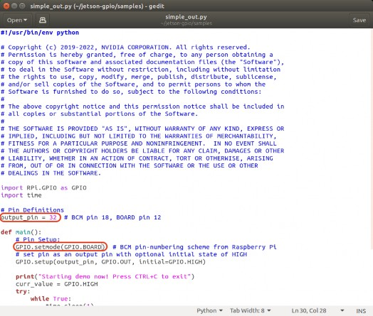

```python
import RPi.GPIO as GPIO
import time

# BOARD 모드 설정 (핀 번호 기준)
GPIO.setmode(GPIO.BOARD)

# 32번 핀을 출력으로 설정
GPIO.setup(32, GPIO.OUT, initial=GPIO.LOW)

try:
    while True:
        # LED ON
        GPIO.output(32, GPIO.HIGH)
        time.sleep(1)
        # LED OFF
        GPIO.output(32, GPIO.LOW)
        time.sleep(1)
except KeyboardInterrupt:
    GPIO.cleanup()
```

---

## 7. GPIO 핀맵 (참고)

Jetson Nano 40-pin 헤더 주요 핀 할당:

| Pin | 신호 | Pin | 신호 |
|-----|------|-----|------|
| 1 | +3.3V | 2 | +5V |
| 3 | I2C0_SDA | 4 | +5V |
| 5 | I2C0_SCL | 6 | GND |
| 7 | GPIO216 | 8 | UART1_TXD |
| 9 | GND | 10 | UART1_RXD |
| 11 | UART1_RTS | 12 | I2S0_FS |
| 13 | SPI1_SCK | 14 | GND |
| 15 | SPI1_MOSI | 16 | SPI1_MISO |
| 17 | SPI1_CS0 | 18 | SPI1_CS1 |
| 19 | SPI0_MOSI | 20 | GND |
| ... | ... | ... | ... |
| **32** | **GPIO257** | **6** | **GND** |

---

## 참고 자료

- [NVIDIA Jetson GPIO GitHub](https://github.com/NVIDIA/jetson-gpio)
- [Jetson Nano 40-pin Header Datasheet](https://www.jetsonhacks.com/nvidia-jetson-nano-gpio-header-pinout/)
- [Raspberry Pi GPIO Documentation (호환)](https://www.raspberrypi.com/documentation/computers/raspberry-pi.html)
