# I2C (Inter-Integrated Circuit)

## I2C 개념

**I2C**(Inter-Integrated Circuit)는 여러 장치 간의 통신을 위해 설계된 **동기식 직렬 통신 버스**이다. 저속의 기기들을 제어/통신하기 위한 방식으로, **SDA**(Serial Data Line)와 **SCL**(Serial Clock Line)의 2개의 Pin으로 구성된다.

**Master/Slave 방식**으로 동작하며, 다양한 센서(온도, 압력, 가속도 등)를 쉽게 연결할 수 있다. 각 센서는 고유한 주소를 가지고 있어서 버스에서 충돌 없이 통신할 수 있다.


```
Master ────┬──── SDA ────┬──── Slave (Address 01)
           │             │
           └──── SCL ────┘    Slave (Address 02)
                               Slave (Address 12)
                               Slave (Address 34)
                               Slave (Address 127)
```

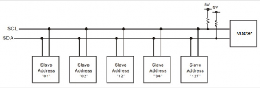

### I2C 통신 방식

I2C 통신은 다음 규칙을 따른다:

- 데이터 교환 전, I2C 모듈 사이의 SCL/SDA 라인은 모두 **1 = High 상태**를 유지
- 통신이 시작되면 데이터 라인은 클럭 라인보다 먼저 **0 = Low 신호**로 바뀜 (**falling edge**)
- 통신이 종료되면 **SCL → SDA** 순서로 각각의 신호가 0에서 1로 바뀜 (**rising edge**)
- Start/Stop 시점을 제외한 실제 데이터의 교환은 모두 **SCL = 1(High)** 을 유지하는 순간에 SDA 값을 기준으로 수행됨

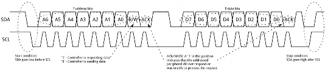

> 참고: <https://learn.sparkfun.com/tutorials/i2c>

---

## Jetson Nano I2C Device File

Linux 시스템에서는 모든 하드웨어 장치가 `/dev` 아래 파일처럼 존재한다.

```
/dev/i2c-1   ← Jetson Nano의 I2C-1 버스를 나타내는 특수 파일
```

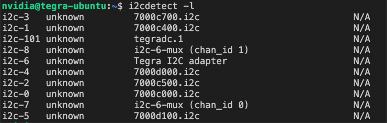

---

## i2cdetect

`i2cdetect`는 Linux 시스템에서 제공되는 i2c 유틸리티 패키지의 일부이다. I2C 장치를 연결했을 때, I2C 버스를 검사하고 I2C 버스에 연결된 장치를 찾는데 사용하는 명령어이다.

사용자는 I2C 버스를 검색하여 연결된 모든 I2C 장치의 주소를 식별할 수 있다.

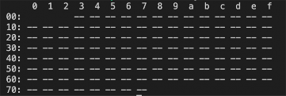

> 위 화면은 아무것도 연결되지 않은 상태

### 명령어 사용법

```
$ sudo i2cdetect -y -r <I2C 버스 번호>
```

| 옵션 | 설명 |
|------|------|
| `-y` | 경고 메시지를 생략하고 사용자 확인 없이 명령을 실행 |
| `-r` | 반복적으로 읽기를 수행하여 장치를 탐지 |

i2cdetect 명령어를 실행하면 테이블 형태의 출력을 볼 수 있다. 각 셀에는 `--` 또는 2자리의 16진수 주소가 표시된다.

- `--` : 해당 주소에 장치가 없음을 의미
- 주소 값 : 해당 주소에 장치가 있음을 나타냄

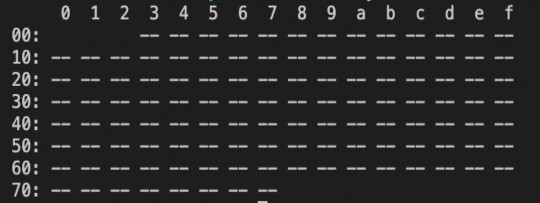

---

## 40-pin Expansion 헤더

Jetson Nano의 40-pin Expansion 헤더를 통해 I2C 통신을 위한 핀에 접근할 수 있다.

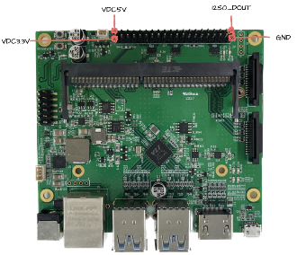


### Jetson Nano Interface

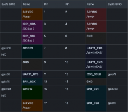
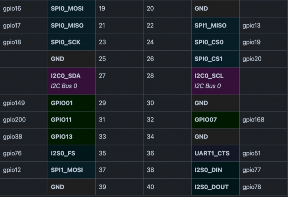


---

## LCD (LCD 1602 IIC I2C)

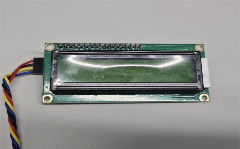
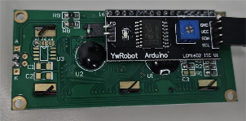

**LCD 1602**는 16글자, 두 줄의 문자를 디스플레이 하도록 구성되어 있다.

- 기본적으로 출력되는 문자는 키보드에서 입력이 가능한 영숫자
- 한글이나 한자는 기본으로 출력 불가능
- I2C 버스를 검색하여 연결된 모든 I2C 장치의 주소를 식별 가능

### LCD 한 글자 출력 방식

LCD 1 글자는 가로 5, 세로 8의 작은 점들이 모여서 하나의 글자를 만든다.


글자의 색이 있는 부분은 **1**, 아무것도 없는 부분은 **0**으로 표시한다.

C 프로그램에서 `B`는 Binary 데이터를 표시하는 첫 문자이고, 그 뒤에 따라오는 글자는 1과 0의 조합으로 하나의 숫자를 표현한다.

```c
byte BChar[] = {
  B11110,
  B10001,
  B10001,
  B11110,
  B10001,
  B10001,
  B10001,
  B11110
};
```

### Jetson Nano에서 I2C LCD 모듈 연결

LCD (LCD 1602 IIC I2C)를 Jetson Nano 40-pin에 다음과 같이 연결한다.

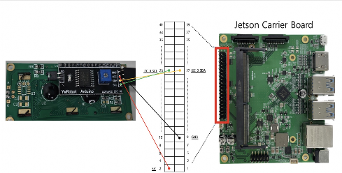

### Jetson Nano에서 I2C LCD 주소 확인

I2C 버스 번호는 **0**번을 사용한다.

```bash
$ sudo i2cdetect -y -r 0
```

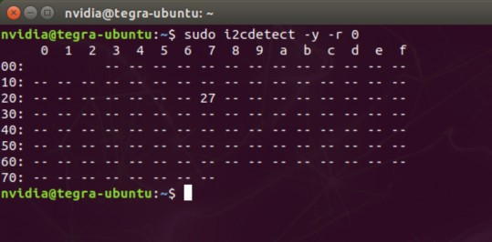

### smbus Library

Python에서 I2C 버스를 통해 **SMBus** 프로토콜을 사용하여 장치와 통신할 수 있도록 도와주는 라이브러리이다.

I2C 버스에 연결된 장치와 데이터 교환을 쉽게 구현할 수 있는 함수를 제공한다.

```python
import smbus

bus = smbus.SMBus(0)        # i2c 버스 번호 (0 사용)
addr = 0x27                 # LCD i2c 장치 주소
```

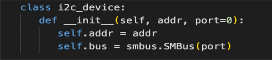
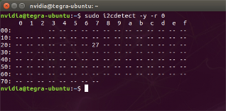

### smbus 라이브러리 설치

```bash
$ sudo apt-get install python3-smbus
```

### smbus 라이브러리 주요 함수

| 함수 | 설명 | 사용법 | 파라미터 설명 |
|------|------|--------|-------------|
| `smbus.SMBus(0)` | Jetson의 I2C 버스(0번)를 활성화하여 장치와의 통신 가능하게 함 | `smbus.SMBus(0)` | - |
| `read_byte_data()` | 특정 레지스터에서 1바이트 데이터를 읽음 | `read_byte_data(i2c_addr, register)` | `i2c_addr`: I2C 장치 주소, `register`: 읽을 레지스터 주소 |
| `write_byte_data()` | 특정 레지스터에 1바이트 데이터를 씀 | `write_byte_data(i2c_addr, register, value)` | `i2c_addr`: I2C 장치 주소, `register`: 쓸 레지스터 주소, `value`: 1바이트 값 |

---

## IMU (MPU6050 - gy25)

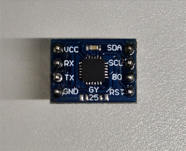
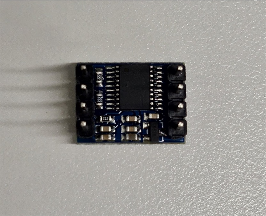

### Jetson Nano에 IMU 연결

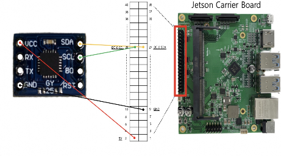

### Jetson Nano에 IMU 연결 시 i2cdetect

I2C 버스 번호는 **0**번을 사용한다. IMU의 i2c 장치 주소는 **0x68**이다.

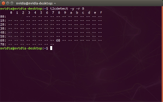

```bash
$ sudo i2cdetect -y -r 0
```

### IMU smbus Library

```python
import smbus

bus = smbus.SMBus(0)            # i2c 버스 번호 (0 사용)
Device_Address = 0x68           # MPU6050 i2c 장치 주소
```

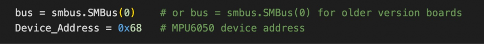

---

## 실습 1-8: Jetson Nano에서 I2C 통신 실습


### 실습 개요

I2C (Inter-Integrated Circuit) 통신을 학습한다.

I2C 장치를 연결했을 때, I2C 버스를 검사하고 I2C 버스에 연결된 장치를 찾는 방법을 익힌다.

### i2cdetect 상세

```bash
$ sudo i2cdetect -y -r 0
```


### SMBus 패키지 설치

SMBus는 Python에서 I2C 통신을 쉽게 구현할 수 있도록 도와주는 라이브러리이다. SMBus(System Management Bus)는 I2C 버스의 하위 집합으로, I2C 프로토콜을 기반으로 하여 저속의 간단한 센서나 디바이스 통신에 자주 사용된다.

```bash
$ sudo apt-get install python3-smbus
```

---

### I2C 통신을 활용한 실습 - LCD

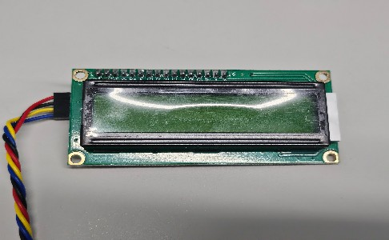
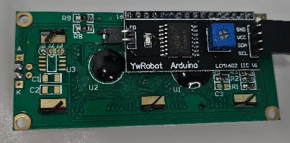

1602 LCD는 16글자, 두 줄의 문자를 디스플레이 하도록 구성되어 있다.
기본적으로 출력되는 문자는 키보드에서 입력이 가능한 영숫자들이며, 한글이나 한자는 기본으로 출력할 수 없다.


#### LCD 연결

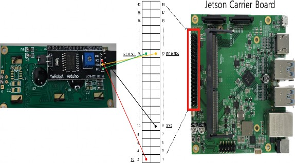

LCD (LCD 1602 IIC I2C)를 Jetson Nano 40pin에 연결한다.

#### I2C 장치 주소 확인

```bash
$ sudo i2cdetect -y -r 0
```


#### LCD 예제 소스 Clone

```bash
$ git clone https://github.com/eleparts/RPi_I2C_LCD_driver.git
$ cd RPi_I2C_LCD_driver
```

#### 드라이버 파일 수정

드라이버 파일(`RPi_I2C_driver.py`)에서 `init` 함수의 `port` 부분을 수정한다. I2C 0번에 연결했기 때문에 `port=0`으로 수정해야 한다.

```bash
$ gedit RPi_I2C_driver.py
```

```python
class i2c_device:
    def __init__(self, addr, port=0):
        self.addr = addr
        self.bus = smbus.SMBus(port)
```

#### start.sh 실행

별도의 라이브러리 등록 과정 없이 예제코드를 실행할 수 있도록 드라이버 파일을 각 디렉토리에 복사한다.

```bash
$ sh start.sh
```

#### 예제 디렉토리 이동

```bash
$ cd example
```

---

### HelloWorld 예제

**파일 위치**: `RPi_I2C_LCD_driver/example/HelloWorld.py`

```python
'''
# RPi_I2C_driver - LiquidCrystal Library - Hello World

This sketch prints "Hello World!" to the LCD
and shows the time.

The circuit:
  RaspberryPi - 1602 I2C LCD
  Vcc - Vcc
  GND - GND
  GPIO02 (PIN3/SDA) - SDA
  GPIO03 (PIN5/SCL) - SCL
'''

# include the library
import RPi_I2C_driver
from time import *

# RPi_I2C_driver.lcd( I2C address )
lcd = RPi_I2C_driver.lcd(0x27)

# Print a message to the LCD.
lcd.print("hello, world!")

time_sec = 0

while True:
    # set the cursor to column 0, line 1
    # (note: line 1 is the second row, since counting begins with 0)
    lcd.setCursor(0, 1)
    # print the number of seconds
    lcd.print(time_sec)
    sleep(1)
    time_sec += 1
```

I2C address 부분이 i2cdetect로 확인한 I2C 장치의 주소(`0x27`)로 되어있는지 확인한다.

```python
# RPi_I2C_driver.lcd(I2C address)
lcd = RPi_I2C_driver.lcd(0x27)
```

#### 파일 실행

```bash
$ sudo python3 HelloWorld.py
```

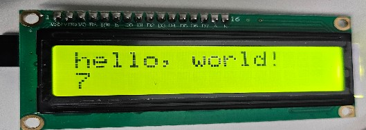

#### LCD 글자 조정

LCD 화면에 빛(전력)은 들어오는데 글자가 보이지 않거나 네모 표시가 뜰 경우:

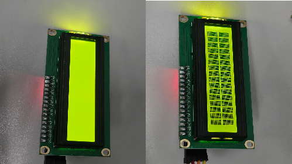

드라이버로 LCD 뒷면의 저항값을 조절한다.
- 저항을 **시계방향**으로 돌리면 저항 값이 낮아짐 (= 밝기가 높아짐)
- 저항을 **반시계 방향**으로 돌리면 저항값이 높아짐 (= 밝기가 낮아짐)

LCD에 전원이 연결된 채로 드라이버를 돌려 글자가 잘 보이도록 조정한다.

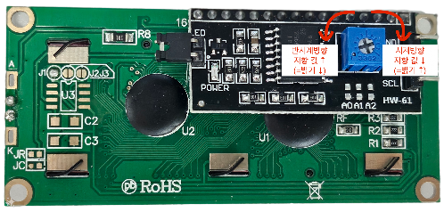

---

### SerialDisplay 예제

**파일 위치**: `RPi_I2C_LCD_driver/example/SerialDisplay.py`

```python
'''
# RPi_I2C_driver - LiquidCrystal Library - SerialDisplay

This sketch takes characters from the terminal
where Python is running and displays them on the LCD.

The circuit:
  RaspberryPi - 1602 I2C LCD
  Vcc - Vcc
  GND - GND
  GPIO02 (PIN3/SDA) - SDA
  GPIO03 (PIN5/SCL) - SCL
'''

# include the library
import RPi_I2C_driver
from time import *

# RPi_I2C_driver.lcd( I2C address )
lcd = RPi_I2C_driver.lcd(0x27)

while True:
    # Enter data received
    str = input()
    # clear the screen
    lcd.clear()
    # display each character to the LCD
    lcd.print(str)
```

I2C address 부분이 `0x27`로 되어있는지 확인한다.

```bash
$ sudo python3 SerialDisplay.py
```

실행한 다음 터미널에서 영어나 숫자를 입력하고 엔터를 누르면 LCD에 입력한 글자가 나타난다.

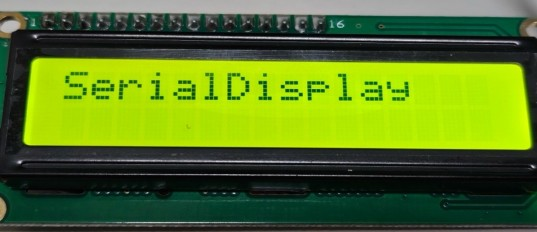

---

### CustomCharactor 예제

**파일 위치**: `RPi_I2C_LCD_driver/example/CustomCharactor_Test.py`

> 해당 파일이 없을 경우 제공된 실습코드를 실행 경로로 복사하거나, 직접 코드를 작성한다.

```python
'''
# RPi_I2C_driver - LiquidCrystal Library - Custom Characters

This sketch prints "I <heart> Ras Pi!!" and a little dancing man
to the LCD.
'''

# include the library
import RPi_I2C_driver
from time import *

# make some custom characters:
heart = [0b00000,0b01010,0b11111,0b11111,0b11111,0b01110,0b00100,0b00000]
smiley = [0b00000,0b00000,0b01010,0b00000,0b00000,0b10001,0b01110,0b00000]
frownie = [0b00000,0b00000,0b01010,0b00000,0b00000,0b00000,0b01110,0b10001]
armsDown = [0b00100,0b01010,0b00100,0b00100,0b01110,0b10101,0b00100,0b01010]
armsUp = [0b00100,0b01010,0b00100,0b10101,0b01110,0b00100,0b00100,0b01010]

# RPi_I2C_driver.lcd( I2C address )
lcd = RPi_I2C_driver.lcd(0x27)

# create a new character
lcd.createChar(0, heart)
lcd.createChar(1, smiley)
lcd.createChar(2, frownie)
lcd.createChar(3, armsDown)
lcd.createChar(4, armsUp)

# set the cursor to the top left
lcd.setCursor(0, 0)

# Print a message to the lcd.
lcd.print("I ")
lcd.write(0)  # when calling lcd.write() '0' must be cast as a byte
lcd.print(" Jetson Nano!")
lcd.write(1)

while True:
    lcd.setCursor(4, 1)
    # draw the little man, arms down:
    lcd.write(3)
    sleep(0.3)
    lcd.setCursor(4, 1)
    # draw him arms up:
    lcd.write(4)
    sleep(0.3)
```

I2C address 부분이 `0x27`로 되어있는지 확인한다.

```bash
$ sudo python3 CustomCharactor_Test.py
```

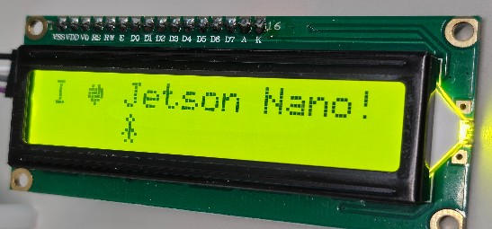

---

### LCD 시간 표시 예제 (lcd_test.py)

**파일 위치**: `RPi_I2C_LCD_driver/example/lcd_test.py`

기본 예제 코드를 참조하여 현재 **날짜와 시간**을 LCD에 1초마다 업데이트하여 표시하는 코드를 작성한다.

- 날짜는 첫번째 라인에, 시간은 두번째 라인에 출력
- 라인 출력 함수: `RPi_I2C_driver`의 `lcd_display_string` 함수 사용

```python
'''
# RPi_I2C_driver - LiquidCrystal Library - display() and noDisplay()

This sketch prints "Hello World!" to the LCD and uses the
display() and noDisplay() functions to turn on and off the display.

The circuit:
  RaspberryPi - 1602 I2C LCD
  Vcc - Vcc
  GND - GND
  GPIO02 (PIN3/SDA) - SDA
  GPIO03 (PIN5/SCL) - SCL
'''

# include the library
import RPi_I2C_driver
import time
from datetime import datetime

# RPi_I2C_driver.lcd( I2C address )
lcd = RPi_I2C_driver.lcd(0x27)

while True:
    # 날짜와 시간 출력
    lcd.lcd_display_string(time.strftime('%Y-%m-%d'), 1)
    lcd.lcd_display_string(time.strftime('%H:%M:%S'), 2)
    time.sleep(1)
```

---

### BMP280 센서 실습 (온도/습도/기압)

BMP280은 온도와 기압을 측정하는 센서로, I2C 통신을 통해 데이터를 읽을 수 있다.

#### BMP280 연결

| BMP280 | Jetson Nano |
|--------|-------------|
| VCC | 3.3V (Pin 1) |
| GND | GND (Pin 6) |
| SCL | SCL (Pin 5) |
| SDA | SDA (Pin 3) |

#### BMP280 주소 확인

```bash
$ sudo i2cdetect -y -r 0
```

BMP280의 I2C 주소는 일반적으로 **0x76** 또는 **0x77**이다.

#### BMP280 Python 코드

```python
import smbus
import time

# BMP280 I2C address (0x76 or 0x77)
addr = 0x76
bus = smbus.SMBus(0)

# BMP280 calibration registers
dig_T1 = bus.read_byte_data(addr, 0x88) | (bus.read_byte_data(addr, 0x89) << 8)

def read_temp():
    # Read temperature from BMP280
    data = bus.read_i2c_block_data(addr, 0xFA, 3)
    temp_raw = (data[0] << 12) | (data[1] << 4) | (data[2] >> 4)
    return temp_raw

while True:
    temp = read_temp()
    print(f"Temperature: {temp}")
    time.sleep(1)
```

---

## 참고 자료

- [SparkFun I2C Tutorial](https://learn.sparkfun.com/tutorials/i2c)
- [RPi_I2C_LCD_driver GitHub](https://github.com/eleparts/RPi_I2C_LCD_driver.git)
