# SPI (Serial Peripheral Interface)

## SPI 개념

**SPI**(Serial Peripheral Interface)는 고속 직렬 통신을 위해 설계된 **동기식 통신 버스**이다.

센서, 메모리, ADC/DAC 등 다양한 주변 장치를 연결할 때 사용된다.

- **Full-duplex 모드 지원** – 데이터 전송과 수신이 동시에 이루어짐
- **Master/Slave 방식**
  - 하나의 마스터와 하나 이상의 슬레이브로 구성
  - 마스터는 클럭 신호를 생성하고, 슬레이브는 마스터의 클럭 신호에 동기화 됨


### SPI 신호 라인

SPI는 **4개의 신호 라인**으로 구성된다:

| 신호 | 설명 |
|------|------|
| **SCLK** (Serial Clock) | 마스터가 생성하는 클럭 신호 |
| **MOSI** (Master Out Slave In) | 마스터 출력, 슬레이브 입력 (마스터로부터의 출력) |
| **MISO** (Master In Slave Out) | 마스터 입력, 슬레이브 출력 (슬레이브로부터의 출력) |
| **SS/CS** (Slave Select / Chip Select) | 슬레이브 셀렉트. 마스터가 특정 슬레이브를 선택하는 신호 (active low) |


---

## SPI 통신 - spidev

Jetson에서 SPI 통신을 하기 위해서는 **spidev**라는 모듈이 필요하다.

`spidev`는 사용자 공간에서 SPI 장치를 제어하기 위한 인터페이스를 제공하여 장치와 사용자 공간 통신을 가능하게 해주는 **커널 모듈**이다.

- `modprobe` 명령어를 사용하여 `spidev` 모듈 로드 필요
- `lsmod` 명령어를 사용하여 현재 로드된 모든 커널 모듈 목록 확인 가능


### SPI Device File

`spidev` 모듈을 로드한 후 SPI 장치가 `/dev/spidevX.Y` 형식의 디바이스 파일로 존재한다.

- **X**: SPI 버스 번호
- **Y**: 각 슬레이브 디바이스 (SS)

```
/dev/spidev0.0  /dev/spidev0.1
/dev/spidev1.0  /dev/spidev1.1
```


---

## SPI Loopback Test

Jetson Nano의 **SPI 0번** MOSI와 MISO를 점퍼선으로 연결하여 SPI Loopback test를 수행한다.

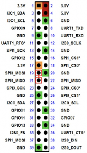
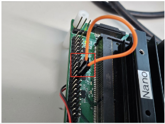


### Loopback Test 수행

```bash
$ sudo ./spidev_test -D /dev/spidev0.0 -v
```

```
spi mode: 0x0
bits per word: 8
max speed: 500000 Hz (500 KHz)

TX | FF FF FF FF FF FF 40 00 00 00 00 95 FF FF FF FF FF FF FF FF FF FF FF FF FF FF FF FF FF F0 0D  | ......@.....
RX | FF FF FF FF FF FF 40 00 00 00 00 95 FF FF FF FF FF FF FF FF FF FF FF FF FF FF FF FF FF F0 0D  | ......@.....
```

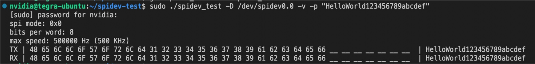
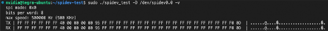


#### 사용자 데이터 Loopback Test

```bash
$ sudo ./spidev_test -D /dev/spidev0.0 -v -p "HelloWorld123456789abcdef"
```

```
spi mode: 0x0
bits per word: 8
max speed: 500000 Hz (500 KHz)

TX | 48 65 6C 6C 6F 57 6F 72 6C 64 31 32 33 34 35 36 37 38 39 61 62 63 64 65 66  | HelloWorld123456789abcdef
RX | 48 65 6C 6C 6F 57 6F 72 6C 64 31 32 33 34 35 36 37 38 39 61 62 63 64 65 66  | HelloWorld123456789abcdef
```

> TX와 RX가 동일하면 Loopback Test 성공!

---

## SPI 실습 물품

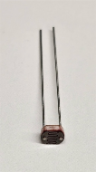
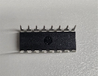
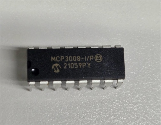
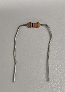

| 부품 | 설명 |
|------|------|
| **조도센서 (CDS)** | 빛의 세기에 따라 저항값이 변하는 센서 |
| **저항** | 회로 구성에 필요한 저항 |
| **ADC MCP3008** | 아날로그-디지털 컨버터 (SPI 통신) |

---

## 40-pin Expansion 헤더


### Jetson Nano Interface


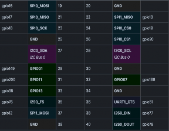


---

## MCP3008 (ADC)

**MCP3008**은 SPI 버스 프로토콜을 사용하는 **아날로그-디지털 컨버터 (ADC)** 이다.

- **ADC (Analog-to-Digital Converter)**: 아날로그 신호를 디지털 값으로 변환
- 조도센서의 아날로그 데이터를 MCP3008 (SPI 통신)를 통해 디지털 값으로 변경하여 출력


> 참고: <https://en.wikipedia.org/wiki/MCP3008>

### MCP3008 Interface

**방향 중요!** (IC의 방향을 반드시 확인)

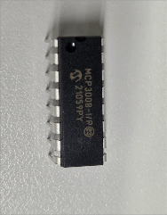
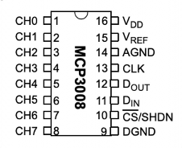


### MCP3008 주요 핀 연결

| MCP3008 핀 | 설명 | 연결 |
|------------|------|------|
| **CS** | Chip Select (SPI SS) | SPI0_CS0 (Pin 24) |
| **CLK** | SPI Clock | SPI0_SCLK (Pin 23) |
| **DIN** | Data In (MOSI) | SPI0_MOSI (Pin 19) |
| **DOUT** | Data Out (MISO) | SPI0_MISO (Pin 21) |
| **CH0-CH7** | 아날로그 입력 채널 | 센서 입력 |
| **VDD/VREF** | 전원 | 3.3V |
| **DGND/AGND** | Ground | GND |

---

## MCP3008과 조도센서(CDS) 회로도

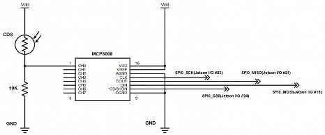

### Jetson Nano와 브레드보드 연결 (조도센서)

**SPI 0번 채널** 사용

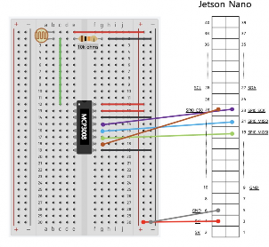

### Jetson Nano와 브레드보드 연결 (조도센서 + LCD I2C)

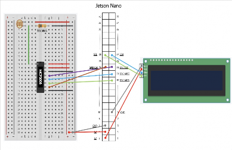

### Jetson Nano와 브레드보드 실제 연결 (SPI 조도센서 실습)

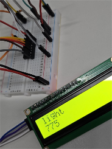
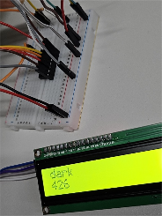

---

## 실습 1-10: Jetson Nano에서 SPI 통신 실습


### 실습 개요

SPI (Serial Peripheral Interface) 통신을 학습한다.

### spidev 모듈 로드

Jetson에서 SPI 통신을 하기 위해선 `spidev`라는 모듈을 로드해야 한다.

`spidev`란 사용자 공간에서 SPI 장치를 제어하기 위한 인터페이스를 제공하여 장치와 사용자 공간 통신을 가능하게 해주는 커널 모듈이다.

#### modprobe 명령어

커널 모듈을 동적으로 로드하고 언로드하는데 사용되며, 종속성을 자동으로 처리하여 필요한 모든 관련 모듈을 함께 로드하거나 언로드한다.

```bash
# 모듈 로드
$ sudo modprobe [모듈명]

# 모듈 언로드
$ sudo modprobe -r [모듈명]
```

> 모듈이 존재하지 않을 경우 `not found` 오류 메시지가 표시된다.

#### lsmod 명령어

현재 로드된 모든 커널 모듈의 목록을 표시한다.

이 명령어는 `/proc` 파일 시스템의 `/proc/modules` 파일을 읽어 현재 로드된 모듈에 대한 정보를 제공한다.

```bash
$ lsmod
```

```
Module                  Size  Used by
<모듈명>                <크기> <사용 횟수> <의존성>
```

### spidev 모듈 로드

```bash
$ sudo modprobe spidev
```

> 모듈을 로드하는 이 작업은 시스템을 부팅할 때마다 반복해야 한다.

### spidev 모듈 로드 확인

```bash
$ lsmod
```

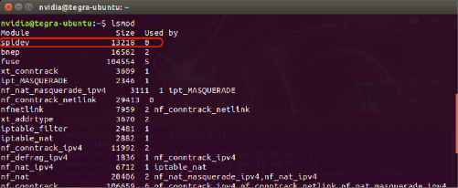

### SPI 장치 파일 확인

```bash
$ ls /dev/spidev*
```

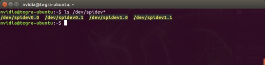

> 참고: `spidev0.0`에서 `0.0`의 의미
> - 첫번째 `0`: 0번 SPI 버스
> - 두번째 `0`: 각 슬레이브 디바이스 (CS)

### 핀 컨트롤 레지스터 확인

SPI에 해당하는 pin control 레지스터 값을 확인한다.

```bash
$ sudo cat /sys/kernel/debug/tegra_pinctrl_reg | grep -i spi
```

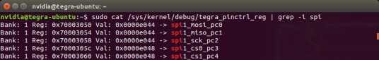

> Value 값이 위 내용과 같아야 SPI 통신이 가능하다.
> 이 레지스터들은 각 pin마다 할당된 기능을 설정하고 제어하는 역할을 하며, 시스템에서 다양한 하드웨어 장치와의 인터페이스를 관리하거나, 입출력(I/O) 동작을 설정할 때 중요한 역할을 한다.

---

### SPI Loopback Test 수행

Jetson Nano의 **SPI 0번 MOSI와 MISO**를 점퍼선으로 연결한다.

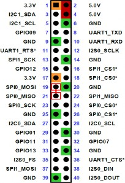
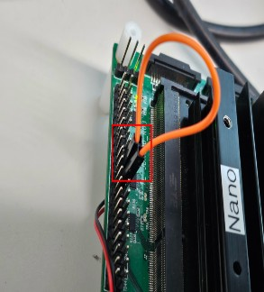

#### spidev-test Clone 및 컴파일

```bash
$ git clone https://github.com/rm-hull/spidev-test
$ cd spidev-test
$ gcc spidev_test.c -o spidev_test
```

#### Loopback Test 실행

SPI0_MOSI, SPI0_MISO를 연결했기 때문에 `spidev0.0` 또는 `spidev0.1`로 loopback test를 할 경우 잘 작동한다.

```bash
$ sudo ./spidev_test -D /dev/spidev0.0 -v
```

```
spi mode: 0x0
bits per word: 8
max speed: 500000 Hz (500 KHz)

TX | FF FF FF FF FF FF 40 00 00 00 00 95 FF FF FF FF FF FF FF FF FF FF FF FF FF FF FF FF FF F0 0D  | ......@.....
RX | FF FF FF FF FF FF 40 00 00 00 00 95 FF FF FF FF FF FF FF FF FF FF FF FF FF FF FF FF FF F0 0D  | ......@.....
```

```bash
$ sudo ./spidev_test -D /dev/spidev0.0 -v -p "HelloWorld123456789abcdef"
```

```
spi mode: 0x0
bits per word: 8
max speed: 500000 Hz (500 KHz)

TX | 48 65 6C 6C 6F 57 6F 72 6C 64 31 32 33 34 35 36 37 38 39 61 62 63 64 65 66  | HelloWorld123456789abcdef
RX | 48 65 6C 6C 6F 57 6F 72 6C 64 31 32 33 34 35 36 37 38 39 61 62 63 64 65 66  | HelloWorld123456789abcdef
```

---

### SPI 통신을 활용한 실습 – 조도센서, ADC (MCP3008)

MCP3008은 SPI 버스 프로토콜을 사용하는 **아날로그-디지털 컨버터 (ADC)** 이다.

조도센서 아날로그 데이터를 MCP3008 (SPI 통신)를 통해 디지털 값으로 변경하여 가져와 출력하는 내용을 실습한다.

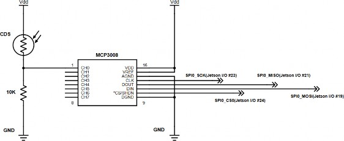

### Jetson Nano – MCP3008, 조도센서(CDS) 회로도

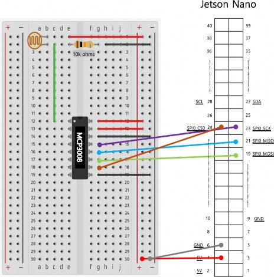

### Jetson Nano – 브레드보드 (조도센서) 연결

#### spidev 라이브러리 설치

```bash
$ pip3 install spidev
$ pip3 list | grep spidev
```

#### MCP3008 Python 코드

**파일 위치**: `mcp3008/mcp3008.py`

```python
import time
import spidev

spi = spidev.SpiDev()
spi.open(0, 0)
spi.max_speed_hz = 1350000

def analog_read(channel):
    r = spi.xfer2([1, (8 + channel) << 4, 0])
    data = ((r[1] & 3) << 8) + r[2]
    return data

while True:
    reading = analog_read(0)
    readingstr = str(reading)
    print('reading : ', readingstr, 'Voltage:', reading * 3.3 / 1024)
    time.sleep(1)
```

> - `spi.open(0, 0)`의 첫번째 `0`: 0번 SPI 버스
> - `spi.open(0, 0)`의 두번째 `0`: 각 슬레이브 디바이스 (CS)
> - `analog_read()`에 쓰이는 `channel`: MCP3008에 연결된 channel 번호 **'0'**

#### 코드 실행

```bash
$ sudo python3 mcp3008.py
```

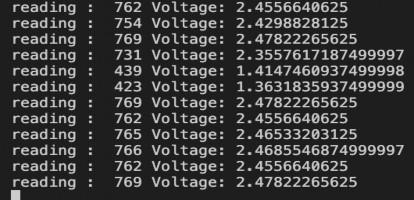

코드가 실행되는 동안 조도센서 위의 밝기를 변화시키면서 데이터가 어떻게 나오는지 확인한다.

---

### I2C + SPI 통신을 활용한 실습

**조도센서, ADC (MCP3008) + LCD (LCD 1602 IIC I2C)**

조도센서의 변화 값에 따라 LCD에 문자로 출력하는 실습을 한다.

Jetson Nano에 조도센서, MCP3008, I2C LCD를 연결한다.

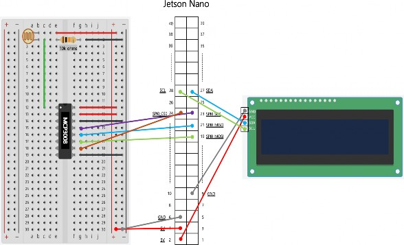

#### 통합 실습 코드

**파일 위치**: `mcp3008/mcp3008_output.py`

> LCD 코드를 사용하기 위해서는 `RPi_I2C_driver.py` 파일이 필요하다.
> 작성할 코드 경로에 `RPi_I2C_driver.py` 파일을 복사하고 Import 해서 사용한다.

```python
import spidev
import RPi_I2C_driver
from time import *

# RPi_I2C_driver.lcd( I2C address )
lcd = RPi_I2C_driver.lcd(0x27)

spi = spidev.SpiDev()
spi.open(0, 0)
spi.max_speed_hz = 1350000

time_sec = 0

def analog_read(channel):
    r = spi.xfer2([1, (8 + channel) << 4, 0])
    data = ((r[1] & 3) << 8) + r[2]
    return data

while True:
    reading = analog_read(0)
    readingstr = str(reading)
    print('reading : ', readingstr, 'Voltage:', reading * 3.3 / 1024)
    
    lcd.clear()
    if reading > 500:
        lcd.print("light")
    else:
        lcd.print("dark")
    
    # set the cursor to column 0, line 1
    # (note: line 1 is the second row, since counting begins with 0)
    lcd.setCursor(0, 1)
    # Print a message to the LCD.
    lcd.print(reading)
    
    sleep(0.5)
```

#### 실행

```bash
$ sudo python3 mcp3008_output.py
```

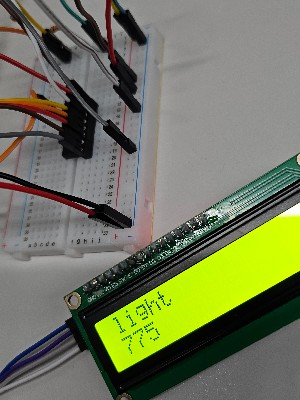
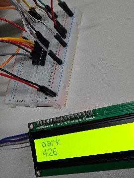

> 실습 환경에 따라 조도센서 데이터의 출력값은 밝고 어두운 조건에서 중간값이 달라질 수 있다.
> 제공된 코드에서는 기준값을 **500**으로 설정하고 있으나, 실제 환경에서 측정된 중간값이 다를 경우 해당 값을 적절히 수정하여 사용해야 한다.

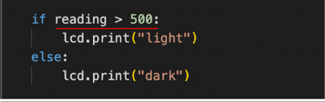

---

## 참고 자료

- [spidev-test GitHub](https://github.com/rm-hull/spidev-test)
- [MCP3008 Datasheet (Wikipedia)](https://en.wikipedia.org/wiki/MCP3008)
