# OpenCV

## Computer Vision

**Computer Vision**은 컴퓨터를 이용하여 정지 영상 또는 동영상으로부터 의미 있는 정보를 추출하는 방법을 연구하는 학문이다.

- 사람이 눈으로 사물을 보고 인지하는 작업을 컴퓨터가 동등하게 수행할 수 있게끔 연구
- 사람의 눈이 하는 작업을 **카메라**가 대신하고, 사람의 뇌가 하는 작업을 **수학적 알고리즘**을 통해 컴퓨터가 유사하게 수행
- 주로 **밝기**, **색상**, **모양**, **텍스처** 등의 영상 정보 활용

---

## What is OpenCV?

**OpenCV** (Open Source Computer Vision Library)는 컴퓨터 비전과 이미지 처리 응용 프로그램을 개발하기 위한 **오픈 소스 라이브러리**이다.

- 다양한 언어(C++, Python, Java, MATLAB) 지원
- 크로스 플랫폼에서 사용 가능
- 많은 함수가 하드웨어 가속을 지원하며, GPU를 이용한 실시간 어플리케이션에도 적합

### 주요 기능

| 분류 | 기능 |
|------|------|
| **이미지 처리** | 필터링(블러, 샤프닝, 경계 검출 등), 히스토그램 계산 및 equalization, 컬러 변환(RGB ↔ Grayscale, HSV 등), 이미지 리사이징, 회전, 크롭 |
| **비디오 처리** | 실시간 카메라 스트리밍 처리, 프레임 추출 및 저장, 영상 코덱 지원 및 비디오 파일 입출력 |
| **객체 탐지 (Object Detection)** | 얼굴 탐지(Haar cascade, DNN), 사람/차량 탐지 (YOLO, SSD 등과 연동), 배경 제거, 모션 감지 |
| **컴퓨터 비전 알고리즘** | 윤곽선 검출(contour), 엣지(Edge) 검출(Canny 등), 코너 검출(Harris, Shi-Tomasi), 특징점 추출(SIFT, SURF, ORB 등), 카메라 캘리브레이션, 스테레오 매칭, 깊이 추정 |
| **딥러닝 연동** | OpenCV DNN 모듈을 통해 ONNX, Caffe, TensorFlow, Darknet 모델 로드 가능, YOLO, SSD, MobileNet 등 실시간 객체 탐지 구현 가능 |

---

## OpenCV Library 모듈

OpenCV 라이브러리는 다수의 모듈로 구성된다:

| 모듈 | 설명 |
|------|------|
| **calib3d** | 카메라 캘리브레이션과 3차원 재구성 |
| **core** | 행렬, 벡터 등 OpenCV 핵심 클래스와 연산 함수 |
| **dnn** | 심층 신경망 기능 |
| **features2d** | 2차원 특징 추출과 특징 벡터 기술, 매칭 방법 |
| **flann** | 다차원 공간에서 빠른 최근방 이웃 검색 |
| **highgui** | 영상의 화면 출력, 마우스 이벤트 처리 등 사용자 인터페이스 |
| **imgcodecs** | 영상 파일 입출력 |
| **imgproc** | 필터링, 기하학적 변환, 색 공간 변환 등 영상 처리 기능 |
| **ml** | 통계적 분류, 회귀 등 머신 러닝 알고리즘 |
| **objdetect** | 얼굴, 보행자 검출 등 객체 검출 |
| **photo** | HDR, 잡음 제거 등 사진 처리 기능 |
| **stitching** | 영상 이어 붙이기 |
| **video** | 옵티컬 플로우, 배경 차분 등 동영상 처리 기술 |
| **videoio** | 동영상 파일 입출력 |
| **world** | 여러 OpenCV 모듈을 포함하는 하나의 통합 모듈 |

---

## OpenCV 설치

### pip 설치

```bash
$ pip3 install opencv-python
$ pip3 install opencv-contrib-python
```

### CMake 옵션 문서

- <https://docs.opencv.org/4.10.0/db/d05/tutorial_config_reference.html>

### OpenCV Tutorial

- <https://docs.opencv.org/4.x/d9/df8/tutorial_root.html>

### GitHub

- <https://github.com/opencv/opencv>

### Documentation

- <https://docs.opencv.org/>

---

## Jetson Nano OpenCV

Jetson Library를 설치할 때 기본적으로 CUDA, cuDNN, TensorRT, OpenCV 등의 라이브러리가 함께 설치된다.

하지만 기본적으로 제공되는 OpenCV는 **CUDA를 사용하지 않는 OpenCV**로 설치된다.

**CUDA를 사용하는 OpenCV**를 설치하기 위해 OpenCV는 소스를 직접 빌드해서 설치해야 한다.

### Jetson Nano에서 OpenCV Build 시 Swap 사용

**Swap**은 컴퓨터 시스템에서 사용되는 메모리 관리 기법으로, 주 메모리(RAM)의 공간이 부족할 때 보조 저장 장치(HDD 또는 SSD)의 일부를 임시 메모리로 사용하는 것을 의미한다.

- OpenCV 전체 빌드에는 약 **8GB 이상의 RAM**이 필요
- Jetson Nano는 **4GB RAM**이므로 swap 공간 할당 필요
- `dphys-swapfile`을 이용하여 swap 파일 사용

> 참고: <https://recoverhdd.com/blog/swap-file-in-windows.html>

### Jetson Nano Camera 사용

로지텍 C270 카메라를 이용해서 Jetson Nano에서 실시간으로 OpenCV 코드 실행 가능

### OpenCV DNN

**OpenCV DNN** (Deep Neural Network)은 OpenCV에 내장된 다양한 심층 학습 모델을 사용하여 얼굴 감지와 같은 작업 수행이 가능하다.

- 딥러닝 학습은 기존의 유명한 **Caffe**, **TensorFlow** 등의 다른 딥러닝 프레임워크에서 진행
- 학습된 모델을 불러와서 실행할 때에는 **dnn 모듈**을 사용

---

## 실습 1-12: Jetson Nano에서 OpenCV with CUDA 설치 및 사용


### 실습 개요

OpenCV (Open Source Computer Vision Library)는 컴퓨터 비전과 이미지 처리 작업을 수행하는데 널리 사용되는 라이브러리이다.

Jetson Nano에서 Jetson-library를 설치하면 기본적으로 CUDA, cuDNN, TensorRT, OpenCV 등의 라이브러리가 함께 설치된다. 그러나 기본적으로 제공되는 OpenCV는 **CUDA를 지원하지 않는 버전**이기 때문에, CUDA 가속이 적용된 OpenCV로 교체하는 과정이 필요하다.

이를 위해, 기존에 설치된 OpenCV를 제거한 후, CUDA를 지원하는 OpenCV를 재설치하는 과정을 먼저 진행한 후 OpenCV 실습을 진행한다.

### CMake 옵션

Jetson Nano에서 OpenCV를 빌드할 때, CUDA 가속을 활성화하려면 CMake 옵션을 적절하게 설정해야 한다.

| CMake 옵션 | 설명 |
|------------|------|
| `WITH_CUDA=ON` | OpenCV의 CUDA 지원을 활성화하여 GPU 가속 기능을 사용할 수 있도록 설정 |
| `CUDA_ARCH_BIN="5.3"` | Jetson Nano의 Maxwell GPU (Compute Capability 5.3)에서 실행 가능하도록 CUDA 커널을 컴파일 |
| `WITH_CUDNN=ON` | 딥러닝 가속 라이브러리 활성화하여, YOLO, SSD, Faster R-CNN 같은 모델을 OpenCV에서 실행할 때 GPU 가속을 지원 |
| `WITH_CUBLAS=ON` | CUDA 기반의 행렬 연산 라이브러리(cuBLAS) 활성화하여 고속 행렬 연산 수행 |
| `ENABLE_FAST_MATH=ON` | CUDA 연산에서 빠른 수학 연산(Fast Math)을 활성화하여 실행 속도를 높임 |
| `CUDA_FAST_MATH=ON` | ENABLE_FAST_MATH=ON과 유사하지만, 특정 CUDA 연산에서 추가적인 최적화를 수행 |
| `OPENCV_DNN_CUDA=ON` | OpenCV의 딥러닝 모듈(cv::dnn)이 GPU에서 실행될 수 있도록 설정 |
| `OPENCV_EXTRA_MODULES_PATH=../../opencv_contrib-4.5.1/modules` | opencv_contrib 모듈을 추가하여 CUDA 기반의 다양한 추가 기능을 사용할 수 있도록 확장 |

> Jetson Nano에서 OpenCV를 직접 빌드할 경우 **2~3시간** 정도 소요되므로, 이미 빌드된 OpenCV 폴더를 가져와 install 명령어를 사용하여 설치하는 방식을 활용한다.

### 기존 OpenCV 버전 확인

```bash
$ jetson_release
```

---

### OpenCV 직접 Build 방법 (참고용)

> Build 방식은 참고용이다. Jetson Nano에서는 OpenCV 소스코드 빌드 소요 시간이 오래 걸리므로 빌드 과정은 읽고 넘어간다.
> 실제 실습은 아래 **'OpenCV Install'** 부터 시작한다.

OpenCV를 Jetson Nano에서 직접 빌드 및 설치하려면 약 8GB 이상의 RAM이 필요하며, Jetson Nano는 RAM이 4GB이기 때문에 swap 공간을 할당해야 한다.

#### dphys-swapfile 설치

```bash
$ sudo apt-get install dphys-swapfile
```

#### `/sbin/dphys-swapfile` 수정

```bash
$ sudo vi /sbin/dphys-swapfile
```

```
CONF_SWAPSIZE=4096
CONF_SWAPFACTOR=2
CONF_MAXSWAP=4096
```

#### `/etc/dphys-swapfile` 주석 해제 및 수정

```bash
$ sudo vi /etc/dphys-swapfile
```

```
CONF_SWAPSIZE=4096
CONF_SWAPFACTOR=2
CONF_MAXSWAP=4096
```

#### 재부팅

```bash
$ sudo reboot
```

#### swap 확인

```bash
$ free -m
```

> swap 6074 정도로 출력되면 정상

#### 기존 OpenCV 삭제

```bash
$ sudo apt purge libopencv-dev libopencv-python libopencv-samples libopencv*
$ pkg-config --modversion opencv4
$ jetson_release
```

#### 패키지 업데이트 및 필수 패키지 설치

```bash
$ sudo apt update
$ sudo apt install -y python3-pip python-dev python3-dev python-numpy python3-numpy
$ sudo sh -c "echo '/usr/local/cuda/lib64' >> /etc/ld.so.conf.d/nvidia-tegra.conf"
$ sudo apt install -y qt5-default
$ sudo apt install -y build-essential cmake git unzip pkg-config libswscale-dev
$ sudo apt install -y libcanberra-gtk* libgtk2.0-dev
$ sudo apt install -y libtbb2 libtbb-dev libavresample-dev libvorbis-dev libxine2-dev
$ sudo apt install -y curl
```

#### 이미지/비디오 포맷 패키지 설치

```bash
$ sudo apt install -y libxvidcore-dev libx264-dev libgtk-3-dev
$ sudo apt install -y libjpeg-dev libpng-dev libtiff-dev
$ sudo apt install -y libmp3lame-dev libtheora-dev libfaac-dev libopencore-amrnb-dev
$ sudo apt install -y libopencore-amrwb-dev libopenblas-dev libatlas-base-dev
$ sudo apt install -y libblas-dev liblapack-dev libeigen3-dev libgflags-dev
$ sudo apt install -y protobuf-compiler libprotobuf-dev libgoogle-glog-dev
$ sudo apt install -y libavcodec-dev libavformat-dev gfortran libhdf5-dev
$ sudo apt install -y libgstreamer1.0-dev libgstreamer-plugins-base1.0-dev
$ sudo apt install -y libv4l-dev v4l-utils qv4l2 v4l2ucp libdc1394-22-dev
```

#### OpenCV & contrib modules 다운로드 및 압축 해제

```bash
# 현재 경로 : ~
$ curl -L https://github.com/opencv/opencv/archive/4.5.1.zip -o opencv-4.5.1.zip
$ curl -L https://github.com/opencv/opencv_contrib/archive/4.5.1.zip -o opencv_contrib-4.5.1.zip
$ unzip opencv-4.5.1.zip
$ unzip opencv_contrib-4.5.1.zip
```

#### Build 폴더 생성 및 CMake 설정

```bash
$ cd opencv-4.5.1/
$ mkdir build
$ cd build
```

```bash
$ cmake -D WITH_CUDA=ON \
    -D ENABLE_PRECOMPILED_HEADERS=OFF \
    -D OPENCV_EXTRA_MODULES_PATH=../../opencv_contrib-4.5.1/modules \
    -D WITH_GSTREAMER=ON \
    -D BUILD_opencv_python2=ON \
    -D BUILD_opencv_python3=ON \
    -D WITH_LIBV4L=ON \
    -D BUILD_TESTS=ON \
    -D BUILD_PERF_TESTS=OFF \
    -D BUILD_EXAMPLES=OFF \
    -D CMAKE_BUILD_TYPE=RELEASE \
    -D CMAKE_INSTALL_PREFIX=/usr/local \
    -D EIGEN_INCLUDE_PATH=/usr/include/eigen3 \
    -D CUDA_ARCH_BIN="5.3" \
    -D CUDA_ARCH_PTX="" \
    -D WITH_CUDNN=ON \
    -D WITH_CUBLAS=ON \
    -D ENABLE_FAST_MATH=ON \
    -D CUDA_FAST_MATH=ON \
    -D OPENCV_DNN_CUDA=ON \
    -D ENABLE_NEON=ON \
    -D WITH_QT=OFF \
    -D WITH_OPENMP=ON \
    -D WITH_OPENGL=ON \
    -D BUILD_TIFF=ON \
    -D WITH_FFMPEG=ON \
    -D WITH_TBB=ON \
    -D BUILD_TBB=ON \
    -D WITH_EIGEN=ON \
    -D WITH_V4L=ON \
    -D OPENCV_ENABLE_NONFREE=ON \
    -D INSTALL_C_EXAMPLES=OFF \
    -D INSTALL_PYTHON_EXAMPLES=ON \
    -D BUILD_NEW_PYTHON_SUPPORT=ON \
    -D BUILD_opencv_python3=TRUE \
    -D OPENCV_GENERATE_PKGCONFIG=ON ..
```

#### OpenCV 빌드

```bash
$ nproc
$ make -j4
```

> OpenCV 빌드는 약 2시간 정도 걸린다.

#### 설치

```bash
$ sudo make install
$ sudo ldconfig
```

---

### OpenCV Install (실제 실습)

> 시간 관계상 여기부터 시작한다.
> 이미 빌드된 OpenCV 폴더를 가져와 install 명령어를 사용하여 설치하는 방식을 활용한다.

#### Swap 공간 할당

```bash
$ sudo apt-get install dphys-swapfile
```

`/sbin/dphys-swapfile` 수정:

```bash
$ sudo vi /sbin/dphys-swapfile
```

```
CONF_SWAPSIZE=4096
CONF_SWAPFACTOR=2
CONF_MAXSWAP=4096
```

`/etc/dphys-swapfile` 주석 해제 및 수정:

```bash
$ sudo vi /etc/dphys-swapfile
```

```
CONF_SWAPSIZE=4096
CONF_SWAPFACTOR=2
CONF_MAXSWAP=4096
```

재부팅 및 swap 확인:

```bash
$ sudo reboot
$ free -m
```

> swap 6074 정도로 출력되면 정상

#### 기존 OpenCV 삭제

```bash
$ sudo apt purge libopencv-dev libopencv-python libopencv-samples libopencv*
$ pkg-config --modversion opencv4
$ jetson_release
```

#### 패키지 업데이트 및 설치

```bash
$ sudo apt update
$ sudo apt install -y python3-pip python-dev python3-dev python-numpy python3-numpy
$ sudo sh -c "echo '/usr/local/cuda/lib64' >> /etc/ld.so.conf.d/nvidia-tegra.conf"
$ sudo apt install -y qt5-default
$ sudo apt install -y build-essential cmake git unzip pkg-config libswscale-dev
$ sudo apt install -y libcanberra-gtk* libgtk2.0-dev
$ sudo apt install -y libtbb2 libtbb-dev libavresample-dev libvorbis-dev libxine2-dev
$ sudo apt install -y curl
$ sudo apt install -y libxvidcore-dev libx264-dev libgtk-3-dev
$ sudo apt install -y libjpeg-dev libpng-dev libtiff-dev
$ sudo apt install -y libmp3lame-dev libtheora-dev libfaac-dev libopencore-amrnb-dev
$ sudo apt install -y libopencore-amrwb-dev libopenblas-dev libatlas-base-dev
$ sudo apt install -y libblas-dev liblapack-dev libeigen3-dev libgflags-dev
$ sudo apt install -y protobuf-compiler libprotobuf-dev libgoogle-glog-dev
$ sudo apt install -y libavcodec-dev libavformat-dev gfortran libhdf5-dev
$ sudo apt install -y libgstreamer1.0-dev libgstreamer-plugins-base1.0-dev
$ sudo apt install -y libv4l-dev v4l-utils qv4l2 v4l2ucp libdc1394-22-dev
```

> 참고: 실습자료를 복사할 경우 복사가 잘 안될 수 있다. 실습자료로 제공된 `opencv_install.txt` 파일을 참고한다.

#### 사전 빌드된 OpenCV 설치

사전 빌드된 `opencv-4.5.1.tar.gz` 파일을 Jetson Nano 홈 디렉토리(`~`)에 복사하여 넣고 압축 해제한다.

(`opencv-4.5.1.tar.gz` 파일을 USB disk 또는 원격 연결된 Visual Studio Code를 이용해서 Jetson Nano에 복사)

```bash
$ tar -xvzf opencv-4.5.1.tar.gz
$ cd opencv-4.5.1/build/
$ sudo make install
```

> 참고: 사전에 설치하는 패키지가 제대로 설치가 안됐을 경우 OpenCV 패키지를 설치할 때 빌드로 넘어가서 시간이 오래 걸리거나 에러가 나는 경우가 있을 수 있다. 그럴 경우 `Ctrl + C`를 눌러 install을 중단하고, 패키지를 제대로 설치한 후에 진행한다. 단, 100%에서 오래 걸리는 건 기다려 주시기 바란다.

#### 라이브러리 캐시 업데이트

```bash
$ sudo ldconfig
```

#### OpenCV with CUDA 설치 확인

```bash
$ jetson_release
```

#### Swap 제거

```bash
$ sudo /etc/init.d/dphys-swapfile stop
$ sudo apt-get remove --purge dphys-swapfile
```


---

## OpenCV C++

Build된 OpenCV를 C++에서 사용하기 위해 코드를 작성한 후 cmake를 통해 빌드한 뒤 실행한다.

### OPENCV VERSION

OpenCV 버전을 출력하는 코드를 작성하여 cmake로 빌드 후 실행한다.

**파일 위치**: `opencv_ex/opencv_cpp/opencv_version/opencv_version.cpp`

```cpp
#include "opencv2/opencv.hpp"

int main(int argc, char** argv) {
    printf("OpenCV version : %s\n", CV_VERSION);
    return 0;
}
```

#### CMakeLists.txt

```cmake
cmake_minimum_required(VERSION 3.0)
project(opencv_version)
find_package(OpenCV REQUIRED)

include_directories(${OpenCV_INCLUDE_DIRS})
add_executable(opencv_version opencv_version.cpp)
target_link_libraries(opencv_version ${OpenCV_LIBS})
```

#### CMakeLists.txt 설명

| 항목 | 설명 |
|------|------|
| `cmake_minimum_required(VERSION 3.0)` | 프로젝트를 빌드하는데 필요한 최소 CMake 버전을 설정 |
| `project(opencv_version)` | 프로젝트의 이름을 설정 |
| `find_package(OpenCV REQUIRED)` | CMake에 OpenCV 라이브러리를 찾게 함. `REQUIRED`는 필수적임을 나타냄 |
| `include_directories(${OpenCV_INCLUDE_DIRS})` | 컴파일러에게 OpenCV 헤더 파일 디렉토리를 추가 |
| `add_executable(opencv_version opencv_version.cpp)` | 실행파일을 생성하도록 지시 |
| `target_link_libraries(opencv_version ${OpenCV_LIBS})` | 실행파일이 OpenCV 라이브러리와 연결되도록 설정 |

#### Build 및 실행

```bash
$ mkdir build
$ cd build
$ cmake ..
$ make
$ ./opencv_version
```


---

### OPENCV CAMERA CAPTURE

로지텍 C270 카메라를 Jetson Nano에 연결한다.

연결 후 카메라가 연결되었는지 확인:

```bash
$ ls /dev/video*
/dev/video0
```

> 연결이 정상적으로 안되면 `ls: cannot access '/dev/video*': No such file or directory` 문구가 뜨므로 연결선을 다시 확인한다.

#### 카메라 캡처 코드

**파일 위치**: `opencv_ex/opencv_cpp/opencv_camera/camera_capture/camera_capture.cpp`

```cpp
#include <opencv2/opencv.hpp>

int main() {
    // Open the default camera using default API
    // 0 is the ID of the default camera
    cv::VideoCapture cap(0);

    // Check if camera opened successfully
    if (!cap.isOpened()) {
        printf("Error: Could not open camera");
        return -1;
    }

    // Get the frame width and height
    int width = cap.get(cv::CAP_PROP_FRAME_WIDTH);
    int height = cap.get(cv::CAP_PROP_FRAME_HEIGHT);
    printf("width, height = %d, %d\n", width, height);

    // Create a window for display
    cv::namedWindow("Camera Capture", cv::WINDOW_AUTOSIZE);

    while (true) {
        cv::Mat frame;

        // Capture frame-by-frame
        cap >> frame;

        // If the frame is empty, break immediately
        if (frame.empty()) {
            printf("Error: Captured empty frame");
            break;
        }

        // Display the resulting frame
        cv::imshow("Camera Capture", frame);

        // Press 'q' on the keyboard to exit the loop
        if (cv::waitKey(10) == 'q') {
            break;
        }
    }

    // When everything is done, release the video capture object
    cap.release();

    // Closes all the windows
    cv::destroyAllWindows();

    return 0;
}
```

#### 주요 함수 설명

| 함수 | 설명 |
|------|------|
| `VideoCapture cap(0)` | VideoCapture 객체를 생성하여 카메라를 염. `cap(N)`에서 N은 `/dev/videoN`의 N에 해당 |
| `cap.isOpened()` | VideoCapture 객체가 성공적으로 카메라를 열었는지 확인 |
| `cap.get(CAP_PROP_FRAME_WIDTH/HEIGHT)` | 캡쳐되는 프레임의 너비와 높이를 가져옴 |
| `namedWindow("Camera Capture", WINDOW_AUTOSIZE)` | 'Camera Capture' 창을 생성하고 프레임 크기에 맞춰 자동 조절 |
| `cap >> frame` | 한 프레임을 읽어와 frame 변수에 저장 |
| `frame.empty()` | 캡쳐된 프레임이 비어 있는지 확인 |
| `imshow("Camera Capture", frame)` | 창에 캡쳐된 프레임을 표시 |
| `waitKey(10) == 'q'` | 10ms 동안 키 입력을 기다리고 'q' 입력 시 루프 종료 |
| `cap.release()` | 카메라 장치 해제 |
| `destroyAllWindows()` | 모든 OpenCV 창을 닫음 |

#### CMakeLists.txt

```cmake
cmake_minimum_required(VERSION 3.0)
project(camera_capture)
find_package(OpenCV REQUIRED)

include_directories(${OpenCV_INCLUDE_DIRS})
add_executable(camera_capture camera_capture.cpp)
target_link_libraries(camera_capture ${OpenCV_LIBS})
```

#### Build 및 실행

```bash
$ mkdir build
$ cd build
$ cmake ..
$ make
$ ./camera_capture
```

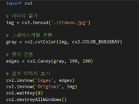


> VSCode에서 remote ssh를 사용하는 경우 다음 에러가 발생할 수 있다:
> ```
> terminate called after throwing an instance of 'cv::Exception'
> what(): OpenCV(4.5.1) ... window_gtk.cpp:624: error: (-2:Unspecified error) Can't initialize GTK backend
> ```
> 이는 OpenCV가 GUI 기능을 사용하려고 할 때 발생하며, 일반적으로 원격 서버나 GUI 환경이 없는 시스템에서 발생한다.
> GUI 기능을 사용할 경우 호스트 컴퓨터(Jetson Nano)로 직접 실행해야 한다.

---

### OPENCV CAMERA BINARIZATION

OpenCV를 이용하여 **BINARIZATION (이진화)**에 대해 알아본다.

이진화는 이미지 또는 영상의 각 픽셀을 **두 개의 부류로 나누는 작업**이다.

- 입력 부분을 주요 객체 영역과 배경 영역으로 나누거나
- 중요도가 높은 관심 영역과 비관심 영역으로 구분하는 용도로 사용
- 보통 그레이스케일 이미지에 대해 이진화를 수행
- 픽셀 값이 특정 값보다 크면 **255**, 작으면 **0**으로 설정
- 비교 대상이 되는 값을 **임계값(threshold)** 또는 문턱치라고 함

임계값은 그레이스케일 범위인 0~255 사이의 정수를 지정할 수 있다.

```
dst(x, y) = 255 (if src(x, y) > T)
             0  (otherwise)
```

#### 이진화 코드

**파일 위치**: `opencv_ex/opencv_cpp/opencv_camera/camera_binarization/binarization.cpp`

```cpp
#include <opencv2/opencv.hpp>

using namespace cv;
using namespace std;

int main() {
    VideoCapture cap(0);
    if (!cap.isOpened()) {
        printf("Error: Could not open camera");
        return -1;
    }

    namedWindow("Binary", WINDOW_AUTOSIZE);

    while (true) {
        Mat frame;
        cap >> frame;

        if (frame.empty()) {
            printf("Error: Captured empty frame");
            break;
        }

        Mat gray;
        cvtColor(frame, gray, COLOR_BGR2GRAY);

        Mat binary;
        threshold(gray, binary, 128, 255, THRESH_BINARY);  // threshold 128
        
        imshow("Binary", binary);

        if (waitKey(10) == 'q') {
            break;
        }
    }

    cap.release();
    destroyAllWindows();

    return 0;
}
```

#### 주요 함수 설명

| 함수 | 설명 |
|------|------|
| `cvtColor(frame, gray, COLOR_BGR2GRAY)` | BGR 이미지를 그레이스케일로 변환 |
| `threshold(gray, binary, 128, 255, THRESH_BINARY)` | 그레이스케일 이미지를 이진화 (임계값 128) |

#### CMakeLists.txt

```cmake
cmake_minimum_required(VERSION 3.0)
project(camera_binarization)
find_package(OpenCV REQUIRED)

include_directories(${OpenCV_INCLUDE_DIRS})
add_executable(binarization binarization.cpp)
target_link_libraries(binarization ${OpenCV_LIBS})
```

#### Build 및 실행

```bash
$ mkdir build
$ cd build
$ cmake ..
$ make
$ ./binarization
```

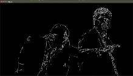
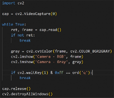

---

### OPENCV CAMERA LABELING

OpenCV를 이용하여 **LABELING (레이블링)**에 대해 알아본다.

레이블링 기법은 영상 내부에 있는 각 객체의 위치, 크기, 모양 등 특징을 분석할 때 사용된다.

- 영상의 레이블링은 일반적으로 **이진화된 영상**에서 수행
- 검은색 픽셀은 **배경**, 흰색 픽셀은 **객체**로 간주
- 하나의 객체는 한 개 이상의 인접한 픽셀로 이루어짐
- 하나의 객체를 구성하는 모든 픽셀에는 같은 레이블 번호가 지정됨

#### 연결성 (Connectivity)

특정 픽셀과 이웃한 픽셀의 연결 관계는 두 가지 방식으로 정의:

| 방식 | 설명 |
|------|------|
| **4-방향 연결성 (4-way connectivity)** | 특정 픽셀의 상하좌우로 붙어있는 픽셀끼리 연결 |
| **8-방향 연결성 (8-way connectivity)** | 상하좌우 + 대각선 방향으로 인접한 픽셀도 연결 |

#### 레이블링 코드 (3가지 모드)

**파일 위치**: `opencv_ex/opencv_cpp/opencv_camera/camera_labeling/labeling.cpp`

```cpp
#include <opencv2/opencv.hpp>
#include <sstream>

using namespace cv;

void labelingBasic();
void labelingImageStats();
void labelingCameraStats();

int main(int argc, char* argv[]) {
    if (argc < 2) {
        printf("Usage: %s <option>\n", argv[0]);
        printf("Options:\n");
        printf(" 1 - Run labelingBasic()\n");
        printf(" 2 - Run labelingImageStats()\n");
        printf(" 3 - Run labelingCameraStats()\n");
        return -1;
    }

    int option = std::stoi(argv[1]);
    switch (option) {
        case 1: labelingBasic(); break;
        case 2: labelingImageStats(); break;
        case 3: labelingCameraStats(); break;
        default: printf("Invalid option\n"); break;
    }

    return 0;
}

void labelingBasic() {
    uchar data[] = {
        0, 0, 1, 1, 0, 0, 0, 0,
        1, 1, 1, 1, 0, 0, 1, 0,
        1, 1, 1, 1, 0, 0, 0, 0,
        0, 0, 0, 0, 0, 1, 1, 0,
        0, 0, 0, 1, 1, 1, 1, 0,
        0, 0, 0, 1, 0, 0, 1, 0,
        0, 0, 1, 1, 1, 1, 1, 0,
        0, 0, 0, 0, 0, 0, 0, 0,
    };

    Mat src = Mat(8, 8, CV_8UC1, data) * 255;
    Mat labels;
    int labelCount = connectedComponents(src, labels);

    std::stringstream ss1;
    ss1 << src;
    printf("src:\n%s\n", ss1.str().c_str());

    std::stringstream ss2;
    ss2 << labels;
    printf("labels:\n%s\n", ss2.str().c_str());

    printf("Number of labels: %d\n", labelCount);
}

void labelingImageStats() {
    Mat src = imread("../keyboard.bmp", IMREAD_GRAYSCALE);
    if (src.empty()) {
        printf("Image load failed!\n");
        return;
    }

    Mat bin;
    threshold(src, bin, 0, 255, THRESH_BINARY | THRESH_OTSU);

    Mat labels, stats, centroids;
    int count = connectedComponentsWithStats(bin, labels, stats, centroids);

    Mat dst;
    cvtColor(src, dst, COLOR_GRAY2BGR);

    for (int i = 1; i < count; i++) {
        int* p = stats.ptr<int>(i);
        if (p[4] < 20) continue;
        rectangle(dst, Rect(p[0], p[1], p[2], p[3]), Scalar(0, 255, 255), 2);
    }

    imshow("src", src);
    imshow("dst", dst);
    waitKey();
    destroyAllWindows();
}

void labelingCameraStats() {
    VideoCapture cap(0);
    if (!cap.isOpened()) {
        printf("Error: Could not open camera\n");
        return;
    }

    while (true) {
        Mat frame;
        cap >> frame;

        if (frame.empty()) {
            printf("Error: Captured empty frame\n");
            break;
        }

        Mat gray;
        cvtColor(frame, gray, COLOR_BGR2GRAY);

        Mat bin;
        threshold(gray, bin, 0, 255, THRESH_BINARY | THRESH_OTSU);

        Mat labels, stats, centroids;
        int count = connectedComponentsWithStats(bin, labels, stats, centroids);

        Mat dst;
        cvtColor(gray, dst, COLOR_GRAY2BGR);

        for (int i = 1; i < count; i++) {
            int* p = stats.ptr<int>(i);
            if (p[4] < 20) continue;
            rectangle(dst, Rect(p[0], p[1], p[2], p[3]), Scalar(0, 255, 255), 2);
        }

        imshow("Camera frame", frame);
        imshow("Labeled", dst);

        if (waitKey(10) == 'q') {
            break;
        }
    }

    cap.release();
    destroyAllWindows();
}
```

#### 주요 함수 설명

| 함수 | 설명 |
|------|------|
| `int main(int argc, char* argv[])` | `argc`는 명령줄 인수의 개수, `argv`는 명령줄 인수를 담은 문자열 배열 |
| `connectedComponents(src, labels)` | 이진화된 이미지에서 서로 연결된 픽셀들을 그룹화하여 고유한 라벨 부여 |
| `imread(imagePath, IMREAD_GRAYSCALE)` | 이미지를 디스크에서 읽어옴 (그레이스케일) |
| `threshold(src, bin, 0, 255, THRESH_BINARY \| THRESH_OTSU)` | Otsu 알고리즘으로 최적 임계값 자동 선택 후 이진화 |
| `connectedComponentsWithStats(...)` | 각 객체의 크기, 위치, 중심점 정보 제공 |
| `rectangle(dst, Rect(...), Scalar(...))` | 이미지에 사각형 그림 |

#### CMakeLists.txt

```cmake
cmake_minimum_required(VERSION 2.8)
project(camera_labeling)
find_package(OpenCV REQUIRED)

include_directories(${OpenCV_INCLUDE_DIRS})
add_executable(labeling labeling.cpp)
target_link_libraries(labeling ${OpenCV_LIBS})
```

#### Build 및 실행

```bash
$ mkdir build
$ cd build
$ cmake ..
$ make
```

**실행 - argument 1** (기본 픽셀 데이터 레이블링):

```bash
$ ./labeling 1
```

배경을 포함하여 총 4개의 연결된 영역을 감지한다.

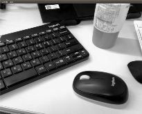

**실행 - argument 2** (이미지 레이블링):

```bash
$ ./labeling 2
```

Bitmap 파일(keyboard.bmp)을 읽고 레이블링을 수행한다.

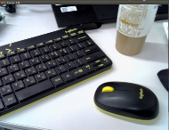

**실행 - argument 3** (카메라 레이블링):

```bash
$ ./labeling 3
```

카메라 영상 이미지 데이터로 실시간 레이블링을 수행한다.

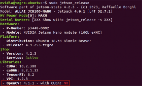

---

## OpenCV Python

`opencv-python`은 OpenCV의 Python 바인딩으로, Python 환경에서 컴퓨터 비전 애플리케이션을 보다 쉽게 개발할 수 있도록 지원하는 라이브러리이다.

Python으로 실행할 때는 `python3 [파일명]`으로 실행한다.

### OPENCV VERSION (Python)

**파일 위치**: `opencv_ex/opencv_py/opencv_version.py`

```python
import cv2
print(cv2.__version__)
```

```bash
$ python3 opencv_version.py
```

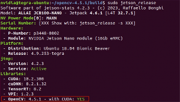

### OPENCV CAMERA (Python)

**파일 위치**: `opencv_ex/opencv_py/opencv_camera.py`

```python
import cv2

def main():
    capture = cv2.VideoCapture(0)

    if not capture.isOpened():
        print("Error: Could not open camera.")
        return

    width = capture.get(cv2.CAP_PROP_FRAME_WIDTH)
    height = capture.get(cv2.CAP_PROP_FRAME_HEIGHT)
    print("width, height = ", width, height)

    while True:
        ret, frame = capture.read()
        if not ret:
            print("Error: Could not read frame")
            break

        cv2.imshow("VideoFrame", frame)
        if cv2.waitKey(1) == ord('q'):
            break

    capture.release()
    cv2.destroyAllWindows()

if __name__ == "__main__":
    main()
```

```bash
$ python3 opencv_camera.py
```

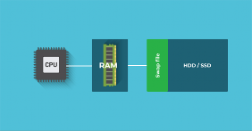

### OPENCV LABELING (Python)

**파일 위치**: `opencv_ex/opencv_py/labeling.py`

```python
import cv2
import numpy as np
import sys

def labeling_basic():
    data = np.array([
        [0, 0, 1, 1, 0, 0, 0, 0],
        [1, 1, 1, 1, 0, 0, 1, 0],
        [1, 1, 1, 1, 0, 0, 0, 0],
        [0, 0, 0, 0, 0, 1, 1, 0],
        [0, 0, 0, 1, 1, 1, 1, 0],
        [0, 0, 0, 1, 0, 0, 1, 0],
        [0, 0, 1, 1, 1, 1, 1, 0],
        [0, 0, 0, 0, 0, 0, 0, 0],
    ], dtype=np.uint8)

    src = data * 255
    cnt, labels = cv2.connectedComponents(src)

    print('src:\n', src)
    print('labels:\n', labels)
    print('number of labels:', cnt)

def labeling_image_stats():
    src = cv2.imread('keyboard.bmp', cv2.IMREAD_GRAYSCALE)
    if src is None:
        print("Image load failed!")
        return

    _, bin = cv2.threshold(src, 0, 255, cv2.THRESH_BINARY | cv2.THRESH_OTSU)
    cnt, labels, stats, centroids = cv2.connectedComponentsWithStats(bin)

    dst = cv2.cvtColor(src, cv2.COLOR_GRAY2BGR)

    for i in range(1, cnt):
        x, y, w, h, area = stats[i]
        if area < 20:
            continue
        cv2.rectangle(dst, (x, y), (x + w, y + h), (0, 255, 255))

    cv2.imshow('src', src)
    cv2.imshow('dst', dst)
    cv2.waitKey()
    cv2.destroyAllWindows()

def labeling_camera_stats():
    cap = cv2.VideoCapture(0)
    if not cap.isOpened():
        print("Error: Could not open camera")
        return

    while True:
        ret, frame = cap.read()
        if not ret:
            print("Error: Captured empty frame")
            break

        gray = cv2.cvtColor(frame, cv2.COLOR_BGR2GRAY)
        _, bin = cv2.threshold(gray, 0, 255, cv2.THRESH_BINARY | cv2.THRESH_OTSU)
        cnt, labels, stats, centroids = cv2.connectedComponentsWithStats(bin)

        dst = cv2.cvtColor(gray, cv2.COLOR_GRAY2BGR)

        for i in range(1, cnt):
            x, y, w, h, area = stats[i]
            if area < 20:
                continue
            cv2.rectangle(dst, (x, y), (x + w, y + h), (0, 255, 255))

        cv2.imshow('Camera frame', frame)
        cv2.imshow('Labeled', dst)

        if cv2.waitKey(10) == ord('q'):
            break

    cap.release()
    cv2.destroyAllWindows()

if __name__ == "__main__":
    if len(sys.argv) < 2:
        print("Usage: python script.py <option>")
        print("Options:")
        print(" 1 - Run labeling_basic")
        print(" 2 - Run labeling_image_stats with image input")
        print(" 3 - Run labeling_camera_stats with camera input")
        sys.exit(-1)

    option = int(sys.argv[1])

    if option == 1:
        labeling_basic()
    elif option == 2:
        labeling_image_stats()
    elif option == 3:
        labeling_camera_stats()
    else:
        print("Invalid option")
```

```bash
$ python3 labeling.py 1
$ python3 labeling.py 2
$ python3 labeling.py 3
```

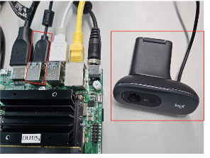
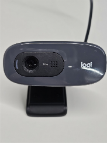
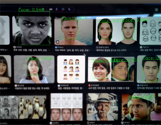

---

## OpenCV CUDA 성능 비교

OpenCV는 기본적으로 CPU에서 연산을 수행하지만, **CUDA를 활용하면 GPU를 통해 연산을 가속화**할 수 있다.

CPU 연산과 CUDA 가속을 비교하면 속도 및 자원 사용량에서 큰 차이를 보인다.

### CUDA 지원 여부 확인

**파일 위치**: `opencv_ex/opencv_cuda/check_cuda.py`

```python
import cv2

cuda_device_count = cv2.cuda.getCudaEnabledDeviceCount()
print(f"CUDA Enabled Device Count: {cuda_device_count}")
```

```bash
$ python3 check_cuda.py
# 출력: CUDA Enabled Device Count: 1
```

### 허프 변환(Hough Transform) 성능 비교

CPU와 GPU의 허프 변환 실행 속도를 비교한다.
GPU는 대형 이미지에서 연산 속도가 현저히 빨라지므로 height와 width를 크게 설정한다.

**파일 위치**: `opencv_ex/opencv_cuda/hough_performance_test.py`

```python
import cv2
import numpy as np
import time

height, width = 4096, 4096
image = np.zeros((height, width, 3), dtype=np.uint8)

cv2.line(image, (0, 0), (width, height), (255, 255, 255), 10)
cv2.line(image, (width, 0), (0, height), (255, 255, 255), 10)
gray_image = cv2.cvtColor(image, cv2.COLOR_BGR2GRAY)
edges = cv2.Canny(gray_image, 50, 150, apertureSize=3)

# CPU Hough Transform
start_cpu = time.time()
lines_cpu = cv2.HoughLines(edges, 1, np.pi / 180, 200)
end_cpu = time.time()
print(f"CUDA (X) 허프 변환 시간 : {end_cpu - start_cpu} seconds")

# GPU Hough Transform
if not cv2.cuda.getCudaEnabledDeviceCount():
    print("CUDA가 활성화된 장치가 없습니다.")
else:
    gpu_image = cv2.cuda_GpuMat()
    gpu_image.upload(gray_image)

    gpu_edges = cv2.cuda.createCannyEdgeDetector(50, 150, 3)
    gpu_edge_output = gpu_edges.detect(gpu_image)

    hough_detector = cv2.cuda.createHoughSegmentDetector(1, np.pi / 180, 200, 10)

    start_gpu = time.time()
    result_gpu = hough_detector.detect(gpu_edge_output)
    end_gpu = time.time()
    print(f"CUDA (O) 허프 변환 시간 : {end_gpu - start_gpu} seconds")
```

```bash
$ python3 hough_performance_test.py
```

> CUDA를 사용한 허프 변환과 사용하지 않은 허프 변환의 성능 차이를 확인할 수 있다.
> 실행 결과 CUDA를 사용한 경우가 훨씬 빠르게 연산됨을 알 수 있다.


---

## OpenCV DNN - Face Detection 성능 비교

OpenCV DNN 모듈은 이미 만들어진 네트워크에서 순방향 실행을 위한 용도로 설계되었으며, OpenCV에 내장된 다양한 심층 학습 모델을 사용하여 얼굴 감지와 같은 작업을 수행할 수 있다.

딥러닝 학습은 기존의 유명한 **Caffe**, **TensorFlow**, **Torch** 등의 딥러닝 프레임워크에서 진행하고, 학습된 모델을 불러와서 실행할 때 **dnn 모듈**을 사용하는 방식이다.

### 딥러닝 프레임워크별 모델 파일

| 프레임워크 | Model 파일 | Config 파일 | Framework 문자열 |
|-----------|-----------|-------------|-----------------|
| Caffe | `*.caffemodel` | `*.prototxt` | `"caffe"` |
| TensorFlow | `*.pb` | `*.pbtxt` | `"tensorflow"` |
| Torch | `*.t7` 또는 `*.net` | - | `"torch"` |
| Darknet | `*.weights` | `*.cfg` | `"darknet"` |
| DLDT | `*.bin` | `*.xml` | `"dldt"` |
| ONNX | `*.onnx` | - | `"onnx"` |

### SSD 기반 Face Detection

**SSD**(Single Shot Detector) 알고리즘은 입력 영상에서 특정 객체의 클래스와 위치, 크기 정보를 실시간으로 추출할 수 있는 객체 검출 딥러닝 알고리즘이다.

OpenCV에서 제공하는 얼굴 검출은 얼굴 객체의 위치와 크기를 알아내도록 훈련된 학습 모델을 사용한다.

#### CUDA 미사용 Face Detection

**파일 위치**: `opencv_ex/opencv_cuda/face_detector/dnnface.py`

```python
import sys
import numpy as np
import cv2
import time

model = 'res10_300x300_ssd_iter_140000_fp16.caffemodel'
config = 'deploy.prototxt'

cap = cv2.VideoCapture(0)
if not cap.isOpened():
    print('Camera open failed!')
    sys.exit()

net = cv2.dnn.readNet(model, config)
if net.empty():
    print('Net open failed!')
    sys.exit()

while True:
    start_time = time.time()
    ret, frame = cap.read()
    if not ret or frame is None:
        break

    blob = cv2.dnn.blobFromImage(frame, 1, (300, 300), (104, 177, 123))
    net.setInput(blob)
    detect = net.forward()

    end_time = time.time()
    elapsed_time = end_time - start_time
    fps = 1 / elapsed_time

    (h, w) = frame.shape[:2]
    detect = detect[0, 0, :, :]

    for i in range(detect.shape[0]):
        confidence = detect[i, 2]
        if confidence < 0.5:
            continue

        x1 = int(detect[i, 3] * w)
        y1 = int(detect[i, 4] * h)
        x2 = int(detect[i, 5] * w)
        y2 = int(detect[i, 6] * h)

        cv2.rectangle(frame, (x1, y1), (x2, y2), (0, 255, 0), 2)
        label = f'Face: {confidence:.3f}'
        cv2.putText(frame, label, (x1, y1 - 10),
                    cv2.FONT_HERSHEY_SIMPLEX, 0.8, (0, 255, 0), 2, cv2.LINE_AA)
        cv2.putText(frame, f'FPS: {fps:.2f}', (10, 30),
                    cv2.FONT_HERSHEY_SIMPLEX, 0.8, (0, 0, 255), 2)

    cv2.imshow('CPU Face Detection', frame)
    if cv2.waitKey(1) == 27:
        break

print(f'CPU 평균 FPS: {fps:.2f}')
cap.release()
cv2.destroyAllWindows()
```

#### CUDA 사용 Face Detection

**파일 위치**: `opencv_ex/opencv_cuda/face_detector/dnnface_cuda.py`

```python
import sys
import numpy as np
import cv2
import time

model = 'res10_300x300_ssd_iter_140000_fp16.caffemodel'
config = 'deploy.prototxt'

cap = cv2.VideoCapture(0)
if not cap.isOpened():
    print('Camera open failed!')
    sys.exit()

net = cv2.dnn.readNet(model, config)
net.setPreferableBackend(cv2.dnn.DNN_BACKEND_CUDA)
net.setPreferableTarget(cv2.dnn.DNN_TARGET_CUDA)

if net.empty():
    print('Net open failed!')
    sys.exit()

while True:
    start_time = time.time()
    ret, frame = cap.read()
    if not ret or frame is None:
        break

    gpu_frame = cv2.cuda_GpuMat()
    gpu_frame.upload(frame)

    blob = cv2.dnn.blobFromImage(frame, 1, (300, 300), (104, 177, 123))
    net.setInput(blob)
    detect = net.forward()

    end_time = time.time()
    elapsed_time = end_time - start_time
    fps = 1 / elapsed_time

    (h, w) = frame.shape[:2]
    detect = detect[0, 0, :, :]

    for i in range(detect.shape[0]):
        confidence = detect[i, 2]
        if confidence < 0.5:
            continue

        x1 = int(detect[i, 3] * w)
        y1 = int(detect[i, 4] * h)
        x2 = int(detect[i, 5] * w)
        y2 = int(detect[i, 6] * h)

        cv2.rectangle(frame, (x1, y1), (x2, y2), (0, 255, 0), 2)
        label = f'Face: {confidence:.3f}'
        cv2.putText(frame, label, (x1, y1 - 10),
                    cv2.FONT_HERSHEY_SIMPLEX, 0.8, (0, 255, 0), 2, cv2.LINE_AA)
        cv2.putText(frame, f'FPS: {fps:.2f}', (10, 30),
                    cv2.FONT_HERSHEY_SIMPLEX, 0.8, (0, 0, 255), 2)

    cv2.imshow('GPU Face Detection', frame)
    if cv2.waitKey(1) == 27:
        break

print(f'GPU 평균 FPS: {fps:.2f}')
cap.release()
cv2.destroyAllWindows()
```

#### 필요한 파일

| 파일명 | 설명 |
|--------|------|
| `res10_300x300_ssd_iter_140000_fp16.caffemodel` | Caffe 프레임워크로 학습된 가중치(Weights) 파일. Face Detection 모델 (ResNet-10 기반 SSD 구조) |
| `deploy.prototxt` | Caffe 프레임워크에서 사용하는 네트워크 구성(Config) 파일 |

이 파일들은 설치한 OpenCV 폴더의 `samples/dnn/` 경로에 있는 `download_models.py` 파일로 다운받을 수 있다.

```bash
$ cd ~/opencv-4.5.1/samples/dnn
$ python3 download_models.py opencv_face_detector_fp16
```

#### 실행

```bash
$ python3 dnnface.py       # CPU only
$ python3 dnnface_cuda.py  # CUDA 가속
```


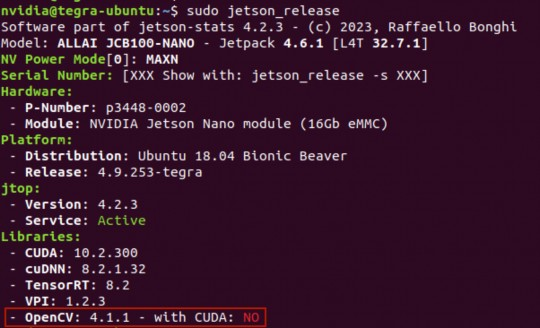

#### 성능 비교

| 항목 | CUDA 사용하지 않음 | CUDA 사용 |
|------|-------------------|-----------|
| 딥러닝 백엔드 | 없음 (기본적으로 CPU 사용) | `DNN_BACKEND_CUDA` 설정 (GPU 사용) |
| 연산 방식 | CPU에서 CNN 연산 수행 | CUDA 기반 GPU에서 CNN 연산 수행 |
| 영상 처리 | `cap.read()`로 CPU에서 직접 처리 | `cv2.cuda_GpuMat().upload(frame)`으로 GPU 메모리에 업로드 후 처리 |
| `net.forward()` 실행 위치 | CPU에서 실행됨 | GPU에서 실행됨 |
| 추론 속도 | 상대적으로 느림 (2~4 FPS) | CUDA 병렬 연산으로 속도 향상 (6~12 FPS) |
| 고해상도 영상 처리 | 프레임 크기가 커질수록 속도 저하 | CUDA 최적화로 속도 유지 |

단일 프레임 기준:
- **CUDA 미사용**: 대략 초당 **2~4 프레임**, GPU 및 GPU Shared RAM 사용량이 적음
- **CUDA 사용**: 대략 초당 **6~12 프레임**, GPU 사용률에서 확연한 차이

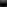


---

## OpenCV DNN - Object Detection (YOLO) 성능 비교

OpenCV의 DNN 모듈을 활용하여 **YOLOv3** 또는 **YOLOv3-tiny** 기반의 객체 검출을 수행하고, CUDA를 사용한 경우와 사용하지 않은 경우의 성능을 비교한다.

### 필요한 파일

| 파일명 | 설명 | 역할 |
|--------|------|------|
| `yolov3.weights` | 사전에 학습된 가중치(Weights) 파일 | 학습 파라미터 저장하여 추론 시 사용 |
| `yolov3.cfg` | 네트워크 구조(Architecture) 파일 | 레이어 구성, 필터 크기 등 모델 설정 정의 |
| `coco.names` | 탐지할 객체 클래스(Class) 목록 | 모델이 인식할 수 있는 객체 이름 나열 |

> 이 파일들은 실습자료로 제공되며, <https://github.com/pjreddie/darknet> 또는 <https://pjreddie.com/darknet/yolo/> 링크에서도 찾을 수 있다.

### YOLOv3 vs YOLOv3-tiny 비교

| 항목 | YOLOv3 | YOLOv3-tiny |
|------|--------|-------------|
| 모델 복잡도 | 깊고 복잡한 구조, 많은 계층과 파라미터 | 경량화된 구조, 계층과 파라미터가 적음 |
| 추론 속도 | 상대적으로 느림 | 매우 빠름 |
| 정확도 | 높은 정확도 (특히 작은 객체 검출 우수) | 다소 낮은 정확도 |
| 적용 환경 | 고성능 GPU/서버 환경, 정확도가 중요한 경우 | 임베디드, 모바일 등 실시간 처리가 필요한 경우 |

### CUDA 미사용 Object Detection

**파일 위치**: `opencv_ex/opencv_cuda/object_detector/object_detector.py`

```python
import cv2
import numpy as np
import time

net = cv2.dnn.readNet("yolov3.weights", "yolov3.cfg")
# net = cv2.dnn.readNet("yolov3-tiny.weights", "yolov3-tiny.cfg")

classes = []
with open("coco.names", "r") as f:
    classes = [line.strip() for line in f.readlines()]

layer_names = net.getLayerNames()
output_layers = [layer_names[i[0] - 1] for i in net.getUnconnectedOutLayers()]
colors = np.random.uniform(0, 255, size=(len(classes), 3))

cap = cv2.VideoCapture(0)
if not cap.isOpened():
    print("Camera open failed!")
    exit()

while True:
    start_time = time.time()
    ret, frame = cap.read()
    if not ret or frame is None:
        break

    height, width, channels = frame.shape
    blob = cv2.dnn.blobFromImage(frame, 0.00392, (416, 416), (0, 0, 0), True, crop=False)
    net.setInput(blob)
    outs = net.forward(output_layers)

    class_ids = []
    confidences = []
    boxes = []

    for out in outs:
        for detection in out:
            scores = detection[5:]
            class_id = np.argmax(scores)
            confidence = scores[class_id]
            if confidence > 0.5:
                center_x = int(detection[0] * width)
                center_y = int(detection[1] * height)
                w = int(detection[2] * width)
                h = int(detection[3] * height)
                x = int(center_x - w / 2)
                y = int(center_y - h / 2)
                boxes.append([x, y, w, h])
                confidences.append(float(confidence))
                class_ids.append(class_id)

    indexes = cv2.dnn.NMSBoxes(boxes, confidences, 0.5, 0.4)

    font = cv2.FONT_HERSHEY_PLAIN
    if len(indexes) > 0:
        for i in indexes.flatten():
            x, y, w, h = boxes[i]
            label = str(classes[class_ids[i]])
            color = colors[i % len(colors)]
            cv2.rectangle(frame, (x, y), (x + w, y + h), color, 2)
            cv2.putText(frame, f"{label}: {confidences[i]:.2f}", (x, y - 10), font, 1, color, 2)

    elapsed_time = time.time() - start_time
    fps = 1 / elapsed_time

    cv2.putText(frame, f"FPS: {fps:.2f}", (10, 60),
                cv2.FONT_HERSHEY_SIMPLEX, 1, (0, 0, 255), 2)

    cv2.namedWindow("Camera Object Detection", cv2.WINDOW_NORMAL)
    cv2.resizeWindow("Camera Object Detection", 800, 600)
    cv2.imshow("Camera Object Detection", frame)

    if cv2.waitKey(1) & 0xFF == 27:
        break

cap.release()
cv2.destroyAllWindows()
```

```bash
$ python3 object_detector.py
```

### CUDA 사용 Object Detection

**파일 위치**: `opencv_ex/opencv_cuda/object_detector/object_detector_cuda.py`

```python
import cv2
import numpy as np
import time

net = cv2.dnn.readNet("yolov3.weights", "yolov3.cfg")
# net = cv2.dnn.readNet("yolov3-tiny.weights", "yolov3-tiny.cfg")

net.setPreferableBackend(cv2.dnn.DNN_BACKEND_CUDA)
net.setPreferableTarget(cv2.dnn.DNN_TARGET_CUDA)

classes = []
with open("coco.names", "r") as f:
    classes = [line.strip() for line in f.readlines()]

layer_names = net.getLayerNames()
output_layers = [layer_names[i[0] - 1] for i in net.getUnconnectedOutLayers()]
colors = np.random.uniform(0, 255, size=(len(classes), 3))

cap = cv2.VideoCapture(0)
if not cap.isOpened():
    print("Camera open failed!")
    exit()

while True:
    start_time = time.time()
    ret, frame = cap.read()
    if not ret or frame is None:
        break

    height, width, channels = frame.shape
    blob = cv2.dnn.blobFromImage(frame, 0.00392, (416, 416), (0, 0, 0), True, crop=False)
    net.setInput(blob)
    outs = net.forward(output_layers)

    class_ids = []
    confidences = []
    boxes = []

    for out in outs:
        for detection in out:
            scores = detection[5:]
            class_id = np.argmax(scores)
            confidence = scores[class_id]
            if confidence > 0.5:
                center_x = int(detection[0] * width)
                center_y = int(detection[1] * height)
                w = int(detection[2] * width)
                h = int(detection[3] * height)
                x = int(center_x - w / 2)
                y = int(center_y - h / 2)
                boxes.append([x, y, w, h])
                confidences.append(float(confidence))
                class_ids.append(class_id)

    indexes = cv2.dnn.NMSBoxes(boxes, confidences, 0.5, 0.4)

    font = cv2.FONT_HERSHEY_PLAIN
    if len(indexes) > 0:
        for i in indexes.flatten():
            x, y, w, h = boxes[i]
            label = f"{classes[class_ids[i]]}: {confidences[i]:.2f}"
            color = colors[i % len(colors)]
            cv2.rectangle(frame, (x, y), (x + w, y + h), color, 2)
            cv2.putText(frame, label, (x, y - 10), font, 1, color, 2)

    elapsed_time = time.time() - start_time
    fps = 1 / elapsed_time

    cv2.putText(frame, f"FPS: {fps:.2f}", (10, 30), font, 2, (0, 0, 255), 2)

    cv2.namedWindow("GPU YOLO Object Detection", cv2.WINDOW_NORMAL)
    cv2.resizeWindow("GPU YOLO Object Detection", 800, 600)
    cv2.imshow("GPU YOLO Object Detection", frame)

    if cv2.waitKey(1) & 0xFF == 27:
        break

cap.release()
cv2.destroyAllWindows()
```

```bash
$ python3 object_detector_cuda.py
```

### 성능 결과

- **YOLOv3**는 모델 구조가 크고 연산량이 많아 CUDA 가속 없이 실행할 경우 실시간 처리가 어려움
- **CUDA 가속 적용** 시 GPU 병렬 연산으로 CPU 전용 실행보다 빠른 추론 속도
- Jetson Nano와 같은 임베디드 디바이스에서는 GPU 가속을 사용해도 완벽한 실시간 처리에는 미치지 못할 수 있음
- **YOLOv3-tiny**는 경량 모델로 Jetson Nano 환경에 더 적합

### YOLOv3-tiny 실행 방법

코드에서 yolov3 관련 줄을 주석 처리하고, yolov3-tiny 부분의 주석을 해제한 후 실행:

```bash
# CUDA 가속 미사용
$ python3 object_detector.py

# CUDA 가속 사용
$ python3 object_detector_cuda.py
```

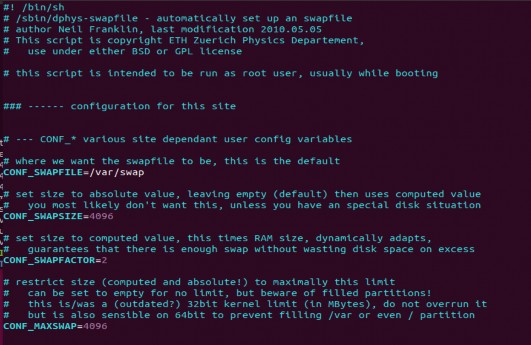


---

## 참고 자료

- [OpenCV 공식 문서](https://docs.opencv.org/)
- [OpenCV GitHub](https://github.com/opencv/opencv)
- [OpenCV 4.10.0 CMake 옵션](https://docs.opencv.org/4.10.0/db/d05/tutorial_config_reference.html)
- [OpenCV Tutorial](https://docs.opencv.org/4.x/d9/df8/tutorial_root.html)
- [YOLO: Real-Time Object Detection](https://pjreddie.com/darknet/yolo/)
- [Darknet GitHub](https://github.com/pjreddie/darknet)
