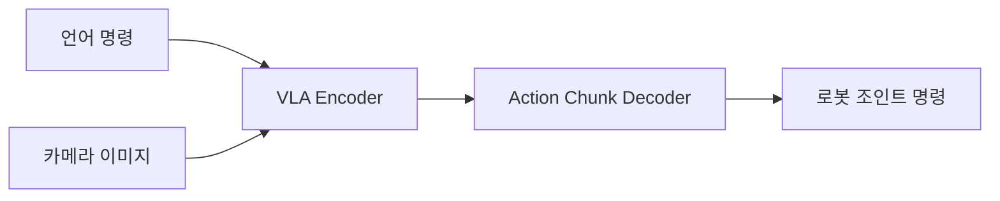

# Centrifuge Vial Pick-and-Place — Sim-to-Real 실습 프로세스

> **실습명:** Train an SO-101 Robot From Sim-to-Real With NVIDIA Isaac  
> **공식 문서:** https://docs.nvidia.com/learning/physical-ai/sim-to-real-so-101/latest/01-overview.html  
> **GitHub:** https://github.com/isaac-sim/Sim-to-Real-SO-101-Workshop  
> **최종 목표:** Vision-Language-Action (VLA) 모델을 훈련시켜 SO-101 로봇 팔이 **시뮬레이션 → 실제 환경**에서 원심분리관 바이알을 집어 랙에 꽂는 태스크를 수행하도록 하는 것

[SO-101 Robot](https://github.com/TheRobotStudio/SO-ARM100)

---

## 📋 목차

1. [개요 — Overview](#1-개요--overview)
2. [사전 준비 — How to Take This Course](#2-사전-준비--how-to-take-this-course)
3. [Sim-to-Real 기초 이론](#3-sim-to-real-기초-이론)
4. [LeRobot 배경 및 커뮤니티](#4-lerobot-배경-및-커뮤니티)
5. [작업 공간 구축 — Building the Workspace](#5-작업-공간-구축--building-the-workspace)
6. [코드 및 모델 다운로드 — Get the Code and Models](#6-코드-및-모델-다운로드--get-the-code-and-models)
7. [SO-101 캘리브레이션 — Calibrating the SO-101](#7-so-101-캘리브레이션--calibrating-the-so-101)
8. [SO-101 조작 및 텔레옵 — Operating the SO-101](#8-so-101-조작-및-텔레옵--operating-the-so-101)
9. [Strategy 1: Domain Randomization (DR) + Sim Teleop](#9-strategy-1-domain-randomization-dr--sim-teleop)
10. [Isaac GR00T: VLA 모델 훈련](#10-isaac-gr00t-vla-모델-훈련)
11. [Sim Evaluation — 시뮬레이션 평가](#11-sim-evaluation--시뮬레이션-평가)
12. [Real Evaluation — 실제 로봇 평가](#12-real-evaluation--실제-로봇-평가)
13. [Strategy 2: Co-Training With Real Data](#13-strategy-2-co-training-with-real-data)
14. [Strategy 3: Cosmos Augmentation](#14-strategy-3-cosmos-augmentation)
15. [Strategy 4: SAGE + GapONet](#15-strategy-4-sage--gaponet)
16. [결론 — Conclusion](#16-결론--conclusion)

---

## 1. 개요 — Overview

### 태스크

SO-101 로봇 팔이 책상 위에 놓인 **투명 원심분리관 바이알(50ml)** 을 집어 **노란색 랙**에 꽂는 **Pick-and-Place** 태스크를 수행한다.

### 핵심 워크플로우

```
Robot Calibration → Domain Randomization → Sim Teleoperation
→ Data Collection → GR00T VLA Training → Sim Evaluation
→ Real Robot Evaluation → Co-Training → Cosmos Augmentation
→ SAGE + GapONet (Actuation Gap 측정 및 보정)
```

### 학습 목표

| # | 목표 |
|---|------|
| 1 | SO-101 로봇을 sim-to-real 실험에 맞게 구성 및 캘리브레이션 |
| 2 | 텔레옵을 통한 데모 데이터 수집 및 Domain Randomization 증강 |
| 3 | GR00T를 이용한 VLA 모델 훈련 |
| 4 | 시뮬레이션에서 훈련된 정책(Policy) 평가 |
| 5 | 실제 로봇에 정책 배포 및 sim-to-real 갭 관찰 |
| 6 | 4가지 Sim-to-Real 전략 적용: DR, Co-training, Cosmos, SAGE+GapONet |

---

## 2. 사전 준비 — How to Take This Course

### 학습 방식 선택

| 옵션 | 설명 | 난이도 |
|------|------|--------|
| **As-Is** | 제공된 프리트레인 체크포인트와 데이터셋 사용 | ⭐ (가장 빠름) |
| **Use Your Own Data** | 직접 텔레옵으로 데이터 수집 + 모델 훈련 | ⭐⭐ |
| **Bring Your Own Task** | 공간은 동일하게 구성하고 props/태스크만 변경 | ⭐⭐⭐ |
| **Going Further** | 라이트박스 제거, 통제되지 않은 환경에서 실행 | ⭐⭐⭐⭐ |

### 컴퓨터 하드웨어 요구사항

| 구성 요소 | 사양 |
|----------|------|
| **GPU** | NVIDIA RTX 5090 Laptop / RTX PRO 6000 Blackwell 이상 (Ada or Blackwell Arch) |
| **RAM** | 64GB 이상 권장 |
| **OS** | Ubuntu Linux 24.04 |
| **기타** | Docker, NVIDIA GPU Driver, CUDA |

### 로봇 하드웨어 사양

> 자세한 내용은 **Building the Workspace** 모듈 참조.

| 항목 | 설명 |
|------|------|
| **Follower Arm (메인 로봇)** | SO-101 (또는 SO-100), gripper camera 내장 권장 |
| **Leader Arm (텔레옵 암)** | SO-101 Leader, 5V 전원 |
| **카메라** | Gripper Camera (손목), External Camera (전면, Intel RealSense D455 등) |

---

## 3. Sim-to-Real 기초 이론

### Sim-to-Real 갭이란?

시뮬레이션에서 완벽하게 훈련된 정책(policy)이 실제 환경에서 동일한 성능을 내지 못하는 현상. 원인:

- **Visuomotor차이**: 조명, 텍스처, 카메라 노이즈
- **Actuation Gap**: 모터 토크, 마찰, 백래시 등 실제 물리 차이
- **환경 차이**: 바닥 재질, 물체 위치 분포 등

### 4가지 전략 개요

| 전략 | 접근법 | 목적 |
|------|--------|------|
| **1. Domain Randomization** | 시뮬레이션 파라미터 무작위화 | 정책의 강건성 확보 |
| **2. Co-Training** | 시뮬레이션 + 실제 데이터 혼합 학습 | 현실 분포 반영 |
| **3. Cosmos Augmentation** | Cosmos World Foundation Model로 합성 데이터 생성 | 데이터 다양성 극대화 |
| **4. SAGE + GapONet** | Actuation Gap 측정 및 신경망 보정 | 물리적 차이 보정 |

---

## 4. LeRobot 배경 및 커뮤니티

- **LeRobot**: Hugging Face의 오픈소스 로봇 학습 프레임워크
- 데이터셋, 모델, 시뮬레이션 환경을 표준화
- SO-101 로봇의 캘리브레이션, 텔레옵, 데이터 수집에 LeRobot API 사용
- Hugging Face Hub를 통한 데이터셋/모델 공유

---

## 5. 작업 공간 구축 — Building the Workspace

### 구성 요소

```
┌─────────────────────────────────────┐
│          라이트박스 (Lightbox)        │
│  ┌───────────────────────────────┐  │
│  │                               │  │
│  │   External Camera (전면)       │  │
│  │         ┌────┐               │  │
│  │  바이알  │ 랙 │  SO-101 Robot  │  │
│  │  ○ ○ ○  │ ██ │  (Gripper Cam) │  │
│  │         └────┘               │  │
│  │     ─── 폼 매트 (Foam Mat) ──  │  │
│  └───────────────────────────────┘  │
└─────────────────────────────────────┘
```

### 주요 부품 목록 (Bill of Materials)

| 부품 | 설명 |
|------|------|
| **SO-101 로봇 팔** | Pre-assembled 권장. Gripper camera 포함된 키트 |
| **SO-101 Leader Arm (텔레옵)** | 5V 전원, 데모 녹화용 |
| **라이트박스 (Lightbox)** | 60cm × 60cm 내외, LED 조명 균일하게 |
| **폼 매트 (Foam Mat)** | 논슬립, 진한 색상 (시뮬레이션 환경과 일치) |
| **원심분리관 바이알** | 50ml, 투명 플라스틱, 스크류 캡 |
| **노란색 랙** | 3~6홀, 바이알 고정 가능 |
| **External Camera** | Intel RealSense D455 등 |
| **Gripper Camera (내장)** | SO-101 그리퍼에 장착된 카메라 |
| **USB 케이블** | 로봇-컴퓨터 연결 |

### 공간 표준화 포인트

- 라이트박스 위치, 조명 밝기, 카메라 각도 고정
- 폼 매트 위치, 바이알/랙 초기 위치 지정
- 실제 환경을 Isaac Lab 시뮬레이션 씬과 최대한 일치시킴

---

## 6. 코드 및 모델 다운로드 — Get the Code and Models

### 저장소 클론

```bash
git clone https://github.com/isaac-sim/Sim-to-Real-SO-101-Workshop.git
cd Sim-to-Real-SO-101-Workshop
```

### Docker 이미지

두 개의 Docker 이미지 사용:

| 컨테이너 | 용도 |
|----------|------|
| **`teleop-docker`** | 시뮬레이션 텔레옵, 시뮬레이션 평가 |
| **`real-robot`** | GR00T 정책 서버, 실제 로봇 평가 |

> Docker 이미지는 `docker/` 디렉토리의 Dockerfile로 빌드하거나 제공된 이미지 사용.

### 모델 다운로드 (Hugging Face)

필요한 디렉토리 생성:

```bash
mkdir -p models
```

| 체크포인트 | 설명 |
|-----------|------|
| `aravindhs-NV/grootn16-finetune_sreetz-so101_teleop_vials_rack_left` | DR only (75 sim episodes) |
| `aravindhs-NV/grootn16-finetune_sreetz-so101_teleop_vials_rack_left_sim_and_real` | Co-training (sim + 5 real) |
| `aravindhs-NV/sreetz-so101_teleop_vials_rack_left_augment_02` | DR augment |
| `aravindhs-NV/so100-orig-groot-vials-rack-left-cosmos-70` | Cosmos augment |

```bash
# 예시
hf download aravindhs-NV/grootn16-finetune_sreetz-so101_teleop_vials_rack_left \
  --local-dir ./models/aravindhs-NV/grootn16-finetune_sreetz-so101_teleop_vials_rack_left
```

### 데이터셋 다운로드

시뮬레이션 수집 데모 데이터셋도 Hugging Face에서 제공.

### Isaac Lab 태스크 목록

| 태스크 ID | 설명 |
|-----------|------|
| `Lerobot-So101-Teleop-Base` | 텔레옵 디버그 |
| `Lerobot-So101-Teleop-Task` | 라이트박스, 카메라 테스트 |
| `Lerobot-So101-Teleop-Vials-To-Rack` | **메인 태스크** — 바이알 → 랙 |
| `Lerobot-So101-Teleop-Vials-To-Rack-DR` | DR 적용 버전 |
| `Lerobot-So101-Teleop-Vials-To-Rack-Eval` | 평가용 (DR 없음, 고정 환경) |
| `Lerobot-So101-Teleop-Vials-To-Rack-DR-Eval` | DR 평가용 |

---

## 7. SO-101 캘리브레이션 — Calibrating the SO-101

### 사전 준비

- 물리적 SO-101 로봇, 텔레옵 암, USB 케이블 연결
- Building the Workspace에서 구성한 작업 공간 유지
- Docker 설치 및 NVIDIA GPU Driver 확인

### 캘리브레이션 전 확인

```bash
# 모든 케이블 연결 확인
# 텔레옵 암 (5V 전원) ↔ Follower (12V 전원) 각각 연결
# 전원 LED 확인 (로봇 후면 컨트롤 보드)
```

### Docker 컨테이너 실행 (teleop-docker)

```bash
xhost +
docker run --name teleop -it --privileged --gpus all -e "ACCEPT_EULA=Y" --rm --network=host \
  -e "PRIVACY_CONSENT=Y" \
  -e DISPLAY \
  -v /dev:/dev \
  -v /run/udev:/run/udev:ro \
  -v $HOME/.Xauthority:/root/.Xauthority \
  -v ~/docker/isaac-sim/cache/kit:/isaac-sim/kit/cache:rw \
  -v ~/docker/isaac-sim/cache/ov:/root/.cache/ov:rw \
  -v ~/docker/isaac-sim/cache/pip:/root/.cache/pip:rw \
  -v ~/docker/isaac-sim/cache/glcache:/root/.cache/nvidia/GLCache:rw \
  -v ~/docker/isaac-sim/cache/computecache:/root/.nv/ComputeCache:rw \
  -v ~/docker/isaac-sim/logs:/root/.nvidia-omniverse/logs:rw \
  -v ~/docker/isaac-sim/data:/root/.local/share/ov/data:rw \
  -v ~/docker/isaac-sim/documents:/root/Documents:rw \
  -v ~/.cache/huggingface/lerobot/calibration:/root/.cache/huggingface/lerobot/calibration \
  -v ~/sim2real/Sim-to-Real-SO-101-Workshop/docker/env:/root/env \
  -v ~/sim2real/Sim-to-Real-SO-101-Workshop:/workspace/Sim-to-Real-SO-101-Workshop \
  teleop-docker:latest
```

### 포트 찾기

컨테이너 내부에서 실행:

```bash
# USB 케이블 분리 후 Enter → 연결 후 Enter → 포트 출력
# 예: /dev/ttyACM0
```

환경 변수 설정:

```bash
setenv TELEOP_PORT=/dev/ttyACM0    # 실제 출력 포트로 변경
setenv TELEOP_ID=orange_teleop
setenv ROBOT_PORT=/dev/ttyACM1     # 실제 출력 포트로 변경
setenv ROBOT_ID=orange_follower
```

### Leader Arm (텔레옵) 캘리브레이션

```bash
lerobot-calibrate \
  --teleop.type=so101_leader \
  --teleop.port=$TELEOP_PORT \
  --teleop.id=$TELEOP_ID
```

**절차:**
1. 각 조인트를 중간 범위(middle-of-range)로 이동
2. 각 조인트를 전체 가동 범위(full range of motion)로 이동
3. 소프트웨어가 조인트 한계값을 기록

### Follower Arm (로봇) 캘리브레이션

```bash
lerobot-calibrate \
  --robot.type=so101_follower \
  --robot.port=$ROBOT_PORT \
  --robot.id=$ROBOT_ID
```

**절차:**
- 동일하게 각 조인트를 중간 → 전체 범위로 이동

---

## 8. SO-101 조작 및 텔레옵 — Operating the SO-101

### 사전 조건

- 캘리브레이션 완료
- Docker 컨테이너 실행 중
- 환경 변수 (`TELEOP_PORT`, `ROBOT_PORT` 등) 설정 완료

### 실제 로봇 텔레옵

```bash
lerobot-teleoperate \
  --robot.type=so101_follower \
  --robot.port=$ROBOT_PORT \
  --robot.id=$ROBOT_ID \
  --teleop.type=so101_leader \
  --teleop.port=$TELEOP_PORT \
  --teleop.id=$TELEOP_ID
```

**실행 순서:**
1. 두 암(Leader/Follower)을 비슷한 자세로 시작
2. Leader Arm을 움직이면 Follower Arm이 따라 움직임
3. 바이알을 집어서 랙에 넣는 동작 연습
4. Ctrl+C로 종료

### 카메라 설정

각 작업 공간에는 두 대의 카메라 사용:

| 카메라 | 위치 | 용도 |
|--------|------|------|
| **Gripper Camera (손목)** | 로봇 그리퍼에 장착 | Ego view, 바이알 근접 인식 |
| **External Camera (전면)** | 작업 공간 전면 | 외부 시점, 전체 상황 인식 |

### Rerun 디버깅

텔레옵 중 Rerun 시각화 도구를 통해 실시간 카메라 피드와 로봇 상태 확인 가능.

---

## 9. Strategy 1: Domain Randomization (DR) + Sim Teleop

### Domain Randomization 이론

**핵심 아이디어:** 시뮬레이션을 현실과 완벽히 일치시키는 대신, 훈련 중 시뮬레이션 파라미터를 무작위화하여 정책이 다양한 환경 변화에 강건해지도록 함.

> *"Make the simulation so varied that the real world looks like just another variation."*

### DR 파라미터 예시

| 파라미터 | 무작위화 범위 |
|----------|--------------|
| 환경 조명 (Dome Light) | 노출, 색온도, HDRI 텍스처 |
| 카메라 포즈 | 위치/회전 미세 오프셋 (± 몇 cm/도) |
| 바이알 위치 | 매 에피소드마다 랜덤 배치 |
| 랙 위치 | x, y, z 미세 변동 |
| 로봇 색상 | 고정 오렌지 vs 기타 |
| 폼 매트 텍스처/패턴 | DR 모드에서 가변 |

### Sim Teleop 실행

DR 없이:
```bash
lerobot_agent --task Lerobot-So101-Teleop-Vials-To-Rack
```

DR 적용:
```bash
lerobot_agent --task Lerobot-So101-Teleop-Vials-To-Rack-DR
```

### 데이터 수집

- DR을 적용한 상태에서 Leader Arm으로 시뮬레이션 로봇 조종
- 각 에피소드(episode)는 환경 리셋 → DR 파라미터 재설정 → 데모 녹화
- **75개 에피소드** 수집 권장 (각 1-2회 Pick-and-Place)
- 최대 효과를 위해 여러 세션에 걸쳐 수집

### DR 코드 구조 (Isaac Lab)

Isaac Lab 환경은 `reset` 이벤트 핸들러를 통해 DR 구현:

```python
# randomize_dome_light: 돔 라이트 노출/색온도/HDRI 무작위화
# randomize_camera_pose: 외부 카메라 위치/회전 오프셋
# reset_vials_rack: 바이알/랙 위치 무작위화
```

---

## 10. Isaac GR00T: VLA 모델 훈련

### 개요

**GR00T (NVIDIA Isaac GR00T)** 는 오픈소스 Vision-Language-Action (VLA) 모델로, 멀티모달 입력(언어 + 이미지)을 받아 로봇 조작 동작을 출력한다.

### 훈련 파이프라인

```
데모 데이터셋 (LeRobot 형식)
       ↓
GR00T Fine-tuning (LoRA or Full)
       ↓
체크포인트 저장 (Hugging Face Hub)
       ↓
정책 서버 (ZMQ Server) → 클라이언트 (로봇/시뮬레이터)
```

### 모델 아키텍처 (간략)



### 제공된 체크포인트

| 체크포인트 | 훈련 데이터 | 비고 |
|-----------|-----------|------|
| `grootn16-finetune_sreetz-so101_teleop_vials_rack_left` | 75 sim episodes w/ DR | Strategy 1 |
| `grootn16-finetune_sreetz-so101_teleop_vials_rack_left_sim_and_real` | sim + 5 real episodes | Strategy 2 |
| `so100-orig-groot-vials-rack-left-cosmos-70` | 75 sim + 70 Cosmos-aug | Strategy 3 |
| `sreetz-so101_teleop_vials_rack_left_augment_02` | DR augment | 추가 실험 |

---

## 11. Sim Evaluation — 시뮬레이션 평가

### 평가 구조

```
Terminal 1 (real-robot container)      Terminal 2 (teleop-docker)
┌─────────────────────────┐            ┌────────────────────────┐
│  GR00T Policy Server    │ ←── ZMQ ──│  Isaac Lab Client      │
│  (model inference)      │            │  (시뮬레이션 환경)     │
│  port 5555              │            │  lerobot_eval 명령     │
└─────────────────────────┘            └────────────────────────┘
```

### Step 1: 정책 서버 실행 (Terminal 1)

```bash
# real-robot 컨테이너 실행
xhost +
docker run -it --rm --name real-robot --network host --privileged --gpus all \
  -e DISPLAY \
  -v /dev:/dev \
  -v /run/udev:/run/udev:ro \
  -v $HOME/.Xauthority:/root/.Xauthority \
  -v /tmp/.X11-unix:/tmp/.X11-unix \
  -v ~/.cache/huggingface/lerobot/calibration:/root/.cache/huggingface/lerobot/calibration \
  -v ~/sim2real/models:/workspace/models \
  -v ~/sim2real/Sim-to-Real-SO-101-Workshop/docker/env:/root/env \
  -v ~/sim2real/Sim-to-Real-SO-101-Workshop/docker/real/scripts:/Isaac-GR00T/gr00t/eval/real_robot/SO100 \
  real-robot \
  /bin/bash
```

컨테이너 내부:

```bash
# 평가할 모델 설정 (Strategy 1: DR only)
export MODEL=aravindhs-NV/grootn16-finetune_sreetz-so101_teleop_vials_rack_left/checkpoint-10000

# 정책 서버 실행
python Isaac-GR00T/gr00t/eval/run_gr00t_server.py \
  --model-path /workspace/models/$MODEL
```

### Step 2: 평가 롤아웃 실행 (Terminal 2, teleop-docker)

```bash
lerobot_eval \
  --task Lerobot-So101-Teleop-Vials-To-Rack-Eval \
  --rename_map '{"external_D455": "front", "ego": "wrist"}' \
  --action_horizon 16 \
  --lang_instruction "Pick up the vial and place it in the yellow rack"
```

### 평가 포인트

| 비교 항목 | 조건 |
|----------|------|
| **DR 없이 평가** | `Lerobot-So101-Teleop-Vials-To-Rack-Eval` |
| **DR 적용 평가** | `Lerobot-So101-Teleop-Vials-To-Rack-DR-Eval` |
| **75 vs 100 에피소드 비교** | 데이터 양에 따른 성능 차이 관찰 |
| **성공률 (Success Rate)** | 바이알을 랙에 성공적으로 넣은 비율 |

---

## 12. Real Evaluation — 실제 로봇 평가

### 평가 구조 (Sim Evaluation과 동일한 GR00T Server-Client)

```
Terminal 1 (real-robot container)      Terminal 2 (실제 로봇)
┌─────────────────────────┐            ┌──────────────────────────┐
│  GR00T Policy Server    │ ←── ZMQ ──│  so101_eval.py 실행      │
│  (model inference)      │            │  → 실제 SO-101 제어      │
│  port 5555              │            │  → 카메라 피드 전송      │
└─────────────────────────┘            └──────────────────────────┘
```

### Step 1: 정책 서버 실행 (Terminal 1)

Sim Evaluation과 동일한 방식으로 서버 실행. (같은 모델 사용)

```bash
# real-robot container 실행
# ... (docker run 명령어 동일)

export MODEL=aravindhs-NV/grootn16-finetune_sreetz-so101_teleop_vials_rack_left/checkpoint-10000

python Isaac-GR00T/gr00t/eval/run_gr00t_server.py \
  --model-path /workspace/models/$MODEL
```

### Step 2: 평가 롤아웃 실행 (Terminal 2, 실제 로봇)

```bash
python Isaac-GR00T/gr00t/eval/real_robot/SO100/so101_eval.py \
  --robot.type=so101_follower \
  --robot.port="$ROBOT_PORT" \
  --robot.id="$ROBOT_ID" \
  --robot.cameras="{
      wrist:  {type: opencv, index_or_path: $CAMERA_GRIPPER, width: 640, height: 480, fps: 30},
      front:  {type: opencv, index_or_path: $CAMERA_EXTERNAL, width: 640, height: 480, fps: 30}
  }" \
  --policy_host=localhost \
  --policy_port=5555 \
  --lang_instruction="Pick up the vial and place it in the yellow rack" \
  --rerun True
```

### 관찰 포인트

| 증상 | 설명 |
|------|------|
| **Sim-to-Real 갭 체험** | 시뮬레이션에서는 잘 동작하던 정책이 실제에서는 실패 |
| **일반적인 실패 모드** | 바이알을 놓침, 그리퍼가 빗나감, 잘못된 위치로 이동 |
| **비전 갭** | 실제 조명/텍스처가 훈련된 분포와 다름 |
| **Actuation 갭** | 실제 모터 응답이 시뮬레이션과 다름 |

---

## 13. Strategy 2: Co-Training With Real Data

### 이론

실제 데이터를 약간(5 에피소드)만 추가해도 sim-to-real 전이 성능이 크게 향상됨.

| 데이터 소스 | 장점 | 단점 |
|-----------|------|------|
| **Sim only** | 대량 수집 가능 | 현실 분포와 불일치 |
| **Real only** | 실제 분포 일치 | 소량만 수집 가능 |
| **Co-training** | 두 장점 결합 | 데이터 파이프라인 복잡 |

### 실제 데모 수집 (선택 사항)

```bash
# 텔레옵으로 5 에피소드 실제 데모 수집
lerobot-teleoperate \
  --robot.type=so101_follower \
  --robot.port=$ROBOT_PORT \
  --robot.id=$ROBOT_ID \
  --teleop.type=so101_leader \
  --teleop.port=$TELEOP_PORT \
  --teleop.id=$TELEOP_ID \
  --dataset.num_episodes 5 \
  --dataset.single_task="Pick up the vial and place it in the yellow rack"
```

데이터 수집 후 Hugging Face Hub 업로드:

```bash
hf upload ${HF_USER}/so101-teleop-vials-to-rack-real ./outputs/...
```

### Co-trained 모델 배포

**정책 서버 (Terminal 1):**

```bash
export MODEL=aravindhs-NV/grootn16-finetune_sreetz-so101_teleop_vials_rack_left_sim_and_real/checkpoint-10000

python Isaac-GR00T/gr00t/eval/run_gr00t_server.py \
  --model-path /workspace/models/$MODEL
```

**평가 클라이언트 (Terminal 2):**

```bash
python Isaac-GR00T/gr00t/eval/real_robot/SO100/so101_eval.py \
  --robot.type=so101_follower \
  --robot.port="$ROBOT_PORT" \
  --robot.id="$ROBOT_ID" \
  --robot.cameras="{...}" \
  --policy_host=localhost \
  --policy_port=5555 \
  --lang_instruction="Pick up the vial and place it in the yellow rack" \
  --rerun True
```

### Key Takeaways

- Sim+Real Co-training이 Sim-only보다 실제 환경에서 더 나은 성능
- 안전이 최우선 — 실제 로봇 배포 시 반드시 비상 정지 버튼 확인
- 실패 모드를 체계적으로 기록 → 다음 전략 개선에 활용

---

## 14. Strategy 3: Cosmos Augmentation

### Cosmos 개요

**Cosmos**는 NVIDIA의 World Foundation Model로, 입력 비디오와 프롬프트를 기반으로 현실적인 물리 시뮬레이션을 가진 새로운 비디오 시퀀스를 생성한다.

### 동작 원리

```
입력: 로봇 데모 비디오 + 텍스트 프롬프트
     "Same task, different lighting, different vial positions"
            ↓
     Cosmos World Foundation Model
            ↓
출력: 다양한 조건에서의 증강된 훈련 데이터
      (동일한 물리 상호작용, 새로운 시각적 외관)
```

### Cosmos 증강 데이터 사용

제공된 Cosmos 증강 체크포인트로 정책 서버 실행:

```bash
# 75 sim + 70 Cosmos-augmented episodes
export MODEL=aravindhs-NV/so100-orig-groot-vials-rack-left-cosmos-70

python Isaac-GR00T/gr00t/eval/run_gr00t_server.py \
  --model-path /workspace/models/$MODEL
```

### Cosmos 증강 vs DR 비교

| 비교 항목 | DR | Cosmos |
|-----------|-----|--------|
| **변경 방식** | 시뮬레이션 파라미터 무작위화 | 생성형 AI로 새 프레임 합성 |
| **물리 일관성** | 완전 물리 시뮬레이션 | 생성 모델에 의존 |
| **데이터 다양성** | 제한된 파라미터 공간 | 거의 무한한 변형 가능 |
| **현실감** | 시뮬레이션 특유의 인공감 | 실제같은 비주얼 생성 가능 |

---

## 15. Strategy 4: SAGE + GapONet

### 개요

**SAGE (Sim-to-Real Actuation Gap Estimation)**: 실제 로봇과 시뮬레이션 간의 **Actuation Gap**을 체계적으로 측정하고 시각화하는 프레임워크.

**GapONet**: Actuation Gap을 보정하기 위한 신경망 모델.

### SAGE 파이프라인

```
1. Collect sim data
   ─ 시뮬레이션에서 모션 트라젝토리 기록

2. Collect real robot data
   ─ 동일한 모션을 실제 로봇에서 실행하여 기록
   ─ SO-101의 경우 8시간 분량 트라젝토리 데이터 수집

3. Train gap-bridging model (GapONet)
   ─ Sim vs Real 간의 차이를 학습하는 신경망

4. Visualize the gap
   ─ 조인트별 오차 시각화
   ─ 시뮬레이션에 GapONet 적용 전/후 비교
```

### 결과 시각화

**정성적 비교 (Isaac Sim에서 오버레이):**
- Top: Real result vs Sim **without** GapONet → 큰 차이
- Bottom: Real result vs Sim **with** GapONet → 거의 일치

**정량적 비교 (조인트별 오차):**
- Orange bars: GapONet 없이 Sim vs Real 오차
- Green bars: GapONet 적용 후 오차 → 현저히 감소

### GapONet 적용 방법

| 방식 | 설명 |
|------|------|
| **Sim-side 보정** | 시뮬레이션의 액추에이터 모델을 GapONet으로 대체 → Sim이 Real에 더 가까워짐 |
| **Real-side 보정** | 실제 로봇 추론 시 GapONet으로 action 보정 → Policy의 action을 실행 전에 수정 |

> 현재 GR00T + GapONet 통합은 진행 중 (Future Work)

---

## 16. 결론 — Conclusion

### 여정 요약

```
Simulation (Isaac Lab)
     │
     ├── Strategy 1: Domain Randomization
     │     → DR-augmented sim data로 VLA 훈련
     │
     ├── Strategy 2: Co-Training
     │     → 소량의 실제 데이터 추가로 큰 성능 향상
     │
     ├── Strategy 3: Cosmos Augmentation
     │     → World Foundation Model로 합성 데이터 생성
     │
     └── Strategy 4: SAGE + GapONet
           → Actuation Gap 측정 및 신경망 보정
     
실제 로봇 배포 → Sim-to-Real 갭 극복
```

### 핵심 교훈

| 교훈 | 내용 |
|------|------|
| **Sim-to-Real 갭은 실재한다** | 시뮬레이션 성능 ≠ 실제 성능 |
| **DR은 강력한 기반 전략** | 간단하지만 효과적인 첫 번째 방어선 |
| **소량의 실제 데이터도 큰 효과** | Co-training이 Sim-only보다 월등 |
| **생성형 AI가 데이터 증강** | Cosmos로 무한한 변형 데이터 생성 가능 |
| **Actuation Gap도 정량화 가능** | SAGE + GapONet으로 측정 및 보정 |
| **전략 조합이 최선** | 단일 전략보다 여러 전략의 조합이 가장 효과적 |

---

## 부록: Docker 명령어 요약

### teleop-docker (시뮬레이션)

```bash
xhost +
docker run --name teleop -it --privileged --gpus all -e "ACCEPT_EULA=Y" --rm --network=host \
  -e "PRIVACY_CONSENT=Y" -e DISPLAY \
  -v /dev:/dev -v /run/udev:/run/udev:ro \
  -v $HOME/.Xauthority:/root/.Xauthority \
  -v ~/docker/isaac-sim/cache/kit:/isaac-sim/kit/cache:rw \
  -v ~/docker/isaac-sim/cache/ov:/root/.cache/ov:rw \
  -v ~/docker/isaac-sim/cache/pip:/root/.cache/pip:rw \
  -v ~/docker/isaac-sim/cache/glcache:/root/.cache/nvidia/GLCache:rw \
  -v ~/docker/isaac-sim/cache/computecache:/root/.nv/ComputeCache:rw \
  -v ~/docker/isaac-sim/logs:/root/.nvidia-omniverse/logs:rw \
  -v ~/docker/isaac-sim/data:/root/.local/share/ov/data:rw \
  -v ~/docker/isaac-sim/documents:/root/Documents:rw \
  -v ~/.cache/huggingface/lerobot/calibration:/root/.cache/huggingface/lerobot/calibration \
  -v ~/sim2real/Sim-to-Real-SO-101-Workshop/docker/env:/root/env \
  -v ~/sim2real/Sim-to-Real-SO-101-Workshop:/workspace/Sim-to-Real-SO-101-Workshop \
  teleop-docker:latest
```

### real-robot container (GR00T 정책 서버 + 실제 로봇 평가)

```bash
xhost +
docker run -it --rm --name real-robot --network host --privileged --gpus all \
  -e DISPLAY \
  -v /dev:/dev -v /run/udev:/run/udev:ro \
  -v $HOME/.Xauthority:/root/.Xauthority \
  -v /tmp/.X11-unix:/tmp/.X11-unix \
  -v ~/.cache/huggingface/lerobot/calibration:/root/.cache/huggingface/lerobot/calibration \
  -v ~/sim2real/models:/workspace/models \
  -v ~/sim2real/Sim-to-Real-SO-101-Workshop/docker/env:/root/env \
  -v ~/sim2real/Sim-to-Real-SO-101-Workshop/docker/real/scripts:/Isaac-GR00T/gr00t/eval/real_robot/SO100 \
  real-robot \
  /bin/bash
```

---

## 부록: Isaac Lab 태스크 목록

| 태스크 이름 | 설명 |
|-------------|------|
| `Lerobot-So101-Teleop-Base` | 기본 텔레옵 디버그 |
| `Lerobot-So101-Teleop-Task` | 라이트박스 + 카메라 포함 |
| `Lerobot-So101-Teleop-Vials-To-Rack` | **메인 태스크** |
| `Lerobot-So101-Teleop-Vials-To-Rack-DR` | DR 적용 텔레옵 |
| `Lerobot-So101-Teleop-Vials-To-Rack-Eval` | 고정 환경 평가 |
| `Lerobot-So101-Teleop-Vials-To-Rack-DR-Eval` | DR 평가 |

### lerobot_agent 명령어

```bash
# 텔레옵 (데모 수집)
lerobot_agent --task Lerobot-So101-Teleop-Vials-To-Rack
# or with DR
lerobot_agent --task Lerobot-So101-Teleop-Vials-To-Rack-DR

# 평가
lerobot_eval --task Lerobot-So101-Teleop-Vials-To-Rack-Eval \
  --rename_map '{"external_D455": "front", "ego": "wrist"}' \
  --action_horizon 16 \
  --lang_instruction "Pick up the vial and place it in the yellow rack"
```

---

## 부록: 참고 자료

| 자료 | 링크 |
|------|------|
| 공식 문서 | https://docs.nvidia.com/learning/physical-ai/sim-to-real-so-101/latest/ |
| GitHub 저장소 | https://github.com/isaac-sim/Sim-to-Real-SO-101-Workshop |
| Isaac GR00T | https://github.com/NVIDIA/Isaac-GR00T |
| 동영상 재생목록 | https://www.youtube.com/watch?v=3TL3ALQxQX8&list=PL2bKqBZg-pzVQspO8-wieuIFctBdz_Tr_ |
| Hugging Face 모델 | https://huggingface.co/aravindhs-NV |
| LeRobot | https://github.com/huggingface/lerobot |
| Discord (NVIDIA Omniverse) | https://discord.gg/nvidiaomniverse |
