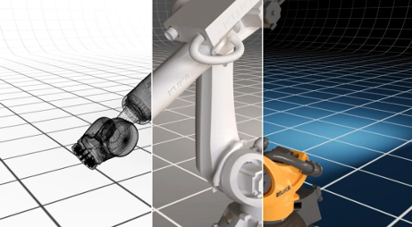
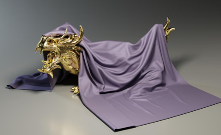
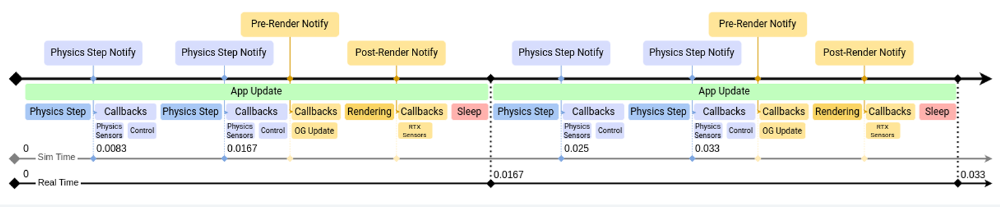
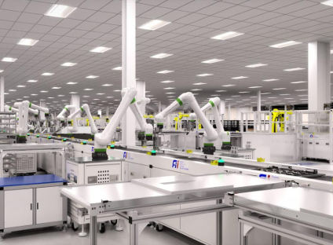
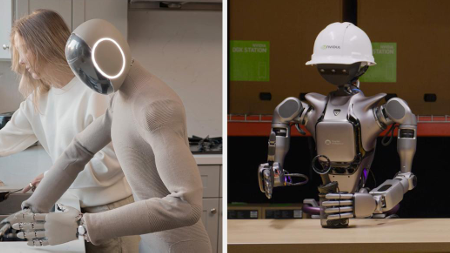
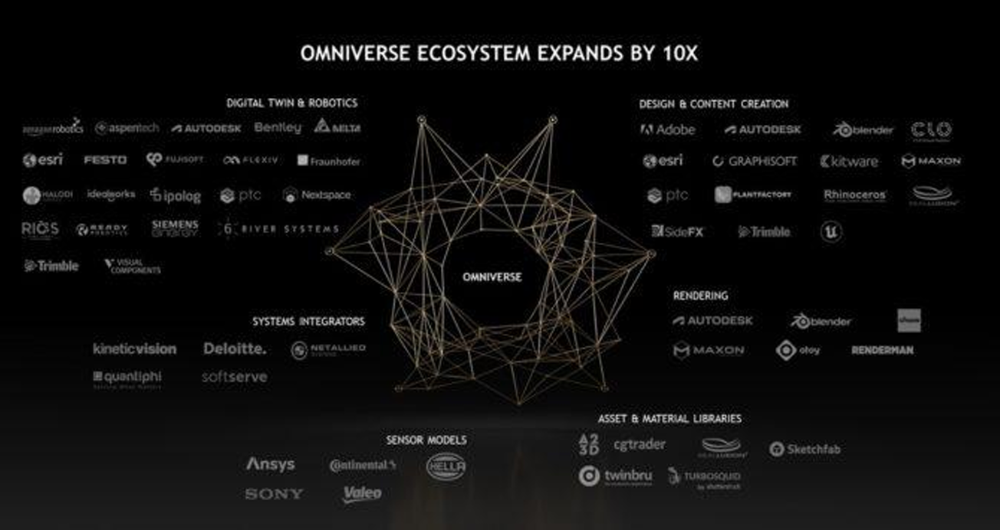
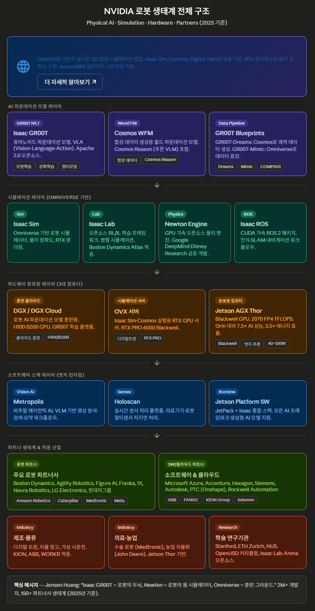

# Physical AI & NVIDIA Omniverse / OpenUSD Overview

## Introduction

### Foundations - Physical AI Trends

- **Physical AI** - AI that understands and interacts with the physical world
- **OpenUSD** - Universal Scene Description, a framework for 3D scene description
- **Isaac Sim** - NVIDIA's robotics simulation platform
  - Isaac Sim core essentials
  - Basic Tutorial
  - CAD to Sim → Robot Rigging → Task Control
- **World Model / NVIDIA Cosmos** - World modeling and synthetic data generation

### Hands On

- **Train an SO-101 Robot From Sim-to-Real With NVIDIA Isaac**

### Physical AI Trends

> F.03 Livestream - Day 5
>
> Watch a team of humanoid robots running a full 100+ Hour shift at human performance levels. This is fully autonomous running Helix-02.

---

## Three Core Pillars

### Graphics

| Concept | Description |
|---|---|
| **OpenUSD (Universal Scene Description)** | Framework for graphics definition and pipeline construction |
| **OMNIVERSE CAD Converter** | Converts industrial designs into SimReady Assets |



### Physics

| Concept | Description |
|---|---|
| **NVIDIA Warp** | Framework for writing differentiable physics kernels |
| **CUDA Acceleration** | GPU kernel optimization for hardware utilization |
| **Mechanics Modeling** | Statics and dynamics in robot implementation within simulation |



### Software

| Concept | Description |
|---|---|
| **Basic Coding Experience** | Fundamental coding including deep learning frameworks |
| **Simulation Step & Loop** | Understanding physics engine stepping |
| **Lifecycle** | Creation and destruction of simulation objects |



---

## Traditional Robotics vs Physical AI

| Traditional Robotics | Robots with Physical AI |
|---|---|
| Rule-based execution | Policy-based execution |
| Hard-coded trajectories with zero adaptability | Generative trajectories with full adaptability |
| Designed for repeatability | Designed for generalization |
| **Highly vulnerable to noise** | **Robust noise grounding** |

 

---

## NVIDIA Omniverse

NVIDIA Omniverse is a collection of libraries and microservices for developing physically based industrial digital twins and robotics AI applications.



- Originally built on **5 pillars**: Nucleus, Connect, Kit, Simulation, RTX Renderer
- The definition has evolved as the ecosystem has grown and diversified

### Resources

- [NVIDIA Omniverse Libraries](https://developer.nvidia.com/omniverse)
- [NVIDIA Omniverse Blueprints](https://developer.nvidia.com/omniverse/blueprints)

### Omniverse Kit SDK

The SDK for developing various Omniverse Applications.

- [Overview — Omniverse Kit](https://docs.omniverse.nvidia.com/kit/docs/kit-manual/latest/)
- Isaac Sim
- USD Explorer
- Modular extension architecture for custom development

### Example

https://build.nvidia.com/nvidia/cosmos-transfer1-7b

**Original : white esspresso coffee maker**
```
A contemporary and sophisticated black luxury kitchen bathed in natural daylight, featuring a spacious layout with an expansive dark granite island at its center. There is a white coffee maker on the island in front of the white robot arm. The cabinetry is finished in a matte black, with elegant silver hardware adding a refined touch. The countertops, made of dark granite, gleam under the soft glow of three pendant lights with sleek metallic finishes. A white robot arm interacts with a white coffee cup and white esspresso coffee maker on the kitchen island. The kitchen is equipped with top-of-the-line stainless steel appliances, including a professional-grade gas range with a large custom vent hood, seamlessly integrated into the design. A double-door refrigerator is neatly concealed within the cabinetry. The backsplash is composed of a slab of black marble with gold veins, complementing the crisp aesthetic while reflecting the ambient lighting. The island features a deep sink with a high-end chrome faucet, surrounded by plush, high-backed barstools upholstered in leather. Open shelving on the side of the island provides space for cookbooks and decorative elements, adding a personalized touch. Large windows flood the space with natural light, offering a glimpse of a desert landscape outside.
```

**Chage : White -> Red**
```
A contemporary and sophisticated black luxury kitchen bathed in natural daylight, featuring a spacious layout with an expansive dark granite island at its center. There is a white coffee maker on the island in front of the white robot arm. The cabinetry is finished in a matte black, with elegant silver hardware adding a refined touch. The countertops, made of dark granite, gleam under the soft glow of three pendant lights with sleek metallic finishes. A white robot arm interacts with a white coffee cup and red esspresso coffee maker on the kitchen island. The kitchen is equipped with top-of-the-line stainless steel appliances, including a professional-grade gas range with a large custom vent hood, seamlessly integrated into the design. A double-door refrigerator is neatly concealed within the cabinetry. The backsplash is composed of a slab of black marble with gold veins, complementing the crisp aesthetic while reflecting the ambient lighting. The island features a deep sink with a high-end chrome faucet, surrounded by plush, high-backed barstools upholstered in leather. Open shelving on the side of the island provides space for cookbooks and decorative elements, adding a personalized touch. Large windows flood the space with natural light, offering a glimpse of a desert landscape outside.
```

---

## OpenUSD

**OpenUSD (Universal Scene Description)** is a framework for describing 3D data.

- Originally open-sourced by **Pixar in 2016**
- Managed by **AOUSD (Alliance for OpenUSD)** since 2023
- Standard for complex 3D data collaboration

> *Example: Toy Story 4 (2019)*

### UsdView

A lightweight, fast USD file viewer.

```bash
# See: https://docs.omniverse.nvidia.com/usd/latest/guide/usdview-quickstart.html
# Follow the page above to install and try
```

### Stage

A **Stage** is the composited result of layers — the current screen output.

- **Layer**: Typically a single `.usd` file
- **Composition**: The combination of multiple layers
- Reference: [USD Fundamentals](https://docs.omniverse.nvidia.com/usd/latest/guide/usd-fundamentals.html)

### Scene Graph Structure

The Stage provides a hierarchical **scene graph** that describes what exists in the scene.

#### Stage - Basic Setup

```python
# usdview basic settings
stage = usdviewApi.stage
stage.SetEditTarget(stage.GetRootLayer())
stage.RemovePrim('/hello')
stage.ClearDefaultPrim()
stage.Save()
```

```python
stage.DefinePrim("/World", "Xform")
# Print the stage as a string
print(stage.ExportToString(addSourceFileComment=False))
```

### Prims

A **Prim (Primitive)** is a container for data, attributes, and relationships of scene objects.

- **Unique Path**: Distinguishes each Prim (e.g., `/World/Environment`)
- **Imageable / Non-Imageable**

```python
# Import the Sdf class
from pxr import Sdf

# Return the path of a Usd.Prim as an Sdf.Path object
Usd.Prim.GetPath()

# Retrieve a Usd.Prim at the specified path from the Stage
Usd.Stage.GetPrimAtPath()
```

#### Prim - Define & Remove

```python
from pxr import Usd

# Define a new primitive at path "/hello"
stage.DefinePrim("/hello")

# Define a new Sphere primitive at "/world"
stage.DefinePrim("/world", "Sphere")
```

#### GPrim Types

| GPrim | Description |
|---|---|
| `Cube` | Cube / Box |
| `Sphere` | Sphere |
| `Cylinder` | Cylinder |
| `Capsule` | Pill-shaped |
| `Cone` | Cone |

#### Prim - Typed API

```python
from pxr import UsdGeom

# Define a Sphere at "/hello"
sphere: UsdGeom.Sphere = UsdGeom.Sphere.Define(stage, "/hello")
sphere.CreateRadiusAttr().Set(2)

# Remove a prim
stage.RemovePrim("/hello")
```

#### Prim - Hierarchy with Scope & Xform

```python
# Define a Scope at /Geometry
geom_scope: UsdGeom.Scope = UsdGeom.Scope.Define(stage, "/Geometry")

# Define an Xform as a child of /Geometry
xform: UsdGeom.Xform = UsdGeom.Xform.Define(stage,
    geom_scope.GetPath().AppendPath("GroupTransform"))

# Define a Cube as a child of /Geometry/GroupTransform
cube: UsdGeom.Cube = UsdGeom.Cube.Define(stage,
    xform.GetPath().AppendPath("Box"))
```

#### Prim - Child Access

```python
prim: Usd.Prim = stage.GetPrimAtPath("/Geometry")
child_prim: Usd.Prim

if child_prim := prim.GetChild("Box"):
    print("Child prim exists")
else:
    print("Child prim DOES NOT exist")
```

### Attributes

**Attributes** are name-value properties with specific data types.

```python
# Get property names of a Prim
prop_names = prim.GetPropertyNames()

# Get/Set attributes on a UsdGeom.Sphere
sphere_prim.GetRadiusAttr().Get()
sphere_prim.GetDoubleSidedAttr().Set(True)
```

#### Attributes - Transform Example

```python
from pxr import Usd, UsdGeom, Gf

world_xform: UsdGeom.Xform = UsdGeom.Xform.Define(stage, "/World")
sphere = UsdGeom.Sphere.Define(stage,
    world_xform.GetPath().AppendPath("Sphere"))

cube: UsdGeom.Cube = UsdGeom.Cube.Define(stage,
    world_xform.GetPath().AppendPath("Cube"))
UsdGeom.XformCommonAPI(cube).SetTranslate(Gf.Vec3d(5, 0, 0))
```

#### Attributes - Listing Properties

```python
# Get the property names
cube_prop_names = cube.GetPrim().GetPropertyNames()
for prop_name in cube_prop_names:
    print(prop_name)
```

#### Attributes - Getting Attributes

```python
cube_attrs = cube.GetPrim().GetAttributes()
for attr in cube_attrs:
    print(attr)

cube_size = cube.GetSizeAttr()
cube_displaycolor = cube.GetDisplayColorAttr()
cube_extent = cube.GetExtentAttr()

print(f"Size: {cube_size.Get()}")
print(f"Display Color: {cube_displaycolor.Get()}")
print(f"Extent: {cube_extent.Get()}")
```

#### Attributes - Modifying Values

```python
cube_size.Set(cube_size.Get() * 2)
cube_extent.Set(cube_extent.Get() * 2)
cube_displaycolor.Set([(0.0, 1.0, 0.0)])
```

### Relationship

**Relationships** are USD Properties containing `SdfPath` links.

- Define relationships between objects
- Used for **Reference**, etc.

```python
# Adding References in Isaac Sim
# https://docs.isaacsim.omniverse.nvidia.com/latest/py/source/extensions/isaacsim.core.utils/docs/index.html#module-isaacsim.core.utils.stage
```

### TimeCodes and TimeSamples

Time-based animation storage mechanism.

- Isaac Sim uses PhysX for physics simulation, but specific animations may still be needed
- **Linear interpolation** is automatically applied when working with code
- Non-linear results should be handled in DCC tools

#### TimeCodes - Basic Setup

```python
cube_xform_api = UsdGeom.XformCommonAPI(cube)
cube_xform_api.SetScale(Gf.Vec3f(5, 5, 0.1))
cube_xform_api.SetTranslate(Gf.Vec3d(0, 0, -2))

stage.SetStartTimeCode(1)
stage.SetEndTimeCode(60)
```

#### TimeCodes - Keyframes

```python
sphere: UsdGeom.Sphere = UsdGeom.Sphere.Get(stage, "/World/Sphere")
sphere_xform_api = UsdGeom.XformCommonAPI(sphere)

sphere_xform_api.SetTranslate(Gf.Vec3d(0,  5.50, 0), time=1)
sphere_xform_api.SetTranslate(Gf.Vec3d(0, -4.50, 0), time=30)
sphere_xform_api.SetTranslate(Gf.Vec3d(0, -5.00, 0), time=45)
sphere_xform_api.SetTranslate(Gf.Vec3d(0, -3.25, 0), time=50)
sphere_xform_api.SetTranslate(Gf.Vec3d(0,  5.50, 0), time=60)
```

### Scope

**Scope** groups prims for organized material application, etc.

```
Materials
├── Plastic
│   ├── Cable
│   ├── Plastic Part 1
│   └── Plastic Part 2
└── Metal
    ├── Metal Part 1
    └── ...
```

### Xform

**Xform** represents **spatial transformations**:

- **Translation**
- **Rotation** (Euler or Quaternion — conversion may be needed depending on context)
- **Scale**

> Parent transforms affect child transforms.

### Metadata

Metadata refers to global information excluding Attributes and Relationships.

- Typically time-invariant values
- Can be time-varying if needed
- Representative metadata: `set active`, `interpolation`

### Lighting

USD lighting is managed under the `UsdLux` domain.

| Light Type | Description |
|---|---|
| `DistantLight` | Directional light |
| `CylinderLight` | Cylindrical area light |
| `RectLight` | Rectangular area light |
| `DiskLight` | Disk-shaped area light |
| `SphereLight` | Spherical area light |
| `DomeLight` | Environment / dome light |
| `PortalLight` | Light portal |

### Modules

Key Python modules for OpenUSD development:

| Module | Purpose |
|---|---|
| `Usd` | Core USD scene description |
| `Sdf` | Scene Description Format (scene graph, paths, layers) |
| `Gf` | Graphics Foundation (math types: vectors, matrices, etc.) |

> See: [Modules — Omniverse Kit](https://docs.omniverse.nvidia.com/kit/docs/kit-manual/latest/)

### Primvars

**Primvars** enable hierarchical object data manipulation and management in complex 3D scenes.

- In Isaac Sim, primvars are typically related to rendering properties such as:
  - Display color
  - Interpolation

### File Formats

| Format | Description |
|---|---|
| `.usdc` | Compressed binary — lightweight, faster loading |
| `.usda` | ASCII text — human-readable, easily overwritten |
| `.usd` | Either `.usda` or `.usdc` (mostly `.usdc`) |
| `.usdz` | Zipped archive for delivery — may contain online asset references that need local replacement |

---

## Composition

A Stage is rendered by compositing multiple layers of **"opinions"**.

The compositing technique is called the **Composition Arc**, and the order determines which opinions are strongest:

### LIVRPS

| Order | Arc | Description |
|---|---|---|
| **L** | **L**ook | Reference to a material look |
| **I** | **I**nherits | Class inheritance |
| **V** | **V**ariantSets | Variant selection |
| **R** | **R**eferences | External file reference |
| **P** | **P**ayloads | Deferred loading reference |
| **S** | **S**pecializes | Specialization override |

> **LIVRPS** Reference: [What Is LIVERPS? — Learn OpenUSD](https://openusd.org/release/glossary.html#liverps)
>
> In Isaac Sim, **L** and **I** are rarely used; most components are loaded via **R** and **P**.

### Key Composition Concepts

#### Interoperability

OpenUSD provides standardized C++ and Python libraries for data representation and is compatible with various DCC (Digital Content Creation) tools.

- One 3D scene can be split across multiple files and recombined
- Facilitates collaboration

#### Non-Destructive Editing

Original data is preserved through the Composition approach:

- Layer-based modification overrides
- Separate workspaces during collaboration

#### Extensibility

Standard USD can be extended with custom schemas and plugins:

- RTX Renderer
- USD Physics (Omniverse PhysX integration)

#### Modularity & Scalability

- Each `.usd` file can be developed independently (non-destructive)
- Stage-level management of `.usd` files keeps large scenes manageable

#### Interactive vs Static State

USD fundamentally stores **static "state"** at specific points in time.

- Interactive/runtime values are **not** stored in USD
- Memory-efficient for complex scene representation
- Applications like **Isaac Sim** handle runtime interaction

---

## Capturing Objects

Use applications like **KIRI Engine** or **Reality Composer** to capture simple objects with a smartphone.

1. Capture an object directly
2. Load the captured object (unlimited `.usdz` file)

> If the captured file is not clearly visible, adjust the **FOV**:
>
> **Camera > Free Camera Settings... > Fov value** (lower it)

---




* NVIDIA 로봇 생태계 전체 구조를 5개 레이어로 정리했습니다. 각 카드는 클릭하면 해당 주제를 더 깊이 파고들 수 있습니다.

* 핵심 구조 요약:
   * Omniverse — 모든 것의 공통 기반. OpenUSD 기반 3D 시뮬레이션 플랫폼으로 Isaac Sim, Cosmos, 디지털트윈이 여기서 돌아갑니다.
   * AI 파운데이션 레이어 — GR00T N1.7 (VLA 모델, Apache 2.0), Cosmos WFM (합성 데이터), GR00T-Dreams/Mimic (데이터 파이프라인).
   * 시뮬레이션 레이어 — Isaac Sim (물리 정확 시뮬레이터), Isaac Lab (RL 학습 프레임워크), Newton Engine (Google DeepMind 공동개발 물리 엔진), Isaac ROS (CUDA 가속 ROS 2).
   * 하드웨어 3대 컴퓨터 — DGX (훈련), OVX (시뮬레이션), Jetson AGX Thor (온로봇, Blackwell 기반, 2070 FP4 TFLOPS).
   * 파트너 생태계 — Boston Dynamics, Figure AI, Agility Robotics, 현대차그룹 등 2백만 이상 개발자와 150개 이상 파트너사.

---


## Additional Resources

- [Kitchen Set — Universal Scene Description 26.05 documentation](https://openusd.org/release/tut_kitchen_set.html)
- [City Set — Universal Scene Description 26.05 documentation](https://openusd.org/release/tut_city_set.html)
- [UsdSkel Examples — Universal Scene Description 26.05 documentation](https://openusd.org/release/tut_usdskel_examples.html)
