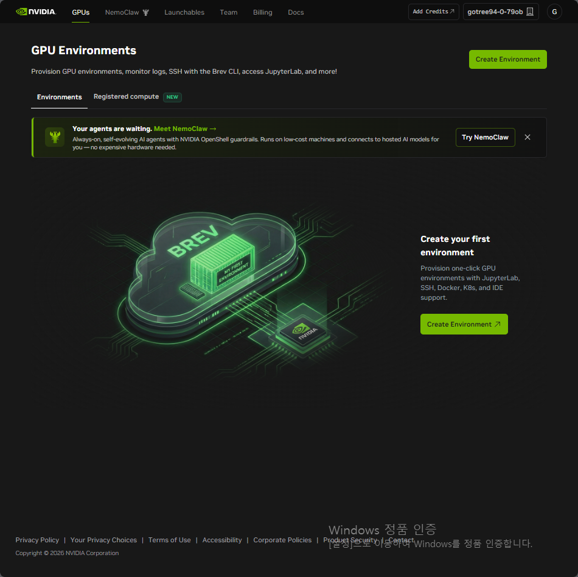
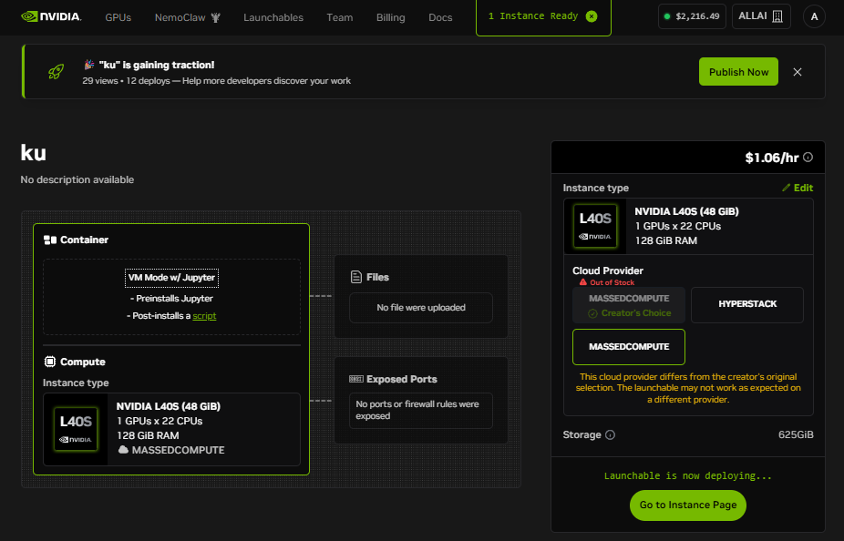
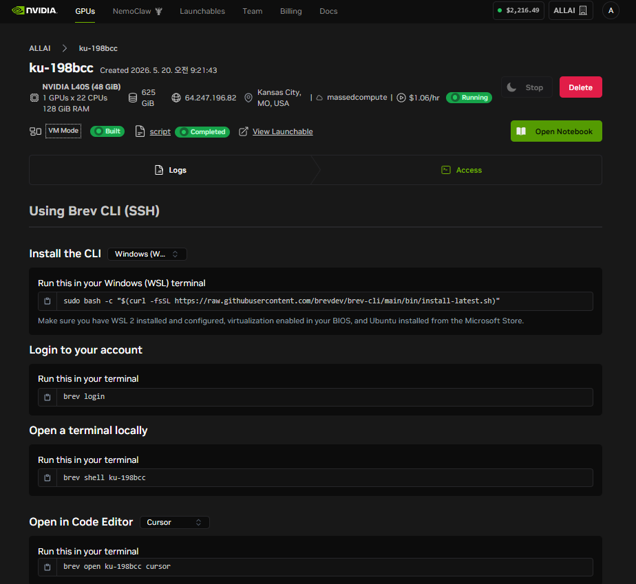
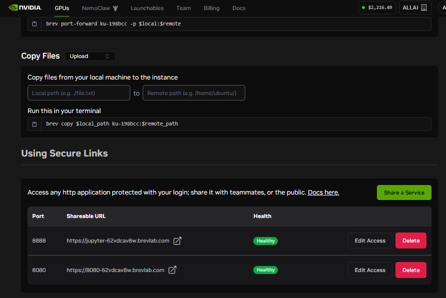
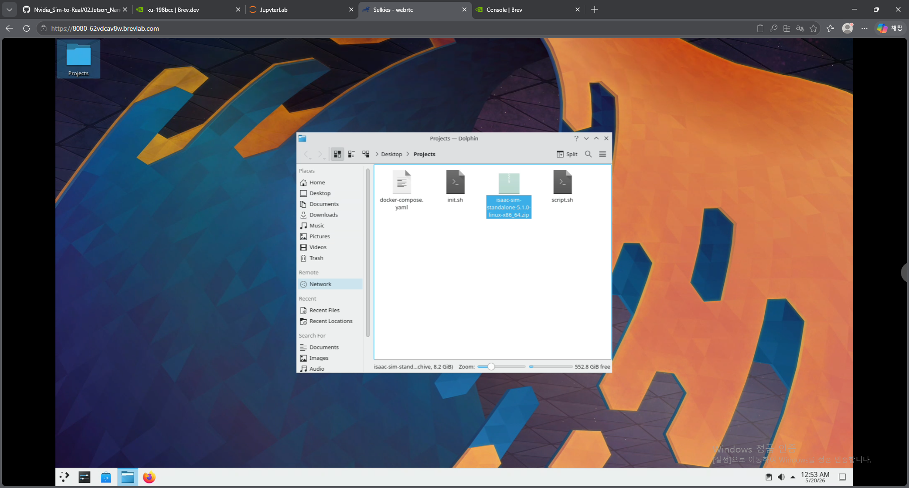
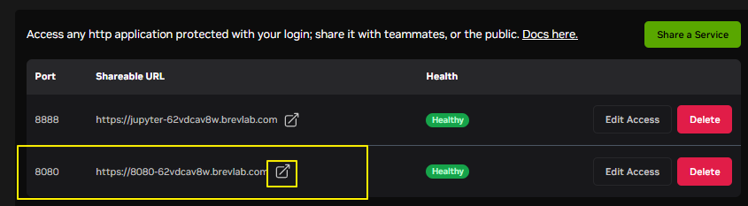

# Day2

https://brev.nvidia.com/

## 1. Brev

* 1.1 brev.nvidia.com
   * 복잡한 설정 없이 NVIDIA GPU  서버를 편하게 사용할 수 있는 서비스
   * 로그인할때 allai12@allai.co.kr로(0519Kosa#) 로그인하고 -> 다른방법으로 -> 다름에 google 계정으로 선택하면 됨.

* 1.2 Launchables > My launchables 에서 ku 선택

* 1.3 Deploy Launchable > Go to Instance Page (우측 하단에 버튼이 있음)
  * Deploy Launchable로 문제 없이 Deploy가 잘 되면 상관 없지만, 잘 되지 않을 경우 꼭 질문할 것
  * 사용하고 싶은데 서버가 선점되었다면 다른 서버를 실행하기 위함.

* 1.4 Instance는 다음 항목 들로 한정 (금요일 제외)

* 1.5 화면 하단의 Using Secure Links > Share a Service
   * 8080 입력 후 Create

* 1.6 Brev 시작
   * 사용자 이름: allai / 비밀번호: kosa 
   * 입력 후 START 버튼을 눌러 원격 데스크톱 시작

* Isaac Sim
   * NVIDIA Isaac Sim™은 NVIDIA Omniverse 기반의 로봇 시뮬레이션 Reference Application입니다.
      -	가상 물리 환경 기반 로봇 테스트 및 개발
      -	Omniverse Kit backend 기반 Extension 사용 가능
      -	정적 USD 파일에 ‘Runtime Interaction’ 부여
      -	Newton Physics, Warp, Cosmos 등 무궁무진한 업데이트 및 상호작용

* User Interface Reference
   * https://docs.isaacsim.omniverse.nvidia.com/5.1.0/gui/reference_user_interface.html
       •	Menu Bar
       •	Viewport
       •	Main Toolbar
       •	Browsers
       •	Stage
       •	Property Panel

* Menu Bar
       •	Create
       •	Window
       •	Tools
       •	Utilities
       •	Layout

* Navigation
   * https://docs.isaacsim.omniverse.nvidia.com/5.1.0/gui/reference_keyboard_shortcuts.html
       * 우 클릭 유지 - 카메라 회전
       * 휠 클릭 유지 - 카메라 이동
       * 휠 스크롤 - 확대/축소
       * Delete - 선택 삭제
       * Space - 애니메이션 시작/정지
       * 우 클릭 유지 + (W/A/S/D) - 앞/뒤/왼/오 이동

* Navigation
   * Toolbar를 눌러 직접 물체를 다양하게 (translation, rotation) 조종하거나 
   * W(translation)
   * E(rotation)
   * R(Scale) 을 눌러 조종 방식 변환해보기
   * 회전: 우클릭+드래그, 좌클릭+ALT,
   * 마우스 휠 클릭: 시점 이동
   * F: 선택한 물체로 시점 변경

* Tool Bar
   * Selection Modes
   * Mode(Global/Local)
   * Rotate(Global/Local)
   * Scale
   * Snap
   * Play/Stop

* Tabs
   * 실수로 무언가를 지웠다면
   * ctrl + 1 또는
   * Layouts > Default Layout 

## 실습1: Basic Tutorial

* STEP 1
   * 1. Ground Plane 추가 : Create > Physics > Ground Plane
   * 2. Light Source 추가 : Create > Lights > Distant Light
   * 3. Visual Cube 추가 : Create > Shape > Cube

* STEP 2
   * 큐브의 Translate, Rotate, Scale을 변경해보기

* STEP 3
   * Cube 항목을 우클릭하여 > Add > Physics > Rigid Body with Colliders Preset
   * 이후 실행 버튼을 눌러 Simulation 시작 
   * Rigidbody나 Collider만 있을 경우 각각 어떻게 될 지 생각해보기

* STEP 4 : 중력의 방향 수정해보기
   * Create > Physics > Physics Scene

* STEP 5
   * Create > Robots > Franka Emika Panda Arm 으로 Franka Panda 생성
   * Tools > Physics > Physics Inspector로 Joint 값 변경해보기

* STEP 6 : Assemble a Simple Robot
   * Ground Plane을 생성한 상태에서, World Prim 아래에 Xform을 생성 translate (0, 0, 1)
   * 생성한 Xform의 child에 Cube와 Cylinder를 생성(Shape)
   * Cube의 Scale(1, 2, 0.5)

* STEP 7: Assemble a Simple Robot
   * 동일한 방법으로 wheel_left, wheel_right Xform 생성 및 Translate, Orient 부여
   * wheel_left: Translate (1.5, 0, 1) Orient (90, 0, 0)
   * wheel_right: Translate( -1.5, 0, 1) Orient (90, 0, 0)
   * 생성한 xform 내부에 create > shape > cylinder
   * cylinder의 Property > Geometry > Axis 를 X로 설정 

* STEP 8 : Assemble a Simple Robot
   * 메쉬 복수 선택 > Add > Physics > Rigid Body with Colliders Preset

* STEP 9 : Assemble a Simple Robot
   * 이렇게 생성된 Collision Mesh 등 요소들은 위 눈 모양의 Show By Type 버튼을 통해 확인가능

* STEP 10 : Assemble a Simple Robot
   * Joint 추가해보기
   * 몸체 Cube와 Cylinder를 차례대로 선택 한 후 우클릭 > Create > Physics > Joint > Revolute Joint
   * 시뮬레이션을 시작하고, Xform을 선택한 후 마우스로 드래그하여 움직임 확인

* STEP 11 : Assemble a Simple Robot
   * Joint Drive 추가
   * Joint를 선택한 후, Property의 Add > Physics > Angular Drive

* STEP 12 : Assemble a Simple Robot
   * 다음과 같이 설정한 후, Play

## Review
- Joint를 연결하려면 RigidBody 속성을 가지고 있어야 한다.
- 움직임을 위한 Articulation Root는 Root 프림에 설정하는 것을 권장
- Parent Prim에 RigidBody 속성을 적용하고, Child Prim에 RigidBody 속성을 중복으로 적용하는 것을 피해야 한다.

* STEP 1 : Collider
   * /Isaac/5.1/Isaac/Robots/NVIDIA/Jetbot에서 Jetbot.usd를 불러온 후, Collider를 확인해보자

* STEP 2 : Collider
   * /jetbot/chassis/geometry 아래 메쉬의 Approximation 방식을 바꿔가면서, Collision Mesh의 변화를 볼 수 있다.

   * 메쉬를 분리하고 Collision Mesh를 적용하여 정교함을 얻을 수 있지만, 성능과 속도의 trade-off 관계를 가진다

## DLI 
Software-in-the-Loop Testing for Robots With OpenUSD, Isaac Sim, and ROS
https://learn.nvidia.com/courses/course-detail?course_id=course-v1:DLI+S-OV-39+V1

