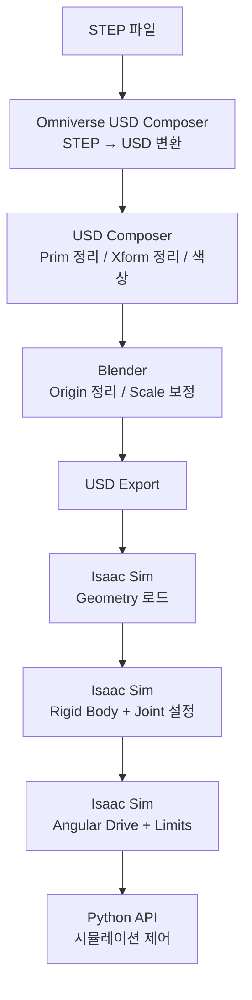

# Day 8: CAD to Sim (수정 및 보강판)

## 준비물
- 블렌더 https://www.blender.org/download/
- NVIDIA Omniverse USD Composer (Isaac Sim에 포함됨)
  - Isaac Sim 설치 시 함께 제공됩니다. Isaac Sim 실행 후 `Window > Stage` 또는 메인 메뉴에서 USD Composer 기능을 사용할 수 있습니다.
- 리깅할 로봇 CAD — RB10-1300E (레인보우로보틱스 협동로봇) https://www.rainbow-robotics.com/rb
- 로봇 사양서 (DH Parameter 포함)

---

## 1. 리깅이란?
- 리깅은 3D 모델이 움직일 수 있도록 뼈대를 심는 작업을 말합니다.
- 로봇 리깅은 공식적으로 정의된 용어는 아니지만, 로봇이 물리 엔진 위에서 관절별로 움직일 수 있도록 준비하는 과정을 뜻합니다.
- **목표**: STEP 파일 → USD → Blender 편집 → Isaac Sim에서 Articulation(관절 구조) 설정

---

## 2. STEP → USD 변환 (Omniverse USD Composer)

> **중요**: 이 단계는 Blender가 아니라 **NVIDIA Omniverse USD Composer** (Isaac Sim 실행 시 접근 가능)에서 진행합니다.
> Blender는 STEP 파일을 직접 불러올 수 없습니다. STEP 파일을 USD로 변환하려면 USD Composer 또는 별도 변환 도구(CAD Assistant, STEPper addon 등)가 필요합니다.

1. **Omniverse USD Composer** (또는 Isaac Sim 실행 후)를 엽니다.
2. `File > Import` 선택
3. 다운로드한 `.stp` (또는 `.step`) 파일 선택


4. Import 옵션 설정:
   - **Convert Visible Only**: 체크 **해제**
   - **Enable Instancing**: 체크 **해제**
   - **Unit**: Meters로 설정

5. **Import** 버튼 클릭
   > 변환된 USD 파일은 STEP 파일과 같은 폴더에 자동 생성됩니다.
   > (USD Composer는 내부적으로 STEP을 파싱하여 USD 계층 구조로 변환합니다.)


---

## 3. Prim 정리 (Omniverse USD Composer)

> 이 단계도 **Omniverse USD Composer** (또는 Isaac Sim Stage)에서 진행합니다.
> 용어 설명: USD에서 3D 장면의 모든 요소는 "Prim(Primitive)"이라고 부릅니다.
> Xform = 위치/회전/크기를 가진 부모 노드, Mesh = 실제 3D 형상几何 데이터입니다.

### 3.1 Looks 분리
1. USD Composer의 Stage 창에서 `Looks` Prim을 찾습니다.
2. `Looks` Prim을 최상위 레벨에 있는 **메인 Xform Prim** (예: `tn__RB101300EEVersion_lMb0r1C` — 이름은 다운로드한 파일에 따라 다릅니다)으로 Drag & Drop 합니다.
   > 이렇게 하면 머티리얼 정의가 메인 모델 계층 안으로 이동합니다.


3. `Looks`와 메인 Xform을 함께 블럭 선택하고:
   - 우클릭 → **Save Selected** (또는 `Ctrl+S`가 아니라 USD Composer 메뉴에서)
   - 새 USD 파일 이름으로 저장 (예: `RB10_1300E_cleaned.usd`)

### 3.2 중첩 Xform 정리
STEP 파일을 변환하면 다수의 중첩 Xform이 생성됩니다:
- `Xform` → `Xform` → `Mesh` 구조를 `Xform` → `Mesh`로 평탄화

**방법** (각 Link에 대해 반복):
1. 최하위 Xform 안에 있는 Mesh 선택
2. 드래그하여 상위 Xform으로 이동 (Stage 창에서 Drag & Drop)
3. 빈 Xform(Prim이 없는 것)은 삭제

 

### 3.3 Xform 이름 정리 및 정리
- 사용하지 않는 Xform Prim은 삭제
- Xform 이름을 읽기 쉽게 변경 (예: `Xform_0123` → `Link1`, `Link2`, ...)


### 3.4 DH Parameter 기반 Xform 생성
로봇의 도면 또는 DH Parameter를 참조하여 각 관절 위치에 새 Xform을 생성합니다:

**RB10-1300E 기준 6개 회전 관절 + 베이스 + 플랜지:**
- `Robot_Base` — 월드 원점 (0, 0, 0), Z-up
- `Link1` ~ `Link6` — 각 관절 위치
- `Flange` — 툴 플랜지 (Link6 끝)

> **Tip**: DH Parameter를 사용하려면 각 Link의 Translate(X, Y, Z)와 Orient(Rotate X, Y, Z)를 결정해야 합니다.
> 일단 모든 관절 위치에 Xform을 먼저 생성하고, 이후에 분류/정리하는 것을 권장합니다.

**Robot Base 설정**:
- Translate: (0, 0, 0)
- Orient: (0, 0, 0) (단위 행렬)
- **Z-up 권장** (Isaac Sim 기본 좌표계)


---

## 4. 색상 추가 (Omniverse USD Composer)

1. Mesh를 선택
2. Property 창에서 **Material** 항목 찾기
3. Mesh가 다양한 Diffuse Color를 가지고 있는 경우:
   - Diffuse 항목의 Material을 다시 원하는 색상으로 재지정
   - 또는 USD Composer의 Material Graph 열어서 직접 편집


---

## 5. Blender에서 Origin 정리

> 이제부터 **Blender**에서 작업합니다.
> Omniverse USD Composer에서 저장한 `.usd` 파일을 Blender로 가져옵니다.

### 5.1 Blender 기본 설정
1. Blender 실행
2. 우측의 기본 큐브, 카메라, 라이트를 모두 선택(`A`)하고 `Delete`로 제거

 

3. 네비게이션: 휠 클릭 + 드래그로 회전, Shift + 휠 클릭으로 이동

### 5.2 USD 파일 불러오기 (첫 번째)
1. 생성한 `.usd` 파일을 Blender 뷰포트로 **Drag & Drop**
2. USD Import 옵션 창에서 **Import USD** 클릭 (기본 옵션 그대로)


### 5.3 USD 계층 분리 (Clear Parent)
1. Stage 창에서 `Root` Xform을 확장하여 내부 요소를 모두 선택
2. 화면에 마우스를 올리고 `Alt + P` → **Clear Parent**
   > 이렇게 하면 USD의 Xform 계층 구조가 해제되고, 각 Mesh가 독립된 오브젝트가 됩니다.


### 5.4 각 Mesh의 Origin 설정

각 관절(Mesh)에 대해 다음 작업을 반복합니다:

#### a. 편집 모드 진입
1. 작업할 Mesh를 클릭 선택
2. `Tab` 키를 눌러 **Edit Mode** 진입

#### b. 정점 선택 및 3D Cursor 이동
1. 관절 회전축이 위치할 **점(Vertex)** 하나를 클릭
   - 여러 점은 `Shift + 클릭`으로 추가 선택
2. **`Shift + S`** (← `Ctrl + S`가 아닙니다! 저장 단축키와 다릅니다)
3. 나타난 Snap 메뉴에서 **"Cursor to Selected"** 선택
   > 잘못 선택했다면 `Alt + A`로 선택 해제 후 다시 시도


#### c. Object Origin을 3D Cursor로 이동
1. `Tab` 키로 **Object Mode** 복귀
2. `F3` 키로 검색 창 열기
3. **"Set Origin"** 입력 → **"Origin to 3D Cursor"** 선택


4. 결과: Mesh의 Origin(피벗 포인트)이 선택한 관절 위치로 이동됨

> 이 과정이 중요한 이유: Isaac Sim에서 Revolute Joint가 이 Origin을 기준으로 회전하기 때문입니다.
> Origin = 관절 회전축의 위치가 됩니다.

### 5.5 Scale 보정 (두 번째 USD Import)

> STEP → USD 변환 시 1 unit = 1cm로 변환되는 경우가 많아,
> Isaac Sim(1 unit = 1m)에서 사용하려면 100배 확대가 필요합니다.

#### 방법 A (권장): 동일 파일을 100% Scale로 다시 Import

1. `File > New`로 **새 Blender 세션** 열기 (혹은 기존 파일 저장 후 새 파일)
   > 새 창을 여는 이유: Blender는 같은 파일을 같은 세션에 중복 Import 시 충돌할 수 있기 때문
2. 같은 USD 파일을 다시 **Drag & Drop**
3. USD Import 옵션에서 **Scale을 100**으로 설정하고 Import


#### 방법 B: 기존 오브젝트 Scale 직접 변경
1. 기존 USD를 Import한 상태에서 Root 오브젝트 선택
2. Transform 패널(`N` 키)에서 Scale X, Y, Z를 모두 100으로 변경
3. `Ctrl+A` → **Apply > Scale** (Scale을 실제 mesh에 적용)

### 5.6 위치 보정 (Location 빼기)

Scale 100으로 Import하면 Root Xform의 Location이 (0, 0, 0)이 아닌 값으로 변경될 수 있습니다.
이유: USD 내부 좌표계 변환으로 인한 위치 이동.

1. **Root 선택** → Transform 패널(`N` 키)에서 현재 **Location (X, Y, Z) 값을 메모**합니다.
   > 예: Location이 (1.5, -0.8, 0.3)로 표시되면 기록
2. **World Origin에 새로운 축(Empty) 생성**:
   - `F3` → **"Cursor to World Origin"** 실행 (3D Cursor를 (0,0,0)으로 이동)
   - `Add > Empty > Plain Axes`로 축 생성
   - Plain Axes의 이름을 "Robot_Origin" 등으로 변경

  

3. **Parent 설정 (위치 유지)**:
   - Root를 선택한 후 `Ctrl` 키를 누른 상태에서 Empty(Plain Axes)도 선택 (Root → Empty 순서)
   - `Ctrl + P` → **Set Parent to Object (Keep Transform)**
   - 이제 Root가 Empty의 자식이 됩니다


4. **Location 리셋**:
   - Root를 선택하고 Transform 패널의 **Location을 (0, 0, 0)으로 변경**
   - (또는 기록해둔 값을 빼서 0으로 만듦)
   - 결과: Empty는 World Origin에 고정되고, Root는 Empty 기준 원점에 정렬됨

### 5.7 나머지 Mesh → Empty Parent

1. 각 Mesh를 선택하고 `Ctrl` 클릭으로 Empty (Plain Axes)도 함께 선택
2. `Ctrl + P` → **Set Parent to Object (Keep Transform)**
   > 이렇게 하면 모든 Mesh가 Empty의 자식이 되며,
   > Empty를 움직이면 모든 파트가 함께 이동합니다.

  

### 5.8 Mesh Origin 최종 정리
각 Mesh에 대해:
1. Mesh 선택
2. `F3` → **"Set Origin"** → **Origin to Center of Mass**
   > 각 Mesh의 물리 중심을 자동 계산
   > 필요에 따라 수동으로 Origin을 조정할 수 있습니다.


### 5.9 USD Export (Blender → USD)

Blender에서 편집 완료 후 USD로 내보냅니다:

1. 상단 메뉴바에서 **Scripting** 탭으로 이동
2. **New** 버튼 클릭
3. 아래 스크립트 입력:

```python
import bpy

# 내보내기 경로: Windows 사용자는 반드시 Windows 경로로 변경
output_path = "C:/Users/YourName/Desktop/RB10_1300E_exported.usdc"
# Linux 사용자: "/home/username/output.usdc"
# Mac 사용자: "/Users/username/Desktop/output.usdc"

bpy.ops.wm.usd_export(
    filepath=output_path,
    export_meshes=True,
    merge_parent_xform=True,
    convert_world_material=True
)
print(f"Exported to: {output_path}")
```

4. 텍스트 에디터 창에서 실행 버튼 (▶) 클릭
5. 콘솔에 `Exported to: ...` 메시지 확인

 

> ⚠️ **경로 주의**: 위 예시는 Windows 경로입니다.
> `/home/shadeform/output.usdc` 같은 Linux 경로는 Windows에서 동작하지 않습니다.
> 자신의 OS에 맞는 경로로 변경하세요.

---

## 6. Isaac Sim에서 시각적 디테일 조정

> 이제 **Isaac Sim**에서 내보낸 USD 파일을 열어 마무리합니다.

### 6.1 파일 불러오기
1. Isaac Sim 실행
2. `File > Open` → 내보낸 `.usdc` 파일 선택

### 6.2 Env Light 제거
- Stage 창에서 `Environment` 또는 `env_light` Prim을 찾아 삭제

### 6.3 Mesh Refinement
1. Stage 창에서 모든 Mesh를 필터링하여 선택
2. Property 창에서 **Refinement Override**에 체크
3. **Refinement Level**을 조정하여 Mesh 품질 개선
   > Level이 높을수록 더 부드러워지지만 성능이 저하됩니다.
   > 일반적인 값: 1~2


---

## 7. 관절 (Joint) 설정

### 7.1 Rigid Body 속성 부여

움직여야 할 각 Link에 대해:
1. Link Mesh 선택
2. Property 창에서 **Add Physics** → **Rigid Body** 선택

> 각 링크가 물리 엔진의 영향을 받는 강체가 됩니다.


### 7.2 Fixed Joint + Articulation Root

로봇의 기반이 되는 `Robot_Base` (또는 베이스 역할을 할 Mesh)에:
1. 우클릭 → **Create Joint** → **Fixed Joint**
   > Fixed Joint는 두 물체를 단단히 고정합니다.
   > Robot_Base는 바닥에 고정되어 움직이지 않아야 합니다.


2. 생성된 Fixed Joint를 선택
3. Property 창에서 **Articulation Root** 체크 활성화
   > Articulation Root는 모든 관절을 하나의 Articulation System으로 묶습니다.
   > 로봇 팔 전체가 하나의 Articulation으로 동작하게 됩니다.


### 7.3 Revolute Joint 생성

각 Link 연결부에 **Revolute Joint** (회전 관절)를 생성합니다:

**올바른 순서**: 항상 부모가 될 Link → 자식 Link 방향으로 연결
- `Robot_Base` ↔ `Link1`
- `Link1` ↔ `Link2`
- `Link2` ↔ `Link3`
- `Link3` ↔ `Link4`
- `Link4` ↔ `Link5`
- `Link5` ↔ `Link6`

**생성 방법**:
1. 부모 Link를 선택 → `Ctrl` + 자식 Link 선택
2. 우클릭 → **Create Joint** → **Revolute Joint**

### 7.4 Joint Axis 설정

각 Revolute Joint의 회전축(Axis)을 설정해야 합니다.
RB10-1300E의 관절 구조를 참고하여:

| 관절 | 회전축 방향 | 설명 |
|------|------------|------|
| Joint 1 (Base) | Z (0,0,1) | 베이스 회전 — 수직축 |
| Joint 2 (Shoulder) | Y (0,1,0) | 숄더 회전 — 수평축 |
| Joint 3 (Elbow) | Y (0,1,0) | 엘보 회전 — 수평축 |
| Joint 4 | X (1,0,0) | 손목 롤 |
| Joint 5 | Y (0,1,0) | 손목 피치 |
| Joint 6 | X (1,0,0) | 툴 롤 |

> **검증 방법**: Isaac Sim에서 Play 버튼(▶) 누르고, 각 Joint의 Position 값을 변경하여
> 예상한 방향으로 링크가 회전하는지 육안 확인합니다.
> 잘못된 축: 잘못된 방향으로 회전하거나 전혀 움직이지 않음.

**Axis 직접 조절 방법**:
1. Revolute Joint 선택
2. Property 창에서 **Axis** 값 (X, Y, Z) 수정
   - 값을 1.0으로 설정하고 나머지는 0.0으로
   - 예: Z축 회전 → Axis = (0.0, 0.0, 1.0)


### 7.5 Joint Limits (관절 각도 제한)

각 Revolute Joint에 최소/최대 회전 각도를 설정합니다.
RB10-1300E의 실제 사양을 참고하세요 (대략적인 값):

| 관절 | 최소 각도 | 최대 각도 |
|------|----------|----------|
| Joint 1 | -180° | +180° |
| Joint 2 | -135° | +135° |
| Joint 3 | -135° | +135° |
| Joint 4 | -180° | +180° |
| Joint 5 | -120° | +120° |
| Joint 6 | -180° | +180° |

설정 위치: Revolute Joint Property → **Joint Limits** → Low / High

### 7.6 Angular Drive (관절 구동 설정)

각 Revolute Joint가 전기 모터처럼 구동되도록 Angular Drive를 추가합니다:

1. Revolute Joint 선택 → Property 창 **Angular Drive** 섹션
2. **Drive Type**: Force (또는 Acceleration)
3. 다음 값을 설정:

| 파라미터 | 권장값 | 단위 | 설명 |
|---------|-------|------|------|
| **Stiffness** | 10000 | N·m/rad | 위치 정확도 (높을수록 목표 각도를 정확히 추종) |
| **Damping** | 100 | N·m·s/rad | 진동 억제 (높을수록 움직임이 둔해짐) |
| **Max Force** | 100 | N·m | 최대 토크 (모터의 힘) |

> **튜닝 팁**:
> - 로봇이 덜덜 떨린다면 → Stiffness 낮추거나 Damping 높임
> - 로봇이 목표 위치에 도달하지 못한다면 → Stiffness 높이거나 Max Force 증가
> - 과도하게 느리다면 → Damping 낮춤


---

## 8. Core API Tutorial Series (Isaac Sim Python)

### 8.1 필요한 확장 활성화

1. `Window > Extensions` 메뉴 열기


2. 검색창에 **"jupyter"** 입력
3. **JUPYTER NOTEBOOK INTEGRATION** 확장 찾기
4. **DISABLED** 및 **AUTOLOAD** 왼쪽 버튼을 모두 클릭하여 활성화 (파란색/초록색으로 변경)

 

### 8.2 Jupyter Notebook 실행
1. `Window > Jupyter Notebook` 선택


2. 커널 선택: **Omniverse (Python 3)**


### 8.3 BaseSample (Boilerplate)
`BaseSample`은 Isaac Sim Robotics 예제에서 재사용되는 **기초 코드 템플릿**입니다.
다음 기능을 제공합니다:
- Stage 생성 시 World 초기화
- 전체 앱 종료 없이 변경점만 로딩 (hot-reload)
- World 안의 객체를 초기 값으로 리셋

> `Window > Examples > Robotics Examples > General > Hello World > Load`로 로드 가능
> 또는 BaseSample을 상속하여 Jupyter Notebook에서 직접 사용

### 8.4 예제 시리즈

#### 01. hello_world
```python
# World를 가져와서 바닥판을 추가하는 가장 기본적인 예제
world = self.get_world()
# world는 Singleton → Isaac Sim 구동 중에는 하나의 world만 존재
```


- API 문서: https://docs.isaacsim.omniverse.nvidia.com/5.0.0/reference_python_api.html

#### 02. hello_cube
- Collider와 RigidBody를 가진 DynamicCuboid 생성
- `world.scene.add()`를 사용한 scene 구성


- 참고: https://docs.isaacsim.omniverse.nvidia.com/5.0.0/py/source/extensions/isaacsim.core.api/docs/index.html#isaacsim.core.api.objects.DynamicCuboid

#### 03. get_assets
- Asset의 URL을 받아와서 reference로 장면에 배치


#### 04. hello_robot
- `world.scene.get_object(name)`으로 scene 내 객체 참조


#### 05. wheeled_robot
- **Physics Callback** 추가 → 재생 버튼 누르면 로봇이 움직임
- 두 바퀴의 속도를 다르게 설정 → 회전 구현


#### 06. manipulator
- Wheeled Robot 외에 **Franka Panda** 매니퓰레이터 생성


#### 07. controllers
- **PickPlaceController**를 사용하여 Articulation에 Pick & Place 동작 구현


#### 08. integrating_robots
- 지금까지 만든 두 로봇(모바일 로봇 + 매니퓰레이터)을 **하나의 Scene**에 통합


#### 09. tasks
- `Task` 클래스: Scene 생성, 정보 수집, 계산 등을 체계화하는 유틸리티
- 앞서 구현한 기능들을 Task를 이용해 재구성


### 8.5 더 많은 예제
- `Window > Examples > Robotics Examples` → 다양한 Robotics 예제 탐색
- 예: multi-robot > RoboFactory

### 8.6 직접 해보기 (Do It Yourself)
- 오늘 만든 Scene에 Python code를 활용해보세요:
  - 매니퓰레이터가 집을 큐브의 **mass**를 높여서 중량물 들어보기
  - Jetbot에 다른 **Controller** 적용해보기
  - **Revolute Joint**의 Angular Drive 값 변경해보기

---

## 참고: 전체 워크플로우 요약



**대안 경로 (URDF 활용)**:
Isaac Sim에는 URDF Importer가 내장되어 있습니다. STEP → STL/OBJ → URDF → USD 변환을 사용하면
Joint와 Articulation이 자동 생성되므로 더 빠를 수 있습니다:
- `Isaac Lab`의 `UrdfConverter` 참고
- 단, URDF 생성 자체가 추가 작업이 필요함

---

## 자주 발생하는 문제와 해결 (Troubleshooting)

| 문제 | 원인 | 해결 |
|------|------|------|
| Blender에서 STEP 파일이 안 열림 | Blender는 STEP 미지원 | USD Composer에서 먼저 USD로 변환 |
| USD Import 후 Mesh가 안 보임 | Scale이 너무 작거나 큼 | Import Scale 100으로 설정 |
| Isaac Sim에서 Joint가 안 움직임 | Rigid Body 누락 | 모든 Link에 Rigid Body 추가 확인 |
| 로봇이 떨리거나 폭발함 | Angular Drive Stiffness 부적절 | Stiffness=10000, Damping=100으로 시작 |
| Joint가 반대 방향으로 회전 | Axis 설정 오류 | 축 방향 확인 (±1.0 값 변경) |
| USB Export 경로 오류 | `/home/` 경로가 Windows에 없음 | Windows 경로(`C:/...`)로 변경 |
