# Synthetic Data Generation

## Data Generation with MobilityGen
   * Occupancy Map 이란?
     * Data Generation With MobilityGen : https://docs.isaacsim.omniverse.nvidia.com/5.1.0/synthetic_data_generation/tutorial_replicator_mobility_gen.html
   * 0과 1 사이의 값으로 나타낸 맵으로 0은 free space, 1은 occupied space를 나타낸다

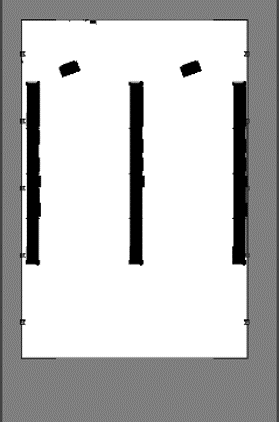

## Data Generation with MobilityGen
   * 가이드에 따라 데이터를 생성
   * 시뮬레이션 환경에서는 Ground Truth기반으로 Occupancy map을 미리 만들게된다

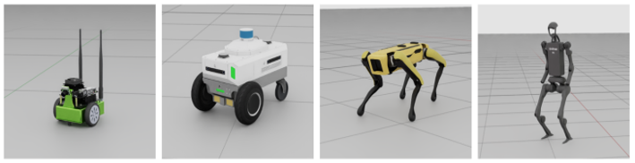

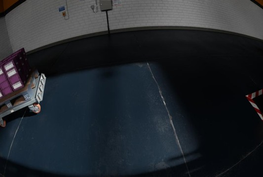

## Cosmos-transfer
   * Cosmos-transfer1 build.nvidia.com : https://build.nvidia.com/nvidia/cosmos-transfer1-7b
   * Cosmos-transfer1 소개영상 : https://www.youtube.com/watch?v=0Yr5SdrVnxc
   * Cosmos-transfer2.5 소개영상 : https://www.youtube.com/watch?v=ttyb_9rX0fk
   * Physical AI NVIDIA Page : https://research.nvidia.com/publication/2025-09_world-simulation-video-foundation-models-physical-ai
   * NVIDIA Cosmos - 월드 파운데이션 모델로 구현하는 피지컬 AI : https://www.nvidia.com/ko-kr/ai/cosmos/#nv-accordion-6744152f25-item-31e94fa711

## Cosmos-transfer2.5
   * 먼저 Huggingface에 가입합니다 : https://huggingface.co/join
   * 가입 후, 계정 > Settings > Create new Access Token > Read Token 생성

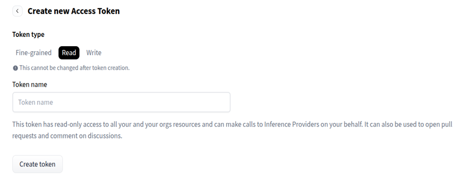

## Cosmos-transfer2.5
   * nvidia/Cosmos-Predict2.5-2B · Hugging Face : https://huggingface.co/nvidia/Cosmos-Predict2.5-2B
   * nvidia/Cosmos-Transfer2.5-2B · Hugging Face : https://huggingface.co/nvidia/Cosmos-Transfer2.5-2B
   * nvidia/Cosmos-Guardrail1 · Hugging Face : https://huggingface.co/nvidia/Cosmos-Guardrail1
   * 다음 링크에 들어가서 Model 사용 허가 신청

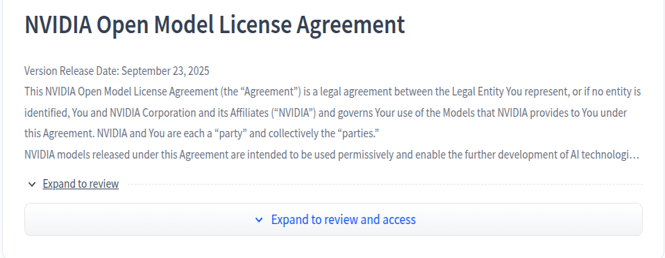


## Cosmos-transfer2.5
   * 아래 Launchable instance 실행 후, cuda12.8 설치 링크 참고하여 설치
   * 설치 후 다음 명령어를 이용하여 확인 
   * 출력이 다음과 같지 않다면, 시도 
```
echo 'export PATH=/usr/local/cuda-12.8/bin:$PATH' >> ~/.bashrc
source ~/.bashrc
```
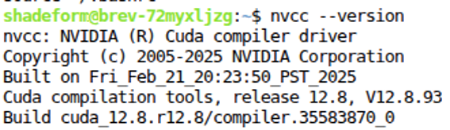


## Cosmos-transfer2.5
   * 이후 transfer2.5 setup 과정 실행 : https://github.com/nvidia-cosmos/cosmos-transfer2.5/blob/main/docs/setup.md
   * 주의! H100은 Graphics Engine이 없습니다(원격 GUI 사용 불가)

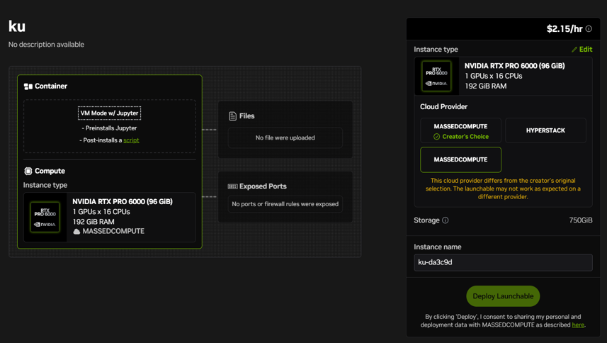


## Cosmos-transfer2.5
   * https://github.com/nvidia-cosmos/cosmos-transfer2.5/blob/main/docs/inference.md
   * 다음 페이지에 따라 예제를 직접 수정해보고, assets/robot_example/robot_prompt 를 수정하여 같은 영상에 다른 prompt 적용해보기

## Cosmos-transfer2.5 Examples
  * 모델에 입력할 Prompt는 매우 세밀한 묘사를 하도록 작성해야하며, 많은 시도를 필요로 합니다.

```
The video captures a robotic manipulation demonstration conducted in an outdoor-like setting. Instead of a laboratory environment, the background features a vivid green grass surface that creates a natural and open atmosphere. Two robotic arms are positioned on either side of a black shirt, which is neatly spread out on a yellow cushion placed on the ground. Behind them, there is a couch made of paper material, adding an interesting, lightweight element to the scene. The left robotic arm is white with a black gripper and begins the task by moving toward the shirt with precise, controlled motions. Its gripper opens and closes as it aligns itself for an accurate grasp. The right robotic arm, which is black with a more articulated gripper, remains still at first, ready to cooperate in the manipulation. Once the left arm grips one side of the shirt and lifts it slightly, the right arm moves in to secure the opposite edge. The two arms then work in synchronized motion, gently lifting and holding the shirt between them. Their precise, coordinated movements emphasize both the stability of their grip and the flexibility required to handle soft fabric. The camera remains fixed on the scene, ensuring a clear, uninterrupted view of the entire manipulation process against the grassy background and paper-textured sofa.


```

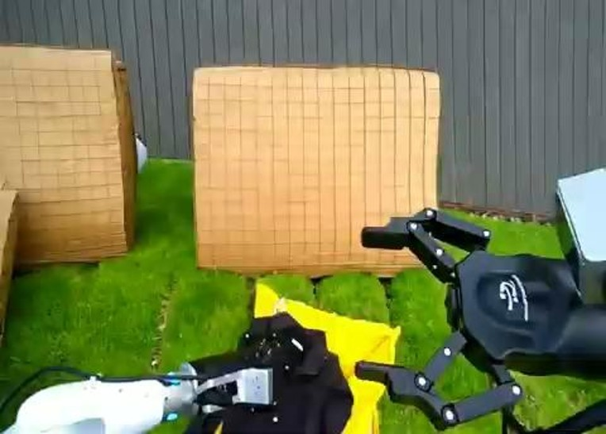


## Cosmos-cosmos2.5 Examples
   * Input이 애매하거나, 모델이 아직 완벽하지 않기 때문에 오류가 발생하기도 합니다.

```
The video has been transformed from a modern urban driving scene to one set along a scenic beachfront. It appears to be filmed with a dashcam or a similar fixed camera mounted inside the vehicle. On both sides of the wide road, there are low-rise buildings, giving the area a relaxed and open atmosphere. These buildings are mostly small shops, cafés, and inns, contributing to a coastal town vibe. Several cars are visible on the road ahead, but unlike the original scene, they are all white, creating a clean and uniform look. Traffic is light, and the vehicles maintain a steady pace as they move forward. Traffic cones are placed along the road to guide cars through a lane closure or roadwork area. On the left side of the road, palm trees line the sidewalk, adding a tropical and beachside feeling to the scene. Pedestrians can be seen walking leisurely or standing near the buildings. The architecture is characterized by light-colored concrete and wood accents rather than glass facades, enhancing the seaside ambiance. The sky is clear and sunny, making the scene bright and highly visible. The car maintains a constant speed as it approaches an intersection where the road splits into different directions. The camera remains fixed throughout the drive, providing a stable view of the palm-lined road, the white cars, and the relaxed coastal surroundings. The overall atmosphere is calm, warm, and reminiscent of a peaceful beachfront town.

```

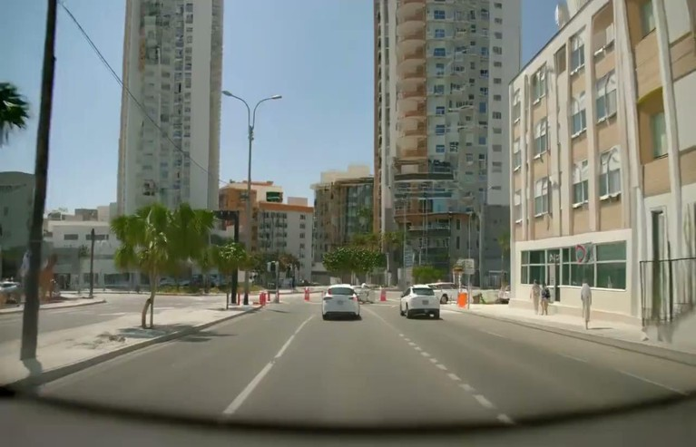

## Cosmos Synthetic Data Generation 
   * Cosmos Synthetic Data Generation : https://docs.isaacsim.omniverse.nvidia.com/5.1.0/replicator_tutorials/tutorial_replicator_cosmos.html
   * Cosmos에 들어갈 input data를 생성하는 script

## Cosmos Synthetic Data Generation 

```
This scene depicts the interior of a factory. The floor is made of white epoxy material, and inside the factory, rows of metal racks are lined up, each stacked with blue boxes. On the factory floor, several items have fallen off the racks, and safety cones and warning markings are placed nearby to prevent entry into restricted areas. On the right side of the scene, a white male worker wearing a fluorescent safety jacket and a hat is working. The factory walls are made of red brick, and the structural frame above the bricks is constructed of steel. Fluorescent lights hanging from the ceiling illuminate the space, adding to the realistic atmosphere of the scene. The entire image is rendered with such a high level of realism that it does not look like computer graphics or a simulated environment at all.

```

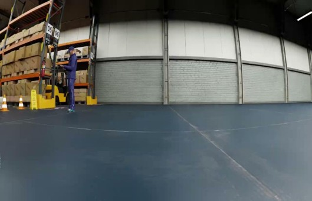

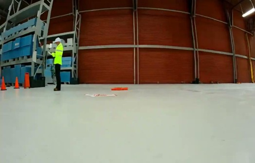

## Do it yourself
   * Isaac Sim과 Cosmos-transfer2.5를 사용하여 산출물을 만들고 아래 항목들을 제출
      -	Stage 구성에 사용한 usd 전체
      -	Stage 구성 및 Synthetic Data Generation 용도로 사용한 데이터 전체
      -	Cosmos-transfer2.5 에 들어간 input 폴더 및 prompt
      -	결과 영상


