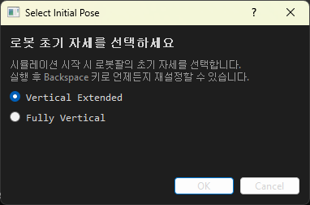
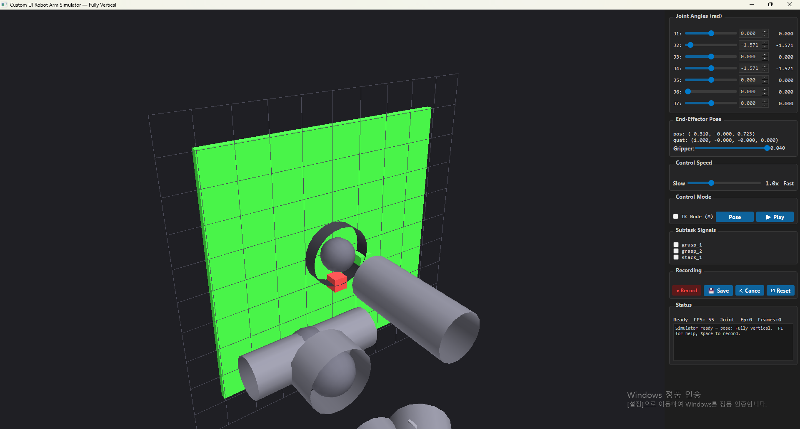
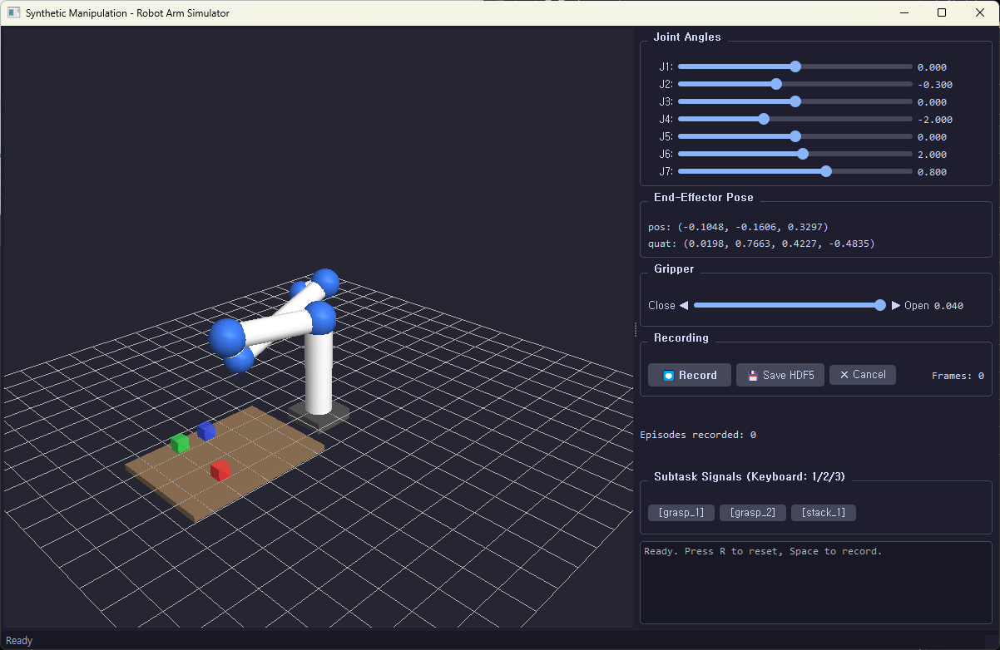

# 프로젝트 요약

> **두 가지 구현체 + 두 가지 분류**:  
> `robot_arm_simulator` (v1, Desktop) → `custom_ui_robot_arm` (v2, 기능 확장)  
> 각 구현체는 **시뮬레이터**와 **데이터 파이프라인**으로 구성

---

## 프로젝트 개요

NVIDIA Isaac Sim / Docker / H100 GPU 없이, 순수 Python 데스크톱 애플리케이션으로  
**Franka Panda 로봇팔 시뮬레이터**를 구동하고 **Isaac Lab Mimic 호환 HDF5 데이터셋**을 생성한다.

---

## 버전 비교

| 항목 | `robot_arm_simulator` (v1) | `custom_ui_robot_arm` (v2) |
|---|---|---|
| **위치** | `Desktop/robot_arm_simulator/` | `C:\custom_ui_robot_arm\` |
| **파일 수** | 7 (+ README-sum.md) | 9 (+ 문서 2개) |
| **3D 뷰어** | `robot_viewer.py` (단일) | `renderer.py` (모듈 분리) |
| **메인 UI** | `main_window.py` (17.9 KB) | `app.py` (39.7 KB, 컨트롤 패널 분리) |
| **재생 기능** | ❌ 없음 | ✅ `playback.py` (HDF5 프레임 재생) |
| **IK 모드** | ❌ 없음 | ✅ M키 토글, 실시간 EEF 제어 |
| **속도 조절** | ❌ 없음 | ✅ 0.1x ~ 3.0x 슬라이더 |
| **관절 숫자 입력** | ❌ 슬라이더 전용 | ✅ QDoubleSpinBox 병행 |
| **자세 프리셋** | ❌ 고정 HOME | ✅ JSON 저장/불러오기 + 시작 선택 |
| **단축키 도움말** | ❌ 없음 | ✅ F1 오버레이 |
| **파일 크기 (합계)** | ~58 KB | ~100 KB |

---

## 구현체 1: `robot_arm_simulator` (v1, Desktop)

 <br>
 <br>

> **최초 구현**. 핵심 기능에 집중 — 3D 뷰어 + 관절 제어 + HDF5 녹화

### 파일 구조

```
Desktop/robot_arm_simulator/
├── config.py          (3.1 KB)  Franka Panda DH 파라미터, 관절 한계, 색상
├── kinematics.py      (8.4 KB)  Modified DH FK, Damped LS IK, Jacobian, 쿼터니온
├── robot_viewer.py    (12.0 KB) QOpenGLWidget — 로봇/큐브/테이블 렌더링, 마우스 카메라
├── main_window.py     (17.9 KB) QMainWindow — 슬라이더·키맵·서브태스크·레코드 통합
├── recorder.py        (12.8 KB) 프레임 버퍼 → HDF5 계층 구조 (robomimic 호환)
├── main.py            (3.8 KB)  엔트리 포인트 + 다크 테마
├── requirements.txt   (77 B)    PyQt5, PyOpenGL, numpy, h5py
└── README-sum.md      (11.9 KB) 프로젝트 개요 문서
```

### 특징

| 모듈 | 설명 |
|---|---|
| **config.py** | DH_ALPHA/DH_A/DH_D (7축), JOINT_LIMITS, HOME_POSITION=`[0, -0.3, 0, -2.0, 0, 2.0, 0.8]`, CUBE_INITIAL_POSITIONS |
| **kinematics.py** | `forward_kinematics()` → 4×4 변환 체인, `compute_jacobian()` → 6×7, `inverse_kinematics()` → damped pseudoinverse, `get_eef_pose()` |
| **robot_viewer.py** | GL_LIGHT0/1 조명, gluCylinder 링크 + gluSphere 관절, 그리퍼 박스, 그리드, EEF 축 |
| **main_window.py** | 7개 슬라이더, EEF 표시, Record/Save/Cancel/Reset 버튼, subtask 체크박스, 로그, 키보드 20개 매핑, 드래그 회전/휠 줌 |
| **recorder.py** | `Frame` dataclass 버퍼링, 유한차분 `joint_vel`, `actions`=`[Δq, gripper_cmd]`, `obs/datagen_info/` 4×4 pose, gzip 압축 |

### 콘트롤 (v1 키맵)

```
W/S:J1  E/D:J2  R/F:J3  T/G:J4  Y/H:J5  U/J:J6  I/K:J7
Z/X: gripper close/open
Space: Record  Ctrl+S: Save  Backspace: Reset
1/2/3: grasp_1/2/stack_1 subtask
Shift: fast mode  V: cube attach/detach
```

---

## 구현체 2: `custom_ui_robot_arm` (v2, 기능 확장)

> **v1을 기반으로 6가지 편의 기능 추가 + 코드 모듈화**

 <br>

### 파일 구조

```
C:\custom_ui_robot_arm/
│
├── 📄 문서
│   ├── IDEA_EVALUATION.md   (12.6 KB) 아이디어 평가 — 기술적 타당성, 리스크, 로드맵 (한글)
│   └── PROJECT_SUMMARY.md   (이 파일) 분류별 요약
│
├── 🏗️ 시뮬레이터
│   ├── config.py             (7.2 KB) DH 파라미터 + PRESET_POSITIONS + SPEED 설정
│   ├── kinematics.py         (8.0 KB) FK/Jacobian/IK + 쿼터니온 + rot_x/y/z
│   ├── renderer.py           (13.0 KB) QOpenGLWidget (v1 ↔ 모듈 분리, GLUT 의존성 제거)
│   ├── app.py                (39.7 KB) QMainWindow + ControlPanel (v1 대비 2.2배)
│   └── main.py               (3.7 KB) 엔트리 포인트 + 시작 자세 선택 다이얼로그
│
├── 📊 데이터 파이프라인
│   ├── recorder.py           (12.3 KB) v1 동일 구조 + subtask 동기화 개선
│   └── playback.py           (13.7 KB) HDF5 로드 → 프레임별 타임라인 재생
│
└── 📦 의존성
    └── requirements.txt      (77 B)   PyQt5, PyOpenGL, numpy, h5py
```

### v2 신규 기능 상세

| 기능 | 구현 | 사용법 |
|---|---|---|
| **시작 자세 선택** | `PoseSelectionDialog` (main.py) | 실행 시 두 가지 프리셋 중 선택 |
| **속도 조절** | `QSlider` 0.1x~3.0x (ControlPanel) | 모든 키보드 제어에 실시간 적용 |
| **관절 숫자 입력** | `QDoubleSpinBox` x 7개 | 슬라이더와 양방향 동기화, 0.001 rad 단위 |
| **IK 모드** | W/S/A/D/E/Q: EEF 이동, R/F/T/G/Y/H: 회전 | 실시간 Damped LS IK 해석, M키 전환 |
| **자세 프리셋** | `PoseManager` → `.pose_presets.json` | 현재 관절각 저장/목록에서 불러오기 |
| **단축키 도움말** | `HelpOverlay` (F1) | 전체 키맵 오버레이 표시 |
| **프레임 재생** | `PlaybackDialog` → h5py 로드 | 타임라인·Play/Pause·Step·에피소드 탐색 |

### 콘트롤 (v2 키맵)

```
[JOINT MODE (기본)]                 [IK MODE (M키 전환)]
W/S:J1  E/D:J2  R/F:J3  T/G:J4     W/S:Z+/-  A/D:X-/+  E/Q:Y+/-
Y/H:J5  U/J:J6  I/K:J7              R/F:Roll  T/G:Pitch  Y/H:Yaw

[GLOBAL]
Space: Record  1/2/3: SubTask  V: Cube attach/detach
M: IK/Joint toggle  Shift: Fast  F1: Help  P: Playback
Backspace: Reset  Ctrl+S: Save HDF5
```

---

## 분류 1: 시뮬레이터 (Simulator)

**목적**: Franka Panda 7-DOF 로봇팔을 3D로 시각화하고 키보드/마우스로 실시간 제어

### 공통 아키텍처 (v1 / v2 동일)

```
main.py → QApplication + 다크 테마
    └── MainWindow (QMainWindow)
        ├── RobotViewer (QOpenGLWidget)   ← 3D 렌더링
        └── ControlPanel (QWidget)         ← 슬라이더/버튼/로그
        └── QTimer (60 FPS)               ← 게임 루프
            ├── 1. 키 반복 처리 (key_states)
            ├── 2. 큐브 부착 업데이트
            ├── 3. FK 계산 → 3D 다시 그리기
            ├── 4. EEF 라벨 업데이트
            └── 5. 녹화 프레임 저장
```

### 운동학 (v1 / v2 공통)

```
Modified DH (Craig) 파라미터:
  i | alpha_{i-1} | a_{i-1} | d_i    | theta_i
  1 |  0.0        | 0.0     | 0.333  | q1
  2 | -π/2        | 0.0     | 0.0    | q2
  3 |  π/2        | 0.0     | 0.316  | q3
  4 |  π/2        | 0.0825  | 0.0    | q4
  5 | -π/2        | -0.0825 | 0.384  | q5
  6 |  π/2        | 0.0     | 0.0    | q6
  7 |  π/2        | 0.088   | 0.107  | q7
```

---

## 분류 2: 데이터 파이프라인 (Data Pipeline)

**목적**: 키보드 조작 시연을 Isaac Lab Mimic 호환 HDF5로 저장하고 재생/검증

### HDF5 출력 구조 (v1 / v2 동일)

```
/data/demo_N/
  ├── actions                    (T, 8)   Δq₁..₇ + gripper_cmd
  ├── obs/
  │   ├── joint_pos              (T, 9)   7 + gripper + dummy
  │   ├── joint_vel              (T, 9)   유한차분
  │   ├── eef_pos                (T, 3)
  │   ├── eef_quat               (T, 4)   (x, y, z, w)
  │   ├── cube_positions         (T, 9)   3 cubes × 3
  │   ├── cube_orientations      (T, 12)  3 cubes × 4
  │   └── datagen_info/
  │       ├── eef_pose           (T, 4, 4)
  │       ├── object_pose        (T, 4, 4)   첫 번째 큐브
  │       ├── target_eef_pose    (T, 4, 4)   마지막 프레임 고정
  │       └── subtask_term_signals/
  │           ├── grasp_1        (T,) bool
  │           ├── grasp_2        (T,) bool
  │           └── stack_1        (T,) bool
  ├── states/articulation/robot/joint_position  (T, 9)
  └── initial_state/articulation/robot/joint_position  (1, 9)
```

### 데이터 흐름

```
키보드 입력
    ↓
joint_angles += delta  (60 FPS, dt=16ms)
    ├──→ FK 계산 → 3D 렌더링
    └──→ recorder.py (녹화 중)
            ↓ Frame buffer (list[Frame])
        [Ctrl+S] → HDF5 파일 (gzip)
            ↓
        playback.py → h5py 로드 → 타임라인 재생
            ↓
        Isaac Lab Mimic → 대량 합성 궤적 생성
```

---

## 두 구현체의 관계

```
NVIDIA Blueprint 분석 & 아이디어 평가
    │
    ▼
robot_arm_simulator (v1)  ← Desktop, 최초 구현
    │   ├── 핵심 기능: 3D 뷰어 + 관절 제어 + HDF5 녹화
    │   └── 단일 파일 구조 (main_window.py 하나에 UI 집중)
    │
    ▼ (피드백 반영)
custom_ui_robot_arm (v2)  ← 기능 확장판
        ├── HOME_POSITION 수정 (충돌 없는 수직 자세)
        ├── 6가지 편의 기능 추가 (속도/IK/프리셋/숫자입력/도움말/재생)
        ├── 모듈 분리 (app.py = MainWindow + ControlPanel)
        ├── GLUT 의존성 제거 → 설치 단순화
        └── 문서 2종 (IDEA_EVALUATION.md + PROJECT_SUMMARY.md)
```

---

## 실행 방법

```powershell
# v1 — Desktop
cd Desktop/robot_arm_simulator
pip install -r requirements.txt
python main.py

# v2 — C:\custom_ui_robot_arm
cd C:\custom_ui_robot_arm
pip install -r requirements.txt
python main.py
```

---

## 의존성 (공통)

```
PyQt5>=5.15         GUI 프레임워크
PyOpenGL>=3.1.6     3D 그래픽스 (GLU 포함, GLUT 불필요)
numpy>=1.21         수치 연산
h5py>=3.0           HDF5 입출력
```
