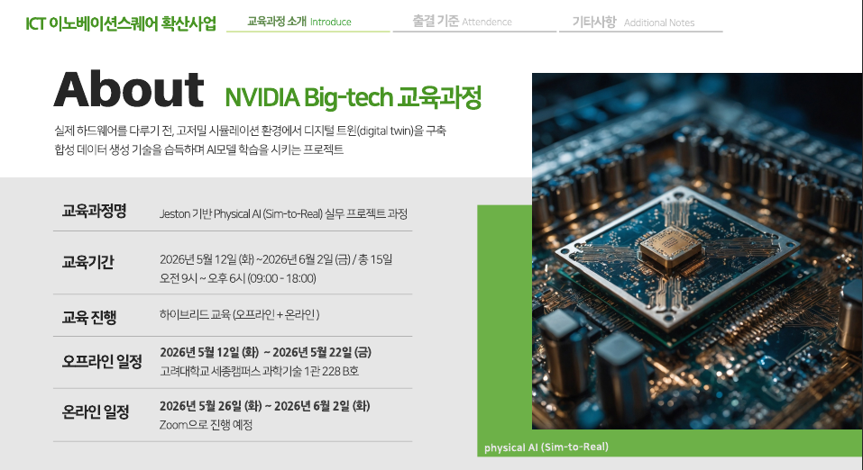
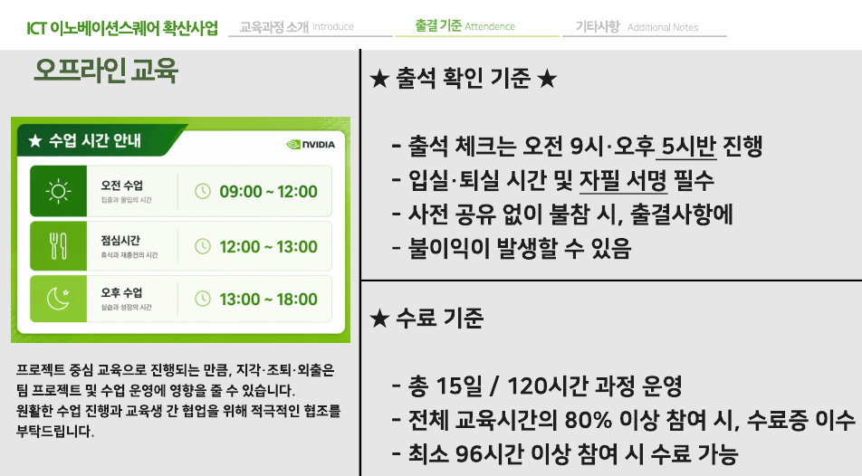

# Nvidia Sim-to-Real (KOREA Univ.)

 <br>
 <br>

* https://github.com/eleparts
* https://blog.naver.com/allai-
* 1일차 자료 : https://brr.kr/erfpgd
* 2일차 자료 : https://brr.kr/h58xxe
* 3일차 자료 : https://brr.kr/h2lkiu
* 4일차 자료 : https://brr.kr/d9oxae

https://stevenkim1217.tistory.com/entry/%EC%9E%84%EB%B2%A0%EB%94%94%EB%93%9C-%EC%95%BC%EB%B6%90-%EC%A0%AF%EC%8A%A8%EB%82%98%EB%85%B8-B01-SUB-%EB%B6%80%ED%8C%85-Yahboom-Jetson-Nano-B01-SUB

https://learn.nvidia.com/courses/course?course_id=course-v1:DLI+S-RX-02+V2&unit=block-v1:DLI+S-RX-02+V2+type@vertical+block@aba5104413ae454c8c63a6f301925337

## Day1
   * Class01 : (강의) 교육소개 : 운영체제 리눅스 기초 / Jetson Nano에 OS image flashing 
   * Class02 : (실습) Virtual Box 설치 / Jetson Nano에 OS image flashing
   * Class03 : (강의) Jetson 소개 / 리눅스 네트워크, Jetpack library 소개 / (실습) Jetpack library 설치, Network 실습
   * Class04 : (강의) Jetson GPIO 소개 / (실습) Jetson gpio로 LED 제어 실습
   * Class05 : (강의) Jetson I2C 소개 / (실습) Jetson I2C로 LCD/IMU 제어 실습
   * Class06 : (강의) Jetson SPI 소개 / (실습) Jetson SPI로 광센서(CDS) 제어 실습
   * Class07 : (강의) OpenCV 소개 / (실습) Cuda Enabled OpenCV 실습
   * Class08 : (실습) OpenCV기반 Label, DNN 실습

```
sudo apt update
sudo apt install gparted -y
```

## Day2
   * Class01 : (강의) Jetson DLI 소개 / CUDA, Object Detection 등 소개 
   * Class02 : (실습) Jetson DLI docker 설치 / Jupyter 사용 실습
   * Class03 : (실습) Jetson DLI Image classification 실습
   * Class04 : (실습) Jetson DLI Image regression 실습
   * Class05 : (강의) Tensorflow 소개 / (실습) Cuda Enabled Tensorflow 실습
   * Class06 : (실습) Tensorflow MNIST mlc/cnn 학습 추론 실습
   * Class07 : (강의) Darknet, Pytorch. TensorRT 소개 / (실습) Darknet 실습
   * Class08 : (실습) Pytorch (yolov5) 실습

## Day3
   * Class01 : (실습) TensorRT 모델 변환 및 추론 실습
   * Class02 : (강의) Mediapipe 소개 / (실습) mediapipe 실습
   * Class03 : (실습) mediapipe 얼굴 인식 실습
   * Class04 : (실습) mediapipe 손 제스처 인식 실습
   * Class05 : 로봇에 jetson nano 조립
   * Class06 : 로봇에 jetson nano 조립
   * Class07 : (강의) 교육소개 / ROS 소개 및 설치
   * Class08 : (실습) Jetson ROS 설치

## Day4
   * Class01 : (강의) ROS 토픽 서비스 액션 소개 / (실습) 토픽 발간 구독
   * Class02 : (강의) ROS 제어기 패키지 / (실습) Catkin 토픽 발간구독
   * Class03 : (강의) ROS 주요도구 / (실습) 로봇 Catkin 패키지
   * Class04 : (실습) 로봇 Catkin 패키지
   * Class05 : (실습) ROS 주요 tool 보기 / 원격개발환경구축
   * Class06 : (실습) 원격개발환경구축
   * Class07 : (강의) Rviz, Odometry TF
   * Class08 : (실습) 모터구동

## Day5
   * Class01 : (강의) SLAM / (실습) SLAM(Gmapping)
   * Class02 : (실습) SLAM(Gmapping)
   * Class03 : (강의) Navigation / (실습) Navigation 해보기
   * Class04 : (실습) Navigation 해보기
   * Class05 : (실습) SLAM(Cartographer)
   * Class06 : (실습) SLAM(Cartographer) / (실습) Rviz와 Nevigation
   * Class07 : (실습) Rviz와 Nevigation
   * Class08 : (실습) Move_Base노드와 SendGoals

```
nvidia@nvidia-desktop:~$ ifconfig
docker0: flags=4099<UP,BROADCAST,MULTICAST>  mtu 1500
        inet 172.17.0.1  netmask 255.255.0.0  broadcast 172.17.255.255
        ether 02:42:e6:b5:49:4d  txqueuelen 0  (Ethernet)
        RX packets 0  bytes 0 (0.0 B)
        RX errors 0  dropped 0  overruns 0  frame 0
        TX packets 0  bytes 0 (0.0 B)
        TX errors 0  dropped 0 overruns 0  carrier 0  collisions 0

eth0: flags=4099<UP,BROADCAST,MULTICAST>  mtu 1500
        ether 3c:6d:66:0b:0f:55  txqueuelen 1000  (Ethernet)
        RX packets 12416  bytes 16950312 (16.9 MB)
        RX errors 0  dropped 0  overruns 0  frame 0
        TX packets 5476  bytes 384393 (384.3 KB)
        TX errors 0  dropped 0 overruns 0  carrier 0  collisions 0
        device interrupt 151  base 0xb000  

l4tbr0: flags=4163<UP,BROADCAST,RUNNING,MULTICAST>  mtu 1500
        inet 192.168.55.1  netmask 255.255.255.0  broadcast 192.168.55.255
        inet6 fe80::1  prefixlen 128  scopeid 0x20<link>
        inet6 fe80::f4bb:a1ff:fe3d:5255  prefixlen 64  scopeid 0x20<link>
        ether f6:bb:a1:3d:52:55  txqueuelen 1000  (Ethernet)
        RX packets 1669  bytes 133004 (133.0 KB)
        RX errors 0  dropped 0  overruns 0  frame 0
        TX packets 425  bytes 59094 (59.0 KB)
        TX errors 0  dropped 0 overruns 0  carrier 0  collisions 0

lo: flags=73<UP,LOOPBACK,RUNNING>  mtu 65536
        inet 127.0.0.1  netmask 255.0.0.0
        inet6 ::1  prefixlen 128  scopeid 0x10<host>
        loop  txqueuelen 1  (Local Loopback)
        RX packets 979  bytes 75617 (75.6 KB)
        RX errors 0  dropped 0  overruns 0  frame 0
        TX packets 979  bytes 75617 (75.6 KB)
        TX errors 0  dropped 0 overruns 0  carrier 0  collisions 0

rndis0: flags=4163<UP,BROADCAST,RUNNING,MULTICAST>  mtu 1500
        inet6 fe80::f4bb:a1ff:fe3d:5255  prefixlen 64  scopeid 0x20<link>
        ether f6:bb:a1:3d:52:55  txqueuelen 1000  (Ethernet)
        RX packets 1703  bytes 136272 (136.2 KB)
        RX errors 0  dropped 4  overruns 0  frame 0
        TX packets 463  bytes 90241 (90.2 KB)
        TX errors 0  dropped 0 overruns 0  carrier 0  collisions 0

usb0: flags=4163<UP,BROADCAST,RUNNING,MULTICAST>  mtu 1500
        inet6 fe80::f4bb:a1ff:fe3d:5257  prefixlen 64  scopeid 0x20<link>
        ether f6:bb:a1:3d:52:57  txqueuelen 1000  (Ethernet)
        RX packets 0  bytes 0 (0.0 B)
        RX errors 0  dropped 0  overruns 0  frame 0
        TX packets 654  bytes 126496 (126.4 KB)
        TX errors 0  dropped 0 overruns 0  carrier 0  collisions 0

wlan0: flags=4163<UP,BROADCAST,RUNNING,MULTICAST>  mtu 1500
        inet 192.168.1.7  netmask 255.255.255.0  broadcast 192.168.1.255
        inet6 fe80::8e58:189d:2be7:fc11  prefixlen 64  scopeid 0x20<link>
        ether 90:de:80:db:79:96  txqueuelen 1000  (Ethernet)
        RX packets 22477  bytes 28928373 (28.9 MB)
        RX errors 0  dropped 0  overruns 0  frame 0
        TX packets 7151  bytes 1351905 (1.3 MB)
        TX errors 0  dropped 0 overruns 0  carrier 0  collisions 0
```

```
+---실습_1-02_windowPC_virtualbox_install
|       allai-mfi-jcb100-nano.tbz2
|       balenaEtcher-1.19.21.Setup.exe
|       code_1.84.2-1699528352_amd64.deb
|       jcb100_nano_sd.img
|       Oracle_VM_VirtualBox_Extension_Pack-7.0.14.vbox-extpack
|       ubuntu-18.04.6-desktop-amd64-003.iso
|       VirtualBox-7.0.14-161095-Win.exe
|       VSCodeUserSetup-x64-1.84.2.exe
|       VBoxGuestAdditions_7.0.14.iso
|
+---실습_1-04_linux_network_jetson_stats
|   |   .DS_Store
|   |
|   \---jetson-fan-ctl
|       |   uninstall.sh
|       |   fanctl.py
|       |   .DS_Store
|       |   install.sh
|       |   config.json
|       |   00_MIT_License.txt
|       |   README.md
|       |   automagic-fan.service
|       |
|       +---.git
|       |   |   description
|       |   |   HEAD
|       |   |   packed-refs
|       |   |   config
|       |   |   index
|       |   |
|       |   +---branches
|       |   +---refs
|       |   |   +---tags
|       |   |   +---remotes
|       |   |   |   \---origin
|       |   |   |           HEAD
|       |   |   |
|       |   |   \---heads
|       |   |           master
|       |   |
|       |   +---objects
|       |   |   +---info
|       |   |   +---pack
|       |   |   +---aa
|       |   |   |       ad9bf3b5ace8c46f3aa3a619bbbb2a11847ae9
|       |   |   |
|       |   |   +---af
|       |   |   |       685abb5344686325e13b24123c8d8084d17590
|       |   |   |
|       |   |   +---ba
|       |   |   |       a6d656d362df1f1c88fabecf137c4491472846
|       |   |   |
|       |   |   +---2d
|       |   |   |       1d80974b60152de2485bec7065cc75434c85b0
|       |   |   |       2c2c0ed0e7144a49eb99a33ba7b470af576ca8
|       |   |   |
|       |   |   +---f6
|       |   |   |       c2c153405070badf88ad8aee5227f0039d3be2
|       |   |   |       a2e43626353d8c208c2998de5df3d5fbebe8e9
|       |   |   |
|       |   |   +---f0
|       |   |   |       8d33543d9dc45938934fdd7ea9c87d057e1b6c
|       |   |   |
|       |   |   +---83
|       |   |   |       2f7eadc55330670274819f85777b3f0d3f4bfb
|       |   |   |
|       |   |   +---b6
|       |   |   |       cf09e91327c22d8d02bf96c958798c908480c2
|       |   |   |       73ac40b569145a804f87a775b6e2a31c19dcb2
|       |   |   |       045a4d2f1aa02ef37b1d8c50127415a7ff830e
|       |   |   |
|       |   |   +---85
|       |   |   |       58231b05c7987679b121f3760f10edb9972ba2
|       |   |   |       47036b09d5e3b8988785b84cb42f308070394d
|       |   |   |
|       |   |   +---7f
|       |   |   |       2ef1fba3ac76f18da87fea57c806098fe602c4
|       |   |   |       ba1e50e1ca89ae6d031d57346eabaf0397c79c
|       |   |   |
|       |   |   +---db
|       |   |   |       af9d7b72fb1eacc624c6e71691edc88079a40d
|       |   |   |       86465db9004a49fd42cceadb8e539332ed288f
|       |   |   |
|       |   |   +---a9
|       |   |   |       6e420f24c2c78d82d0564312f3b9d16697d2ff
|       |   |   |
|       |   |   +---8e
|       |   |   |       035869128eeeb87836a3249a164f4b0bd433ce
|       |   |   |
|       |   |   +---77
|       |   |   |       abf59738e9112468bee227591598a4ce44acb2
|       |   |   |
|       |   |   +---ef
|       |   |   |       0d35e55a63d9260be2647dd7bb647aa0284f3d
|       |   |   |
|       |   |   +---b1
|       |   |   |       6307242a15dba24429b7ceb8e6dbf0b9d3a81e
|       |   |   |
|       |   |   +---25
|       |   |   |       80fc10b0cca34123201baeece4aaf7d7d8ef0c
|       |   |   |
|       |   |   +---63
|       |   |   |       addcdc3a5303bf17498eeef6ca9bd615ec4fda
|       |   |   |
|       |   |   +---4d
|       |   |   |       712b731c6e088a2894ba09722382f907e497dd
|       |   |   |       550420486404a2f348452fcf12e7f453004be5
|       |   |   |
|       |   |   +---6c
|       |   |   |       16993993c013deb9bd5c49d3a6bcdedf86a568
|       |   |   |       3d8166a08b1bf23aa5b5ed47e541deefd2e959
|       |   |   |       8f739d73b274698dc4c29f20cb7a98f42fdb63
|       |   |   |
|       |   |   +---19
|       |   |   |       6a3cd535ae05b2fb7a1ef634dee1d2afe16fc2
|       |   |   |
|       |   |   +---d5
|       |   |   |       106791697bd1d128e896d7275f80249468775c
|       |   |   |
|       |   |   +---e1
|       |   |   |       32a6fa71df89b3f13b4d37b965e76267ffb1d0
|       |   |   |
|       |   |   +---ff
|       |   |   |       aba8798d7a7ddb7987b1594937a3167ad042c8
|       |   |   |       9b641e52ef4512c39695f5cbd637b9ffed8865
|       |   |   |
|       |   |   +---f8
|       |   |   |       4970eda97c975f4796e478e0817e1ce19c7aae
|       |   |   |
|       |   |   +---09
|       |   |   |       2055e2c7fd088c70564a66af31dd6b13818577
|       |   |   |
|       |   |   +---18
|       |   |   |       027887a69277cdd89620bcad6b686a52fdb1ca
|       |   |   |
|       |   |   +---c5
|       |   |   |       ab1dca47253537fe7d56085b3814d27e2114c0
|       |   |   |
|       |   |   +---5b
|       |   |   |       4904e578820ac4c17b7d517a50dd1e73153a16
|       |   |   |
|       |   |   +---88
|       |   |   |       a6bcffb1a95971e43308c04cb79013144e496b
|       |   |   |
|       |   |   +---a7
|       |   |   |       7907ffc187e3e136e3736c4feffab7c3a5f978
|       |   |   |
|       |   |   +---e3
|       |   |   |       f045f113e3ffdcc1fdbfef03a4f123a67b66da
|       |   |   |
|       |   |   +---70
|       |   |   |       33c89c1139ccf0443482a7636d557f6532b471
|       |   |   |       25432d2a2bbb8aad10727218682d3ba1352189
|       |   |   |
|       |   |   +---6d
|       |   |   |       2c1ae0950fac948bd63cd10d63f759cbde080c
|       |   |   |
|       |   |   +---84
|       |   |   |       73f10a9ea45fc3ca5c85dc6bbe28238a4baa53
|       |   |   |
|       |   |   +---d2
|       |   |   |       d9a1c35882ae1fc4520ee9280f57521bc37cb8
|       |   |   |
|       |   |   +---07
|       |   |   |       c2951bf1c43a787bdb5a947079e0898ee11123
|       |   |   |
|       |   |   +---b2
|       |   |   |       021cbf44f6ea63952ae84fa207c4b590f8e0b7
|       |   |   |
|       |   |   +---39
|       |   |   |       a6c902e0d83bfa9041034fd459c794dd62c1e2
|       |   |   |
|       |   |   +---49
|       |   |   |       67b98d2073b23a50f65b0e8e12a5e308f437c4
|       |   |   |
|       |   |   +---72
|       |   |   |       a96d63afe495a417a63dc563d8465084236f43
|       |   |   |
|       |   |   +---4e
|       |   |   |       9646dbcb5c377302c58671116d0561cfb3fde8
|       |   |   |
|       |   |   +---f1
|       |   |   |       5f7f8e2e3f89149919ee27e8044bfc71c12c9d
|       |   |   |
|       |   |   +---28
|       |   |   |       48e0a7e5dc142acda5b6cf866e5deed5d430d8
|       |   |   |
|       |   |   +---73
|       |   |   |       1b0cbf39728f45d05fabbc9950fba53a17d02e
|       |   |   |
|       |   |   +---9f
|       |   |   |       f1158004b719532a189583b8ec120799d78e2a
|       |   |   |
|       |   |   +---b3
|       |   |   |       bca90f6e5d90720f354351c867444b916d0fb2
|       |   |   |
|       |   |   +---9e
|       |   |   |       05eac4c1e96e8804d05445a2d7b275a3c2db70
|       |   |   |
|       |   |   +---11
|       |   |   |       a52ccadaa0ff68d6f3548174f1221846c06d41
|       |   |   |
|       |   |   +---27
|       |   |   |       4c50766e874ecee4f6d934b142c1b29f8790c7
|       |   |   |
|       |   |   +---ac
|       |   |   |       3768b623bb9163d4db923395b491954a0c49bf
|       |   |   |       e322a8d69529f379f7fcabff401e90e8f9e968
|       |   |   |
|       |   |   +---35
|       |   |   |       8e10a091454fb5843a99c687ef976e3f79b84f
|       |   |   |
|       |   |   +---eb
|       |   |   |       7066f30172972e58af0c52fd4d583c65c1332f
|       |   |   |
|       |   |   +---fe
|       |   |   |       5978e6420fc06a7b8aba1ea6ddd8c1ef63ec16
|       |   |   |       5d000191cc6abc66ec885db3b2bf6f08d84210
|       |   |   |
|       |   |   +---69
|       |   |   |       6cf7cb35d7b4adb923e2ba354b034deb4c52fd
|       |   |   |
|       |   |   +---26
|       |   |   |       38caea92768e97137ef2fcdbd895de2ab4bb6e
|       |   |   |
|       |   |   +---33
|       |   |   |       80782cfda51fc5083a90ee6085861662158173
|       |   |   |
|       |   |   +---30
|       |   |   |       2de34cd99483ea8c89a1bef7ed4783cab05d4d
|       |   |   |
|       |   |   +---1a
|       |   |   |       ce536631b73d9103b7e72be48c0caaa701d108
|       |   |   |
|       |   |   +---6b
|       |   |   |       31e3f85d9694cc3773e6f11562cdf0b6481573
|       |   |   |
|       |   |   +---29
|       |   |   |       37d8eddad73970810c997689db3128aec4a793
|       |   |   |
|       |   |   +---93
|       |   |   |       dd8443b4859eb3f55e48685502bf2f3edd56e8
|       |   |   |
|       |   |   +---51
|       |   |   |       7df30732647233440f354b9943692a6f46ccb9
|       |   |   |
|       |   |   +---ca
|       |   |   |       9fcace8f52d9ea464d3cfdc17af8c2557e9dd5
|       |   |   |       cfac3b6c096edb252ff9dac788b121bf54b904
|       |   |   |
|       |   |   +---bd
|       |   |   |       ed7963edd0b476686ea3a2edeb25ef1b968fe2
|       |   |   |
|       |   |   +---c6
|       |   |   |       4875fac8ef66e6c6f33781465b7b2aeb1f68d5
|       |   |   |
|       |   |   +---58
|       |   |   |       6964530afc5014ddeeaecf10ad987435eb6e02
|       |   |   |
|       |   |   +---cf
|       |   |   |       5412d770484ccd881c92a3a2d8d78b3ad3ec9d
|       |   |   |
|       |   |   +---59
|       |   |   |       5619f697060a9ce0146b23a0a62d8a58192349
|       |   |   |
|       |   |   +---67
|       |   |   |       ae861204b879e4fb9456bb8306adc0b2cf6791
|       |   |   |
|       |   |   +---d7
|       |   |   |       d02e997a3a21849604594d52ad207fc3eec823
|       |   |   |
|       |   |   +---56
|       |   |   |       131c04c6ba1b4a146ed52a896117f5489b0b1f
|       |   |   |
|       |   |   +---5a
|       |   |   |       d5c4e49f692a5bdd1d966a07f11083cad19c2e
|       |   |   |
|       |   |   +---9c
|       |   |   |       a7f0a50878ccdda6f01ca3ff5284b0e371ff7d
|       |   |   |
|       |   |   \---57
|       |   |           c7e83f0fde700e504faf7c1a7a56bbc6b88e76
|       |   |
|       |   +---info
|       |   |       exclude
|       |   |
|       |   +---hooks
|       |   |       prepare-commit-msg.sample
|       |   |       post-update.sample
|       |   |       commit-msg.sample
|       |   |       pre-receive.sample
|       |   |       pre-push.sample
|       |   |       applypatch-msg.sample
|       |   |       pre-commit.sample
|       |   |       pre-rebase.sample
|       |   |       fsmonitor-watchman.sample
|       |   |       pre-applypatch.sample
|       |   |       update.sample
|       |   |
|       |   \---logs
|       |       |   HEAD
|       |       |
|       |       \---refs
|       |           +---heads
|       |           |       master
|       |           |
|       |           \---remotes
|       |               \---origin
|       |                       HEAD
|       |
|       \---01_Images
|               README.md
|               Waveshare_4pins_PWM_Fan.png
|
+---실습_1-06_gpio
|   |   .DS_Store
|   |
|   \---jetson-gpio
|       |   MANIFEST.in
|       |   LICENSE.txt
|       |   .gitignore
|       |   setup.py
|       |   README.md
|       |   .DS_Store
|       |
|       +---.git
|       |   |   index
|       |   |   HEAD
|       |   |   description
|       |   |   packed-refs
|       |   |   config
|       |   |
|       |   +---branches
|       |   +---objects
|       |   |   +---info
|       |   |   \---pack
|       |   |           pack-25553fe1a6b116259f882d400997ffb4cca37da1.idx
|       |   |           pack-25553fe1a6b116259f882d400997ffb4cca37da1.pack
|       |   |
|       |   +---refs
|       |   |   +---tags
|       |   |   +---remotes
|       |   |   |   \---origin
|       |   |   |           HEAD
|       |   |   |
|       |   |   \---heads
|       |   |           master
|       |   |
|       |   +---hooks
|       |   |       pre-receive.sample
|       |   |       post-update.sample
|       |   |       commit-msg.sample
|       |   |       applypatch-msg.sample
|       |   |       pre-rebase.sample
|       |   |       pre-push.sample
|       |   |       prepare-commit-msg.sample
|       |   |       pre-commit.sample
|       |   |       update.sample
|       |   |       pre-applypatch.sample
|       |   |       fsmonitor-watchman.sample
|       |   |
|       |   +---info
|       |   |       exclude
|       |   |
|       |   \---logs
|       |       |   HEAD
|       |       |
|       |       \---refs
|       |           +---remotes
|       |           |   \---origin
|       |           |           HEAD
|       |           |
|       |           \---heads
|       |                   master
|       |
|       +---samples
|       |   |   test_all_pins.py
|       |   |   simple_input.py
|       |   |   test_all_pins_input.py
|       |   |   issue40-trigger.py
|       |   |   jetson_model.py
|       |   |   button_interrupt.py
|       |   |   simple_out.py
|       |   |   button_led.py
|       |   |   button_event.py
|       |   |   test_all_apis.py
|       |   |   run_sample.sh
|       |   |   simple_pwm.py
|       |   |   issue40.py
|       |   |
|       |   \---docker
|       |           Dockerfile
|       |
|       +---.github
|       |   +---workflows
|       |   |       codeql-analysis.yml
|       |   |
|       |   \---ISSUE_TEMPLATE
|       |           bug_report.md
|       |
|       +---debian
|       |   |   rules
|       |   |   changelog
|       |   |   copyright
|       |   |   jetson-gpio-common.udev
|       |   |   compat
|       |   |   python-jetson-gpio.postinst
|       |   |   python3-jetson-gpio.postinst
|       |   |   control
|       |   |
|       |   \---source
|       |           format
|       |
|       \---lib
|           \---python
|               +---Jetson
|               |   |   __init__.py
|               |   |
|               |   \---GPIO
|               |           __init__.py
|               |           gpio_cdev.py
|               |           gpio_pin_data.py
|               |           99-gpio.rules
|               |           gpio_event.py
|               |           gpio.py
|               |
|               \---RPi
|                   |   __init__.py
|                   |
|                   \---GPIO
|                           __init__.py
|
+---실습_1-08_i2c
|   |   .DS_Store
|   |
|   +---mpu6050
|   |       mpu6050_simpletest2.py
|   |       .DS_Store
|   |       boxctrl_imu.py
|   |       mpu6050_simpletest1.py
|   |       smbus_test.py
|   |
|   \---RPi_I2C_LCD_driver
|       |   .DS_Store
|       |   LICENSE
|       |   README.md
|       |   RPi_I2C_driver.py
|       |   example.py
|       |   start.sh
|       |
|       +---.git
|       |   |   packed-refs
|       |   |   index
|       |   |   HEAD
|       |   |   description
|       |   |   config
|       |   |
|       |   +---branches
|       |   +---refs
|       |   |   +---tags
|       |   |   +---remotes
|       |   |   |   \---origin
|       |   |   |           HEAD
|       |   |   |
|       |   |   \---heads
|       |   |           master
|       |   |
|       |   +---objects
|       |   |   +---info
|       |   |   \---pack
|       |   |           pack-4335aecf9a621aa4c1fa9ecb1348ab30d9445ec3.idx
|       |   |           pack-4335aecf9a621aa4c1fa9ecb1348ab30d9445ec3.pack
|       |   |
|       |   +---info
|       |   |       exclude
|       |   |
|       |   +---hooks
|       |   |       pre-receive.sample
|       |   |       prepare-commit-msg.sample
|       |   |       pre-commit.sample
|       |   |       commit-msg.sample
|       |   |       pre-push.sample
|       |   |       post-update.sample
|       |   |       pre-rebase.sample
|       |   |       applypatch-msg.sample
|       |   |       fsmonitor-watchman.sample
|       |   |       update.sample
|       |   |       pre-applypatch.sample
|       |   |
|       |   \---logs
|       |       |   HEAD
|       |       |
|       |       \---refs
|       |           +---heads
|       |           |       master
|       |           |
|       |           \---remotes
|       |               \---origin
|       |                       HEAD
|       |
|       +---example
|       |   |   Blink.py
|       |   |   SerialDisplay.py
|       |   |   HelloWorld.py
|       |   |   lcd_test.py
|       |   |   RPi_I2C_driver.py
|       |   |   CustomCharactor_Test.py
|       |   |   CustomCharactor_Hangle_Test.py
|       |   |   TextDirection.py
|       |   |   Autoscroll.py
|       |   |   setCursor.py
|       |   |   Display.py
|       |   |   Scroll.py
|       |   |   CustomCharactor.py
|       |   |   Cursor.py
|       |   |
|       |   \---__pycache__
|       |           RPi_I2C_driver.cpython-36.pyc
|       |
|       +---circuit_image
|       |       5V_I2C_LCD_Logic_Level_converter.png
|       |       3.3V_I2C_LCD.png
|       |
|       \---original_example
|               RPi_I2C_driver.py
|               examples.py
|
+---실습_1-10_spi
|   |   .DS_Store
|   |
|   +---MCP3008
|   |       mcp3008.py
|   |       mcp3008_output.py
|   |       .DS_Store
|   |       RPi_I2C_driver.py
|   |
|   \---spidev-test
|       |   LICENSE
|       |   README.md
|       |   .gitignore
|       |   spidev_test.c
|       |   spidev_test
|       |
|       \---.git
|           |   HEAD
|           |   packed-refs
|           |   config
|           |   description
|           |   index
|           |
|           +---branches
|           +---refs
|           |   +---tags
|           |   +---heads
|           |   |       master
|           |   |
|           |   \---remotes
|           |       \---origin
|           |               HEAD
|           |
|           +---objects
|           |   +---pack
|           |   +---info
|           |   +---28
|           |   |       6950dfb8b84179892d79c9d5287ad82c8a5b09
|           |   |
|           |   +---f6
|           |   |       c449b79b68397d223322ac4a6e0a6f20c363a4
|           |   |
|           |   +---da
|           |   |       59562d98b386357ca78a58333fd521366af9dd
|           |   |
|           |   +---f8
|           |   |       05e810e5c6e087791506b4e721958de3574ae4
|           |   |
|           |   +---c4
|           |   |       7b07446d49c4d0709825ce11d55a072ef23f4b
|           |   |
|           |   +---52
|           |   |       5f24fd656042d006a771457ad325ab5e3dc2b6
|           |   |
|           |   +---ee
|           |   |       1bd93a747aa35d988b3a24c21ca47fb85cd0a0
|           |   |
|           |   +---2d
|           |   |       89d684fcb5cce46c5514009a9245992af560aa
|           |   |
|           |   +---ce
|           |   |       1f8df6ff97d0dd27a154e565b69706348b5bd8
|           |   |
|           |   +---e7
|           |   |       c2c177790bb2898293a5758ba9db87108e187b
|           |   |
|           |   +---23
|           |   |       cb790338e191e29205d6f4123882c0583ef8eb
|           |   |
|           |   +---dd
|           |   |       95560348d6f8eb62df10206607423d187a710b
|           |   |
|           |   +---27
|           |   |       ad2544e2d41a175dd602f12a19ef603cf120e5
|           |   |
|           |   +---55
|           |   |       1481e75bc7f7eded6c2f1542d0110b8f8d5ef6
|           |   |
|           |   +---10
|           |   |       0a621ab7f6c9c6cb1206d14bbb4fbece6537b4
|           |   |
|           |   +---46
|           |   |       a707c89608eef7df36fe36ee069adad98fccf1
|           |   |
|           |   +---aa
|           |   |       0a358d52ae4904b2c5924c69ac47760b1ea8c7
|           |   |       8cb6f00f43730362f5f3f706ed6386eddd414f
|           |   |
|           |   +---53
|           |   |       f3a39f81dce2a3d3c20ae338d43145fe2d397d
|           |   |
|           |   +---45
|           |   |       3596c9541f01705d786a40802d068238eae215
|           |   |
|           |   +---9a
|           |   |       d10bc369f38af628fd5ed761a523f5e9a04cb1
|           |   |
|           |   +---79
|           |   |       9ad53f273f940e6af10618d80d7befa8c568cc
|           |   |
|           |   +---cf
|           |   |       49cad826e396fe610430d270e975694e465a13
|           |   |
|           |   +---a9
|           |   |       fa1780446d687d9180fdb2043d0df875da82b7
|           |   |
|           |   +---65
|           |   |       3ff3b6140fde2720103c8f5cd0a7835dade11b
|           |   |
|           |   \---0b
|           |           7ecd60c56de6eb36ed553cfa9ebecf34aea8c1
|           |
|           +---hooks
|           |       pre-commit.sample
|           |       commit-msg.sample
|           |       pre-rebase.sample
|           |       post-update.sample
|           |       pre-receive.sample
|           |       applypatch-msg.sample
|           |       prepare-commit-msg.sample
|           |       pre-push.sample
|           |       fsmonitor-watchman.sample
|           |       update.sample
|           |       pre-applypatch.sample
|           |
|           +---info
|           |       exclude
|           |
|           \---logs
|               |   HEAD
|               |
|               \---refs
|                   +---remotes
|                   |   \---origin
|                   |           HEAD
|                   |
|                   \---heads
|                           master
|
\---실습_1-12_opencv
    |   .DS_Store
    |   opencv_install.txt
    |   opencv-4.5.1.tar.gz
    |
    \---opencv_ex
        +---opencv_cpp
        |   +---opencv_version
        |   |       .DS_Store
        |   |       CMakeLists.txt
        |   |       opencv_version.cpp
        |   |
        |   \---opencv_camera
        |       |   .DS_Store
        |       |
        |       +---camera_binarization
        |       |       .DS_Store
        |       |       CMakeLists.txt
        |       |       binarization.cpp
        |       |
        |       +---camera_labeling
        |       |       keyboard.bmp
        |       |       .DS_Store
        |       |       CMakeLists.txt
        |       |       labeling.cpp
        |       |
        |       \---camera_capture
        |               camera_capture.cpp
        |               .DS_Store
        |               CMakeLists.txt
        |
        +---opencv_py
        |       keyboard.bmp
        |       opencv_version.py
        |       opencv_camera.py
        |       labeling.py
        |
        \---opencv_cuda
            |   check_cuda.py
            |   hough_performance_test.py
            |
            +---face_detector
            |       dnnface_cuda.py
            |       deploy.prototxt
            |       dnnface.py
            |       res10_300x300_ssd_iter_140000_fp16.caffemodel
            |
            \---object_detector
                    yolov3.cfg
                    object_detector_cuda.py
                    yolov3-tiny.cfg
                    object_detector.py
                    coco.names
                    yolov3.weights
                    yolov3-tiny.weights
```

