# README_FRANKA.md

# Franka Robotics / Franka Emika Panda 정리

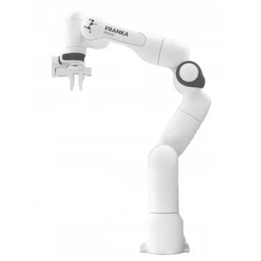 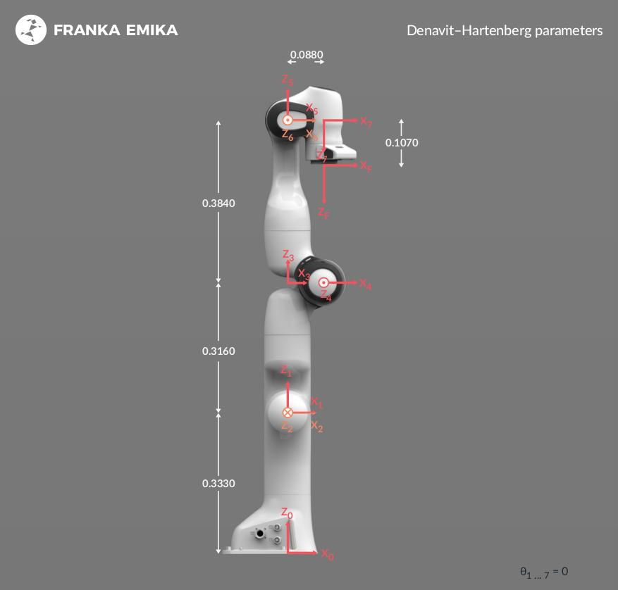 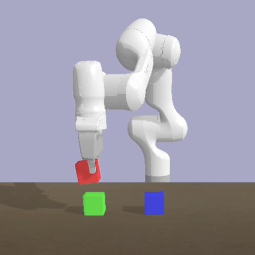  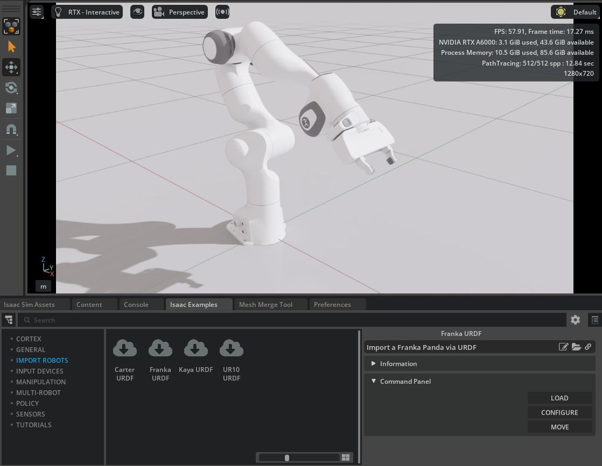

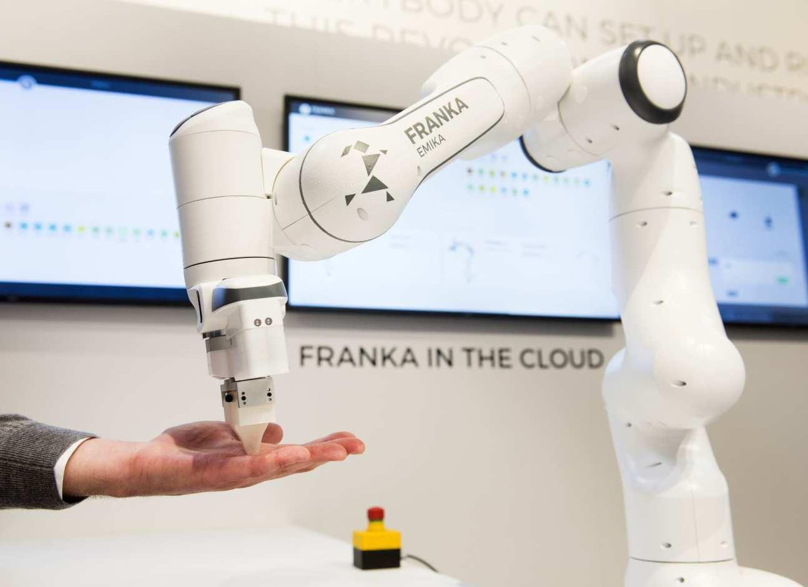  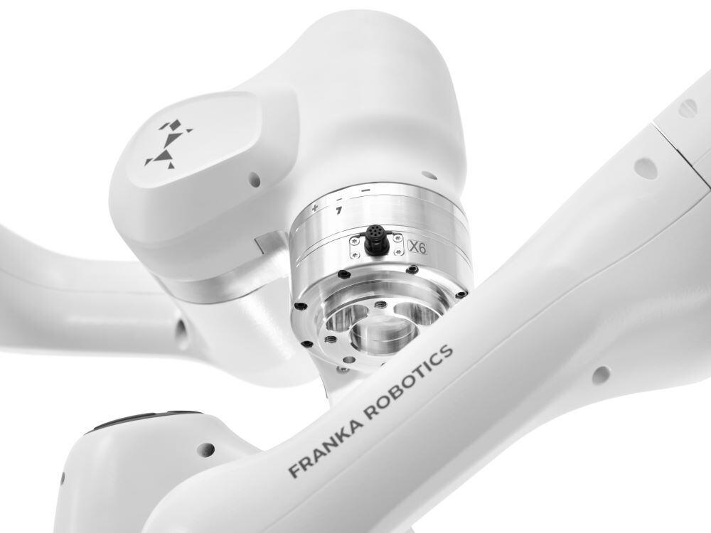 
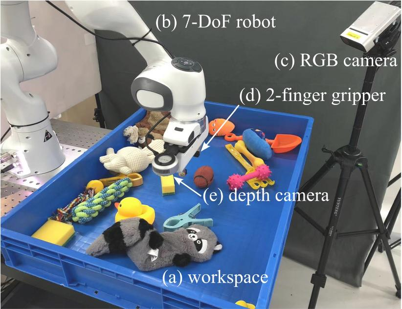 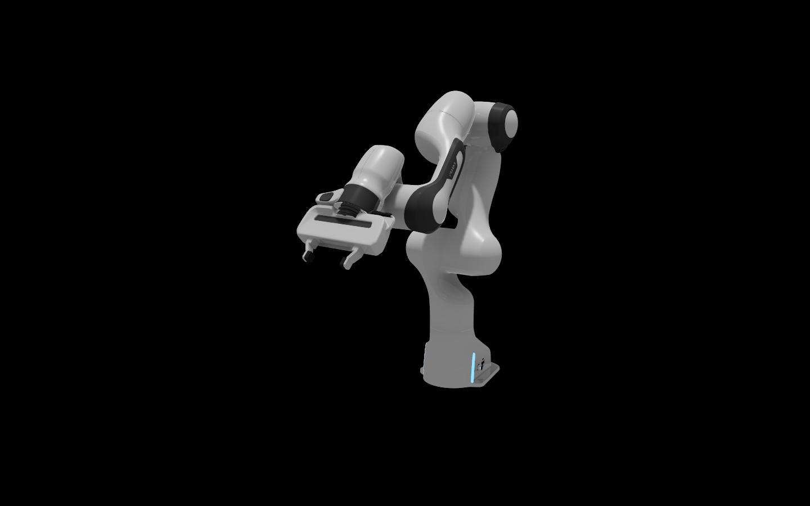 
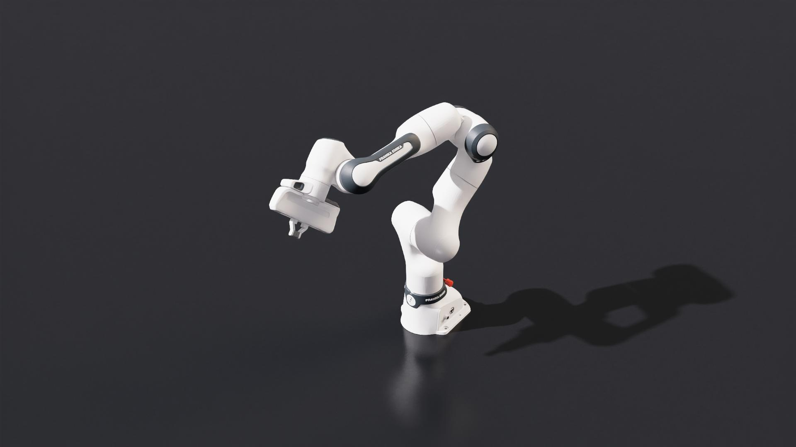  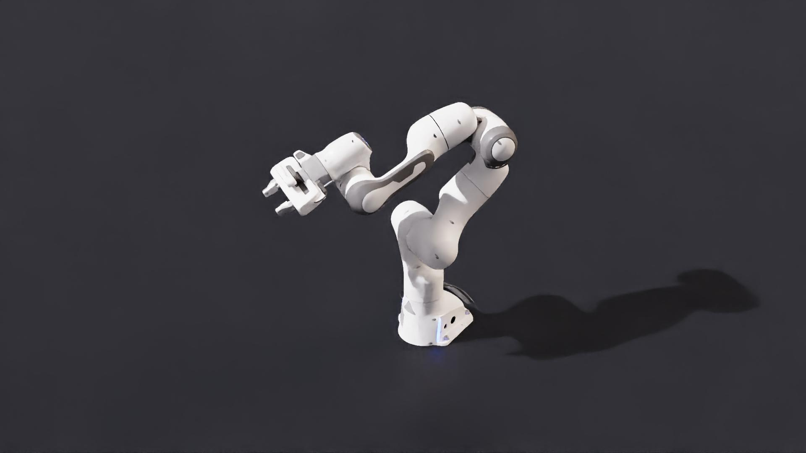 
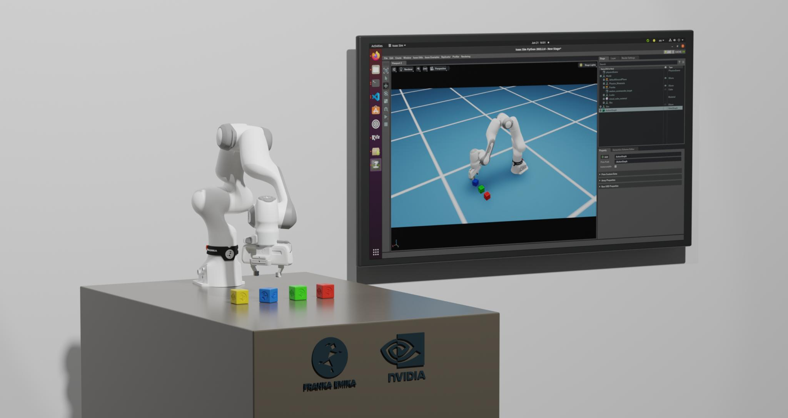 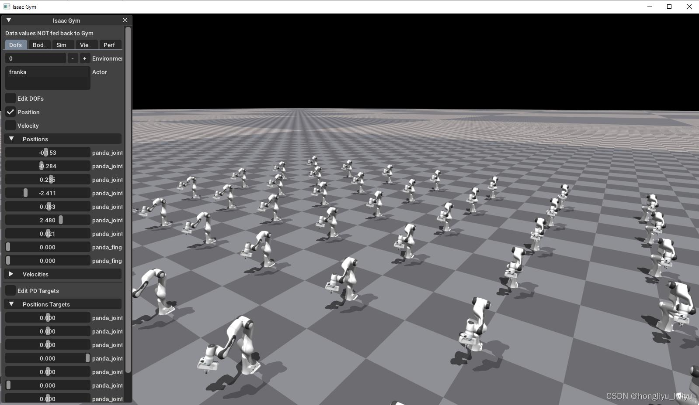

## 개요

Franka Robotics의 Franka Emika Panda(FR3)는 연구 및 AI Robotics 분야에서 가장 많이 사용되는 협동로봇(CoBot) 중 하나입니다.

특징:
- 7축(7DOF) 협동로봇
- Torque Sensor 내장
- 높은 정밀도
- AI / RL / Isaac Sim / ROS2 친화적
- 연구 및 교육 플랫폼으로 널리 사용

---

# 대표 모델

## Franka Emika Panda

- 7 DOF
- Payload 약 3kg
- Reach 약 855mm
- Repeatability ±0.1mm

## Franka Research 3 (FR3)

Panda의 최신 세대 모델.

개선점:
- 향상된 내구성
- 강화된 제어
- 산업 환경 대응
- 연구 플랫폼 최적화

---

# Kinematics 구조

Franka는 전형적인 Serial Manipulator 구조를 가진다.

Joint 구성:

1. Base Rotation
2. Shoulder
3. Elbow
4. Wrist
5. Wrist
6. Wrist
7. Tool Orientation

---

# Forward Kinematics

Forward Kinematics:

T = T1 * T2 * T3 * T4 * T5 * T6 * T7

DH Parameter 기반으로 계산 가능.

---

# Inverse Kinematics (IK)

Franka는 7축이므로 redundancy가 존재한다.

즉:

7 DOF - 6 DOF End-effector = 1 redundancy

이 redundancy를 이용해:
- 장애물 회피
- 자연스러운 자세
- 관절 제한 회피
- 최적화 제어

가능.

---

# Jacobian 기반 IK

대표 수식:

Δq = J† Δx

여기서:
- J† : Pseudo Inverse Jacobian
- Δx : End-effector movement
- Δq : Joint movement

---

# Null-space 제어

7축 로봇의 핵심:

Δq = J†Δx + (I - J†J)z

가능한 기능:
- Elbow posture optimization
- Collision avoidance
- Joint limit avoidance

---

# Torque Control

Franka의 가장 큰 특징 중 하나는 모든 축에 Torque Sensor가 있다는 점.

대표식:

τ = JᵀF

가능한 제어:
- Impedance Control
- Compliance Control
- Force Control
- Human-Robot Interaction

---

# NVIDIA Isaac Sim 연동

Franka는 NVIDIA Omniverse / Isaac Sim에서 가장 많이 사용되는 로봇 중 하나.

대표 사용:
- Pick & Place
- Reinforcement Learning
- cuRobo Motion Planning
- Manipulation AI
- Foundation Model Robotics

---

# Isaac Sim Python 예제

```python
from omni.isaac.franka import Franka

robot = Franka(
    prim_path="/World/Franka",
    name="franka"
)
```

---

# ROS2 연동

대표 패키지:
- franka_ros2
- MoveIt2
- ros2_control

활용:
- Motion Planning
- Trajectory Control
- Simulation Integration

---

# NVIDIA 관련 기술

## Isaac Sim
물리 기반 로봇 시뮬레이터

## Isaac Lab
강화학습 프레임워크

## cuRobo
GPU 기반 Motion Planning

## Omniverse
USD 기반 협업 시뮬레이션 플랫폼

---

# USD / Omniverse 특징

- Non-destructive Composition
- Layer Override
- Collaborative Workflow
- OpenUSD 기반

---

# Franka가 연구에서 유명한 이유

- Torque Sensor 내장
- 7축 Redundancy
- ROS 친화적
- AI 연구 친화적
- Isaac Sim 기본 지원
- RL 연구 표준 플랫폼 수준

---

# 추천 학습 주제

1. DH Parameter
2. Jacobian
3. Numerical IK
4. MoveIt2
5. cuRobo
6. Isaac Sim
7. RL Manipulation
8. Operational Space Control
9. Impedance Control
10. USD Robotics Pipeline

---

# 참고 키워드

- Franka Panda
- FR3
- libfranka
- franka_ros2
- Isaac Sim
- Omniverse
- cuRobo
- MoveIt2
- Reinforcement Learning
- Manipulation AI

---

# 정리

Franka Panda / FR3는 현재 AI Robotics 연구에서 가장 중요한 협동로봇 플랫폼 중 하나이며,
NVIDIA Omniverse 및 Isaac Sim 생태계와 매우 강하게 연결되어 있다.

특히:
- Manipulation AI
- Reinforcement Learning
- Digital Twin
- Simulation-to-Real
- GPU Motion Planning

분야에서 핵심 플랫폼으로 활용된다.


---

# 1. Franka Panda 전체 DH Parameter

Franka Panda의 대표적인 DH Parameter 예시:

| Joint | a (m) | d (m) | α (rad) |
|---|---|---|---|
| 1 | 0 | 0.333 | 0 |
| 2 | 0 | 0 | -π/2 |
| 3 | 0 | 0.316 | π/2 |
| 4 | 0.0825 | 0 | π/2 |
| 5 | -0.0825 | 0.384 | -π/2 |
| 6 | 0 | 0 | π/2 |
| 7 | 0.088 | 0.107 | π/2 |

DH Matrix:

A_i = RotZ(θ_i) * TransZ(d_i) * TransX(a_i) * RotX(α_i)

---

# 2. 실제 Jacobian 유도

Jacobian은 다음과 같이 정의된다:

J(q) = [Jv; Jw]

각 관절 i에 대해:

Jv_i = z_i × (p_e - p_i)

Jw_i = z_i

Jacobian은:
- Velocity Mapping
- Force Mapping
- IK Solver
- Operational Space Control

에서 핵심 역할 수행.

---

# 3. Python IK Solver 구현

예제:

```python
import numpy as np

def ik_step(J, dx):
    J_pinv = np.linalg.pinv(J)
    dq = J_pinv @ dx
    return dq
```

Numerical IK:
- Jacobian Pseudo-Inverse
- Damped Least Squares
- Gradient Descent

등 사용 가능.

---

# 4. Isaac Sim + Panda 실습

Isaac Sim에서 Panda 생성:

```python
from omni.isaac.franka import Franka

robot = Franka(
    prim_path="/World/Franka",
    name="franka"
)
```

가능한 실습:
- Pick & Place
- Motion Planning
- RL Training
- Synthetic Data

---

# 5. ROS2 MoveIt2 연동

대표 구성:

- franka_ros2
- MoveIt2
- ros2_control

실행 예시:

```bash
ros2 launch moveit2_tutorials demo.launch.py
```

활용:
- Path Planning
- Collision Avoidance
- Trajectory Generation

---

# 6. cuRobo GPU Motion Planning

NVIDIA cuRobo 특징:

- GPU 병렬 계산
- 빠른 Trajectory Optimization
- 실시간 Motion Planning

활용:
- Manipulation
- Bin Picking
- Dynamic Replanning

---

# 7. Impedance Control 구현

기본식:

F = K(x_d - x) + B(v_d - v)

특징:
- 부드러운 충돌 대응
- Human Interaction
- Compliance Motion

Franka에서 매우 많이 사용됨.

---

# 8. Operational Space Control

대표식:

τ = J^T F

End-effector 기준으로 직접 제어 수행.

가능:
- Cartesian Motion
- Force Control
- Precision Manipulation

---

# 9. RL Pick & Place

Isaac Lab / Isaac Gym 기반 강화학습 예제 가능.

대표 알고리즘:
- PPO
- SAC
- DDPG

학습 내용:
- Grasping
- Object Manipulation
- Bin Picking

---

# 10. Panda USD 구조 분석

USD 구조 예시:

```usd
def Xform "Franka"
{
    def PhysicsRevoluteJoint "joint1"
    {
    }
}
```

구성:
- Articulation Root
- Joint
- Collision
- Visual Mesh
- Physics Material

---

# 11. Panda URDF → USD 변환

대표 변환 방식:

URDF Importer:
- ROS URDF 읽기
- USD Articulation 생성
- Physics 자동 생성

Isaac Sim Importer 사용 가능.

---

# 12. Franka Torque Control 구조 분석

Torque Control Loop:

τ = M(q)q¨ + C(q,q˙) + G(q)

구성:
- Dynamics Compensation
- Gravity Compensation
- Friction Compensation

활용:
- Force Control
- Compliance
- Human Safe Interaction

---

# 추가 추천 학습

## Robotics
- Rigid Body Dynamics
- Lie Algebra
- Screw Theory

## AI Robotics
- Diffusion Policy
- VLA
- RLHF for Robotics

## NVIDIA Stack
- Isaac Lab
- Isaac ROS
- cuMotion
- Omniverse Kit
