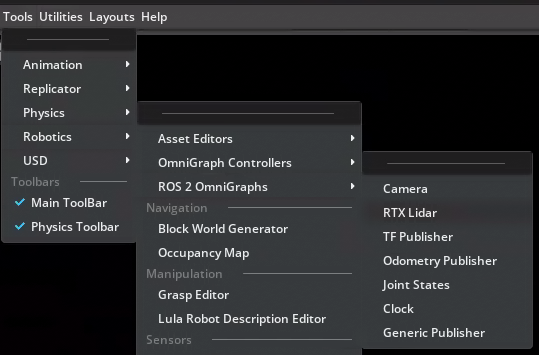
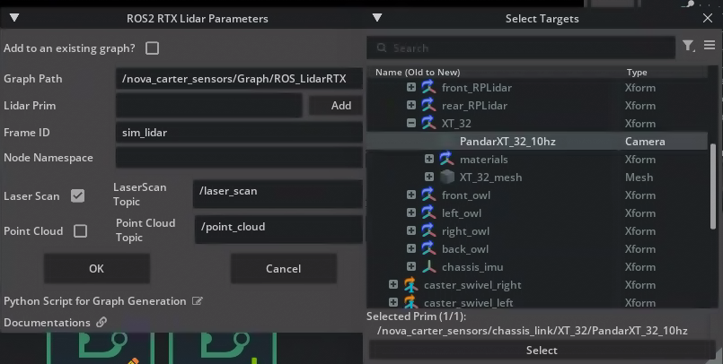
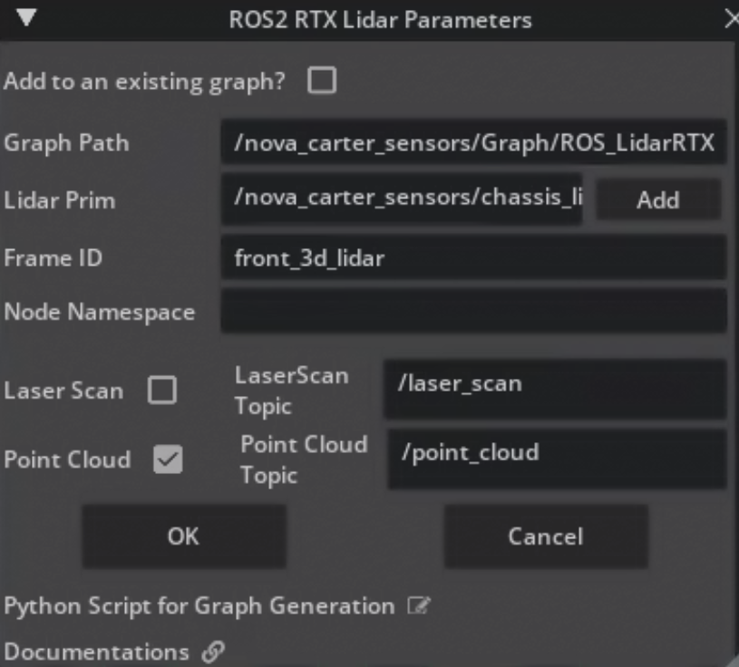
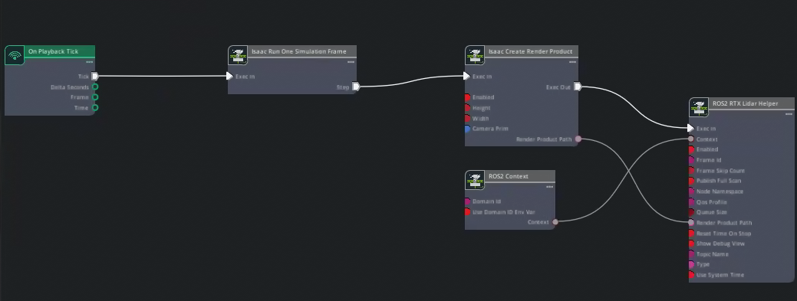
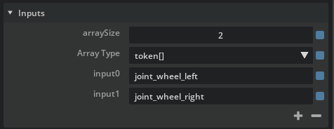
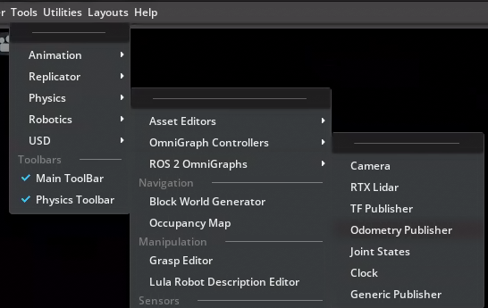
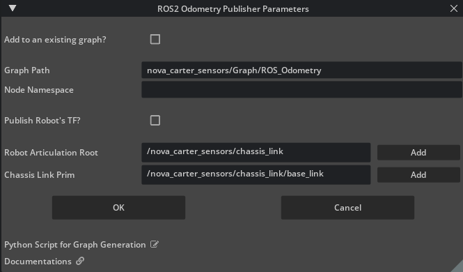
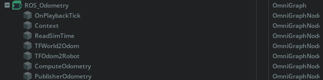
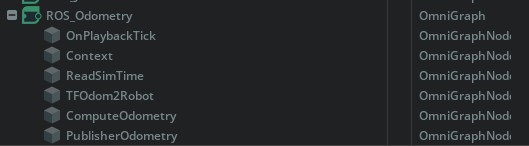
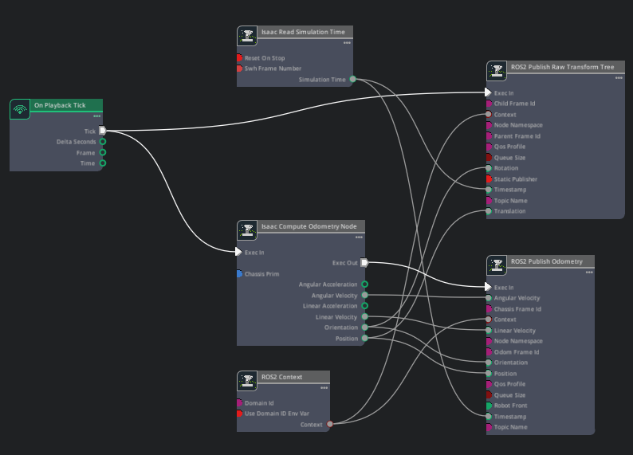

# DLI : Software-in-the-Loop Testing for Robots With OpenUSD, Isaac Sim, and ROS

---
 
## Introduction

**Overview**
Welcome to the lab, Software-in-the-Loop Testing for Robots With OpenUSD, Isaac Sim, and ROS! This course is designed to immerse you in the world of robotics simulation using NVIDIA Isaac Sim and ROS 2. Whether you're a beginner or an experienced developer, this course will guide you through building, configuring, and testing robotic systems in a virtual environment.

**What You'll Do in This Course:**
   * Learn how to launch Isaac Sim and integrate it with ROS 2 for seamless communication between your simulation and ROS nodes.
   * Develop ROS-compatible graphs for sensors like Lidar, control mechanisms like Twist subscribers, and odometry publishers.
   * Build environment maps that robots can use for navigation and obstacle avoidance.
   * Use tools like MoveIt2 for manipulation tasks and Nav2 for autonomous navigation.
   * Combine navigation and manipulation skills to complete a simulated task involving multiple robots.

* By the end of this course, you will have gained practical experience in configuring and testing robotic systems within a simulated environment, preparing you to apply these skills to real-world robotics projects. Let’s get started!

---

## Setting up Isaac Sim and ROS Integration

**Overview**

   * In this module, we will configure Isaac Sim to communicate with ROS 2, enabling seamless data exchange between the simulation environment and your ROS nodes.
   * By the end of this module, you will have a fully operational Isaac Sim environment integrated with ROS 2, ready for robotics development and testing.
   * Before you begin, [download the course assets](https://download.learn.nvidia.com/assets/s-ov-39-v1/DLI_SIL_online_dli.zip) you'll need for this lab. We recommend you extract the folder to your desktop to follow-along with the instructions in this course: (/Desktop/DLI_SIL). 

---

## Launching Isaac Sim With ROS 2

* To begin, we need to set up the Isaac Sim environment to publish robot and environment data to your ROS nodes.

1. Open a new terminal by pressing Ctrl+Alt+T.
2. Run the following commands in the terminal:

```
source /opt/ros/humble/setup.bash
```

* This ensures that your terminal is sourced for ROS 2 (Humble).

**Understanding the Integration**
Isaac Sim acts as a simulation platform that can interact with ROS 2 through its built-in tools and extensions. In this step, we will ensure that the simulation environment is configured correctly to publish data such as sensor readings, odometry, and robot states to ROS topics.

**Review: Verifying ROS Sourcing**
Before proceeding, confirm that your terminal is properly sourced for ROS 2:

1. Run the following command:

```
   echo $ROS_DISTRO
```

2. If the output does not display humble, re-run the sourcing command:

```
source /opt/ros/humble/setup.bash
```

**Launch Isaac Sim**
* From the terminal we were just working in, run the following commands.

1. Navigate to the Isaac Sim directory:

```
cd ~/isaacsim
```

2. Run this command to launch Isaac Sim:

```
./isaac-sim.sh
```

**Wait for Isaac Sim to fully load.**
   * Ensure that no errors appear in the terminal before proceeding.

* By completing this setup, you are laying the foundation for subsequent modules where we will create ActionGraphs, configure sensors, and enable advanced robotics functionalities.

---

## Module 2: Creating ROS Graphs for Nova Carter

**Overview**
We’re now going to focus on establishing a seamless connection between the Nova Carter robot in Isaac Sim and ROS through the creation of Action Graphs. In this module, we generate and configure several graph components that enable the robot to communicate sensor data, control commands, and state information with ROS. We use built-in shortcuts to create ROS-compatible graphs that streamline these interactions.


---
## Module 2: Creating ROS Graphs for Nova Carter

**Publishing a Lidar Graph**

We will start by publishing the synthetic lidar pointcloud generated by Isaac Sim to ROS

1. In Isaac Sim, go to File > Open
2. Open the Nova Carter robot from ~/Desktop/DLI_SIL/Starting_point/nova_carter/nova_carter.usd
3. In the Stage Tree, right-click the default prim and select Create > Scope.
4. Rename the new scope to Graph
  * A Scope acts as a container for organizing graphs and related components.
5. Navigate to Tools > Robotics > ROS 2 OmniGraphs > RTX Lidar.
  * This shortcut simplifies the process of adding a Lidar graph.



6. In the window that appears, set the Graph Path to: /nova_carter_sensors/Graph/ROS_LidarRTX
7. For the lidar prim, click the Add button and select the following path: /nova_carter_sensor/chassis_link/XT_32/PandarXT_32_10hz
   * Press Select to confirm.
   * It should look like this:

 

8. Set the Frame ID to: front_3d_lidar.
9. Uncheck the box for Laser Scan, as it is not needed for this configuration.
10. Check the box for Point Cloud to enable publishing point cloud data.



11. Press OK to complete the setup.

* You have successfully integrated a Lidar sensor into your simulation environment, preparing it for real-time interaction with ROS nodes in subsequent modules.

---

## Module 2: Creating ROS Graphs for Nova Carter

**Reviewing the Generated Action Graph**

We’ve used the shortcut tool to create and configure a ROS-compatible Lidar sensor. Next, let’s take a look at the Action Graph which runs this sensor. Action Graphs are event-driven tools for visual programming.

1. Find the lidar Action Graph in the Stage panel at: /nova_carter_sensors/Graph/ROS_LidarRTX.
2. Right-click on ROS_LidarRTX, then select Open Graph.
 


This graph is now ready to publish synthetic point cloud data from Isaac Sim to ROS, enabling downstream robotics applications like mapping and obstacle detection.

Let’s keep going!

---

## Module 2: Creating ROS Graphs for Nova Carter

**Adding ROS 2 Nodes to the Graph**

Let’s look at another Action Graph that uses a Differential Controller to move the Nova Carter robot, using messages from ROS.

> **Note** <br>
> This graph has been pre-built for you to save time, but let’s analyze it together for reference.

 

1. The following nodes were added to the graph:
   * ROS 2 Context Node
   * ROS 2 Subscribe Twist Node
   * Two instances of the Break 3 Vector Node
 


2. They were connected as follows:
   * Connect ROS 2 Context: Context to ROS 2 Subscribe Twist: Context.
   * Connect ROS 2 Subscribe Twist Angular Velocity (Z) to one of the Break 3 Vector nodes.
   * Connect ROS 2 Subscribe Twist Linear Velocity (X) to the other Break 3 Vector node.
   * From the Break 3 Vector nodes:
     * Connect Z of Angular Velocity to Desired Angular Velocity on the Differential Controller.
     * Connect X of Linear Velocity to Desired Linear Velocity on the Differential Controller.
   * Connect On Playback Tick Delta Seconds to DT on the Differential Controller.

3. Optional Advanced Configuration
   * Select the Differential Controller node and adjust additional parameters:
     * Set maximum acceleration, deceleration, and angular acceleration as needed for your application.


 
4. Ensured that the output array names for left and right wheels match your robot's configuration.
   * This setup allows Nova Carter to interpret Twist messages from ROS and convert them into physical motion within Isaac Sim.

---

## Module 2: Creating ROS Graphs for Nova Carter

**Create Odometry Publisher**

Let's create and configure an Odometry Publisher for the Nova Carter robot. This publisher will relay the robot's movement data, such as position and velocity, to ROS topics. Odometry data is essential for tasks like localization and navigation, as it provides information about the robot's state in the environment.

1. In the Stage Tree, navigate to /nova_carter_sensors/chassis_link.
2. Right-click on chassis_link and select Create > Xform.
3. Rename the new Xform to base_link.



4. Go to Tools > Robotics > ROS 2 Omnigraph Odometry Publisher
   * This tool simplifies the creation of a graph for publishing odometry data.
 


5. In the dialog window, set the following parameters:
   * Graph Path: nova_carter_sensors/Graph/ROS_Odometry
   * Articulation Root: /nova_carter_sensors/chassis_link
   * Chassis Link Prim: /nova_carter_sensors/chassis_link/base_link
6. Press OK to create the graph.



7. Locate the newly created graph in the Stage Tree under nova_carter_sensors/Graph/ROS_Odometry.
8. Right-click on it and select Open Graph.
9. Identify and delete the TFWorld2Odom node from the graph, via the Stage Panel.
10. Your graph should now look like this:

<br>


The odometry publisher enables Nova Carter to share its movement data with ROS nodes, which is critical for navigation and localization tasks.

---

## Module 2: Creating ROS Graphs for Nova Carter

**Review**

In this module, we successfully created and configured ROS Action Graphs for the Nova Carter robot, including the Lidar graph, Twist subscriber, and Odometry publisher. These graphs enable Nova Carter to interact with ROS by publishing sensor data, receiving motion commands, and sharing odometry information.

With these foundational components in place, Nova Carter is now ready to perform advanced tasks such as navigation and mapping in subsequent modules.
Let’s move forward and continue building on this solid groundwork!

## Quiz 2 points possible (graded)

1. Action Graphs in Isaac Sim are event-driven tools used for visual programming.
```
○ False
○ True
```

2. What is the primary purpose of creating a lidar graph in Isaac Sim for Nova Carter?
```
○ To control the robot's movement
○ To publish synthetic point cloud data to ROS
○ To generate odometry data
```

---
## Module 3: Setting up Additional ROS Features
Overview
With our Action Graphs set up, let’s expand the Nova Carter robot's functionality by integrating additional ROS features. These enhancements include generating an occupancy map for navigation and configuring a joint state publisher to share the robot's articulation data with ROS.

---
Module 3: Setting up Additional ROS Features

Create Joint State Publisher
In this section, we will configure a ROS Joint State Publisher for the Nova Carter robot. This publisher will broadcast the robot's joint states to ROS, allowing real-time monitoring of its movements.

 

In the Stage Tree, right-click and select Create > Scope.
Rename the new scope to Graph
A Scope acts as a container for organizing graphs and related components.
Navigate to Tools > Robotics > ROS 2 OmniGraphs > Joint States.
This shortcut provides a quick way to configure a Joint State Publisher.
 

Set the Graph Path to /nova_carter_sensors/Graph/ROS_JointStates
Set the Articulation Root to /nova_carter_sensors
 

Check the box for Publisher to enable joint state publishing.
Uncheck the boxes for Subscriber and Move Robot, as they are not needed for this setup.
Press OK to create the graph
Save your work by pressing Ctrl+S
---
## Module 3: Setting up Additional ROS Features

Verify Functionality
Press the Play button in Isaac Sim to activate the publisher.
Open a ROS-sourced terminal and run the following command:
ros2 topic list
Confirm that /joint_states is listed among the available topics.
By completing this section, you have successfully set up a Joint State Publisher for Nova Carter, enabling seamless communication of its joint states with ROS.


---
Module 3: Setting up Additional ROS Features

Create Auto Name Space Attribute
Now we can add an auto namespace attribute to the Nova Carter robot. This ensures that all ROS topics and services associated with the robot are properly namespaced, preventing conflicts when working with multiple robots or systems.

 

In the Stage Tree, right-click on the nova_carter_sensors prim.
Select Add > Attribute from the context menu.
 

In the dialog box that appears:
Set the Name to isaac:namespace.
Set the Type to String.
Ensure that Custom is checked.
Click Add to finalize.
 

In the Raw USD Properties within the Property panel, locate the newly added isaac:namespace attribute.
Set its value to carter.
Save your changes by pressing Ctrl+S.
Press the Play button in Isaac Sim to activate the simulation.
---
Module 3: Setting up Additional ROS Features
Verify Namespaced Topics
Open a ROS-sourced terminal and run:
ros2 topic list
Verify that all Nova Carter-related topics are now prefixed with /carter. You should see output similar to:
 

Namespacing is critical when working with multiple robots or systems in ROS to avoid topic collisions.


---
## Module 3: Setting up Additional ROS Features
Review
In this module, we expanded Nova Carter's capabilities by configuring a Joint State Publisher and implementing an auto namespace attribute. These enhancements ensure organized communication and seamless integration with ROS, setting the stage for advanced robotics applications. With these features in place, Nova Carter is now better equipped to interact with its environment and handle complex tasks. Let’s continue building on this progress in the next module!

Test your knowledge with the following quiz.

Quiz
2 points possible (graded)
A Joint State Publisher in ROS is used to broadcast a robot's joint states to ROS topics for real-time monitoring.

False

True
unanswered
What is the purpose of adding an auto namespace attribute to the Nova Carter robot?

To increase the robot's speed in simulation

To enable the robot to publish odometry data

To avoid topic conflicts when working with multiple robots
unanswered

---
## Module 4: Configuring the Franka Robot
Overview
Congratulations on completing the setup for Nova Carter! In this module, we’ll focus on configuring the Franka robot with its own ROS Action Graphs and features. This includes setting up joint state publishers and subscribers, adding a namespace for topic organization, and integrating an Owl camera for advanced manipulation tasks. By the end of this module, you’ll have both robots fully configured and ready to work together in the simulation environment.

Let’s get started!


---
Module 4: Configuring the Franka Robot
Configuring the Franka ROS Graphs
Now that the Carter robot is ready, and data is ready to be communicated with ROS, let’s set up the Franka robot with its own Action Graphs.

Joint State Publisher and Subscriber
Open the Desktop/DLI_SIL/Starting_point/franka/franka.usd file.
In the Stage Tree, right-click and select Create > Scope.
Rename the new scope to Graph
A Scope acts as a container for organizing graphs and related components.
 

Navigate to Tools > ROS 2 Omnigraphs > Joint States.
 

Configure the graph with the following settings:
Graph Path: /franka/Graph/ROS_JointStates
Articulation Root: /franka
Enable both the Publisher and Subscriber options.
Keep the Move Robot option selected.
Confirm and save your configuration.
Press the Play button.

---
## Module 4: Configuring the Franka Robot
Setting the Node Namespace
To verify that the node namespace is configured correctly, open a ROS-sourced terminal and run:
ros2 topic list
When you list the topics, note that Franka’s published topics appear without an additional namespace prefix. Ideally, they should be listed as, for example, /franka/joint_states rather than /joint_states.

This is accomplished with an extra namespacing level.

Node Namespace
Similar to what we did for the Nova Carter robot, let’s add a specific namespace to the Franka robot so all topics published from the Franka are isolated. This will prevent any conflicts from other robot topics.

Right-click on the franka prim and select Add > Attribute.
 

Create a new attribute with the following properties:
Name: isaac:namespace
Type: String
Ensure the Custom option is checked.
 

Set the attribute value to franka in the Raw USD Properties panel.
Save the changes.
Press the Play button.
To verify that the node namespace is configured correctly, open a ROS-sourced terminal and run:
ros2 topic list
When you list the topics, note that Franka’s published topics now appear with an additional namespace “franka” prefix. You should see, /franka/joint_states, and /franka/joint_command.


---
## Module 4: Configuring the Franka Robot
Adding the Owl Camera to the Gripper
The Owl camera is an asset with a ROS-specific variant, which we will now add to the end of the Franka robot’s tool_center prim. We will try to support more assets with built-in ROS graphs in a future version of Isaac Sim.

Expand the panda_hand prim in the Stage panel using the + button, so you can see the prim named tool_center.
Using the Content panel, locate the Owl USD file from the Desktop/DLI_SIL/Starting_point/owl folder.
Drag the Owl USD file onto the /franka/panda_hand/tool_center, prim in the Stage outline. This action will parent the Owl camera to the end of the robot arm.
Select the Owl prim in the Stage.
 

In the Property panel under the Variants section, choose the variant named enabled.
 

Configure the transform properties for the Owl as follows:
Translate:, (0.03, 0.0, -0.05)
Orient:, (0, -90, 0)
Note:
If the Owl camera appeared at the base of the robot, confirm that Preferences > Stage > Keep Prim World Transform When Reparenting is unchecked. Then delete and re-import. Confirm these settings.
---

## Module 5: Creating the Occupancy Map
Overview
The occupancy map gives general information about the environment: white for free space, black for occupied (obstacles), and gray for unknown. The robot can use this map and match it with the patterns of obstacles it detected with the lidar to localize itself. In addition, in the path planning algorithm, cost heuristics are assigned to obstacles (infinite cost to obstacles, so the robot will not intentionally plan a path that collides with obstacles, as well as high costs for regions near the obstacles to create a safety buffer). With this cost information, the robot can compute the optimal path using a planning algorithm.

Let's get started!

---

## Module 5: Creating the Occupancy Map
Create the Map
Open the file /Desktop/DLI_SIL/Starting_point/warehouse_env/warehouse_env.usd in Isaac Sim.
💡 Tip
Camera control:
ALT + Left Click: Rotate about object
Right Mouse Button: Rotate about camera
Scroll wheel: Zoom
Middle Mouse Button: Pan


Navigate to Tools > Robotics > Occupancy.


In the Occupancy Map tab, configure the following:
Origin: (-2.5, -1.0, 0.52)
Upper Bound: (3.5, 6.0, 0.03)
Lower Bound: (-3.5, -6.0, -0.03)
Cell Size: 0.05


Click Calculate to create the occupancy map, which centers the mapping at approximately (-2.5, -1, 0.2).

---

## Module 5: Creating the Occupancy Map

Visualize and Save the Map


Click Visualize Image to open the visualization window.
Set Rotate Image to 180°.
Choose ROS Occupancy Map Parameter File (YAML) for the Coordinate Type.
Click Regenerate Image.
Copy the YAML content from the dialog and save it as warehouse_env.yaml inside the /Desktop/DLI_SIL folder.
💡 Tip
Here's an example of how to make this file using the terminal:
1. Copy the text in the dialog box above, under Occupancy Map.
2. Open a terminal and type cat > ~/Desktop/DIL_SIL/warehouse_env.yaml
3. Right click and select Paste.
4. Press CTRL+D.

Save the generated image as warehouse_env.png in the same directory.


📝 Note
The occupancy map provides a grid-based representation where each cell’s value indicates the likelihood of an obstacle's presence.
This map is essential for localization and safe path planning, as it helps the robot avoid obstacles by assigning high costs to areas with detected obstacles.

💾 Checkpoint
If you find yourself lost or want to jump ahead, load Checkpoint 3.

---

## Module 6: Setting up the Environment
Overview
In this module, we will set up a shared simulation environment where both Nova Carter and Franka robots can operate collaboratively. Building on the configurations from previous modules, we will position the robots, create a unified Environment ROS Graph, and verify that all topics are correctly namespaced and functional. By the end of this module, you’ll have a fully integrated environment ready for multi-robot tasks and advanced simulations. Let’s get started!

---

## Module 6: Setting up the Environment

Import Both Robots Into the Stage
Navigate to the Content Browser in Isaac Sim.


Drag and drop the nova_carter and franka assets into the Stage.
Use the asset in Checkpoint1_nova_carter if you were not able to configure the Nova Carter.
Use the asset in Checkpoint2_franka if you were not able to configure the Franka.


Move both robot xforms (nova_carter_sensors and franka) into the Robots scope.
Select the nova_carter xform in the Stage Tree.
Translate: (-3, 1.2, 0)
Orient: (0, 0, -90)
Select the franka xform in the Stage Tree.


Set its transform values to:
Translate: (-4.7, -6.1, 0.8)
Orient: (0.0, 0.0, 0.0)
Right-click in the Stage Tree and select Create > Scope.
Rename this new scope to Graph.


Navigate to Tools > ROS 2 Omnigraphs > Clock.
Set up the Clock node as prompted and click OK.
Press the Play button in Isaac Sim to start the simulation.
---
Module 6: Setting up the Environment

Verify ROS Topics
Open a ROS-sourced terminal.
Run the following command to list all active topics:
ros2 topic list


Confirm that you see topics for both Nova Carter and Franka, as well as shared topics like /clock.

---

## Module 6: Setting up the Environment

Review
We have successfully configured the Franka robot with its own ROS ActionGraphs, integrated a namespace for organized communication, and enhanced its functionality with an Owl camera for manipulation tasks. With both Nova Carter and Franka now fully set up in the shared simulation environment, you’re ready to explore multi-robot collaboration and advanced robotics applications in the next steps. Great work so far, let’s keep building!

💾 Checkpoint
If you find yourself lost or want to jump ahead, load Checkpoint 4.

Before we move on, test your knowledge with the following quiz.

## Quiz
1 point possible (graded)
What is the purpose of creating a unified Environment ROS Graph in this module?
To configure joint state publishers for both robots
To set up a Twist subscriber for differential drive robots
To ensure all ROS topics are correctly namespaced and functional for multi-robot tasks
To create an occupancy map for obstacle avoidance

---

## Module 7: ROS Workspace Setup

Overview
In this module, we will set up our ROS workspaces that are required to run our autonomous software stacks.

---

## Module 7: ROS Workspace Setup

Installing the nova_carter_description Package
The nova_carter_description package contains all the TF configurations and robot description details (URDF files) for Nova Carter. These instructions—adapted for Isaac Sim 4.5 and Isaac ROS 3.2—ensure that your environment is properly configured for integrating the robot’s description into your ROS workspace.

Set Up Locale for UTF-8 Support
locale  # check for UTF-8

sudo apt update && sudo apt install locales
sudo locale-gen en_US en_US.UTF-8
sudo update-locale LC_ALL=en_US.UTF-8 LANG=en_US.UTF-8
export LANG=en_US.UTF-8

locale  # verify settings
Install Required Dependencies
sudo apt update && sudo apt install gnupg wget
sudo apt install software-properties-common
sudo add-apt-repository universe
Register NVIDIA's GPG Key and Repository
- Choose one of the following options based on your location:

wget -qO - https://isaac.download.nvidia.com/isaac-ros/repos.key | sudo apt

---

## Module 7: ROS Workspace Setup

Installing the ROS workspace
Let’s configure and build your ROS workspace to ensure it is ready for integrating Isaac ROS packages and running simulation components. We will verify that your terminal is properly sourced, update package dependencies, compile the workspace, and source the built setup file.

Open a new terminal and run:
source /opt/ros/humble/setup.bash
Run the following commands to initialize and update rosdep:
rosdep init
rosdep update
Navigate to your ROS workspace directory, ros_ws, and install the required dependencies from the workspace source:
rosdep install --from-paths src --ignore-src -r -y
Build your workspace using colcon:
colcon build
After the build completes, source the generated setup file to overlay the new packages into your current shell session:
source install/setup.bash
You now have a workspace that is ready to run all the required packages. Our ROS workspace is fully configured and ready to support the necessary packages for our simulation environment. We're now prepared to move forward into more advanced modules.

---

## Module 7: ROS Workspace Setup
Review
We prepared the simulation environment by installing the nova_carter_description package and configuring the ROS workspace. These steps ensured that all necessary robot descriptions, TF configurations, and dependencies are in place for seamless integration with Isaac Sim. With this foundation, we’re ready to move forward into advanced robotics functionalities, starting with manipulation using MoveIt2 in the next module.

## Quiz
1 point possible (graded)
What is the purpose of sourcing the ROS setup file (source /opt/ros/humble/setup.bash) in a terminal?
To view source code of ROS nodes for a given workspace
To enable robotics tasks and begin navigation tasks
To ensure the terminal is properly configured to use ROS commands and access ROS packages
To generate a new ROS workspace
unanswered

---

## Module 8: Autonomous Navigation with Nav2
Overview
Throughout this lab, you’ve configured and tested key components for both Nova Carter and Franka, integrated advanced tools like MoveIt2, and prepared a shared simulation environment. In this module, we’ll bring everything together by setting up autonomous navigation using the Nav2 stack. By the end of this module, Nova Carter will be able to navigate the environment autonomously, completing the foundation for multi-robot collaboration.

---

## Module 8: Autonomous Navigation with Nav2
Adding Occupancy Maps
Copy the occupancy map image and YAML files that you generated in an earlier module to this folder: ~/Desktop/DLI_SIL/Starting_point/gtc25-mega1/ros_ws/src/navigation/carter_navigation/maps/

---

## Module 8: Autonomous Navigation with Nav2
Building and Sourcing Your Workspace
Navigate to the root of the workspace folder:
cd ~/Desktop/DLI_SIL/Starting_point/gtc25-mega1/ros_ws/
Run build command:
colcon build
It is important to source your workspace so that all packages can be found by ROS. Make sure to source your workspace each time you open a new terminal for the remainder of this lab.

source ~/Desktop/DLI_SIL/Starting_point/gtc25-mega1/ros_ws/install/setup.bash

---

## Module 8: Autonomous Navigation with Nav2

Running the Nav Stack
Press the Play button in Isaac Sim to activate the simulation environment.
Open a new terminal and source your ROS workspace:
source ~/Desktop/DLI_SIL/Starting_point/gtc25-mega1/ros_ws/install/setup.bash
Run the following command to launch Nova Carter’s TF publisher. This uses the robot_state_publisher to publish TFs based on joint states from Isaac Sim:
ros2 launch carter_navigation nova_carter_description_isaac_sim.launch.py
In a new terminal, source your ROS workspace, and run this command to relay the /tf_static topic to a namespaced topic /carter/tf_static.
This ensures static TF messages are correctly remapped: (as sometimes remapping in launch files is not guaranteed for static messages).
source ~/Desktop/DLI_SIL/Starting_point/gtc25-mega1/ros_ws/install/setup.bash
ros2 run topic_tools relay /tf_static /carter/tf_static
Start Nav2 for Nova Carter by running the following command in another ROS-sourced terminal:
source ~/Desktop/DLI_SIL/Starting_point/gtc25-mega1/ros_ws/install/setup.bash
ros2 launch carter_navigation carter_warehouse_env.launch.py


You should see an RVIZ window that looks like this. The white areas mean free space, the dark areas mean obstacles that the robot needs to avoid. The pink and blue areas are regions with low and high costs to discourage the robot from going there to avoid potentially colliding with the environment.

Now, left click on Nav2 Goal to set the target position and orientation of the robot.


💡 Tip
To watch the Carter robot from different vantage points:
In Isaac Sim’s Viewport, switch cameras to the “third_person_view_cam” or one of the other cameras mounted to the Carter robot while it’s moving.
---
Module 8: Autonomous Navigation with Nav2
Review
By completing this section, you have successfully configured and run the Nav2 stack for Nova Carter, enabling autonomous navigation within the simulation environment.

## Quiz
1 point possible (graded)
What is the purpose of sourcing a ROS workspace setup file (e.g., source install/setup.bash) after building a ROS workspace?
To install ROS packages
To configure the ROS workspace directory
To ensure that all packages in the workspace are recognized and accessible by ROS in the current terminal session
To build the ROS workspace using colcon

---

## Module 9: Manipulation With MoveIt2

Overview
Let’s keep going and integrate MoveIt2, a powerful robotics manipulation platform for ROS, with the Franka robot in Isaac Sim. MoveIt2 enables advanced motion planning, control, and manipulation tasks. By the end of this module, you’ll be able to execute motion plans for the Franka robot and visualize its movements in real time.

---

## Module 9: Manipulation With MoveIt2
Running MoveIt2
Press the Play button.
Open a new terminal and source your ROS workspace:
source ~/Desktop/DLI_SIL/Starting_point/gtc25-mega1/ros_ws/install/setup.bash
Run the following command to launch MoveIt2 with Franka:
ros2 launch isaac_moveit isaac_moveit.launch.py


You should see a window like this: the white model represents the actual position of the robot, and the orange model represents the target position of the robot.

Use the arrows and circular rings to drag the target position like this:


Then click Plan and Execute.
Similar to the previous step, update the gripper by selecting “hand” for the planning group and set the goal state to “close” (or “open” if the gripper is already closed). Then click Plan and Execute.

In Isaac Sim, switch to the Franka camera view to observe the robot's movements as it executes motion plans.


Optionally, click Windows > Viewports > Viewports2, Select “camera” to toggle first-person view camera that we imported earlier.

---

## Module 9: Manipulation With MoveIt2
Review
Alright! We successfully integrated MoveIt2 with the Franka robot, enabling motion planning and manipulation capabilities within Isaac Sim. This setup allows the robot to execute complex tasks and prepares us for further exploration of autonomous navigation in the next module. Great progress so far, how about a bonus?!

Quiz
1 point possible (graded)
What is the main purpose of using MoveIt2 in robotics?

Autonomous navigation

Manipulation tasks

Sensor integration

Voice control integration

---

## Challenge
Multi-Robot Coordination
In this final challenge, we will combine everything we’ve learned to complete a collaborative task using both Nova Carter and Franka. The goal is to use ROS Nav2 to autonomously navigate Nova Carter to the Franka loading zone, use Franka to pick up a cube, load it onto Nova Carter, and then navigate Nova Carter back to the drop-off zone.

## Challenge Instructions
Navigate Nova Carter to the Loading Zone
Use the Nav2 stack to send a navigation goal for Nova Carter to reach the Franka loading zone.
Ensure that the robot avoids obstacles and follows an optimal path based on the occupancy map.
Use Franka to Pick Up a Cube
Switch control to Franka and use MoveIt2 to plan and execute a motion to pick up a cube from the loading zone.
Carefully position Franka’s gripper to secure the cube.
Load the Cube onto Nova Carter
Plan and execute another motion with Franka to place the cube securely on Nova Carter’s platform.
Verify that the cube is stable before proceeding.
Navigate Nova Carter to the Drop-Off Zone
Use Nav2 again to send a navigation goal for Nova Carter to move to the designated drop-off zone.
Ensure smooth navigation while carrying the cube.
💡 Tip
If you were not able to configure the environment, use the asset in Checkpoint4_completed_environment, and if you were not able to generate the occupancy map, use the ROS workspace in Checkpoint5_completed_ros_package.

---

## Software-in-the-Loop Testing for Robots With OpenUSD, Isaac Sim, and ROS

**Review**
Congratulations on completing this hands-on lab! Together, we’ve explored the exciting possibilities of robotics simulation using Isaac Sim and ROS. Starting with foundational configurations, we set up Nova Carter and Franka robots, integrated advanced tools like MoveIt2 for manipulation, and enabled autonomous navigation with Nav2. Finally, you applied these skills in a collaborative multi-robot challenge, showcasing the power of simulation for testing and development.

Check out the Robotics Fundamentals Learning Path to continue your learning journey.
https://www.nvidia.com/en-us/learn/learning-path/robotics/

---
Quiz 정답

## Module 2 퀴즈 정답
   * 1번 문제: Action Graphs in Isaac Sim are event-driven tools used for visual programming. (Isaac Sim의 액션 그래프는 비주얼 프로그래밍을 위해 사용되는 이벤트 기반 도구이다.)
      * 정답: True
   * 2번 문제: What is the primary purpose of creating a lidar graph in Isaac Sim for Nova Carter? (Nova Carter를 위해 Isaac Sim에서 라이다 그래프를 생성하는 주된 목적은 무엇인가?)
      * 정답: To publish synthetic point cloud data to ROS (ROS에 합성 포인트 클라우드 데이터를 발행하기 위함)   

## Module 3 퀴즈 정답
   * 1번 문제: A Joint State Publisher in ROS is used to broadcast a robot's joint states to ROS topics for real-time monitoring.
      * (ROS의 Joint State Publisher는 실시간 모니터링을 위해 로봇의 관절 상태를 ROS 토픽으로 브로드캐스트하는 데 사용된다.)
      * 정답: True
   * 2번 문제: What is the purpose of adding an auto namespace attribute to the Nova Carter robot?
      * (Nova Carter 로봇에 자동 네임스페이스 속성을 추가하는 목적은 무엇인가?)
      * 정답: To avoid topic conflicts when working with multiple robots
      * (여러 대의 로봇을 다룰 때 토픽 충돌을 방지하기 위함)   

## Module 6 퀴즈 정답
   * 1번 문제: What is the purpose of creating a unified Environment ROS Graph in this module? (본 모듈에서 통합 환경 ROS 그래프를 생성하는 목적은 무엇인가?)
   * 정답: To ensure all ROS topics are correctly namespaced and functional for multi-robot tasks (다중 로봇 작업에서 모든 ROS 토픽이 올바르게 네임스페이스가 지정되고 정상 작동하도록 보장하기 위함)   

## Module 7 퀴즈 정답
   * 1번 문제: What is the purpose of sourcing the ROS setup file (source /opt/ros/humble/setup.bash) in a terminal? (터미널에서 ROS 설정 파일(source /opt/ros/humble/setup.bash)을 소싱하는 목적은 무엇인가?)
   * 정답: To ensure the terminal is properly configured to use ROS commands and access ROS packages (터미널이 ROS 명령어를 사용하고 ROS 패키지에 접근할 수 있도록 올바르게 구성하기 위함)   

## Module 8 퀴즈 정답
   * 1번 문제: What is the purpose of sourcing a ROS workspace setup file (e.g., source install/setup.bash) after building a ROS workspace?
   * (ROS 작업 공간을 빌드한 후 작업 공간 설정 파일(예: source install/setup.bash)을 소싱하는 목적은 무엇인가?)
   * 정답: To ensure that all packages in the workspace are recognized and accessible by ROS in the current terminal session
   * (현재 터미널 세션에서 작업 공간 내의 모든 패키지가 ROS에 의해 인식되고 접근 가능하도록 보장하기 위함)   

## Module 9 퀴즈 정답
   * 1번 문제: What is the main purpose of using MoveIt2 in robotics?
   * (로봇 공학에서 MoveIt2를 사용하는 주요 목적은 무엇인가?)정답: Manipulation tasks (매니퓰레이션/조작 작업)   


