# DLI: OpenUSD, Isaac Sim, ROS를 활용한 로봇 소프트웨어-인-더-루프 테스트

---

## 소개

**개요**
랩에 오신 것을 환영합니다: OpenUSD, Isaac Sim, ROS를 활용한 로봇 소프트웨어-인-더-루프 테스트! 이 과정은 NVIDIA Isaac Sim과 ROS 2를 사용하여 로봇 시뮬레이션의 세계에 몰입할 수 있도록 설계되었습니다. 초보자든 경험 많은 개발자든 관계없이, 이 과정은 가상 환경에서 로봇 시스템을 구축, 구성 및 테스트하는 방법을 안내합니다.

**이 과정에서 배울 내용:**
   * Isaac Sim을 실행하고 ROS 2와 통합하여 시뮬레이션과 ROS 노드 간의 원활한 통신을 설정하는 방법을 학습합니다.
   * Lidar와 같은 센서, Twist 구독자와 같은 제어 메커니즘, Odometry 게시자에 대한 ROS 호환 그래프를 개발합니다.
   * 로봇이 내비게이션과 장애물 회피에 사용할 수 있는 환경 맵을 구축합니다.
   * 조작 작업을 위한 MoveIt2와 자율 주행을 위한 Nav2와 같은 도구를 사용합니다.
   * 여러 로봇이 포함된 시뮬레이션 작업을 완료하기 위해 내비게이션과 조작 기술을 결합합니다.

* 이 과정이 끝나면 시뮬레이션 환경 내에서 로봇 시스템을 구성하고 테스트하는 실무 경험을 얻게 되어, 실제 로봇 공학 프로젝트에 이러한 기술을 적용할 준비를 갖추게 됩니다. 시작해 봅시다!

---

## Isaac Sim 및 ROS 통합 설정

**개요**

   * 이 모듈에서는 Isaac Sim이 ROS 2와 통신하도록 구성하여 시뮬레이션 환경과 ROS 노드 간의 원활한 데이터 교환을 가능하게 합니다.
   * 이 모듈을 마치면 ROS 2와 통합된 완전히 작동하는 Isaac Sim 환경을 갖추게 되어 로봇 개발 및 테스트를 진행할 수 있습니다.
   * 시작하기 전에, 이 랩에 필요한 [코스 자료를 다운로드](https://download.learn.nvidia.com/assets/s-ov-39-v1/DLI_SIL_online_dli.zip)하세요. 과정의 지침을 따라하기 위해 폴더를 바탕화면에 추출하는 것을 권장합니다: (/Desktop/DLI_SIL).

---

## ROS 2와 함께 Isaac Sim 실행하기

* 먼저, Isaac Sim 환경이 로봇 및 환경 데이터를 ROS 노드에 게시하도록 설정해야 합니다.

1. Ctrl+Alt+T를 눌러 새 터미널을 엽니다.
2. 터미널에서 다음 명령어를 실행합니다:

```
source /opt/ros/humble/setup.bash
```

* 이 명령은 터미널이 ROS 2(Humble)를 사용하도록 소싱합니다.

**통합 이해하기**
Isaac Sim은 내장된 도구와 확장 기능을 통해 ROS 2와 상호작용할 수 있는 시뮬레이션 플랫폼 역할을 합니다. 이 단계에서는 시뮬레이션 환경이 센서 판독값, 주행 거리(odometry), 로봇 상태와 같은 데이터를 ROS 토픽에 올바르게 게시하도록 구성되어 있는지 확인합니다.

**검토: ROS 소싱 확인**
진행하기 전에 터미널이 ROS 2에 대해 제대로 소싱되었는지 확인합니다:

1. 다음 명령어를 실행합니다:

```
   echo $ROS_DISTRO
```

2. 출력에 `humble`이 표시되지 않으면 소싱 명령어를 다시 실행합니다:

```
source /opt/ros/humble/setup.bash
```

**Isaac Sim 실행**
* 방금 작업하던 터미널에서 다음 명령어를 실행합니다.

1. Isaac Sim 디렉토리로 이동합니다:

```
cd ~/isaacsim
```

2. 다음 명령어를 실행하여 Isaac Sim을 실행합니다:

```
./isaac-sim.sh
```

**Isaac Sim이 완전히 로드될 때까지 기다립니다.**
   * 진행하기 전에 터미널에 오류가 없는지 확인하세요.

* 이 설정을 완료함으로써 이후 모듈에서 ActionGraph를 생성하고, 센서를 구성하며, 고급 로봇 기능을 활성화할 수 있는 기반을 마련하게 됩니다.

---

## 모듈 2: Nova Carter를 위한 ROS 그래프 생성

**개요**
이제 Isaac Sim의 Nova Carter 로봇과 ROS 간의 원활한 연결을 Action Graph 생성을 통해 구축하는 데 집중하겠습니다. 이 모듈에서는 로봇이 센서 데이터, 제어 명령 및 상태 정보를 ROS와 통신할 수 있도록 하는 여러 그래프 구성 요소를 생성하고 구성합니다. 내장된 단축키를 사용하여 이러한 상호작용을 간소화하는 ROS 호환 그래프를 만듭니다.

---

## 모듈 2: Nova Carter를 위한 ROS 그래프 생성

**Lidar 그래프 게시**

Isaac Sim이 생성한 합성 라이다 포인트클라우드를 ROS에 게시하는 것부터 시작하겠습니다.

1. Isaac Sim에서 File > Open으로 이동합니다.
2. ~/Desktop/DLI_SIL/Starting_point/nova_carter/nova_carter.usd에서 Nova Carter 로봇을 엽니다.
3. Stage Tree에서 default prim을 마우스 오른쪽 버튼으로 클릭하고 Create > Scope를 선택합니다.
4. 새 scope의 이름을 Graph로 변경합니다.
   * Scope는 그래프 및 관련 구성 요소를 구성하기 위한 컨테이너 역할을 합니다.
5. Tools > Robotics > ROS 2 OmniGraphs > RTX Lidar로 이동합니다.
   * 이 단축키는 라이다 그래프 추가 과정을 간소화합니다.


6. 나타나는 창에서 Graph Path를 다음으로 설정합니다: `/nova_carter_sensors/Graph/ROS_LidarRTX`
7. lidar prim의 경우 Add 버튼을 클릭하고 다음 경로를 선택합니다: `/nova_carter_sensor/chassis_link/XT_32/PandarXT_32_10hz`
   * Select를 눌러 확인합니다.
   * 다음과 같이 표시되어야 합니다:


8. Frame ID를 `front_3d_lidar`로 설정합니다.
9. Laser Scan 체크박스를 해제합니다(이 구성에는 필요하지 않음).
10. Point Cloud 체크박스를 선택하여 포인트 클라우드 데이터 게시를 활성화합니다.


11. OK를 눌러 설정을 완료합니다.

* 라이다 센서를 시뮬레이션 환경에 성공적으로 통합하여 후속 모듈에서 ROS 노드와의 실시간 상호작용을 위한 준비를 마쳤습니다.

---

## 모듈 2: Nova Carter를 위한 ROS 그래프 생성

**생성된 Action Graph 검토**

단축키 도구를 사용하여 ROS 호환 라이다 센서를 생성하고 구성했습니다. 다음으로, 이 센서를 실행하는 Action Graph를 살펴보겠습니다. Action Graph는 비주얼 프로그래밍을 위한 이벤트 기반 도구입니다.

1. Stage 패널에서 라이다 Action Graph를 찾습니다: `/nova_carter_sensors/Graph/ROS_LidarRTX`
2. ROS_LidarRTX를 마우스 오른쪽 버튼으로 클릭하고 Open Graph를 선택합니다.


이 그래프는 이제 Isaac Sim의 합성 포인트 클라우드 데이터를 ROS에 게시하여 매핑 및 장애물 감지와 같은 다운스트림 로봇 애플리케이션을 가능하게 할 준비가 되었습니다.

계속 진행해 봅시다!

---

## 모듈 2: Nova Carter를 위한 ROS 그래프 생성

**그래프에 ROS 2 노드 추가**

ROS의 메시지를 사용하여 Nova Carter 로봇을 움직이는 Differential Controller를 사용하는 또 다른 Action Graph를 살펴보겠습니다.

> **참고** <br>
> 이 그래프는 시간 절약을 위해 미리 구축되어 있지만, 참고를 위해 함께 분석해 보겠습니다.


1. 다음 노드들이 그래프에 추가되었습니다:
   * ROS 2 Context Node
   * ROS 2 Subscribe Twist Node
   * Break 3 Vector Node의 두 개 인스턴스


2. 다음과 같이 연결되었습니다:
   * ROS 2 Context: Context를 ROS 2 Subscribe Twist: Context에 연결합니다.
   * ROS 2 Subscribe Twist Angular Velocity (Z)를 Break 3 Vector 노드 중 하나에 연결합니다.
   * ROS 2 Subscribe Twist Linear Velocity (X)를 다른 Break 3 Vector 노드에 연결합니다.
   * Break 3 Vector 노드에서:
     * Angular Velocity의 Z를 Differential Controller의 Desired Angular Velocity에 연결합니다.
     * Linear Velocity의 X를 Differential Controller의 Desired Linear Velocity에 연결합니다.
   * On Playback Tick Delta Seconds를 Differential Controller의 DT에 연결합니다.

3. 선택적 고급 구성
   * Differential Controller 노드를 선택하고 추가 파라미터를 조정합니다:
     * 애플리케이션에 필요에 따라 최대 가속도, 감속도 및 각가속도를 설정합니다.


4. 왼쪽 및 오른쪽 바퀴에 대한 출력 배열 이름이 로봇 구성과 일치하는지 확인합니다.
   * 이 설정을 통해 Nova Carter는 ROS의 Twist 메시지를 해석하여 Isaac Sim 내에서 물리적 움직임으로 변환할 수 있습니다.

---

## 모듈 2: Nova Carter를 위한 ROS 그래프 생성

**Odometry 게시자 생성**

Nova Carter 로봇을 위한 Odometry 게시자를 생성하고 구성해 보겠습니다. 이 게시자는 위치 및 속도와 같은 로봇의 움직임 데이터를 ROS 토픽에 중계합니다. Odometry 데이터는 환경 내에서 로봇의 상태에 대한 정보를 제공하므로 위치 추정 및 내비게이션과 같은 작업에 필수적입니다.

1. Stage Tree에서 `/nova_carter_sensors/chassis_link`로 이동합니다.
2. `chassis_link`를 마우스 오른쪽 버튼으로 클릭하고 Create > Xform을 선택합니다.
3. 새 Xform의 이름을 `base_link`로 변경합니다.


4. Tools > Robotics > ROS 2 Omnigraph Odometry Publisher로 이동합니다.
   * 이 도구는 odometry 데이터 게시를 위한 그래프 생성을 간소화합니다.


5. 대화 상자 창에서 다음 파라미터를 설정합니다:
   * Graph Path: `nova_carter_sensors/Graph/ROS_Odometry`
   * Articulation Root: `/nova_carter_sensors/chassis_link`
   * Chassis Link Prim: `/nova_carter_sensors/chassis_link/base_link`
6. OK를 눌러 그래프를 생성합니다.


7. Stage Tree에서 `nova_carter_sensors/Graph/ROS_Odometry` 아래에 새로 생성된 그래프를 찾습니다.
8. 마우스 오른쪽 버튼으로 클릭하고 Open Graph를 선택합니다.
9. Stage Panel을 통해 그래프에서 TFWorld2Odom 노드를 찾아 삭제합니다.
10. 그래프가 다음과 같이 표시되어야 합니다:

<br>


Odometry 게시자는 Nova Carter가 움직임 데이터를 ROS 노드와 공유할 수 있게 하며, 이는 내비게이션 및 위치 추정 작업에 중요합니다.

---

## 모듈 2: Nova Carter를 위한 ROS 그래프 생성

**검토**

이 모듈에서는 Nova Carter 로봇을 위한 ROS Action Graph(Lidar 그래프, Twist 구독자, Odometry 게시자)를 성공적으로 생성하고 구성했습니다. 이 그래프들은 Nova Carter가 센서 데이터를 게시하고, 모션 명령을 수신하며, odometry 정보를 공유함으로써 ROS와 상호작용할 수 있게 합니다.

이러한 기본 구성 요소가 마련됨에 따라 Nova Carter는 후속 모듈에서 내비게이션 및 매핑과 같은 고급 작업을 수행할 준비가 되었습니다.
이 견고한 기반 위에 계속해서 구축해 나가 봅시다!

**퀴즈 (각 2점, 채점됨)**

1. Isaac Sim의 Action Graph는 비주얼 프로그래밍을 위해 사용되는 이벤트 기반 도구입니다.

```
○ False
○ True
```

2. Nova Carter를 위해 Isaac Sim에서 라이다 그래프를 생성하는 주된 목적은 무엇인가?

```
○ 로봇의 움직임을 제어하기 위해
○ 합성 포인트 클라우드 데이터를 ROS에 게시하기 위해
○ Odometry 데이터를 생성하기 위해
```

---

## 모듈 3: 추가 ROS 기능 설정

**개요**

Action Graph가 설정되었으므로, 추가 ROS 기능을 통합하여 Nova Carter 로봇의 기능을 확장해 보겠습니다. 이러한 개선 사항에는 내비게이션을 위한 점유 맵 생성과 로봇의 관절 데이터를 ROS와 공유하기 위한 Joint State Publisher 구성이 포함됩니다.

---

## 모듈 3: 추가 ROS 기능 설정

**Joint State Publisher 생성**

이 섹션에서는 Nova Carter 로봇을 위한 ROS Joint State Publisher를 구성합니다. 이 게시자는 로봇의 관절 상태를 ROS에 브로드캐스트하여 움직임을 실시간으로 모니터링할 수 있게 합니다.

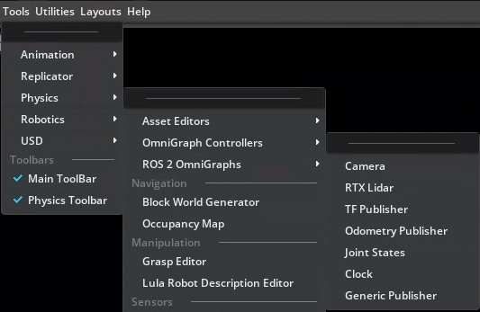

1. Stage Tree에서 마우스 오른쪽 버튼을 클릭하고 Create > Scope를 선택합니다.
2. 새 scope의 이름을 Graph로 변경합니다.
   * Scope는 그래프 및 관련 구성 요소를 구성하기 위한 컨테이너 역할을 합니다.
3. Tools > Robotics > ROS 2 OmniGraphs > Joint States로 이동합니다.
   * 이 단축키는 Joint State Publisher를 빠르게 구성하는 방법을 제공합니다.

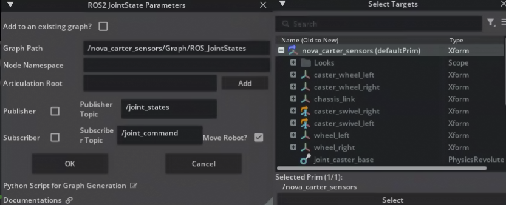

4. Graph Path를 `/nova_carter_sensors/Graph/ROS_JointStates`로 설정합니다.
5. Articulation Root를 `/nova_carter_sensors`로 설정합니다.

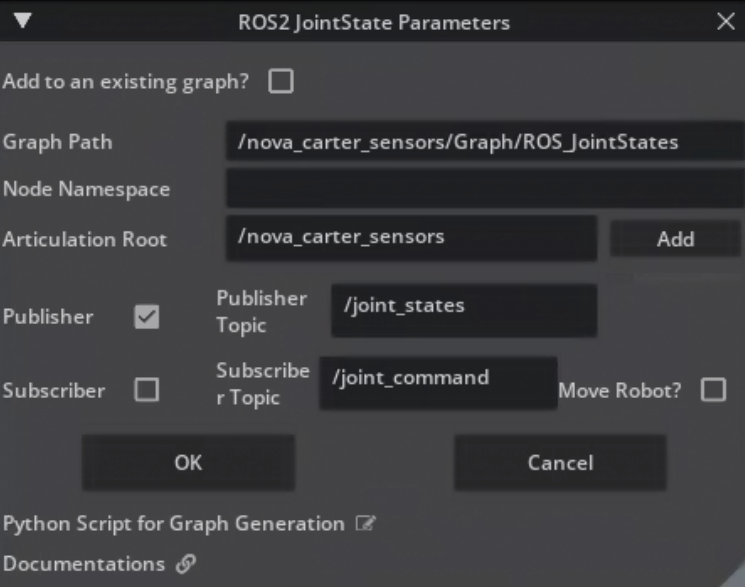

6. Publisher 체크박스를 선택하여 관절 상태 게시를 활성화합니다.
7. Subscriber와 Move Robot 체크박스는 해제합니다(이 설정에는 필요하지 않음).
8. OK를 눌러 그래프를 생성합니다.
9. Ctrl+S를 눌러 작업을 저장합니다.

---

## 모듈 3: 추가 ROS 기능 설정

**기능 확인**

1. Isaac Sim에서 Play 버튼을 눌러 게시자를 활성화합니다.
2. ROS가 소싱된 터미널을 열고 다음 명령어를 실행합니다:

```
ros2 topic list
```

3. `/joint_states`가 사용 가능한 토픽 중에 나열되는지 확인합니다.

```
$ ros2 topic list
/cmd_vel
/joint_states
/odom
/parameter_events
/point_cloud
/rosout
/tf
```

* 이 섹션을 완료함으로써 Nova Carter를 위한 Joint State Publisher를 성공적으로 설정하여 관절 상태를 ROS와 원활하게 통신할 수 있게 되었습니다.

---

## 모듈 3: 추가 ROS 기능 설정

**자동 네임스페이스 속성 생성**

이제 Nova Carter 로봇에 자동 네임스페이스 속성을 추가할 수 있습니다. 이는 로봇과 관련된 모든 ROS 토픽과 서비스에 적절한 네임스페이스가 지정되도록 하여, 여러 로봇이나 시스템에서 작업할 때 충돌을 방지합니다.

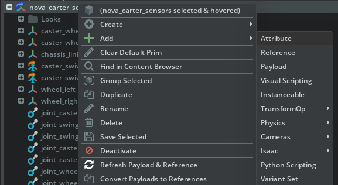

1. Stage Tree에서 `nova_carter_sensors` prim을 마우스 오른쪽 버튼으로 클릭합니다.
2. 컨텍스트 메뉴에서 Add > Attribute를 선택합니다.

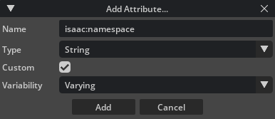

3. 나타나는 대화 상자에서:
   * Name을 `isaac:namespace`로 설정합니다.
   * Type을 String으로 설정합니다.
   * Custom이 체크되어 있는지 확인합니다.
   * Add를 클릭하여 완료합니다.

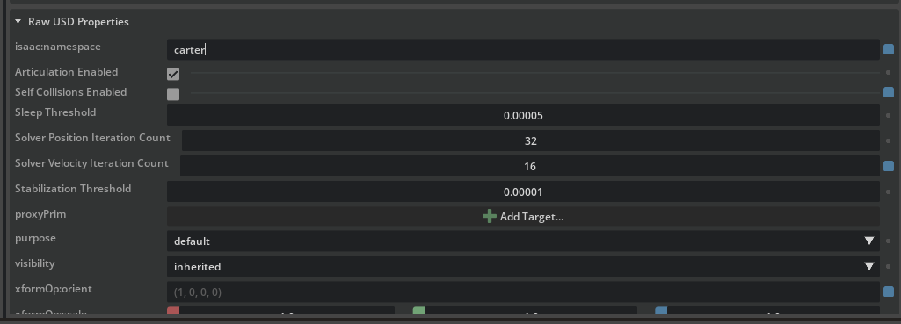

4. Property 패널의 Raw USD Properties에서 새로 추가된 `isaac:namespace` 속성을 찾습니다.
5. 값을 `carter`로 설정합니다.
6. Ctrl+S를 눌러 변경 사항을 저장합니다.
7. Isaac Sim에서 Play 버튼을 눌러 시뮬레이션을 활성화합니다.

---

## 모듈 3: 추가 ROS 기능 설정

**네임스페이스가 적용된 토픽 확인**

1. ROS가 소싱된 터미널을 열고 실행합니다:

```
ros2 topic list
```

2. 모든 Nova Carter 관련 토픽이 이제 `/carter` 접두사로 시작하는지 확인합니다. 다음과 유사한 출력이 표시되어야 합니다:

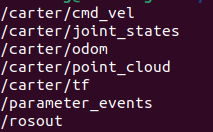

* 네임스페이스는 ROS에서 여러 로봇이나 시스템으로 작업할 때 토픽 충돌을 피하기 위해 중요합니다.

---

## 모듈 3: 추가 ROS 기능 설정

**검토**

이 모듈에서는 Joint State Publisher를 구성하고 자동 네임스페이스 속성을 구현하여 Nova Carter의 기능을 확장했습니다. 이러한 개선 사항은 체계적인 통신과 ROS와의 원활한 통합을 보장하여 고급 로봇 애플리케이션을 위한 토대를 마련합니다. 이러한 기능을 통해 Nova Carter는 이제 환경과 상호작용하고 복잡한 작업을 처리할 준비가 더 잘 갖추어졌습니다. 다음 모듈에서 계속 발전시켜 나가 봅시다!

다음 퀴즈로 지식을 테스트해 보세요.

**퀴즈 (각 2점, 채점됨)**

ROS의 Joint State Publisher는 실시간 모니터링을 위해 로봇의 관절 상태를 ROS 토픽으로 브로드캐스트하는 데 사용된다.

```
○ False
○ True
```

Nova Carter 로봇에 자동 네임스페이스 속성을 추가하는 목적은 무엇인가?

```
○ 시뮬레이션에서 로봇의 속도를 높이기 위해
○ 로봇이 odometry 데이터를 게시할 수 있도록 하기 위해
○ 여러 로봇으로 작업할 때 토픽 충돌을 방지하기 위해
```

---

## 모듈 4: Franka 로봇 구성

**개요**

Nova Carter 설정을 완료하신 것을 축하드립니다! 이 모듈에서는 Franka 로봇을 자체 ROS Action Graph 및 기능으로 구성하는 데 초점을 맞출 것입니다. 여기에는 Joint State Publisher 및 Subscriber 설정, 토픽 구성을 위한 네임스페이스 추가, 고급 조작 작업을 위한 Owl 카메라 통합이 포함됩니다. 이 모듈이 끝나면 두 로봇이 모두 완전히 구성되어 시뮬레이션 환경에서 함께 작동할 준비가 됩니다.

시작해 봅시다!

---

## 모듈 4: Franka 로봇 구성

**Franka ROS 그래프 구성**

이제 Carter 로봇이 준비되었고 ROS와 통신할 데이터가 준비되었으니, Franka 로봇을 자체 Action Graph로 설정해 보겠습니다.

**Joint State Publisher 및 Subscriber**
1. Desktop/DLI_SIL/Starting_point/franka/franka.usd 파일을 엽니다.
2. Stage Tree에서 마우스 오른쪽 버튼을 클릭하고 Create > Scope를 선택합니다.
3. 새 scope의 이름을 Graph로 변경합니다.
   * Scope는 그래프 및 관련 구성 요소를 구성하기 위한 컨테이너 역할을 합니다.

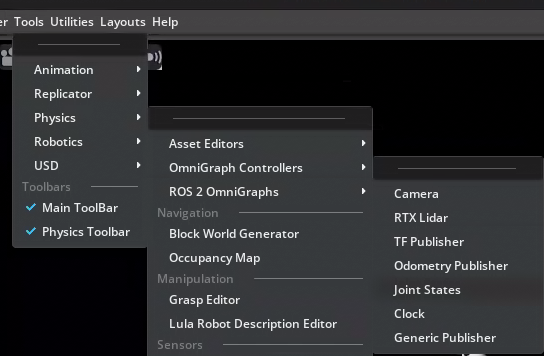

4. Tools > ROS 2 Omnigraphs > Joint States로 이동합니다.

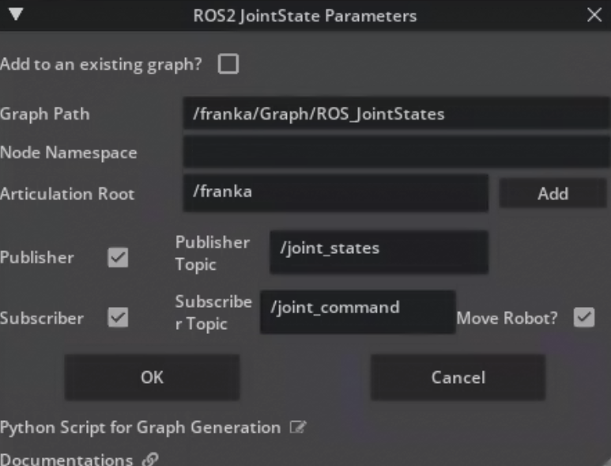

5. 다음 설정으로 그래프를 구성합니다:
   * Graph Path: `/franka/Graph/ROS_JointStates`
   * Articulation Root: `/franka`
   * Publisher와 Subscriber 옵션을 모두 활성화합니다.
   * Move Robot 옵션은 선택된 상태로 둡니다.
6. 구성을 확인하고 저장합니다.
7. Play 버튼을 누릅니다.

---

## 모듈 4: Franka 로봇 구성

**노드 네임스페이스 설정**

노드 네임스페이스가 올바르게 구성되었는지 확인하려면 ROS가 소싱된 터미널을 열고 다음을 실행합니다:

```
ros2 topic list
```

토픽을 나열할 때 Franka의 게시된 토픽이 추가 네임스페이스 접두사 없이 나타나는 것을 확인할 수 있습니다. 이상적으로는 `/joint_states`가 아닌 `/franka/joint_states`와 같이 표시되어야 합니다.

이는 추가 네임스페이스 레벨을 통해 구현됩니다.

**노드 네임스페이스**

Nova Carter 로봇에서 했던 것과 유사하게, Franka 로봇에도 특정 네임스페이스를 추가하여 Franka에서 게시되는 모든 토픽이 격리되도록 합시다. 이는 다른 로봇 토픽과의 충돌을 방지합니다.

1. `franka` prim을 마우스 오른쪽 버튼으로 클릭하고 Add > Attribute를 선택합니다.


2. 다음 속성으로 새 속성을 생성합니다:
   * Name: `isaac:namespace`
   * Type: String
   * Custom 옵션이 체크되어 있는지 확인합니다.

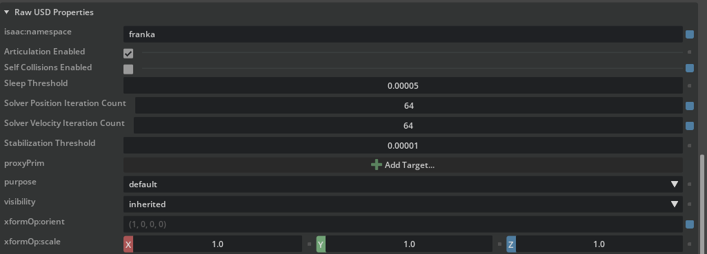

3. Raw USD Properties 패널에서 속성 값을 `franka`로 설정합니다.
4. 변경 사항을 저장합니다.
5. Play 버튼을 누릅니다.
6. 노드 네임스페이스가 올바르게 구성되었는지 확인하려면 ROS가 소싱된 터미널을 열고 다음을 실행합니다:

```
ros2 topic list
```

* 토픽을 나열할 때 Franka의 게시된 토픽이 이제 추가 네임스페이스 "franka" 접두사와 함께 나타나는 것을 확인할 수 있습니다. `/franka/joint_states` 및 `/franka/joint_command`가 표시되어야 합니다.

---

## 모듈 4: Franka 로봇 구성

**그리퍼에 Owl 카메라 추가**

Owl 카메라는 ROS 특화 변형이 있는 에셋으로, 이를 Franka 로봇의 `tool_center` prim 끝에 추가할 것입니다. 향후 Isaac Sim 버전에서는 내장 ROS 그래프와 함께 더 많은 에셋을 지원할 예정입니다.

1. Stage 패널에서 `+` 버튼을 사용하여 `panda_hand` prim을 확장하면 `tool_center`라는 prim이 보입니다.
2. Content 패널을 사용하여 Desktop/DLI_SIL/Starting_point/owl 폴더에서 Owl USD 파일을 찾습니다.
3. Owl USD 파일을 Stage 개요의 `/franka/panda_hand/tool_center` prim 위로 드래그 앤 드롭합니다. 이 작업은 Owl 카메라를 로봇 팔 끝에 자식으로 추가합니다.
4. Stage에서 Owl prim을 선택합니다.

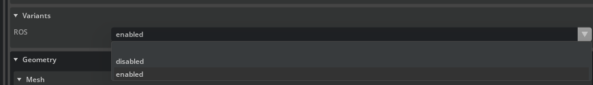

5. Property 패널의 Variants 섹션에서 `enabled`라는 변형을 선택합니다.

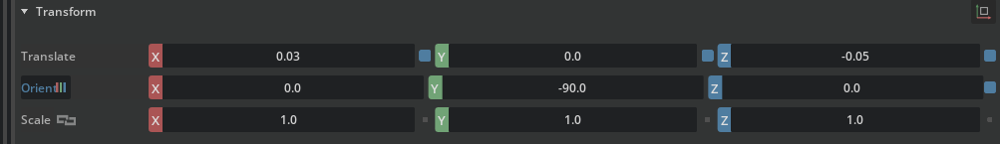

6. Owl의 트랜스폼 속성을 다음과 같이 구성합니다:
   * Translate: (0.03, 0.0, -0.05)
   * Orient: (0, -90, 0)

> **참고:** <br>
> Owl 카메라가 로봇 베이스에 나타난 경우, Preferences > Stage > Keep Prim World Transform When Reparenting이 체크 해제되어 있는지 확인하세요. 그런 다음 삭제하고 다시 가져오세요. 이러한 설정을 확인하십시오.

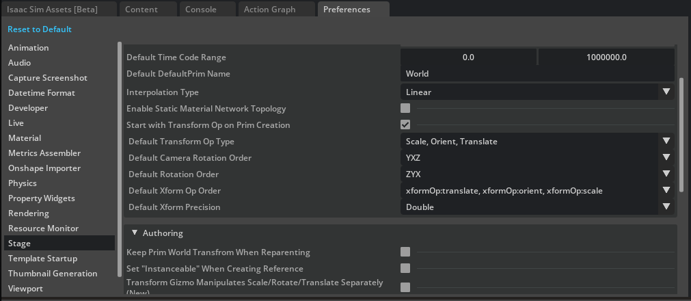

---

## 모듈 5: 점유 맵 생성

**개요**

점유 맵은 환경에 대한 일반 정보를 제공합니다: 흰색은 자유 공간, 검은색은 점유됨(장애물), 회색은 미지의 영역을 나타냅니다. 로봇은 이 맵을 사용하여 라이다로 감지한 장애물 패턴과 일치시켜 자신의 위치를 추정할 수 있습니다. 또한 경로 계획 알고리즘에서는 장애물에 비용 휴리스틱이 할당됩니다(장애물에는 무한 비용이 할당되어 로봇이 의도적으로 장애물과 충돌하는 경로를 계획하지 않도록 하며, 장애물 근처 영역에는 안전 버퍼를 만들기 위해 높은 비용이 할당됩니다). 이 비용 정보를 통해 로봇은 계획 알고리즘을 사용하여 최적 경로를 계산할 수 있습니다.

시작해 봅시다!

---

## 모듈 5: 점유 맵 생성

**맵 생성**

1. Isaac Sim에서 `/Desktop/DLI_SIL/Starting_point/warehouse_env/warehouse_env.usd` 파일을 엽니다.
> 💡 팁 <br>
카메라 제어: <br>
ALT + 왼쪽 클릭: 객체 중심으로 회전 <br>
오른쪽 마우스 버튼: 카메라 중심으로 회전 <br>
스크롤 휠: 확대/축소 <br>
가운데 마우스 버튼: 이동 <br>

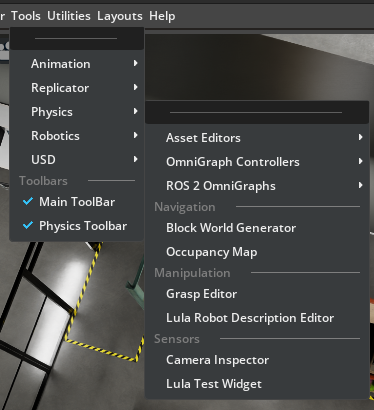

2. Tools > Robotics > Occupancy로 이동합니다.

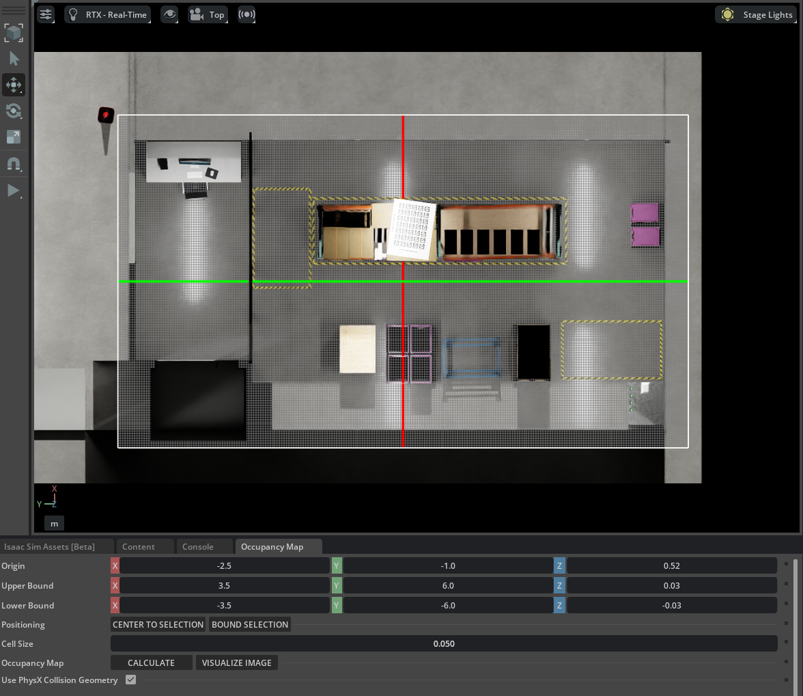

3. Occupancy Map 탭에서 다음을 구성합니다:
   * Origin: (-2.5, -1.0, 0.52)
   * Upper Bound: (3.5, 6.0, 0.03)
   * Lower Bound: (-3.5, -6.0, -0.03)
   * Cell Size: 0.05

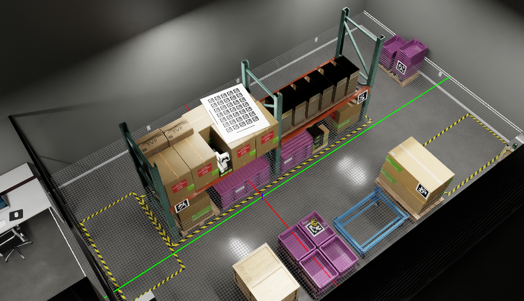

4. Calculate를 클릭하여 점유 맵을 생성합니다. 매핑은 대략 (-2.5, -1, 0.2)를 중심으로 합니다.

---

## 모듈 5: 점유 맵 생성

**맵 시각화 및 저장**

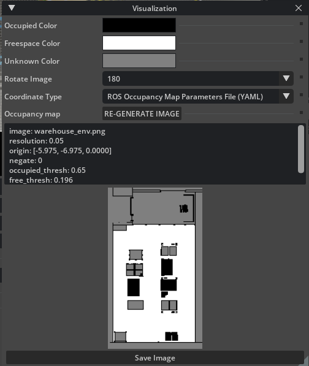

1. Visualize Image를 클릭하여 시각화 창을 엽니다.
2. Rotate Image를 180°로 설정합니다.
3. Coordinate Type으로 ROS Occupancy Map Parameter File (YAML)을 선택합니다.
4. Regenerate Image를 클릭합니다.
5. 대화 상자에서 YAML 내용을 복사하여 `/Desktop/DLI_SIL` 폴더 안에 `warehouse_env.yaml`로 저장합니다.

>💡 팁 <br>
터미널을 사용하여 이 파일을 만드는 방법의 예시입니다: <br>
1. Occupancy Map 위 대화 상자의 텍스트를 복사합니다. <br>
2. 터미널을 열고 `cat > ~/Desktop/DLI_SIL/warehouse_env.yaml`을 입력합니다. <br>
3. 마우스 오른쪽 버튼을 클릭하고 Paste를 선택합니다. <br>
4. CTRL+D를 누릅니다. <br>

6. 생성된 이미지를 같은 디렉토리에 `warehouse_env.png`로 저장합니다.

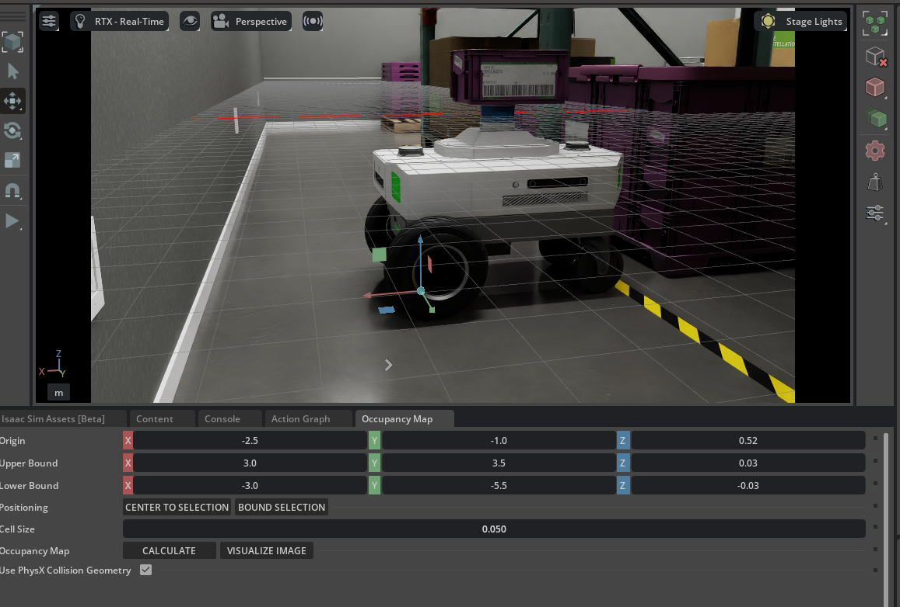

>📝 참고  <br>
점유 맵은 각 셀의 값이 장애물 존재 가능성을 나타내는 그리드 기반 표현을 제공합니다. <br>
이 맵은 위치 추정과 안전한 경로 계획에 필수적이며, 감지된 장애물이 있는 영역에 높은 비용을 할당하여 로봇이 장애물을 회피하도록 돕습니다. <br>

> 💾 체크포인트  <br>
길을 잃었거나 앞으로 건너뛰고 싶다면 Checkpoint 3을 로드하세요. <br>

---

## 모듈 6: 환경 설정

**개요**

이 모듈에서는 Nova Carter와 Franka 로봇이 협력하여 작동할 수 있는 공유 시뮬레이션 환경을 설정합니다. 이전 모듈의 구성을 기반으로 로봇을 배치하고, 통합 Environment ROS Graph를 생성하며, 모든 토픽이 올바르게 네임스페이스가 지정되고 정상 작동하는지 확인합니다. 이 모듈이 끝나면 다중 로봇 작업 및 고급 시뮬레이션을 위한 완전히 통합된 환경을 갖추게 됩니다. 시작해 봅시다!

---

## 모듈 6: 환경 설정

**두 로봇을 Stage로 가져오기**

1. Isaac Sim에서 Content Browser로 이동합니다.

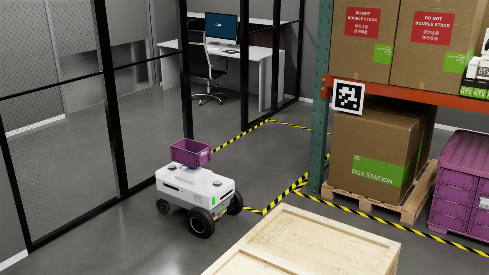<br>
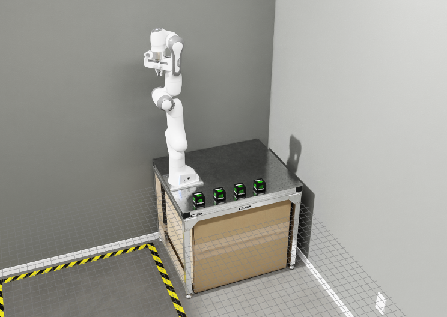

2. `nova_carter`와 `franka` 에셋을 Stage로 드래그 앤 드롭합니다.
   * Nova Carter를 구성할 수 없었다면 Checkpoint1_nova_carter의 에셋을 사용하세요.
   * Franka를 구성할 수 없었다면 Checkpoint2_franka의 에셋을 사용하세요.

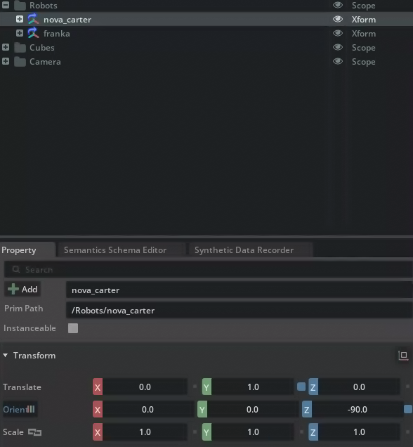

3. 두 로봇 xform(`nova_carter_sensors`와 `franka`)을 Robots scope 안으로 이동합니다.
4. Stage Tree에서 `nova_carter` xform을 선택합니다.
   * Translate: (-3, 1.2, 0)
   * Orient: (0, 0, -90)
5. Stage Tree에서 `franka` xform을 선택합니다.

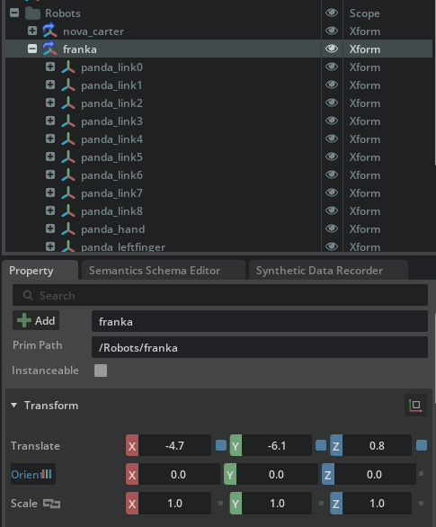

6. 트랜스폼 값을 다음으로 설정합니다:
   * Translate: (-4.7, -6.1, 0.8)
   * Orient: (0.0, 0.0, 0.0)
7. Stage Tree에서 마우스 오른쪽 버튼을 클릭하고 Create > Scope를 선택합니다.
8. 이 새 scope의 이름을 Graph로 변경합니다.

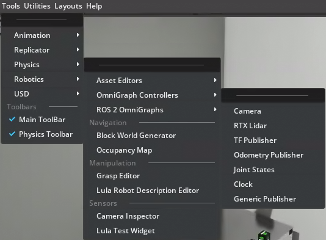

9. Tools > ROS 2 Omnigraphs > Clock으로 이동합니다.
10. 프롬프트에 따라 Clock 노드를 설정하고 OK를 클릭합니다.
11. Isaac Sim에서 Play 버튼을 눌러 시뮬레이션을 시작합니다.

---

## 모듈 6: 환경 설정

**ROS 토픽 확인**

1. ROS가 소싱된 터미널을 엽니다.
2. 다음 명령어를 실행하여 모든 활성 토픽을 나열합니다:

```
ros2 topic list
```

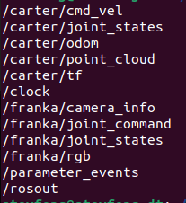

3. Nova Carter와 Franka의 토픽뿐만 아니라 `/clock`과 같은 공유 토픽도 표시되는지 확인합니다.

---

## 모듈 6: 환경 설정

**검토**

Franka 로봇을 자체 ROS ActionGraph로 성공적으로 구성하고, 체계적인 통신을 위한 네임스페이스를 통합했으며, 조작 작업을 위한 Owl 카메라로 기능을 향상시켰습니다. 이제 Nova Carter와 Franka가 모두 공유 시뮬레이션 환경에 완전히 설정되었으므로, 다음 단계에서 다중 로봇 협업과 고급 로봇 애플리케이션을 탐색할 준비가 되었습니다. 지금까지 훌륭한 작업입니다. 계속 구축해 나가 봅시다!

>💾 체크포인트 <br>
길을 잃었거나 앞으로 건너뛰고 싶다면 Checkpoint 4를 로드하세요.

계속하기 전에 다음 퀴즈로 지식을 테스트해 보세요.

## 퀴즈
1점 (채점됨)
본 모듈에서 통합 환경 ROS 그래프를 생성하는 목적은 무엇인가?

```
○ 두 로봇 모두에 대한 Joint State Publisher를 구성하기 위해
○ 차동 구동 로봇을 위한 Twist 구독자를 설정하기 위해
○ 다중 로봇 작업에서 모든 ROS 토픽이 올바르게 네임스페이스가 지정되고 정상 작동하도록 보장하기 위해
○ 장애물 회피를 위한 점유 맵을 생성하기 위해
```

---

## 모듈 7: ROS 작업 공간 설정

**개요**

이 모듈에서는 자율 주행 소프트웨어 스택을 실행하는 데 필요한 ROS 작업 공간을 설정합니다.

---

## 모듈 7: ROS 작업 공간 설정

**nova_carter_description 패키지 설치**

`nova_carter_description` 패키지에는 Nova Carter의 모든 TF 구성과 로봇 설명(URDF 파일)이 포함되어 있습니다. Isaac Sim 4.5 및 Isaac ROS 3.2에 맞게 조정된 이 지침은 로봇 설명을 ROS 작업 공간에 통합하기 위한 환경이 올바르게 구성되도록 합니다.

1. UTF-8 지원을 위한 로케일 설정

```
locale  # UTF-8 확인

sudo apt update && sudo apt install locales
sudo locale-gen en_US en_US.UTF-8
sudo update-locale LC_ALL=en_US.UTF-8 LANG=en_US.UTF-8
export LANG=en_US.UTF-8

locale  # 설정 확인
```

2. 필수 종속성 설치

```
sudo apt update && sudo apt install gnupg wget
sudo apt install software-properties-common
sudo add-apt-repository universe
```

3. NVIDIA의 GPG 키 및 리포지토리 등록
- 위치에 따라 다음 옵션 중 하나를 선택하세요:

```
wget -qO - https://isaac.download.nvidia.com/isaac-ros/repos.key | sudo apt
```

---

## 모듈 7: ROS 작업 공간 설정

**ROS 작업 공간 설치**

Isaac ROS 패키지를 통합하고 시뮬레이션 구성 요소를 실행할 준비가 된 ROS 작업 공간을 구성하고 빌드해 보겠습니다. 터미널이 제대로 소싱되었는지 확인하고, 패키지 종속성을 업데이트하고, 작업 공간을 컴파일하고, 빌드된 설정 파일을 소싱할 것입니다.

1. 새 터미널을 열고 실행합니다:

```
source /opt/ros/humble/setup.bash
```

2. 다음 명령어를 실행하여 rosdep을 초기화하고 업데이트합니다:

```
rosdep init
rosdep update
```

3. ROS 작업 공간 디렉토리인 `ros_ws`로 이동하여 작업 공간 소스에서 필요한 종속성을 설치합니다:

```
rosdep install --from-paths src --ignore-src -r -y
```

4. colcon을 사용하여 작업 공간을 빌드합니다:

```
colcon build
```

5. 빌드가 완료되면 생성된 설정 파일을 소싱하여 새 패키지를 현재 셸 세션에 오버레이합니다:

```
source install/setup.bash
```

이제 필요한 모든 패키지를 실행할 준비가 된 작업 공간을 갖추었습니다. ROS 작업 공간이 완전히 구성되어 시뮬레이션 환경에 필요한 패키지를 지원할 준비가 되었습니다. 이제 더 고급 모듈로 나아갈 준비가 되었습니다.

---

## 모듈 7: ROS 작업 공간 설정

**검토**

`nova_carter_description` 패키지를 설치하고 ROS 작업 공간을 구성하여 시뮬레이션 환경을 준비했습니다. 이러한 단계를 통해 Isaac Sim과의 원활한 통합을 위해 필요한 모든 로봇 설명, TF 구성 및 종속성이 준비되었습니다. 이 기반을 바탕으로 다음 모듈에서 MoveIt2를 사용한 조작 기능부터 시작하여 고급 로봇 기능으로 나아갈 준비가 되었습니다.

## 퀴즈: 1점 (채점됨)

터미널에서 ROS 설정 파일(`source /opt/ros/humble/setup.bash`)을 소싱하는 목적은 무엇인가?

```
○ 특정 작업 공간에 대한 ROS 노드의 소스 코드를 보기 위해
○ 로봇 작업을 활성화하고 내비게이션 작업을 시작하기 위해
○ 터미널이 ROS 명령어를 사용하고 ROS 패키지에 접근할 수 있도록 올바르게 구성하기 위해
○ 새로운 ROS 작업 공간을 생성하기 위해
```

---

## 모듈 8: Nav2를 사용한 자율 주행

**개요**

이 랩을 통해 Nova Carter와 Franka의 주요 구성 요소를 구성 및 테스트하고, MoveIt2와 같은 고급 도구를 통합했으며, 공유 시뮬레이션 환경을 준비했습니다. 이 모듈에서는 Nav2 스택을 사용하여 자율 주행을 설정함으로써 모든 것을 통합합니다. 이 모듈이 끝나면 Nova Carter가 환경을 자율적으로 탐색할 수 있게 되어 다중 로봇 협업의 기반이 완성됩니다.

---

## 모듈 8: Nav2를 사용한 자율 주행

**점유 맵 추가**

1. 이전 모듈에서 생성한 점유 맵 이미지와 YAML 파일을 다음 폴더로 복사합니다:

```
~/Desktop/DLI_SIL/Starting_point/gtc25-mega1/ros_ws/src/navigation/carter_navigation/maps/
```

---

## 모듈 8: Nav2를 사용한 자율 주행

**작업 공간 빌드 및 소싱**

1. 작업 공간 폴더의 루트로 이동합니다:

```
cd ~/Desktop/DLI_SIL/Starting_point/gtc25-mega1/ros_ws/
```

2. 빌드 명령어를 실행합니다:

```
colcon build
```

모든 패키지를 ROS에서 찾을 수 있도록 작업 공간을 소싱하는 것이 중요합니다. 이 랩의 나머지 부분에서 새 터미널을 열 때마다 작업 공간을 소싱해야 합니다.

```
source ~/Desktop/DLI_SIL/Starting_point/gtc25-mega1/ros_ws/install/setup.bash
```

---

## 모듈 8: Nav2를 사용한 자율 주행

**Nav 스택 실행**

1. Isaac Sim에서 Play 버튼을 눌러 시뮬레이션 환경을 활성화합니다.
2. 새 터미널을 열고 ROS 작업 공간을 소싱합니다:

```
source ~/Desktop/DLI_SIL/Starting_point/gtc25-mega1/ros_ws/install/setup.bash
```

3. 다음 명령어를 실행하여 Nova Carter의 TF 게시자를 실행합니다. 이는 robot_state_publisher를 사용하여 Isaac Sim의 관절 상태를 기반으로 TF를 게시합니다:

```
ros2 launch carter_navigation nova_carter_description_isaac_sim.launch.py
```

4. 새 터미널에서 ROS 작업 공간을 소싱하고 이 명령어를 실행하여 `/tf_static` 토픽을 네임스페이스가 적용된 토픽 `/carter/tf_static`으로 중계합니다.
   * 이는 정적 TF 메시지가 올바르게 재매핑되도록 보장합니다(때로는 런치 파일에서 정적 메시지에 대한 재매핑이 보장되지 않을 수 있음).

```
source ~/Desktop/DLI_SIL/Starting_point/gtc25-mega1/ros_ws/install/setup.bash
ros2 run topic_tools relay /tf_static /carter/tf_static
```

5. 다른 ROS가 소싱된 터미널에서 다음 명령어를 실행하여 Nova Carter용 Nav2를 시작합니다:

```
source ~/Desktop/DLI_SIL/Starting_point/gtc25-mega1/ros_ws/install/setup.bash
ros2 launch carter_navigation carter_warehouse_env.launch.py
```

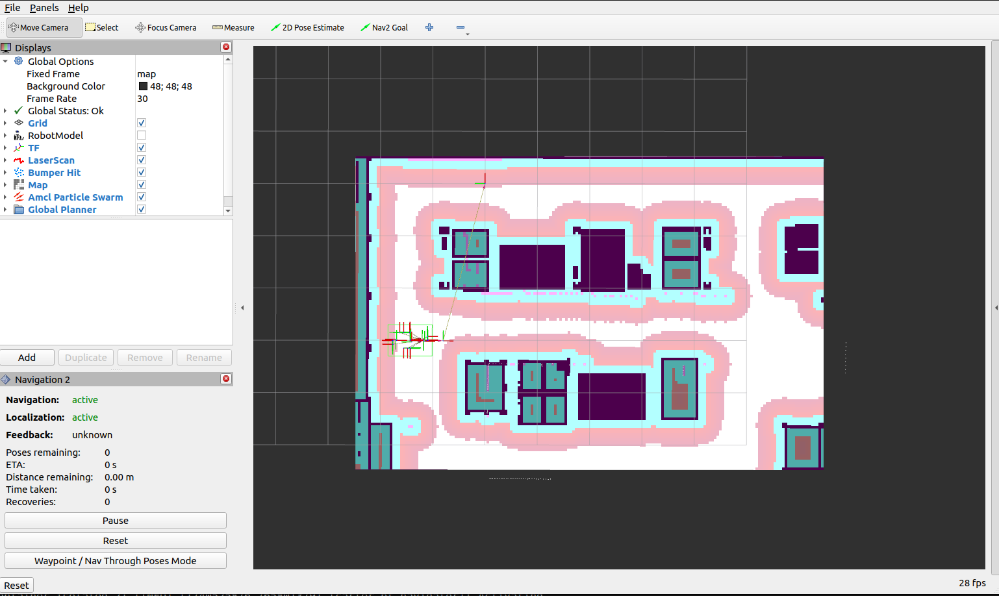

이와 같은 RVIZ 창이 표시됩니다. 흰색 영역은 자유 공간, 어두운 영역은 로봇이 회피해야 할 장애물을 의미합니다. 분홍색과 파란색 영역은 각각 낮은 비용과 높은 비용의 영역으로, 로봇이 환경과 충돌할 가능성을 줄이기 위해 해당 영역에 가는 것을 discourage합니다.

이제 Nav2 Goal을 왼쪽 클릭하여 로봇의 목표 위치와 방향을 설정합니다.

https://learn.learn.nvidia.com/assets/courseware/v1/a7bae6e7a772dbad4340b1788c8c8459/asset-v1:DLI+S-OV-39+V1+type@asset+block/gtc_mega1_lab_navigation.mp4

>💡 팁 <br>
다양한 관점에서 Carter 로봇을 보려면: <br>
Isaac Sim의 Viewport에서 카메라를 "third_person_view_cam" 또는 Carter 로봇에 장착된 다른 카메라로 전환하여 움직이는 로봇을 관찰하세요. <br>

---

## 모듈 8: Nav2를 사용한 자율 주행

**검토**

이 섹션을 완료함으로써 Nova Carter용 Nav2 스택을 성공적으로 구성하고 실행하여 시뮬레이션 환경 내에서 자율 주행을 가능하게 했습니다.

## 퀴즈: 1점 (채점됨)

ROS 작업 공간을 빌드한 후 작업 공간 설정 파일(예: `source install/setup.bash`)을 소싱하는 목적은 무엇인가?

```
○ ROS 패키지를 설치하기 위해
○ ROS 작업 공간 디렉토리를 구성하기 위해
○ 현재 터미널 세션에서 작업 공간 내의 모든 패키지가 ROS에 의해 인식되고 접근 가능하도록 보장하기 위해
○ colcon을 사용하여 ROS 작업 공간을 빌드하기 위해
```

---

## 모듈 9: MoveIt2를 사용한 조작

**개요**

계속해서 Isaac Sim의 Franka 로봇과 함께 ROS를 위한 강력한 로봇 조작 플랫폼인 MoveIt2를 통합해 보겠습니다. MoveIt2는 고급 모션 계획, 제어 및 조작 작업을 가능하게 합니다. 이 모듈이 끝나면 Franka 로봇의 모션 계획을 실행하고 그 움직임을 실시간으로 시각화할 수 있게 됩니다.

---

## 모듈 9: MoveIt2를 사용한 조작

**MoveIt2 실행**
1. Play 버튼을 누릅니다.
2. 새 터미널을 열고 ROS 작업 공간을 소싱합니다:

```
source ~/Desktop/DLI_SIL/Starting_point/gtc25-mega1/ros_ws/install/setup.bash
```

3. 다음 명령어를 실행하여 Franka로 MoveIt2를 실행합니다:

```
ros2 launch isaac_moveit isaac_moveit.launch.py
```

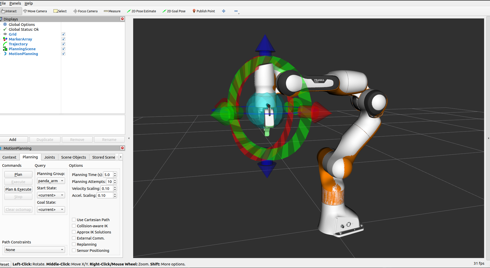

* 이와 같은 창이 표시됩니다: 흰색 모델은 로봇의 실제 위치를 나타내고, 주황색 모델은 로봇의 목표 위치를 나타냅니다.

* 화살표와 원형 링을 사용하여 목표 위치를 다음과 같이 드래그합니다:

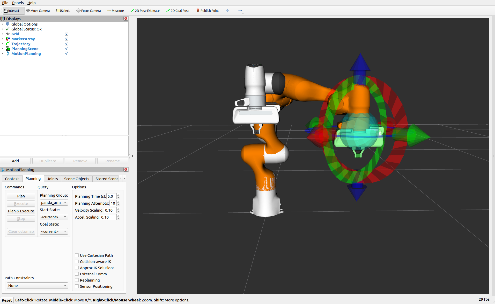

* 그런 다음 Plan and Execute를 클릭합니다.

4. 이전 단계와 유사하게, 계획 그룹으로 "hand"를 선택하고 목표 상태를 "close"(그리퍼가 이미 닫혀 있으면 "open")로 설정하여 그리퍼를 업데이트합니다. 그런 다음 Plan and Execute를 클릭합니다.

https://learn.learn.nvidia.com/assets/courseware/v1/f6406f99a4d1d683ff56370a8e7f959d/asset-v1:DLI+S-OV-39+V1+type@asset+block/gtc_mega1_lab_manipulation.mp4

5. Isaac Sim에서 Franka 카메라 보기로 전환하여 모션 계획이 실행될 때 로봇의 움직임을 관찰합니다.

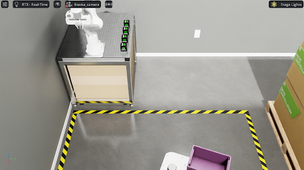

* 선택사항: Windows > Viewports > Viewports2를 클릭하고 "camera"를 선택하여 이전에 가져온 1인칭 뷰 카메라로 전환합니다.

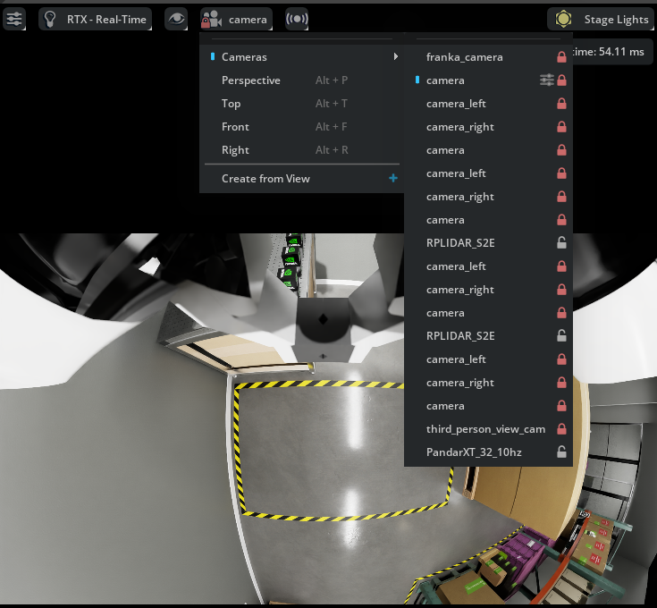

---

## 모듈 9: MoveIt2를 사용한 조작

**검토**

좋습니다! Franka 로봇과 MoveIt2를 성공적으로 통합하여 Isaac Sim 내에서 모션 계획 및 조작 기능을 활성화했습니다. 이 설정을 통해 로봇은 복잡한 작업을 실행할 수 있으며 다음 모듈에서 자율 주행에 대한 추가 탐구를 위한 준비를 갖추게 됩니다. 지금까지 훌륭한 진전입니다, 보너스는 어떠세요?!

**퀴즈: 1점 (채점됨)**

* 로봇 공학에서 MoveIt2를 사용하는 주요 목적은 무엇인가?

```
○ 자율 주행
○ 조작(매니퓰레이션) 작업
○ 센서 통합
○ 음성 제어 통합
```

---

## 도전 과제

**다중 로봇 협업**

이 마지막 도전 과제에서는 지금까지 배운 모든 것을 결합하여 Nova Carter와 Franka를 모두 사용하는 협업 작업을 완료합니다. 목표는 ROS Nav2를 사용하여 Nova Carter를 Franka 적재 구역까지 자율 주행시키고, Franka를 사용하여 큐브를 집어 Nova Carter에 적재한 다음, Nova Carter를 다시 하역 구역까지 주행시키는 것입니다.

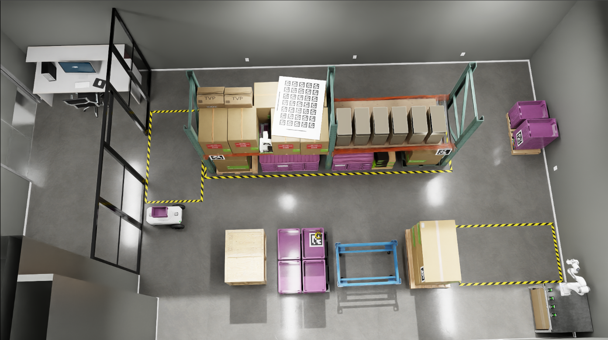

**도전 과제 지침**

1. Nova Carter를 적재 구역으로 주행
   * Nav2 스택을 사용하여 Nova Carter가 Franka 적재 구역에 도달하도록 내비게이션 목표를 보냅니다.
   * 로봇이 장애물을 회피하고 점유 맵을 기반으로 최적 경로를 따르는지 확인합니다.
2. Franka를 사용하여 큐브 집기
   * Franka로 제어를 전환하고 MoveIt2를 사용하여 적재 구역에서 큐브를 집기 위한 모션을 계획하고 실행합니다.
   * Franka의 그리퍼를 신중하게 위치시켜 큐브를 고정합니다.
3. 큐브를 Nova Carter에 적재
   * Franka로 또 다른 모션을 계획하고 실행하여 큐브를 Nova Carter의 플랫폼에 안전하게 놓습니다.
   * 진행하기 전에 큐브가 안정적인지 확인합니다.
4. Nova Carter를 하역 구역으로 주행
   * Nav2를 다시 사용하여 Nova Carter가 지정된 하역 구역으로 이동하도록 내비게이션 목표를 보냅니다.
   * 큐브를 운반하는 동안 원활한 주행을 보장합니다.

>💡 팁 <br>
환경을 구성할 수 없었다면 Checkpoint4_completed_environment의 에셋을 사용하고, 점유 맵을 생성할 수 없었다면 Checkpoint5_completed_ros_package의 ROS 작업 공간을 사용하세요.

---

## OpenUSD, Isaac Sim, ROS를 활용한 로봇 소프트웨어-인-더-루프 테스트

**검토**

이 실습 랩을 완료하신 것을 축하드립니다! 함께 Isaac Sim과 ROS를 사용하여 로봇 시뮬레이션의 흥미진진한 가능성을 탐구했습니다. 기본 구성부터 시작하여 Nova Carter와 Franka 로봇을 설정하고, 조작을 위한 MoveIt2와 같은 고급 도구를 통합했으며, Nav2를 사용한 자율 주행을 활성화했습니다. 마지막으로 이러한 기술을 협업 다중 로봇 도전 과제에 적용하여 테스트 및 개발을 위한 시뮬레이션의 강력함을 선보였습니다.

* 학습 여정을 계속하려면 [Robotics Fundamentals Learning Path](https://www.nvidia.com/en-us/learn/learning-path/robotics/)를 확인하세요.

---

## 퀴즈 정답

**Module 2 퀴즈 정답**
   * 1번 문제: Isaac Sim의 액션 그래프는 비주얼 프로그래밍을 위해 사용되는 이벤트 기반 도구이다.
      * 정답: True
   * 2번 문제: Nova Carter를 위해 Isaac Sim에서 라이다 그래프를 생성하는 주된 목적은 무엇인가?
      * 정답: To publish synthetic point cloud data to ROS (ROS에 합성 포인트 클라우드 데이터를 발행하기 위함)

**Module 3 퀴즈 정답**
   * 1번 문제: ROS의 Joint State Publisher는 실시간 모니터링을 위해 로봇의 관절 상태를 ROS 토픽으로 브로드캐스트하는 데 사용된다.
      * 정답: True
   * 2번 문제: Nova Carter 로봇에 자동 네임스페이스 속성을 추가하는 목적은 무엇인가?
      * 정답: To avoid topic conflicts when working with multiple robots (여러 대의 로봇을 다룰 때 토픽 충돌을 방지하기 위함)

**Module 6 퀴즈 정답**
   * 1번 문제: 본 모듈에서 통합 환경 ROS 그래프를 생성하는 목적은 무엇인가?
   * 정답: To ensure all ROS topics are correctly namespaced and functional for multi-robot tasks (다중 로봇 작업에서 모든 ROS 토픽이 올바르게 네임스페이스가 지정되고 정상 작동하도록 보장하기 위함)

**Module 7 퀴즈 정답**
   * 1번 문제: 터미널에서 ROS 설정 파일(source /opt/ros/humble/setup.bash)을 소싱하는 목적은 무엇인가?
   * 정답: To ensure the terminal is properly configured to use ROS commands and access ROS packages (터미널이 ROS 명령어를 사용하고 ROS 패키지에 접근할 수 있도록 올바르게 구성하기 위함)

**Module 8 퀴즈 정답**
   * 1번 문제: ROS 작업 공간을 빌드한 후 작업 공간 설정 파일(예: source install/setup.bash)을 소싱하는 목적은 무엇인가?
   * 정답: To ensure that all packages in the workspace are recognized and accessible by ROS in the current terminal session (현재 터미널 세션에서 작업 공간 내의 모든 패키지가 ROS에 의해 인식되고 접근 가능하도록 보장하기 위함)

**Module 9 퀴즈 정답**
   * 1번 문제: 로봇 공학에서 MoveIt2를 사용하는 주요 목적은 무엇인가?
   * 정답: Manipulation tasks (매니퓰레이션/조작 작업)
