# Linux (Operation System)

> **충청ICT 교육과정 Day1** — Linux 운영체제 기초

---

## 1. OS (Operating System)

**운영체제**란 사용자와 컴퓨터 하드웨어 사이의 인터페이스 역할을 하는 소프트웨어의 집합이다.

- 컴퓨터 시스템의 자원을 효율적으로 관리
- 사용자 및 다른 소프트웨어와의 상호작용
- 성능 최적화 및 편리한 인터페이스 제공
- **범용OS** 와 **전용(Embedded)OS** 로 구분되어 사용됨

```
 ┌─────────────────────────────────────────────────┐
 │                 Application                      │
 ├─────────────────────────────────────────────────┤
 │              Operating System                    │
 ├─────────────────────────────────────────────────┤
 │                 Hardware                         │
 └─────────────────────────────────────────────────┘
```


---

## 2. OS (Operating System) - Linux

- **Open Source and Free** — 오픈소스, 무료 사용 가능
- Linux에는 **Red Hat, SUSE, Debian** 등의 배포판(Distribution)이 존재
- **배포판(Distribution)**: Linux Kernel 외 용도에 따른 여러 소프트웨어 패키지들을 함께 담은 Linux OS 시스템
- **NVIDIA Jetson**은 **Ubuntu Linux** 지원

| 배포판 | 패키지 형식 | 패키지 관리자 |
|--------|-----------|-------------|
| Red Hat / CentOS / Fedora | .rpm | YUM / DNF |
| SUSE | .rpm | YaST / Zypper |
| Debian / **Ubuntu** | **.deb** | **APT** |
| Arch Linux | - | Pacman |

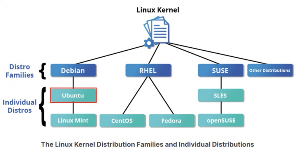
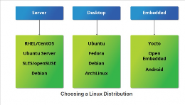


---

## 3. Linux 활용 분야

Linux는 다음과 같은 다양한 분야에서 활용된다:

- **서버** (웹 서버, DB 서버, 파일 서버)
- **클라우드 컴퓨팅** (AWS, GCP, Azure 등)
- **임베디드 시스템** (IoT, 라우터, 셋톱박스)
- **AI / 머신러닝** (NVIDIA Jetson, 서버)
- **모바일** (Android - Linux Kernel 기반)
- **슈퍼컴퓨터** (Top 500 중 90% 이상이 Linux)
- **데스크탑** (Ubuntu, Fedora 등)

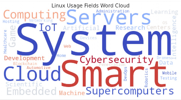


---

## 4. Linux OS의 주요 구성

Linux 운영체제는 다음 주요 구성 요소로 이루어져 있다:

```
 ┌──────────────────────────────────────────────┐
 │         X Window System (Desktop Environment)  │
 ├──────────────────────────────────────────────┤
 │                   Shell                        │
 ├──────────────────────────────────────────────┤
 │                   Daemon                       │
 ├──────────────────────────────────────────────┤
 │               File System                      │
 ├──────────────────────────────────────────────┤
 │                  Kernel                        │
 ├──────────────────────────────────────────────┤
 │               BootLoader                       │
 │          (BIOS / UEFI → GRUB)                 │
 ├──────────────────────────────────────────────┤
 │                 Hardware                       │
 └──────────────────────────────────────────────┘
```

| 구성 요소 | 역할 |
|-----------|------|
| **BootLoader** | 부팅 시 OS를 메모리에 로드 |
| **Kernel** | 하드웨어-소프트웨어 간 인터페이스, 핵심 관리 기능 |
| **Daemon** | 백그라운드 서비스 프로세스 |
| **Shell** | 사용자-커널 간 명령 인터페이스 |
| **File System** | 데이터 저장 및 계층 구조 관리 |
| **X Window System** | GUI 환경 제공 |

---

## 5. Linux – BootLoader

**BootLoader**는 컴퓨터를 부팅할 때 설치된 운영체제를 메모리에 로드하고 실행하는 역할을 한다.

- **BIOS**, **UEFI**가 부트 디바이스(하드 디스크, SSD)에서 부트로더를 로드하고 실행
- 대표적인 부트로더로는 **GRUB**(Grand Unified Bootloader)이 있음

### UEFI (Unified Extensible Firmware Interface)
- 64bit OS 부팅을 지원하는 펌웨어
- Legacy BIOS Setup 인터페이스 지원
- 기존 BIOS보다 빠른 부팅, 보안 부팅 지원

| 구분 | Legacy BIOS | UEFI |
|------|------------|------|
| 인터페이스 | 16bit | 64bit |
| 부팅 속도 | 상대적으로 느림 | 빠름 |
| 디스크 파티션 | MBR (최대 2TB) | GPT (9.4ZB) |
| Secure Boot | 미지원 | 지원 |

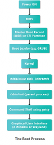
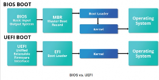

---

## 6. Linux – Kernel

**Kernel**은 운영체제의 핵심 부분으로, 하드웨어와 소프트웨어 간의 인터페이스 역할을 한다.

- 부팅 과정에서 커널이 메모리에 로드되어 실행
- **프로세스 관리**: CPU 스케줄링, 프로세스 생성/종료
- **메모리 관리**: 가상 메모리, 페이징, 세그멘테이션
- **파일 시스템 관리**: 파일 읽기/쓰기, 권한 관리
- **장치 드라이버 관리**: 하드웨어 장치 제어
- 쉘(Shell)에게 전달받은 사용자의 요청을 하드웨어에게 전달하여 처리할 수 있게 함
- OS의 가장 낮은 수준의 API (Application Programming Interface)

```
  사용자
    │
    ▼
┌──────────┐     ┌──────────────┐
│  Shell   │────▶│   Kernel     │────▶ Hardware
└──────────┘     └──────────────┘
   (요청 해석)       (하드웨어 제어)
```

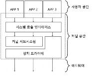
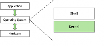

---

## 7. Linux – Daemons

**Daemon**(데몬)은 백그라운드에서 실행되며 사용자의 직접적인 개입 없이 특정 작업을 수행하는 프로그램이다.

- 서버나 시스템 관리 작업을 자동화하는 역할
- 주로 시스템이 부팅될 때 시작되어 지속적으로 실행
- 리눅스 시스템 운영에 필수적인 역할
- 서버 및 백그라운드 작업을 안정적으로 유지하는 핵심 요소

### 대표적인 Linux Daemon

| 데몬 이름 | 역할 |
|-----------|------|
| `systemd` | 시스템 및 서비스 관리 (최신 표준) |
| `sshd` | SSH 원격 접속 서비스 |
| `httpd` / `apache2` | 웹 서버 |
| `cron` / `systemd-timer` | 스케줄링 작업 |
| `rsyslogd` | 시스템 로그 관리 |
| `networkd` | 네트워크 관리 |

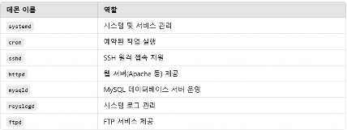
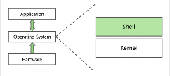

---

## 8. Linux – Shell

**Shell**(셸)은 사용자와 커널 간의 명령 인터페이스 역할을 한다.

- 사용자가 명령어를 입력하면 셸이 이를 해석하여 커널에 전달
- 커널의 실행 결과를 사용자에게 반환
- 즉, 사용자의 요청이 Shell을 통해 해석되고, 그 결과가 Kernel에 전달됨

### 대표적인 Shell

| Shell | 설명 | 특징 |
|-------|------|------|
| **Bash** (Bourne Again Shell) | Linux 표준 Shell | 대부분의 Linux 배포판 기본 |
| **sh** (Bourne shell) | UNIX 전통 Shell | 가장 기본적인 Shell |
| **Ash** (Almquist Shell) | 경량 Shell | 임베디드 Linux에 주로 사용 |
| **Zsh** (Z Shell) | 확장 Shell | Bash에 다양한 기능 추가 |
| **Fish** | 친화적 Shell | 자동완성, 하이라이트 등 |

```
┌─────────────────────────────────────────────┐
│  사용자 (명령어 입력: ls -la /home)          │
└──────────────────┬──────────────────────────┘
                   │
                   ▼
┌─────────────────────────────────────────────┐
│  Shell (명령어 해석, 실행)                   │
│  ex: Bash가 "ls"를 해석하여 kernel에 전달    │
└──────────────────┬──────────────────────────┘
                   │
                   ▼
┌─────────────────────────────────────────────┐
│  Kernel (하드웨어 제어, 결과 반환)           │
└─────────────────────────────────────────────┘
```

---

## 9. Linux – File System

**File System**(파일 시스템)은 데이터를 저장하고 관리하는 체계이다.

- 리눅스 파일 시스템은 **계층적인 구조**를 가지고 있음
- 모든 파일과 디렉토리는 **`/`(루트)** 에서 시작
- 여러 종류의 파일 타입 지원 — 일반 파일, 심볼릭 링크 파일, 디바이스 파일 등
- **사용자와 그룹 기반의 권한 시스템**으로 파일과 디렉토리에 대한 접근 제어

### 주요 디렉토리 구조

| 디렉토리 | 설명 |
|----------|------|
| `/` | 루트 디렉토리 (최상위) |
| `/bin` | 기본 실행 명령어 |
| `/sbin` | 시스템 관리 명령어 |
| `/etc` | 시스템 설정 파일 |
| `/home` | 사용자 홈 디렉토리 |
| `/var` | 가변 데이터 (로그, 캐시) |
| `/tmp` | 임시 파일 |
| `/dev` | 장치 파일 |
| `/proc` | 프로세스 정보 (가상 파일 시스템) |
| `/usr` | 사용자 프로그램 및 라이브러리 |

### 대표적인 파일 시스템

| 파일 시스템 | 설명 | 특징 |
|------------|------|------|
| **Ext4** | Linux 표준 파일 시스템 | 저널링, 대용량 지원, 안정적 |
| **XFS** | 고성능 파일 시스템 | 대용량 파일에 최적화, RHEL 기본 |
| **Btrfs** | 차세대 파일 시스템 | 스냅샷, 압축, 씬 프로비저닝 |

### 마운트 (Mount)

리눅스에서는 파일 시스템을 **마운트**해서 사용한다. 마운트는 특정 저장 장치의 파일 시스템을 파일 시스템 계층 구조의 특정 지점에 연결하는 과정을 의미한다.

```bash
# 마운트 예시
mount /dev/sda1 /mnt/data

# 마운트 확인
df -h

# 파일 시스템 정보 확인
lsblk -f
```

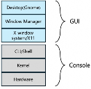
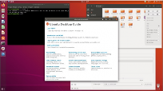

---

## 10. Linux – X Window System

**X Window System**은 리눅스에서 그래픽 사용자 인터페이스(GUI)를 제공하는 시스템이다.

- 디스플레이 장치에 창을 표시하며 마우스와 키보드 등의 입력장치의 상호작용 관리
- GUI 환경의 구현을 위한 기본적인 프레임워크 제공

### Desktop Environment (데스크탑 환경)

운영 체제 상단의 그래픽 사용자 인터페이스 (사용자가 모니터를 통해 볼 수 있는 작업 공간)

| 데스크탑 환경 | 특징 |
|--------------|------|
| **GNOME** | Ubuntu Linux 기본, 모던한 UI |
| **KDE Plasma** | 풍부한 커스터마이징, Windows 유사 |
| **Xfce** | 가볍고 빠름, 구형 하드웨어에 적합 |
| **Fluxbox** | 최경량, 최소 기능 |

> Ubuntu Linux는 **GNOME** 데스크탑 환경을 기본으로 지원한다.

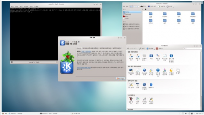
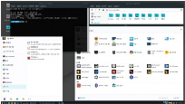
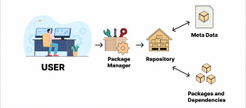
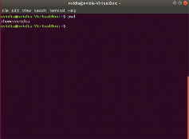

---

## 11. Linux Repository

**Repository**(저장소)는 Linux에서 설치하고자 하는 프로그램/소프트웨어 패키지가 저장된 서버이다.

- Linux 배포판별 패키지 저장소(서버)로부터 소프트웨어 검색 및 설치하는 도구 제공
- Repository에 찾는 소프트웨어가 없다면, 패키지를 담고 있는 서버를 리눅스 환경에 새로 등록해야 함

| 배포판 계열 | 패키지 관리자 | 패키지 형식 | 명령어 예시 |
|-----------|-------------|-----------|-----------|
| **Ubuntu / Debian** | **APT** | `.deb` | `apt install`, `apt update` |
| **Red Hat / CentOS / Fedora** | **YUM / DNF** | `.rpm` | `yum install`, `dnf install` |
| **Arch Linux** | **Pacman** | - | `pacman -S` |

```bash
# Ubuntu APT 명령어 예시
sudo apt update                    # 패키지 목록 업데이트
sudo apt install nginx             # 패키지 설치
sudo apt remove nginx              # 패키지 제거
sudo apt search 키워드             # 패키지 검색

# Repository 등록 예시 (PPA)
sudo add-apt-repository ppa:deadsnakes/ppa
sudo apt update
```

---

## 12. Linux Terminal

**Terminal**(터미널)은 사용자가 명령을 입력하고 출력 결과를 텍스트로 확인하는 인터페이스이다.

- 터미널은 정보를 전송하는 역할
- OS가 정보를 이해하기 위해 터미널은 shell을 사용 (주로 bash)
- **CLI (Command Line Interface)**: 사용자가 텍스트로 명령어를 입력하고 결과가 텍스트로 화면에 출력

```
┌─────────────────────────────────────────────┐
│  Terminal Application                        │
│  (터미널 에뮬레이터: gnome-terminal, xterm)  │
└──────────────────┬──────────────────────────┘
                   │
                   ▼
┌─────────────────────────────────────────────┐
│  Shell (Bash, Zsh 등)                        │
│  - 명령어 해석                               │
│  - 프롬프트 표시 ($ 또는 #)                  │
└──────────────────┬──────────────────────────┘
                   │
                   ▼
┌─────────────────────────────────────────────┐
│  Kernel                                       │
│  - 하드웨어 제어                              │
│  - 시스템 콜 처리                             │
└─────────────────────────────────────────────┘
```

```bash
# 터미널 기본 명령어 예시
$ pwd              # 현재 작업 디렉토리 출력
$ ls -la           # 파일 목록 상세 보기
$ cd /home         # 디렉토리 이동
$ mkdir newdir     # 디렉토리 생성
$ rm file.txt      # 파일 삭제
$ sudo apt update  # 관리자 권한으로 명령 실행
```

> **참고**: 프롬프트 `$` 는 일반 사용자, `#` 은 root(관리자)를 나타냄.

---

## 참고 자료

- [Ubuntu Linux 공식 문서](https://help.ubuntu.com)
- [NVIDIA Jetson Linux 문서](https://docs.nvidia.com/jetson/l4t/)
- [Linux Kernel 공식 문서](https://www.kernel.org/doc/)
- [GNU GRUB Manual](https://www.gnu.org/software/grub/manual/)
